## [[Counting]] #[[MAT 1348]]
	- ## 6.1 Product Principle
	  id:: 66048b1e-6aa0-441b-bc2f-6fd4fba57cd3
		- Suppose a procedure can be broken down into a sequence of $k$ tasks $T_1,T_2,...,T_k$ such that:
			- There are $n_1$ ways to carry out task $T_1$
			- For $i = 2,..., k$, there are $n_i$ ways to carry out task $T_i$ arfter each of the tasks have been done in a certain way
		- Then there are $(n_1)(n_2)...(n_k)$ ways to ^^carry out a problem^^
		- Examples:
		  background-color:: blue
			- How many (new) Ontario license plates are there consisting of four uppercase letters followed by 3 digits
				- 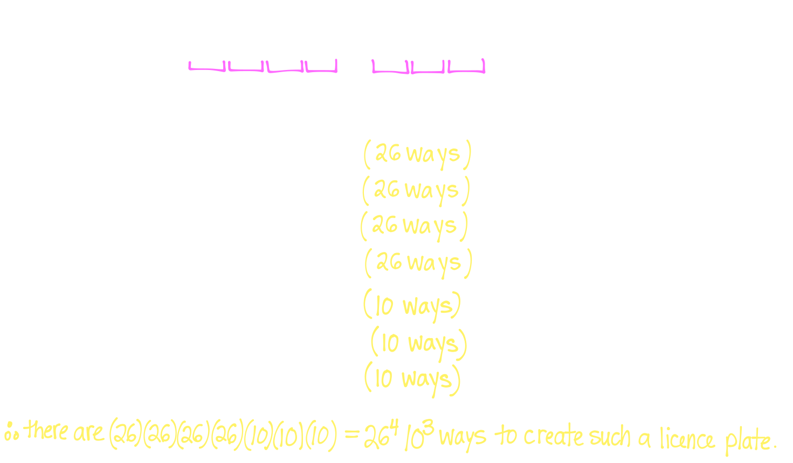
			- How many (new) Ontario license plates are there such that the first letter is an 'A' and the second digit is a '5'
				- 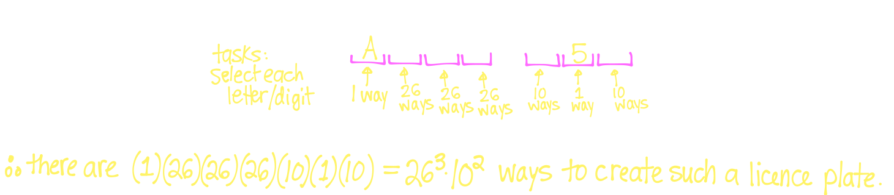
			- Let $A = \{1,2,3,4,5\}$ and $B = \{x,y,z\}$
				- How many distinct functions are there from $A$ to $B$
					- 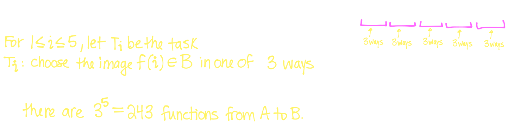
			- Let $A$ and $B$ be finite sets with $|A| = m$ and $|B|=n$
				- How many functions $f: A \rightarrow B$ are there?
					- 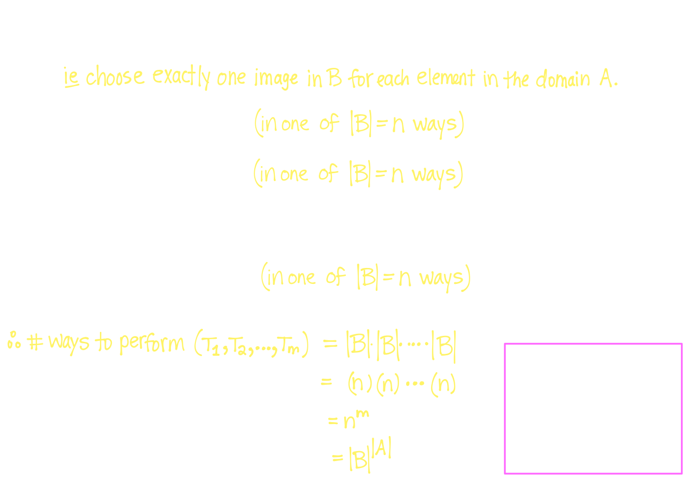
			- Let $A$ and $B$ be finite sets with $|A| = m$ and $|B| = n$
				- How many functions $f: A\rightarrow B$ are **injective**?
					- 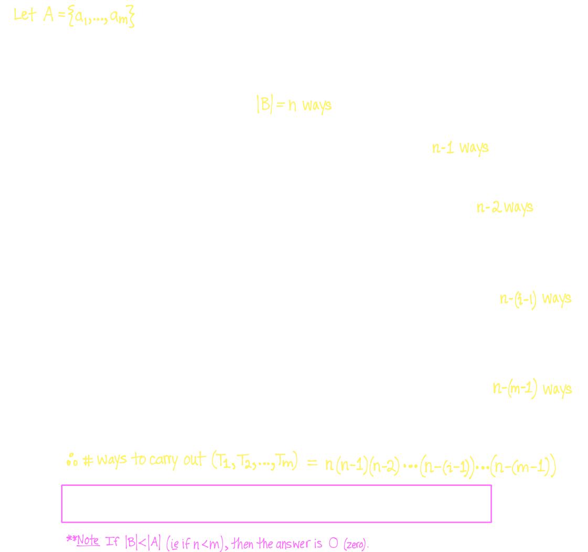
	- ## 6.2 Permutation
	  id:: 66048b1e-b392-4b5a-8d74-758c66219f41
		- ^^**Definition**^^
			- A **permutation** is an ordered arrangement of some (or all) of the elements of a finite set
			- An ordering of $r$ elements from a set is called an $r$**-permutation**
		- Examples:
		  background-color:: blue
			- Write all 3-permutations of the 3-element set $S = \{1,2,3\}$
				- 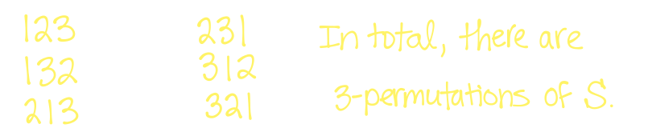
			- How many 3-permutations are there of the 6-element set $S = \{1,2,3,4,5,6\}$
				- 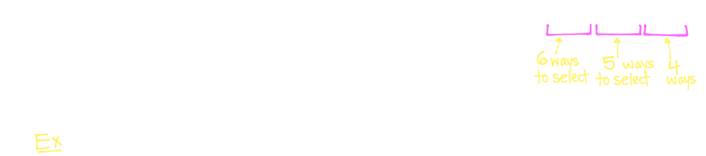
		- Let $n \ge r \ge 0$ be integers
			- $P(n,r)$ denotes the number of $r$-permutations of a set of $n$ elements
			- $P(n,n)$ is therefore the number of permutations of a set of $n$ elements
				- By the **Product Rule:**
					- $P(n,r) = (n)(n-1)(n-2)...(n-r+1)$
	- ## 6.3 Factorial
	  id:: 66048b1e-9d54-4cc8-a4f0-5258356aad02
		- ^^**Definition**^^
			- $n$ **factorial**, denoted $n!$ is defined for all integers $n \ge 0$ as follows:
				- $$0! = 1$$
			- If $n \ge 1$, then
				- $$n! = n(n-1)! = n(n-1)(n-2)...(2)(1)$$
			- For instance:
				- $1! = 1(0!) =1$
				- $2! = 2(1!)= (2)(1) = 2$
				- $3! = (3)(2)(1) = 6$
				- $4! = (4)(3)(2)(1) = 24$
	- ## 6.4 Combination
	  id:: 66048b1e-4a61-407f-8035-d841488ee6d7
		- ^^**Definition**^^
			- Let $n \ge r \ge 0$ be integers
			- An $r$**-combination** of a set $S$ of $n$ elements is a subset of $S$ of size $r$
			- $C(n,r)$ is the number of $r$-combinations of a set $n$ elements
			- In other words $C(n,r)$ is the number of subsets $T$ of a set $S$ such that $|T| = r$ and $|S| =n$
		- ^^**Theorem**^^
			- Let $n,r \in \mathbb{N}$ with $n \ge r \ge 0$, then:
			- $$C(n,r) = \begin{pmatrix} n \\ r \end{pmatrix} = \frac{n!}{r!(n-r)!} =\frac{P(n,r)}{P(r,r)}$$
		- We can show this in $P(n,r) = C(n,r)P(r,r)$
		- We count in two steps:
			- Choose an $r$-element subset $T$ of $S$ (in one of $C(n,r)$ possible ways)
			  logseq.order-list-type:: number
			- Arrange the $r$-elements of $T$ (in one of $P(r,r)$ possible ways)
			  logseq.order-list-type:: number
		- The product principle then states that number of ways to carry out the tasks is $P(n,r) = C(n,r)P(r,r)$
		- Examples:
		  background-color:: blue
			- List all possible 3-element subsets of the set $S = \{1,2,3,4\}$
				- 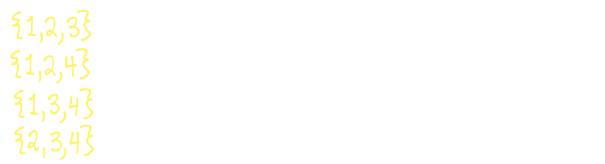
			- A photographer is taking group photos of 7 inhabitants of The Island K&K, namely A,B,C,D,E,F and G
				- In how many ways can the photographer select 5 out of 7 of these inhabitants to be in the photo
					- 
				- How many distinct ways can the photographer arrange 5 out of 7 of these inhabitants in a line
					- 
				- In how many distinct ways can the photographer line up 5 out of 7 of these inhabitants so that A and B are in the photo and A stands next to B
					- 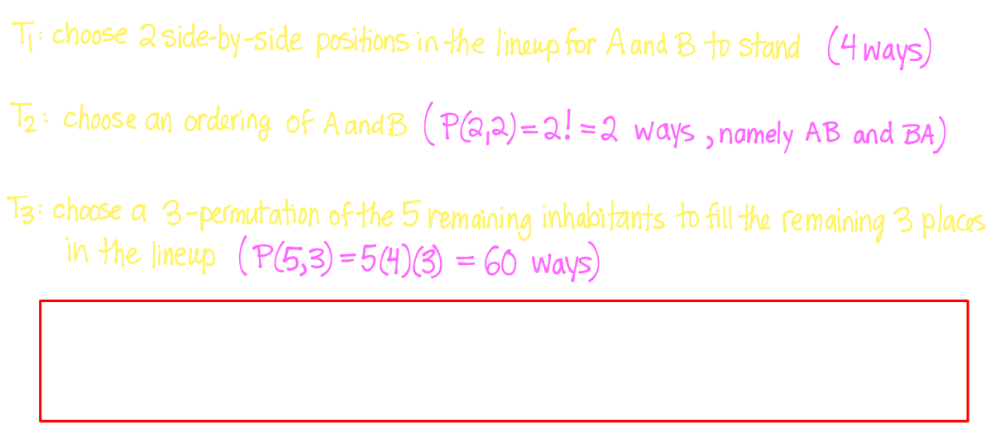
			-
	- ## 6.5 Inclusion-Exclusion Principle
	  id:: 66048b1e-1469-4648-99ad-a23996809c6b
		- Let $A$ and $B$ be sets: Then,
			- $$|A \cup B| = |A| + |B| - |A \cap B|$$
			- and
			- $$|\overline{A \cup B}| = |U| - |A \cup B| = |U| - |A| -|B| + |A \cap B|$$
		- Let $A$, $B$ and $C$ be sets
			- $$|A \cup B \cup C| = |A| + |B| +|C| - |A \cap B| - |A \cap C| - |B \cap C| + |A \cap B \cap C|$$
		- Examples:
		  background-color:: blue
			- Let $A = \{1,2,3,4,5,6,7\}$ and let $B = \{5,6,7,8,9,10\}$
				- 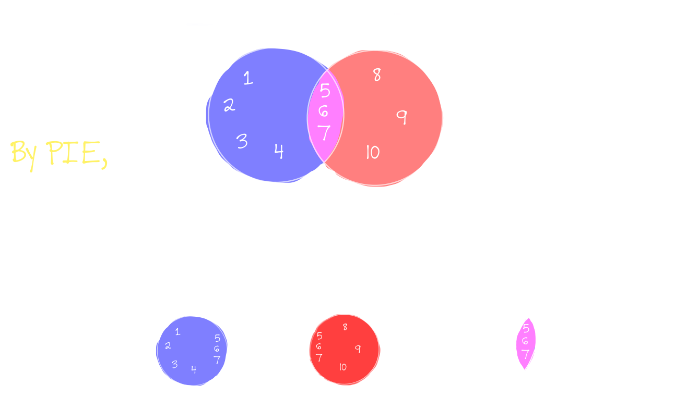
			- How many 5-letter "words" (strings of length 5 consisting of lowercase letters of the English alphabet) start with the letter **a** or end with the letters **zz**
				- 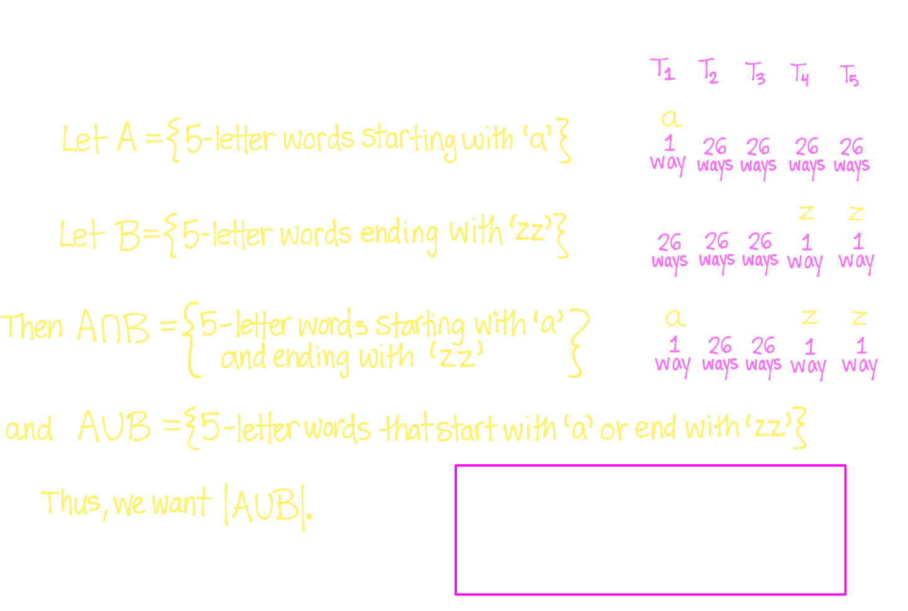
			- How many 5-letter "words" do not start with the letter **a** nor end with the letters **zz**?
				- 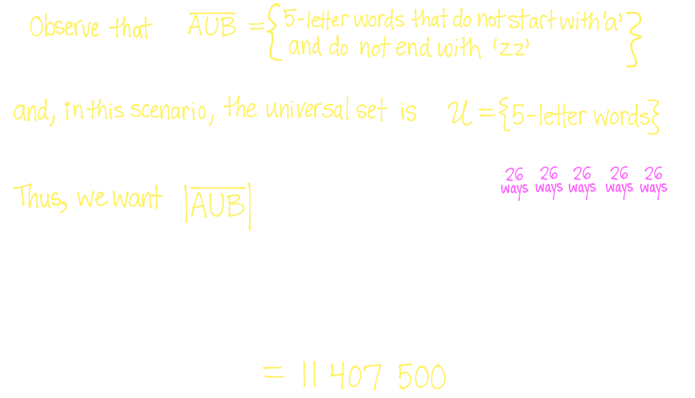
			- A photographer is taking group photos of 6 inhabitants of The Island of K&K namely A,B,C,D,E and F
				- In how many different ways can the photographer arrange 5 out of 6 of these inhabitants in a line so that
					- A and B are both in the photo **OR** B,C and E are all in the photo?
						- 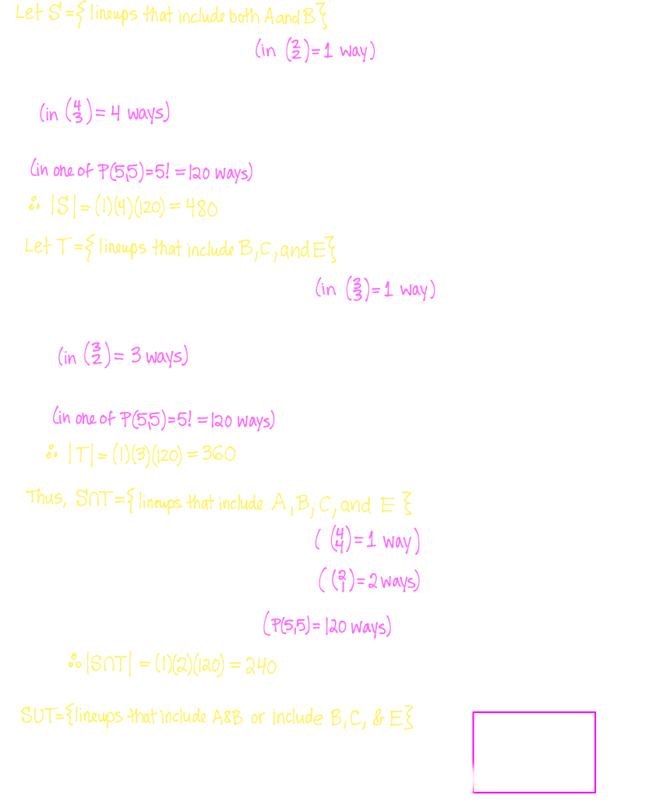
		- ## 6.6 Sum Principle
			- If a task can be accomplished $n_1$ ways and a second task can be accomplished in $n_2$ ways, and these two tasks cannot be accomplished simulataneously, then there are $n_1+n_2$ ways to accomplish one task or the other
			- Examples:
			  background-color:: blue
				- How many binary strings of length 10 start with '000' and contain at least five 1's
					- 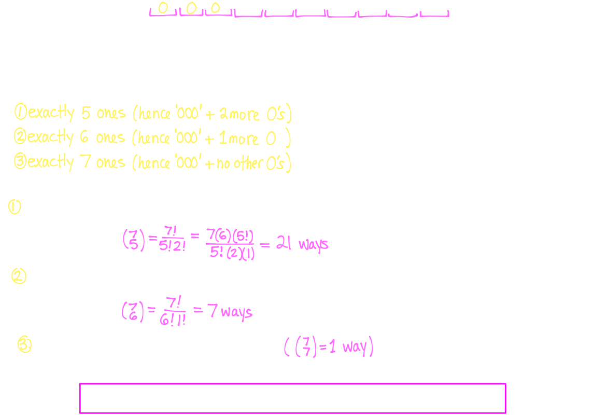
				- A 9-member fellowship is formed by selecting its members from among a group of 15 people consisting of 1 wizard, 5 hobbits, 5 elves, 2 men and 2 dwarves
					- In how many ways can the fellowship be formed if it must contain at least 2 hobbits **or** at least 2 men?
						- 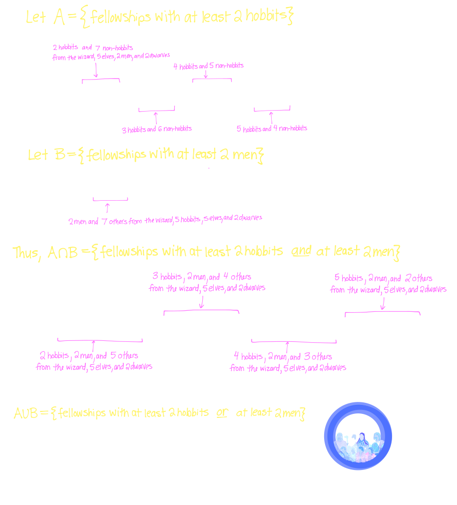