## 1. [[Improper Integrals]] #[[MAT 1322]]
	- ### Brief Review of Definite Integrals
	  id:: 65a02154-c603-4ad9-912c-da0262df985c
		- **Net Area**
			- If $f(x)$ is continuous of $[a,b]$ (or has a finite # of jump discontinuities on $[a,b]$), then $f$ is **integrable** on $[a,b]$ and:
				- 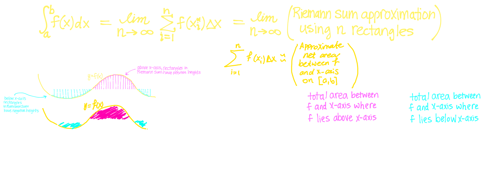
			- **Evaluating Definite Integrals Using FTC**
				- If $f(x)$ is continuous on $[a,b]$, then
					- $$\int_a^b f(x) = F(x) \Big|_a^b = F(b) - F(a)$$ where,
						- $F(x) \big|_a^b$ is where we find the antiderivative
						- $F(b) - F(a)$ is subtracting at the limits of integration
			- Example:
			  background-color:: blue
				- $$\int_1^2 \frac{1}{x} \ dx$$
					- 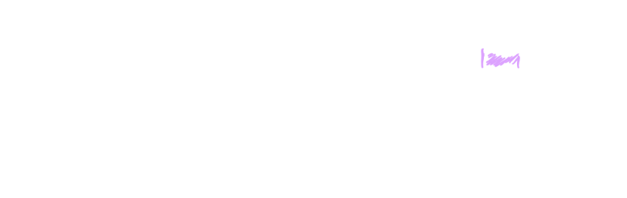
				- ^^**BUT WAIT**^^
					- $$\int_0^1 \frac{1}{x} \\ \ne \ln |x| \Big|_0^1$$
					- because $\frac{1}{x}$ is **not** continuous on $[0,1]$ and $\therefore$ FTC 2 is not applicable
						- 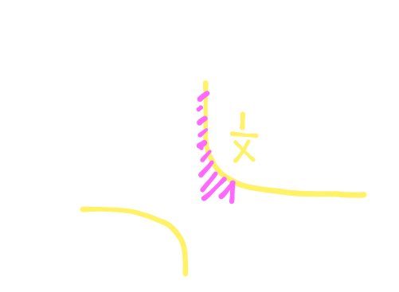
				- ^^**SOLUTION?**^^
					- 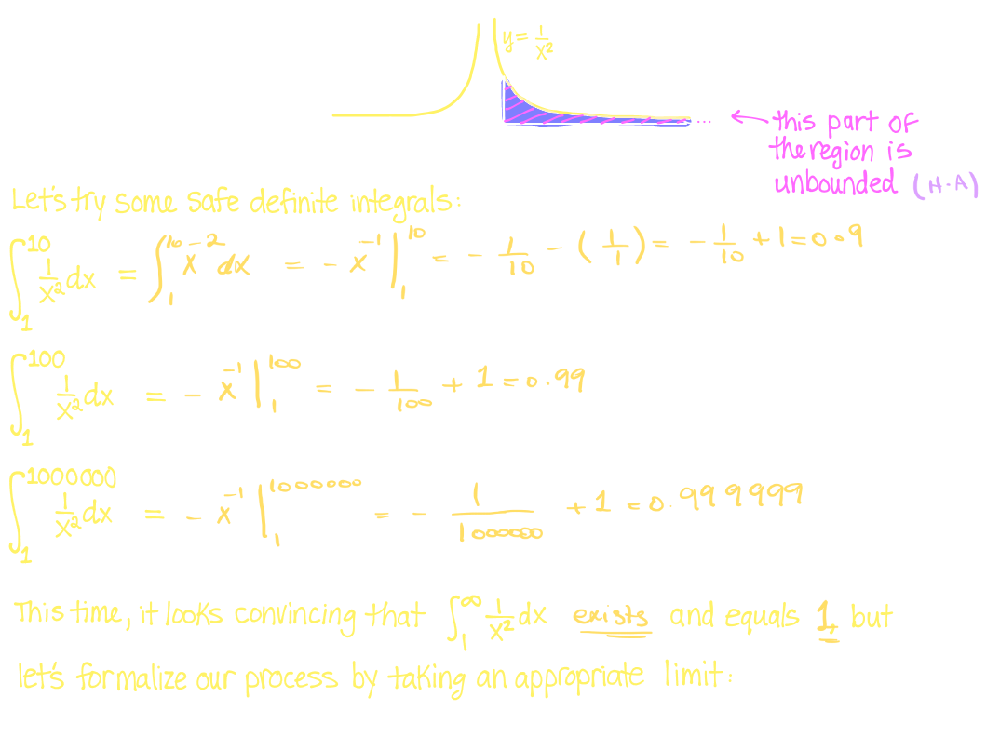
					- 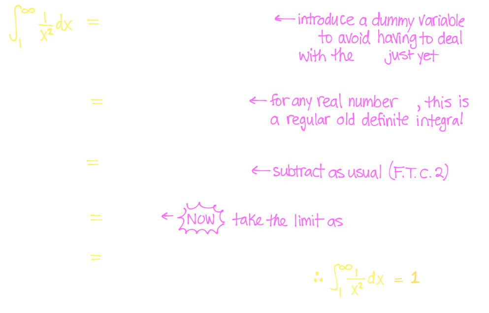
				- 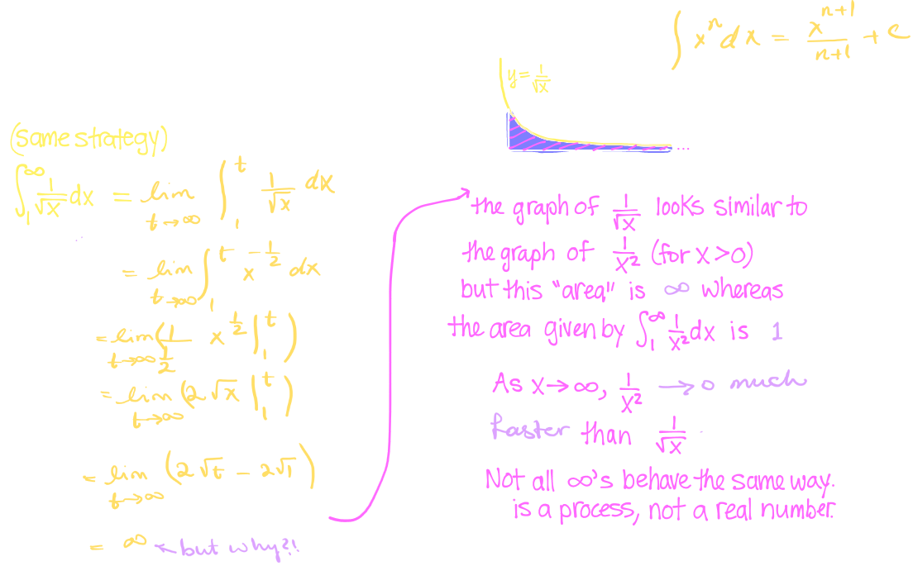
	- ### Improper Intergrals - Type I - Infinite Intervals
	  id:: 65a046e6-9944-4514-b11e-4661f05bdcb8
		- An integral of the form $\int_a^b f(x) \ dx$ is called an **improper intergral of type I** if:
			- $a = -\infin$ and/or $b = \infin$
		- Suppose $\int_a^t f(x) \ dx$ exists for all $t \ge a$, then we define:
			- $$\int_a^{\infin} f(x) \ dx = \lim_{t \rightarrow \infin} \int_a^t f(x) \ dx$$
				- if the limit exists, $\int_a^{\infin} f(x) \ dx$ is **convergent**
				- if the limit DNE, $\int_a^{\infin} f(x) \ dx$ is **divergent**
			- Similarly, if $\int_t^b f(x) \ dx$ exists for all $t \le b$, then we define:
				- $$\int_{-\infin}^b f(x) \ dx = \lim_{t \rightarrow - \infin} \int_t^b f(x) \ dx$$
					- if the limit exists, $\int_{- \infin}^b f(x) \ dx$ is **convergent**
					- if the limit DNE, $\int_{- \infin}^b f(x) \ dx$ is **divergent**
		- In the case of $\int_{- \infin}^{\infin} f(x)  \ dx$
			- If $f$ is continuous on $(\infin, -\infin)$, then we define
				- $$\int_{- \infin}^{\infin} f(x)  \ dx = \int_{- \infin}^a f(x)  \ dx + \int_a^{\infin} f(x)  \ dx$$
				- where we split the integral at any real number $a$
			- If one(or both) of $\int_{- \infin}^a f(x)  \ dx$ and $\int_{a}^{\infin} f(x)  \ dx$ is divergent,
				- then $\int_{- \infin}^{\infin} f(x)  \ dx$ is also divergent
		- Example:
		  background-color:: blue
			- For a general power $p \in \mathbb{R}$, when does $\int_1^{\infin} \frac{1}{x^p} \ dx$ converge or diverge?
				- 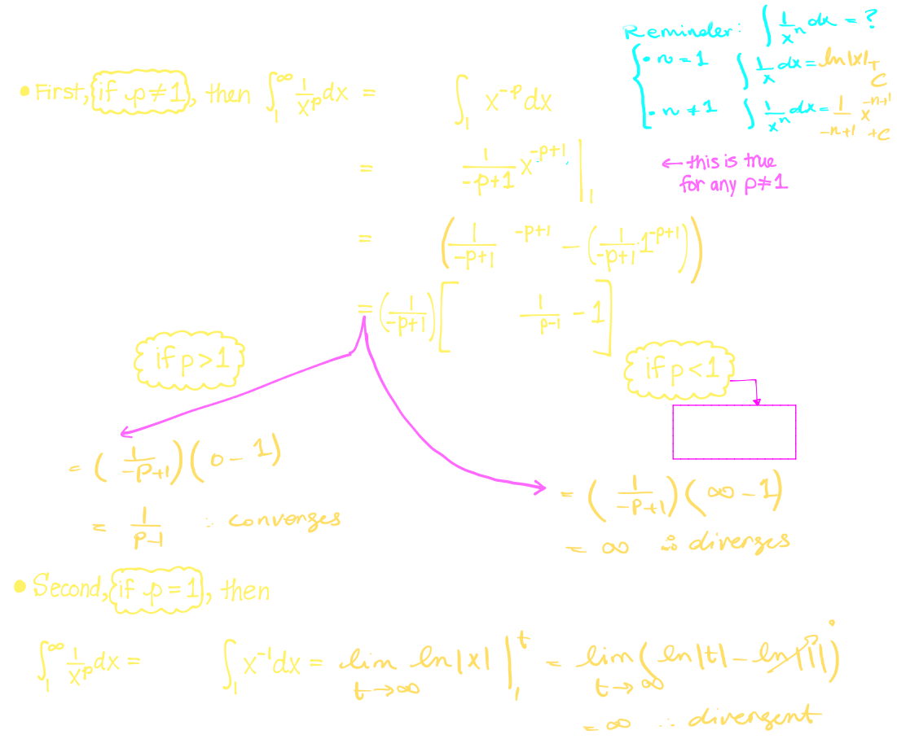
			- $$\int_{-\infin}^{\infin} \frac{1}{1+x^2} \ dx$$
			- 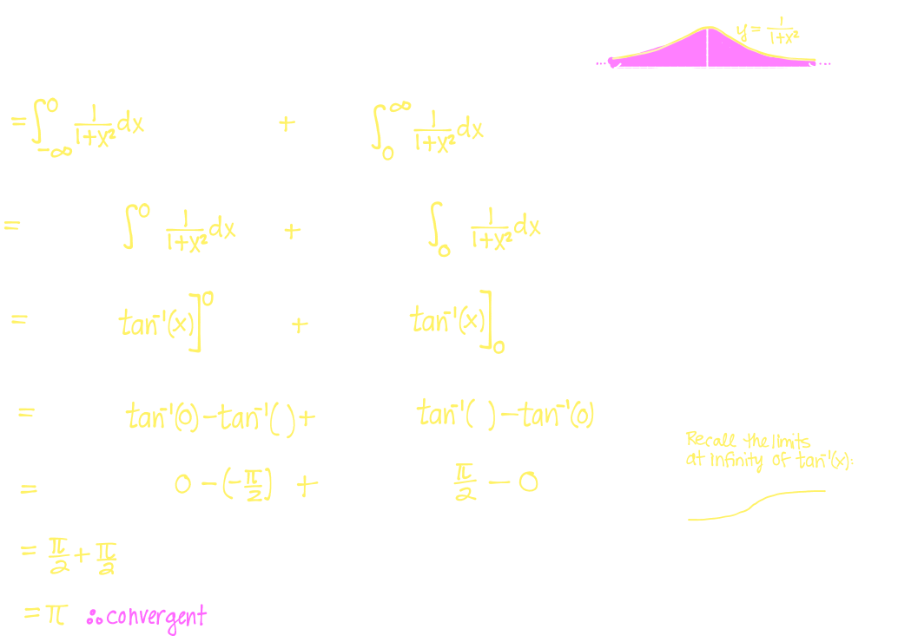
			  id:: 65a04efb-292b-4d59-a3b5-10c3d05fd44a
			- $$\int_{-\infin}^{\infin} xe^{-x^2} \ dx$$
			- 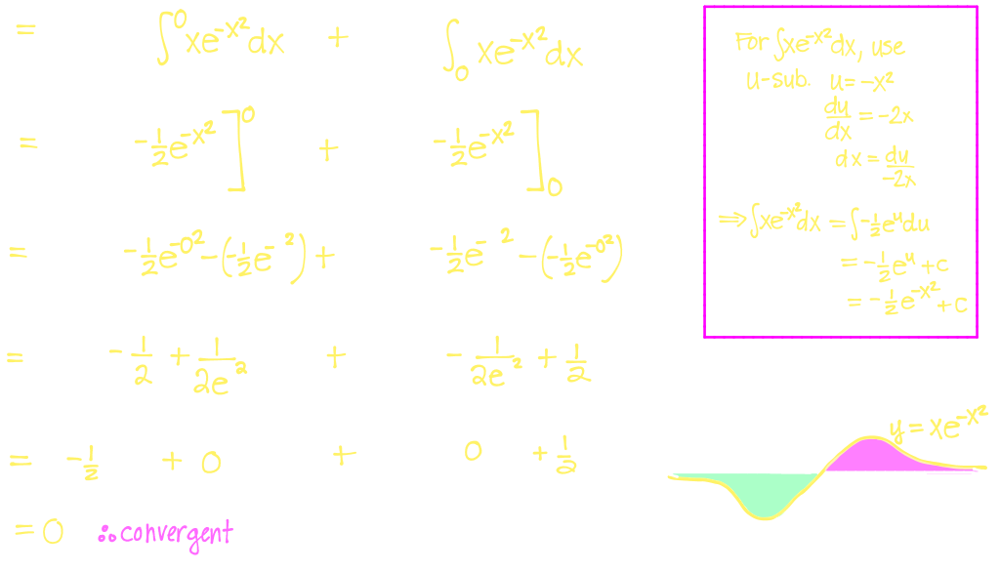
	- ### Improper Integrals - Type II - Discontinuous Integrals
	  id:: 65a04f7c-60e4-4c3d-9f6a-3a15f36d02ff
		- An integral of the form $\int_a^b f(x) \ dx$ is called an **improper integral of type I** if:
			- $f$ is continuous on $[a,b)$ but discontinuous at $b$, in which case:
				- $$\int_a^b f(x) \ dx = \lim_{t \rightarrow b^-} \int_a^t f(x) \ dx$$
			- $f$ is continuous on $(a,b]$ but discontinuous at $a$, in which case:
				- $$\int_a^b f(x) \ dx = \lim_{t \rightarrow a^+} \int_t^b f(x) \ dx$$
			- In each case, the improper integral is **convergent** is convergent if the corresponding limit exists and **divergent** otherwise
			- If $f$ has a discontinuity at $c$ where $a < c < b$, then we define
				- $$\int_a^b f(x)  \ dx = \int_{a}^c f(x)  \ dx + \int_c^b f(x)  \ dx \\ \qquad \qquad \qquad  \qquad \quad = \lim_{t \rightarrow c^-} \int_a^t f(x) \ dx + \lim_{s \rightarrow c^+} \int_s^b f(x) \ dx$$
			- ^^**NOTE:**^^
				- Improper integrals of type II are the sneakiest type of improper integral since the "improper part" is not as obvious to detect compared to the infinite limit of integration in type I
		- Example:
		  background-color:: blue
			- $$\int_0^1 \ln(x) \ dx$$
				- 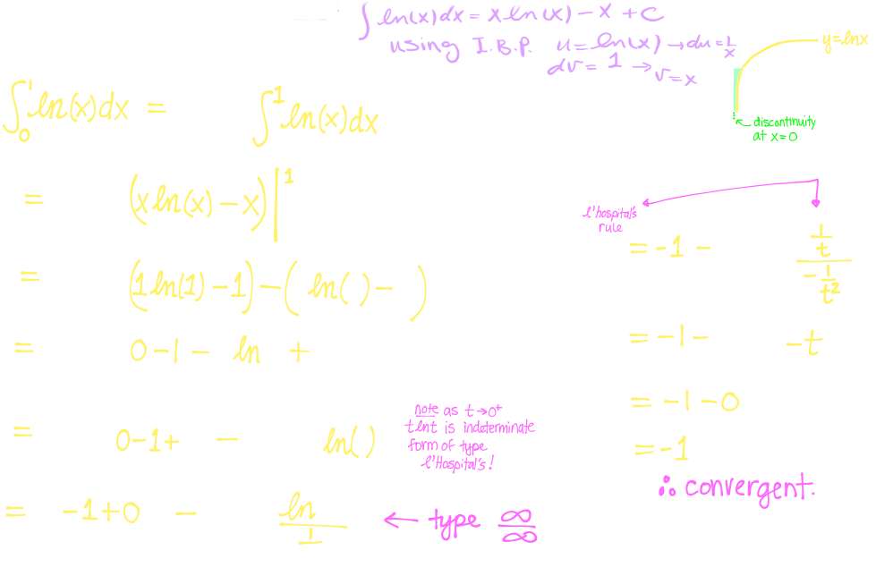
			- $$\int_1^2 \frac{1}{(x-2)^4} \ dx$$
				- 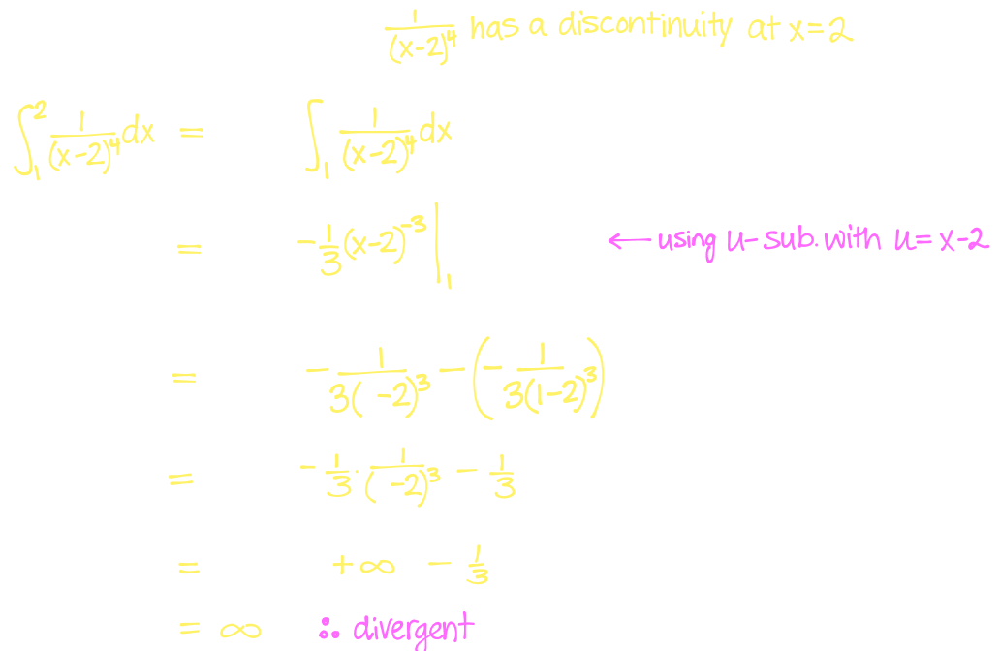
	- ### Comparison Test for Improper Intergrals
	  id:: 65a06fc7-2701-4cda-9086-21a790662bdd
		- In certain scenarios is it difficult to find exact value of an improper integral, but is still useful to know whether it is convergent or divergent
		- Suppose $f$ and $g$ are continuous functions with
			- $$f(x) \ge g(x) \ge 0 \text{ for all } x\ge a$$
		- If $\int_a^{\infin} f(x) \ dx$ converges, then so does  $\int_a^{\infin} g(x) \ dx$
			- Essentially if "bigger" area converges $\rightarrow$ "smaller" area converges
		- If $\int_a^{\infin} g(x) \ dx$ diverges, then so does  $\int_a^{\infin} f(x) \ dx$
			- Essentially if "smaller" area diverges $\rightarrow$ "bigger" area diverges
		- **Useless Cases for Comparison Tests:**
			- If $\int_a^{\infin} f(x) \ dx$ diverges then $\int_a^{\infin} g(x) \ dx$ can both diverge or converge
			- If $\int_a^{\infin} g(x) \ dx$ converges then $\int_a^{\infin} f(x) \ dx$ can both diverge or converge
		- **Useful Integrals for Comparision**
			- $$\int_1^{\infin} \frac{1}{x^p} \ dx = \begin{Bmatrix} \frac{1}{p-1} \text{ if } p > 1 \\ \infin \text{ if } p \le 1 \end{Bmatrix}$$
			- $$\int_0^{\infin} e^{-ax}\ dx = \begin{Bmatrix} \frac{1}{a} \text{ if } a > 0 \\ \infin \text{ if } a \le 0 \end{Bmatrix}$$
			- $$\int_0^1 \frac{1}{x^p}\ dx = \begin{Bmatrix} \frac{1}{1-p} \text{ if } p < 1 \\ \infin \text{ if } a \ge 1 \end{Bmatrix}$$
		- Example:
		  background-color:: blue
			- $$\int_1^{\infin} \frac{1}{x^4+3x+7} \ dx$$
				- converge or diverge?
					- 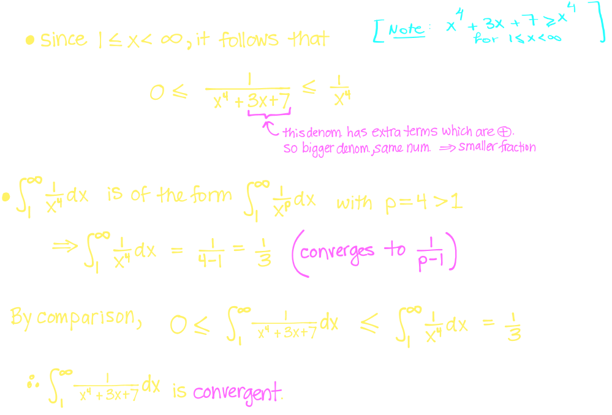
		- Example:
		  background-color:: blue
			- $$\int_1^{\infin} \frac{2 - \cos(x)}{\sqrt{3x^2 -1}} \ dx$$ converge
				- 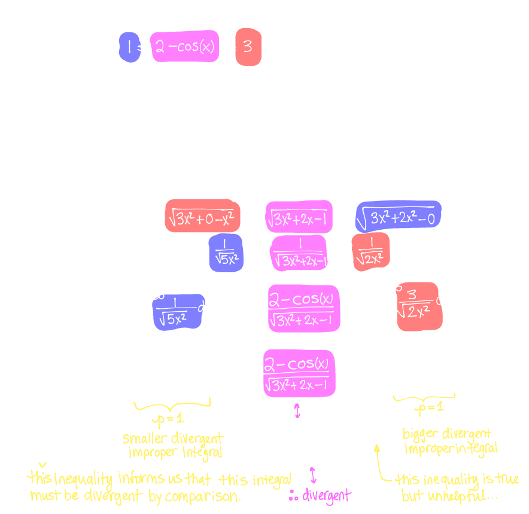
- ## 2. [[Areas]]
	- ### Areas Between Curves
	  id:: 65a08aed-c387-4ed4-acf7-86ab63741fa3
		- What is the area $A$ of the region that lies between $y = f(x)$ and $y = g(x)$ on the interval $[a.b]$?
		- First let's assume $f(x) \ge g(x) \ge 0$ on $[a,b]$
			- 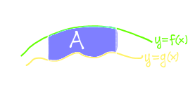
		- In this case, it's easy to see that it's equal to:
			- 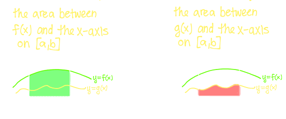
			- $$A = \int_a^b f(x) \ dx - \int_a^b g(x) \ dx = \int_a^b (f(x) - g(x)) \ dx$$
		- Now, what if $f$ and/or $g$ lie below the $x-$axis at some point(s) on $[a,b]$
			- 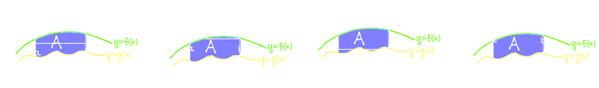
		- $A$ can be broken up into regions above and below and use as an application of net area and definite integrals
		- The area between the two curves on the interval $[a,b]$ is:
			- 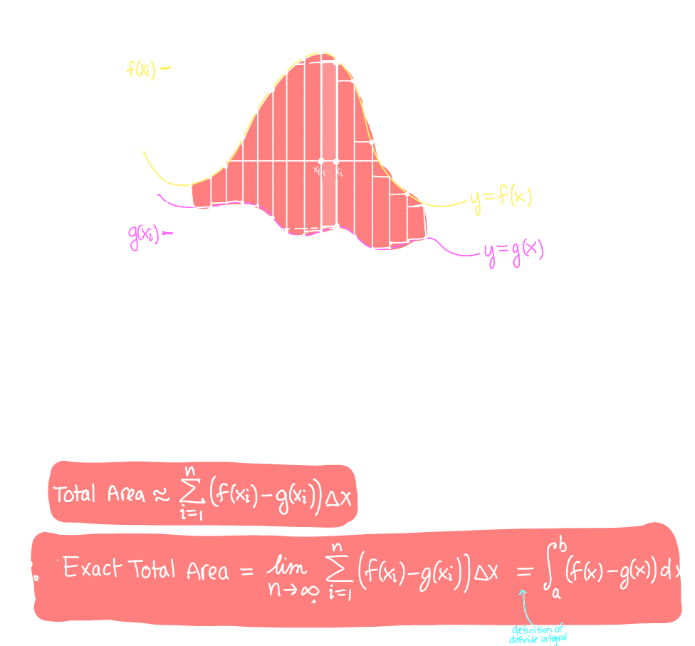
		- Example:
		  background-color:: blue
			- Find the area of the region bounded by the curves $y = \ln(x), y = x$ and the lines $x=2$ and $x=3$
				- 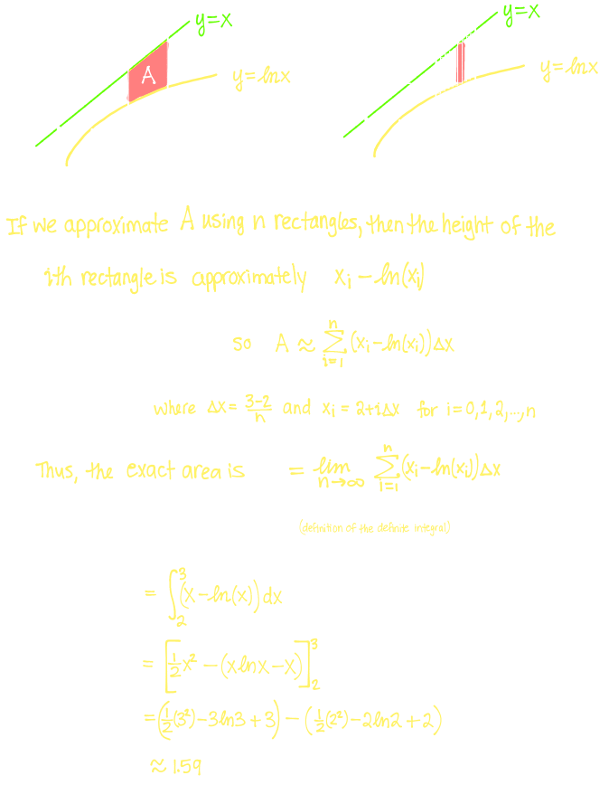
			- Find the area of the region bounded by the curves $g(x) = 3x^2$ and $h(x) = 1-x^2$
				- 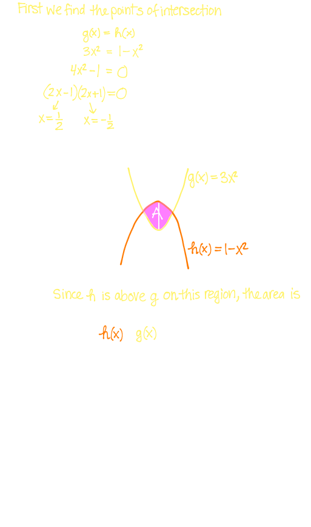
		- It's easier to consider $x$ as a function of $y$
			- The area $A$ of the region bounded by $x = g(y)$, $x=f(y)$ and the lines $y=c$ and $y=d$ is given by
				- $$A = \int_c^d (f(y)-g(y)) \ dy$$
				- 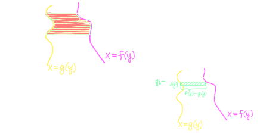
		- Example:
		  background-color:: blue
			- Find the area enclosed by the graph of $y = x$ and $y^2 = x+2$
			- Find the area of the region bounded by the curves $y = cos(x)$ and $y= sin(x)$ and lines $x=0$ and $x = \frac{\pi}{2}$
				- 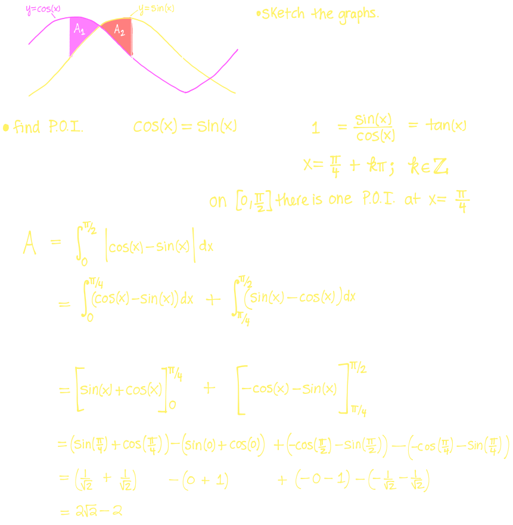
-