# Kinematics and Dynamics of a Particle
	- ## Physics and Measurement
	- ## Motion in 1-D
	- ## Motion in 2-D
	- ## Laws of Motion
	- ## Applications of Newton's Laws
- # Work-Energy Principle
	- ## Work and Kinetic Energy
		- ### Mechanical Work
			- **Mechanical work** is defined as the dot product of displacement vector and force vector
				- ^^For a constant force^^ applied over the object in $\Delta \vec{r}$ distance, the work done by the force is:
					- $$W = \vec{F} \cdot \Delta \vec{r}  = F \Delta r \cos \theta$$
					- 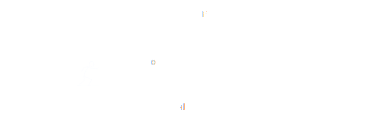
			- ^^For a varying force^^, work is defined as:
				- $$W = \int_{r_1}^{r_2} \vec{F} \cdot d\vec{r}$$
					- If the curve of force as a function of $x$ is given for a force along the motion, the area under the curve is the work done by the force
			- The SI unit of work is the **joule** $1 J = 1 \text{ N} \cdot \text{m}$
			- **Mechanical Work Sign**
				- Work is a scalar quantity and can be either positive, negative or zero
					- If the applied force $F$ (and the displacement $d$ are in the ^^same direction^^, work is ^^positive^^)
					- If $F$ and $d$ are in the ^^opposite direction^^, work done is ^^negative^^
					- Work is ^^zero^^ if either ^^displacement is zero^^ or $\theta = 90^\circ$
				- {:height 249, :width 657}
		- ### Work-Energy Theorem
			- An object moves with velocity $v$ has **kinetic energy** calculated by
				- $$K = \frac{1}{2}mv^2$$
				- Kinetic energy is a scalar quantity and measured in joules
			- **Work-Energy Theorem**
				- The ^^work done by all forces^^ acting on a body is equal to the **change in the body's kinetic energy**
					- $$W_{net} = \Delta K = \frac{1}{2} mv^2_f - \frac{1}{2}mv_i^2$$
				- If $W > 0$ net force speeds up the object, while $W < 0$ slows down the object
		- ### Conservative vs. Non-Conservative Forces
			- Two types of work coming from different forces
				- **Conservative forces** perform work that ^^do not depend on the path^^ taken (gravity, spring force)
					- The energy is converted into potential energy
					- ^^Path independent^^
				- **Nonconservative forces** perform work that ^^depends on the path^^(friction)
					- The energy is dissipated by heat or sound
					- Any non-zero nonconservative work **will change the mechanical energy**
					- ^^Path dependent^^
			- **Conservative Forces and Potential Energy**
				- Work done by any ^^conservative forces^^ is proportional to the **change in the potential energy** associated with that force:
					- $$W_c = - \Delta U$$
				- **Potential energy** is a type of energy which is stored inside the ojbect and can be converted into other energies such as kinetic energy
					- Potential energy is usually shows by $U, PE$ or $U_p$
						- Gravitational Potential Energy (Earth): $\Delta U_g = mg\Delta y$
						- Gravitational Potential Energy (Any Planet): $\Delta U_g = -G \frac{m_1 m_2}{r^2}$
						- Spring Potential Energy: $U_s = \frac{1}{2}kx^2$
					- A conservative force is always toward the points with lower potential energies
					- If work is done by only conservative forces, then the mechanical energy of the system is conserved
				- **Potential energy** can also be described as the
					- $$\Delta U = - \int_{r_1}^{r^2} \vec{F}_c \cdot \vec{d}r$$ and as a differential equation
						- $$\vec{F}_c = -\frac{dU_p}{\vec{dr}}$$
		- ### Power
			- **Power** is defined as the rate of energy generation or consumption or the rate of whcih work is done
				- The SI Unit for power is Watts, $1 \text{ W} = 1 \text{ J/s}$
				- $$P = \frac{\Delta E}{\Delta t} \text{ or }  P = \frac{\text{Work}}{\text{Time}}$$
				- Or also written as $P = \vec{F} \cdot \vec{v} = Fv \cos \theta$
	- ## Conservation of Energy
		- The total **mechanical energy** of a system is the sum of kinetic and potential energies at a given time
			- $W_{net} = \Delta K$ using Work-Energy Theoren
				- Also for conservative force, $W_c = - \Delta U$, therefore:
				- $$\Delta K = W_{net} = W_c + W_{nc} = - \Delta U + W_{nc}$$
			- Solving for $W_{nc}$,
				- $$W_{nc} = \Delta K + \Delta U = \Delta E$$ where
				- $W_{nc}$ is total work done by non-conservative forces and $\Delta E$ is the total change in mechanical energy
					- If positive, mechanical energy is increased (ex. pulling force)
					- If negative, mechanical energy is decreased (ex. friction)
					- If zero, energy is conserved
				- $$W_{added} + K_i + U_i = K_f + U_f + W_{lost}$$
		- ### Energy Conservation
			- If there **no non-conservative work** and there is ^^no dissipated energy^^, there is ^^no change in energy^^
				- $$\Delta E = 0 \rightarrow \Delta K + \Delta U = 0$$
- # Collisions
	- ## Linear Momentum and Impulse
		- **Linear momentum** is defined as the ^^product of mass and velocity of an object^^
			- Momentum is a vector measured in $\text{kg} \cdot \text{m/s}$
				- $$\vec{P} = m \vec{v}$$
			- If a force is applied to an object, Newton's Second Law
				- $$\vec{F} = \frac{\Delta \vec{P}}{\Delta t}$$
		- **Impulse** is defined as the ^^change in momentum^^ of the object if a ^^constant^^ external force of F is applied to the object
			- $$\vec{J} = \Delta \vec{P} = \vec{F} \Delta t$$
			- For a **net external force which is changing with time**, impulse is defined as:
				- $$\vec{J} = \Delta \vec{P} = \int_{t_i}^{t_f} \vec{F}(t) \ dt$$
		- ^^**Note:**^^
			- If a Force vs Time plot is provided, **Impulse** is the area under the curve
			- When **net external force** is ^^zero^^, momentum remains ^^conservered^^
	- ## Conservation of Momentum
		- **Conservation of momentum** means that the change in momentum (^^impulse^^) is zero
			- $$\Delta \vec{p} = 0 \qquad \rightarrow \qquad \vec{p}_f = \vec{p}_i$$
		- If the **net external force on a system of objects is zero**, the impulse of the system will be zero and the total **momentum of the system remains constant**
		- Note that ^^sum of all internal forces^^ between elemetns of a system should be ^^zero^^ because of Newton's third law
	- ## Collisions
		- ### **Elastic Collision**
			- In a **perfectly elastic collision**, two objects completely bounce off each other
				- Assume there is ^^no loss of energy^^ in this collision because there is **no deformation**
			- ^^**Note:**^^
				- During this collision, **total momentum** and **total kinetic energy** of the two objects are **conserved**, from before and after the collision
			- **Conservation of Kinetic Energy:**
			  background-color:: green
				- $$\frac{1}{2}m_Av^2_{A1} + \frac{1}{2}m_Bv^2_{B1} = \frac{1}{2}m_Av^2_{A2} + \frac{1}{2}m_Bv^2_{B2}$$
			- **Conservation of Total Momentum**
			  background-color:: green
				- $$m_A\vec{v}_{A1} + m_B\vec{v}_{B1} = m_A\vec{v}_{A2} + m_B\vec{v}_{B2}$$
		- ### **Elastic Collision with One Object Intitially at Rest**
			- It is very commom to have **one of the objects initially at rest**
				- Since we still have elastic collision, both kinetic energy and total momentum are conserved
			- **Equation for One Moving Object**
			  background-color:: green
				- $$v_{A2} = \frac{m_A - m_B}{m_A + m_B} v_{A1}$$
		- ### **Perfectly Inelastic Collision**
			- In a **perfectly inelastic collision**, the two objects ^^stick together^^ after collision
				- The **kinetic energy** is not ^^conserved^^ because part of the energy is lost due to **deformation**
				- **Total momentum** is ^^conserved^^
			- **Kinetic Energy**
			  background-color:: green
				- $$\frac{1}{2}m_Av^2_{A1} + \frac{1}{2}m_Bv^2_{B1} > \frac{1}{2}m_Av^2_{A2} + \frac{1}{2}m_Bv^2_{B2}$$
			- **Conservation of Total Momentum**
				- $$m_A\vec{v}_{A1} + m_B\vec{v}_{B1} = (m_A + m_B)\vec{v}_{2}$$
		- ### Shell Explosion
			- **Momentum Conservation in the Centre of Mass Frame**
				- The centre of mass behaves as if it were a **single particle of combined mass** $M$ located at an imaginary point, where that net external foce would be applied
				- Location of centre of mass is where the mass of the entire system would be concentrated
				- The motion of the center of mass depends only on the **net external force** acting on the entire system
				- If there is **no external force**, momentum is conserved
				- If there is **external force**, there will be ^^impulse^^ on the centre of mass
- # Rotational Kinematics and Dynamics
	- ## Dynamics of Rotational Motion
		- ## Torque
			- **Torque** is simply tendency of rotation
			- It is a rotational equivalent of force defined as
				- $$\tau = |\vec{r} \times \vec{F}| = rF \sin \theta$$ where
					- $r$ is the magnitude of vector $\vec{r}$ which is deifned from **centre of rotation** (^^ref. point^^) to **point of exertion of force** (^^point of action^^)
					- $\theta$ is the angle
			- Forces that cause NO torque are
				- Parallel to axis of rotation $(\sin \theta = 0)$
				- Acting at centre of rotation $(r=0)$
		- ## Rotational Kinematics
			- The parameters describing the translational motion have an analogue in rotational mtion
				- **Kinematic Equations for Rotational Motion**
				  background-color:: green
					- $$\theta_f = \frac{1}{2}\alpha t^2 + \omega_i t + \theta_i$$
					- $$\omega_f = \alpha t + \omega_i$$
					- $$\omega_f^2 - \omega_i^2 = 2 \alpha \Delta \theta$$
					- $$\frac{1}{2} (\omega_f + \omega_i)t = \Delta \theta$$
				- ^^**Note:**^^ For **uniform circular motion**, $\alpha - 0$
		- ## Moment of Inertia
			- ### Moment of Inertia of Discrete partices
				- The **moment of inertia** of an object is a measure of the ^^resistance^^ of the object to ^^changes^^ in **rotational motion**
					- The quanity shows how the mass of an object is distributeed about its *axis of rotation*
				- For point masses $m_i$ at distances $r_i$ from axis of rotation, the moment of inertia is
					- $$I = \sum m_i \cdot r_i^2$$
						- with units $\text{kg} \cdot \text{m}^2$
				- ^^**Note:**^^ The value of $I$ changes if the axis of rotation changes
			- ### Moment of Inertia of Objects with a Continuous Mass
				- When there is an extended object with a **continuous mass distribution**, the the moment of inertia can be found with:
					- $$I = \int r^2 \ dm$$
		- ## Parallel Axis Theorem
			- If the object is rotating about an unknown axis, **Parallel Axis Theorem** to calculate the moment of inertia about this new axis
			- If we know that the moment of inertia about an axis that extends through the body's **centre of mass** $(I_{COM})$, the moment of inertia about an axis that is ^^parallel^^ to this axis is
				- $$I = I_{COM} + M \cdot h^2$$
				- where $h$ is the **distance between the axes** and the $M$ is the total mass of the object
					- 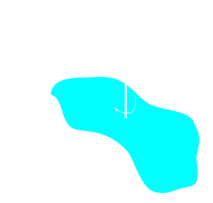
			- ### Moment of Inertia in Composite Shapes
				- For **composite shapes**, you can use the moment of inertia of their sub-components to the moment of inertia, as long as you are **careful with the axis of rotation** for each ^^sub-component^^
		- ## Rotational Analog of Newton's Second Law
			- Torque is the rotational analog for force
			- When torque is applied, the angular acceleration changes
				- This change is given by **Newton's Second Law for rotations**:
					- $$\sum \tau = I \cdot \alpha$$
					- where $\alpha$ is in $\text{rad/s}^2$
		- ## Rotational Kinetic Energy
			- When an object is rotating, we have **rotational kinetic energy** from all the mass elements rotating
				- $$K = \frac{1}{2} I \cdot \omega^2$$
				- The kinetic energy of a rigid body with **both translation and rotation**
					- $$K = \frac{1}{2}I \omega^2 + \frac{1}{2}Mv^2_{cm}$$
			- ### Conservation of Energy
				- Similar to translational motion, if there is no friction or other non-conservative forces, total mechanical energy is conserved
		- ## Rotational Work and Torque
			- When torque is applied to an object, work is beign performed
				- Work done by a torque caused by a force which is along the angular displacement is:
					- $$W = \tau (\theta_f - \theta_i)$$
				- or integral
					- $$W = \int \vec{\tau} \cdot d\vec{\theta}$$
				- If the force is opposite the direction of angular displacement, then the torque is doing negative work; if in the same direction, then positive work
		- ## Rolling Motion
			- Roling without slipping is a combination of two mtions
				- A ^^translational motion^^ of the centre of the mass with the velocity:
					- $$v_{cm} = R \cdot \omega$$
				- A ^^rotational motion^^ of all points on the object
			- In rolling without slipping, the **point of contact** is instananeously at rest
				- All points of the rolling object are rotating about this point of contact
				- 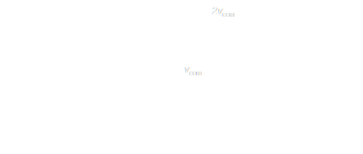
			- The rolling without slipping motion is usually caused by the static friction between the point of contact and surface
			- For rolling without slipping:
			  background-color:: green
				- $v_{cm} = R \omega$
				- $a_{cm} = R \alpha$
				- $d_{cm} = R \theta$
				- Since a rolling object has **both translational and rotational motion**, the total kinetic energy for an object rolling without slipping is:
					- $$K =  \frac{1}{2}mv^2 + \frac{1}{2}I_{cm} \omega^2 $$
					- First term is translational kinetic energy of centre of mass, and second is rotational kinetic energy of the object
		- ## Angular Momentum
			- **Angular momentum** is a vector the cross product of position vector and momentum vector
				- $$\vec{L} = \vec{r} \times \vec{P}$$
			- **Magnitude** of this vector is equivalent to $|\vec{L}| = |\vec{r}||\vec{p}| \sin \theta$
			- For rigid bodies rotating around an axis with angular frequency $\omega$, the magnitude of angular momentum in analogy to  linear momentum can be represented by
				- $$L  = I \omega$$
			- ### Angular Momentum and Torque
				- $$\vec{\tau} =  \vec{r} \times \vec{F} =  \vec{r} \times \frac{\vec{dP}}{dt} = \frac{\vec{dL}}{dt}$$
				- If the **net externl torque** about an axis acting on a rotating body is **zero**, the **angular momentum about the same axis remains constant**
					- $$L_f = L_i$$
	- ## Periodic Motion
		- ### Basic Concepts of Oscillation
			- **Simple Harmonic Motion** (SHM) is a type of periodic motion in which
				- The restoring force is ^^proportional to the displacement from the equilibrium position^^
				- The force direction is ^^opposite to that of displacement^^
					- $$F = - kx$$
				- Any physical system with the above type of the force undergoes a Simple Harmonic Motion
			- The **mathematical description** of SHM is a sinusoidal function of time:
				- $$x(t) = A \cos (\omega t + \varphi )$$
			- These are the parameters we use to describe a simple harmonic motion
				- **Amplitude (A)**
					- The maximum displacement of the object from the equilibrium
				- **Period(T)**
					- The time it takes for one complete oscillation (Period is measured in seconds)
						- $$T = \frac{\text{Total time}}{\text{Number of cycles}}$$
				- **Frequency (f)**
					- The number of oscillations per unit of time (Frequency is measured in Hertz (1$\text{Hz}$ = $\frac{1}{s}$)
						- $$f = \frac{1}{T}$$
				- **Angular Frequency (**$\omega$**)**
					- The rate at which argument of sinusoidal function describing oscillation changes in time (Angular frequency is measured in $\text{rad/s}$)
						- $$\omega = 2 \pi f = \frac{2 \pi}{T}$$
				- **Phase Constant (**$\varphi$**)**
					- A term which determines the initial condition of oscillation (phase constant is measured in $\text{rad}$)
					- Phase constant causes a shift in the oscillating function which changes the starting point of oscillation:
						- 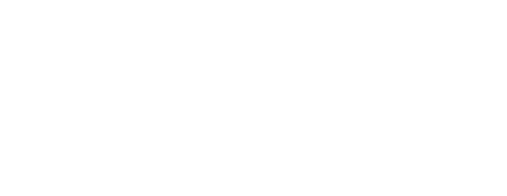
					- To calculate the **phase constant** $\varphi$, we need to solve this equation
						- $$x(t=0) = A \cos (\varphi) \rightarrow \varphi = \cos^{-1} \Big( \frac{x(0)}{A}\Big)$$
						- Solving the equation for the phase constant will give two answers between $0$ and $2\pi$:
							- $\varphi = 0$ or $2 \pi - \theta$, $0 \le \theta < \pi$
					- Use the inormation at **time equal to zero** to find two possible soltuions for the phase constant by using the above equations
					- Use the **slope of tangent line** to the curve at the same moment to pick the right angle
						- Example:
							- The velocity $\text{cm/s}$ vs. time $s$ of a mass-spring on a SHM is shown in the graph
								- Find the equation representing position against time, and draw that graph
								- 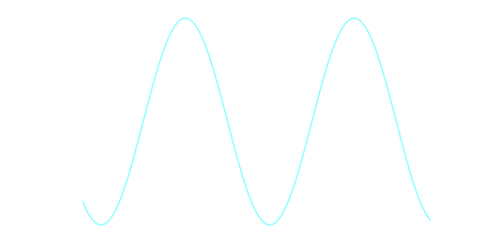
							- The displacement graph of a simple harmonic motion over time is shown below
								- Write the equation for displacement as a function of time
									- 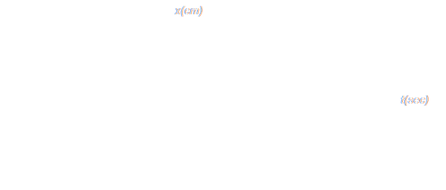
		- ### Velocity and Acceleration
			- Displacement of an oscillator with respect to the equilibrium position is found by $x(t) = A \cos (\omega t + \varphi )$
				- 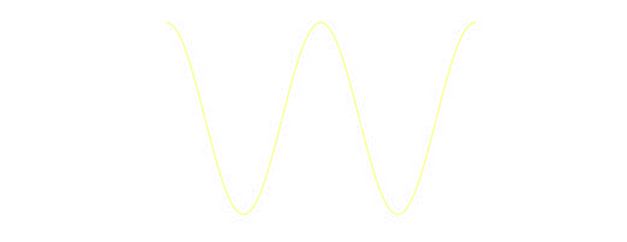
			- **Velocity**
				- The **velocity of an oscillator** can be found by taking the derivative of displacement with respect to time
					- $$v(t) = \frac{dx}{dt} = -A \omega \sin (\omega t + \varphi)$$
						- 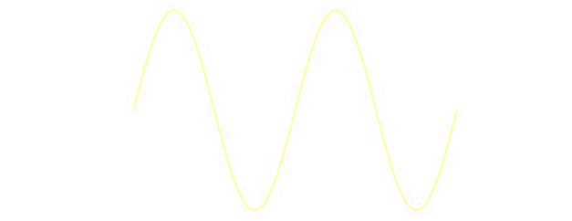
					- Velocity of an oscillator is an oscillating function with the **same period** as $x(t)$
					- Velocity is changing in $-A \omega \le v(t) \le + A\omega$
			- **Acceleration**
				- The **acceleration of an oscillator** can be found by taking the derivative of velocity with respect to time
					- $$a(t) = \frac{dv}{dt} = - A \omega^2 \cos (\omega t + \varphi)$$
					- 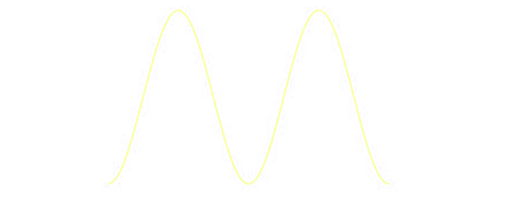
				- Accleration of an oscillator is an oscillating function with **same period** as $x(t)$ and $v(t)$
				- Acceleration is changing in $-A \omega^2 \le a(t) \le +A \omega^2$$
			- Using $a(t) = - \omega^2 x(t)$ one can find the relation between displacement and acceleration
			- #### Relation Between $\omega$ and $k$
				- A force in the form of $F = - ksx$ undergoes simple harmonic motion, where $k$ is a constant dependent on the physical properties of the system
				- By looking at Newton's Second Law, one can find the relation between the constant $k$ and angular frequency of oscillation $\omega$
					- $$\omega = \sqrt{\frac{k}{m}}$$
		- ### SHM as the Projection of Uniform Circular Motion
			- The moition of an oscillator undergoing as simple harmonic motion could be mapped to a **uniform circular motion**
				- 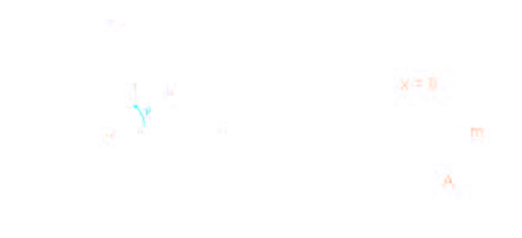
					- Angle $\theta$ is to be equal to $\omega t$ where $\omega$ is the angular frequency of SHM
					- When time passes, $\omega t$ gets larger, so the point on the circle corresponds to the angle rotating in a counter-clockwise direction
				- Trignometric realtions for the triangle at any moment can by shown by:
					- $$x(t) = \cos \theta = \cos(\omega t)$$
					- $$y(t) = \sin(\omega t)$$
				- Since both SHM and uniform circular motion over the above circle are described by the same equation, we can describe SHM as a projection of circular motion over $x$ or $y$ axis
		- ### Energy of an Oscillator
			- There are two different types of energies related to an oscillation:
				- The **kinetic energy** is the energy of a moving object
					- $K = \frac{1}{2}mv^2$
				- The **potential energy** is the energy stored in the oscillation
					- For mass and spring oscillation, it is a potential energy stored inside of the spring due to stretch or compression in the length of the spring
						- $$U = \frac{1}{2}kx^2$$
			- The **total energy** of the system at any time during SHM is the sum of kinetic energy and potential energy and is ^^constant^^ because of the ^^conservation of energy^^
				- $$E = K + U = \text{constant}$$
			- **How to Find Total Energy of an Oscillator**
				- The total energy of the oscillator can be found using
					- The definition, if the **position and velocity of the oscillator  is known at any moment**
						- $$E = \frac{1}{2}m(v(t))^2 + \frac{1}{2}k(x(t))^2$$
					- Looking at **equilibrium point**
						- At equilibrium, $x = 0, v = v_{max}$
							- $$E = K + U = \frac{1}{2}mv_{max}^2+0$$
							- $$E = \frac{1}{2}mA^2\omega^2$$
					- Looking at **turning points**
						- At turning points, $x = \pm A, v = 0$
							- $$E = K + U = 0 + \frac{1}{2}kA^2$$
							- $$E = \frac{1}{2}kA^2$$
				- $$\frac{1}{2} kA^2 = \frac{1}{2}kx^2 + \frac{1}{2}mv^2$$
		- ### Vertical Springs
			- The main difference between a horizontal spring and a **vertical spring** is that force of gravity is along the oscillation and can affect it
			- If a mass $M$ is attached to a vertical spring and then slowly lowered to stop in a lower position, the string is stretched by
				- $$\Delta x = \frac{Mg}{k}$$
				- Changing the mass attached to a vertical spring (adding or removing a mass) shifts the position of equilibrium
				- **Any oscillation (SHM) now would be around the new equilibrium position**
		- ### Simple Pendulums
			- **Simple pendulums** are pendulums for which the mass attached to the string is considered a point
				- The motion of these pendulums could be described as simple harmonic moiton
			- The driving force acting on the mass is $mg \sin \theta$ and since it is **restoring** (always pushes the mass toward equilibrium which is the lowest point), we have
				- $$F_{\theta} = - mg \sin \theta$$
					- For small $\theta, F_{\theta} = - mg\theta$
				- The distance travelled by the mass is the arc length corresponding to the angle $\theta$, and $l$, the length of the pendulum
					- $$x = l \theta$$
					- id:: 660f37e1-8f24-48b9-ae01-72ba8ce622c1
					  $$F_{\theta} = - \frac{mg}{l}x$$
			- By comparing with the general form of SHM forces the **effective spring constant** for a simple pendulum is:
				- $$\omega = \sqrt{\frac{g}{l}}$$
		- ### Physical Pendulums
			- If the mass is not concentrated at the lower part of the object, it can oscillate around its **pivot point**
				- This oscillation for small angles can be described by simple harmonic motion, where for this oscillation:
					- $$\theta (t) = \theta_{max} \cos (\omega t + \phi_0)$$
					- where
						- $$\omega = \sqrt{\frac{Mgl}{I}}$$
						- $I$ is the moment of inertia around the pivot point, and $l$ is the distance between pivot and centre of mass of object
		- ### Underdamped Oscillations
			- **Damped Oscillation Theory**
				- In real systems, there are always **resistive forces** that oppose oscillation
					- These resistive forces cause the ^^total energy of the system to decay^^
				- A type of these resistive forces is proportional to the speed of the oscillator and is shown by
					- $$F_{resistive} = - bv$$
					- Net force acting on the oscillator is equal to $F = -kx - bv = ma$ the solution for dependent on the magnitude of the damping constant
				- Only will observe oscillations **only** for relatively small damping constants
					- This condition is known as **underdamped condition** and the oscillation in this case is known as **damped oscillation**
			- **Energy in a Damped Oscillation**
				- Energy is no longer conserved in a damped oscillation
					- The ^^total energy of the system^^ could still be obtained by
						- $$E(t) = \frac{1}{2}kA^2(t) = \frac{1}{2}kA^2_o e^{-\frac{bt}{m}}$$
		- ### Critical Damping and Over-Damping Conditions
			- **Critically Damping Condition**
				- In underdamped condtions, the oscillation decays faster at $b$
					- At a very special point $\omega_o = \frac{b}{2m}$, there would be no oscillation anymore
					- This is called **critical damping condition**
						- In this condition, $\omega' = 0$, so $x(t) = A^2_o e^{-\frac{bt}{m}} \cos \varphi$
						- There is no oscillation and the displacement decays to zero exponentially
						- 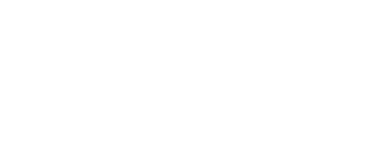
					- The system has critical damping condition if $b = 2m\omega_o = 2 \sqrt{km}$
			- **Overdamping Condition**
				- The system would be in **overdamping condition** when
					- $$\frac{b}{2m} > \omega_o$$
				- There is again no oscillation in overdamped condition
				- $x(t)$ decays to zero at a **slower rate** compared to a critically damped condition
				- The bigger the value of the damping constant, the slower $x(t)$ goes to zero
		- ### Forced Oscillation and Resonance
			- The decaying energy of a damped oscillation could be restored by applying a **driving force**
			- This type of oscillation is know as ^^forced or driven osciilation^^
			- Force is periodic in the form,
				- $$F_d = F_o \cos(\omega_d t)$$
					- where $\omega_d$ is the **driven angular frequency**, at which the force is exterted
				- ^^**Note:**^^ In driven or forced oscillation, the system oscillates with the driven angular frequency
			- The amplitude of a driven oscillation is found to be proportional to:
				- $$A \propto \frac{1}{\sqrt{(\omega_o^2 - \omega_d^2)^2 + (\frac{b\omega_d}{m})^2}}$$
				- If $\omega_d$ is close to $\omega_o = \sqrt{\frac{k}{m}}$ the amplitude becomes very large
			- The condition in which $\omega_O = \omega_d$ is called **resonance** and it is where the amplitude gets its maximum value
- # Electrostatics
	- ## Electric Fields
		- ### Charge, Conductors, Insulators
			- **Properties of Charge**
				- There are two types of charges, ^^positive (+)^^ and ^^negative (-)^^
				- Charges with the **same sign repel** each other, while **opposite charges attract**
				- Charges is measured in units of **Coulombs**
					- Often found in $\mu C = 1 \times 10^{-6} C$ or $n C = 1 \times 10^{-9} C$
				- The total amount of charge in the Universe is constant; charge cannot be created or destroyed
					- This is the fundamental law of nature called the **conservation of charge**
				- Charge is provided by **protons** and **electrons**
					- Protons and electrons possess the smallest amount of charge possible, called the ^^fundamental charge^^
						- $$e = 1.6021892 x 10^{-19}$$
					- Charge cannot be broken down any further than the amount of charge on a proton or an electron
						- Because of this, charge is defined as **quantized**
			- **Condutors**
				- **Conductors** are materials where electrons are not bound to any particular atomic nucleus
					- They are free to move around
				- If a positively charged body is brought close to a condurctor, electrons will flow ^^towards^^ the positive charge, and a negatively charged body will flow ^^away from^^ external negative charge
				- If the charge inside a conductor moves around because of an external charge, there will be a change seperation in the conductor even if the conductor itself is neutral
					- This is **induced charge**
					- 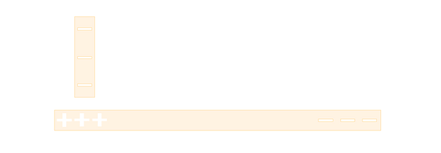
			- **Insulators**
				- **Insulators** are materials where electrons are bound to a specific atomic nucleus
					- The electrons are only able to move small distances or not at all
				- Net charge can be added to insulators by ^^contact(friction)^^
					- When charging by contact, electrons are transferred frm one insulator to the other, leaving one object with a net positive charge and the other with a net negative charge
			- **Semiconductors**
				- **Semiconductors** can be either insulators or conductors, depending on the conditions of the material (heat, or if light is shining)
		- ### Electric Force and Coulombs Law
			- Electric charges interact iwth each other by attraction and repulsion
				- These interactions are caused by **electric force**
			- The ^^magnitude^^ of force between two ^^point charges^^ is given by **Coulomb's Law**:
				- $$F = k \frac{q_1q_2}{r^2_{12}}$$
					- $k$ is the **Coulomb/Electrostatic constant**, $k = 8.99 \times 10^9 \frac{\text{Nm}^2}{C^2}$
			- The coulomb constant can also be defined in term of **vacuum permittivity**, $\epsilon_0$
				- $$k = \frac{1}{4 \pi \epsilon_0}$$
				- $\epsilon_0= 8.85 \times 10^{-12} \frac{C^2}{\text{Nm}^2}$
			- Electrostatic forces between two point charges are **always** equal and opposite, even if the charges have different magnitude
		- ### Principle of Superposition
			- **Electric Field Due to Point Charge**
				- At a distance $r$ from a point charge of $Q$, the **magnitude** of the electric field is:
					- $|\vec{E}| = k \frac{Q}{r^2}$
					- The **direction** of the electic friled is along the line connecting the source charge ($Q$) to the point of intereset
					- Electric fields always point ^^away from positive charges^^ and ^^towards negative charges^^
					- $F_E = q \vec{E}$
			- **Principle of Superposition**
				- When there is more than a single point charge present, the net electric field at any point in space is the vector sum of each individual electric field present at that point
					- 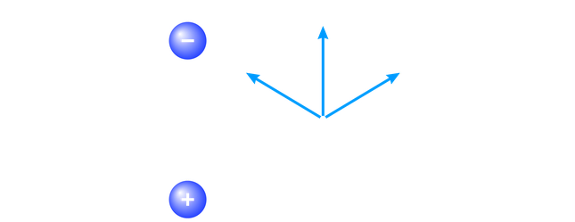{:height 211, :width 473}
				- $$\vec{E}_{tot} = \vec{E}_1 + \vec{E}_2 + \vec{E}_3 + ... = \sum_i \vec{E}_i$$
		- ### Motion of a Charged Particle in an Electric Field
			- If a charged particle enters a region of space with an electric field, it will experience an electric force
				- This force will be in the ^^same direction^^ as the electric field if the charge is ^^positive^^, or in the ^^opposite direction^^ if charge is negative
			- We can connect the electric foce to the magnitude of ^^acceleration^^ of the charged particle with Newton's Second Law
				- $$a = {qE}{m}$$
			- By connecting the electric foield to the acceleration of a charged particle, we are able to use kinematic equations to describe th trajectory of a charged particle in a electric field
		- ### Electric Dipoles
			- An **electric dipole** is made of a positive charge, and a negative charge of equal magnitude, seperated by some distance
				- 
			- The **electric dipole moment** $\vec{p}$, where $q$ is the magnitude of charge on one of the charges
				- $$\vec{p} = |\vec{q}| \vec{r}$$
			- **Electric Field Due to Dipole**
				- To find the electric field created by an electric dipole, one uses the principle of superposition and adds the two electric fields produced by the positive and negative charge
				- If looking at a point ^^far away^^ from the dipole that is ^^along the axis^^ of the electric dipole, the electric field in in the ^^same direction^^ as the electric dipole moment and has the magnitude:
					- $$\vec{E}_{dipole} = k \frac{2\vec{p}}{y^3}$$ where $y$ is the distance from the centre of the dipole
				- When looking at a point ^^along the perpendicular bisector^^ of the electric dipole, the field is in the ^^opposite direction^^ as the electric dipole moment, and has the magnitude:
					- $$\vec{E}_{dipole} = - k \frac{\vec{p}}{y^3} $$
					- 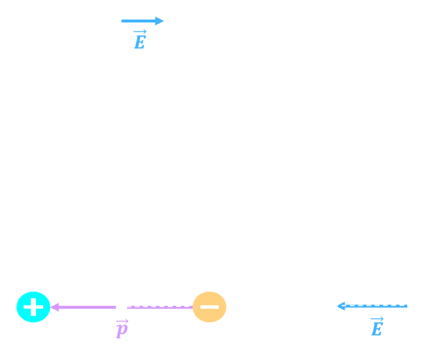{:height 235, :width 283}
				- The electric field strength of a dipole decreases with $y^3$ from the dipole
				- **Torque and Potential Energy**
					- If an electric dipole is placed in a ^^uniform^^ electric field, the net force on the dipole is ^^zero^^
						- Since the two charges have equal and opposite charges they would experience equal and opposite electric forces
					- However, the dipole may experience torque: $\vec{\tau} = \vec{p} \times \vec{E}$
					- To find the **magnitude**, $|\vec{\tau}| = |\vec{p}||\vec{E}| \sin \theta$
					- When a dipole rotates, it is doing **work** against the external electric field
						- Because the electric field is conservative, electric dipoles in an external electric field are said to have ^^potential energy^^
							- $$U = -\vec{p} \cdot \vec{E} = - pE \cos \theta$$
		- ### Electric Field of Continuous Charge Distributions
			- When presented with a **continuous** charge distribution, rather than a set of point charges, one needs to use **integrals** to find the electric field
		- ### Electric Fields
			- Every charge creates an **electric field**
			- The electric field is how charges will behave with each other at any point in sapce
			- The electric force that a charged particle will experience in an electric field is:
				- $\vec{F} = q\vec{E}$
			- **Electric Field Due to One Particle**
				- Unlike the electric force which only exists if there are two or more charges, the electric field can be produced by a single point charge
				- The **magnitude** of the electric field is: $|\vec{E}| = k \frac{Q}{r^2}$
				- The **direction** of the electric field is along the line connecting the source charge to the point of interest
					- Electric fields always points ^^away from positive^^ and ^^towards negative^^ charges
		- ### Properties of Conductors
			- The ^^electric field^^ inside a conductor is ^^zero^^
			- ^^Electric field lines^^ are always ^^perpendicular^^ to the surface of the conductor
			- If a conductor has a total positive or negative charge, the ^^excess charge must sit on the surfaces^^ of a conducting material
				- Excess charge cannot exist inside the volume of conductor
		- ### Electric Fields of Special Charge Distributions
			- **Conducting charged sphere**
				- $$|\vec{E}(r)| = \begin{Bmatrix} 0 \quad r < R \\ \frac{Q}{4\pi r^2 \epsilon_0} \quad r > R \end{Bmatrix}$$
			- **Conducting charged spherical shell**
				- For the space between the shells, the electric field depends only on the **interior** charge and uses the same formula as above
					- For the space outside the shells, the electric field depends on the **total**** **charge on all of the shells
				- Inside the conductors, the field is zero
			- **Infinte Line of Charge** or **Infinitely conducting charged cylinder**
				- The field is zero inside the conductor and the equation is:
					- $$|\vec{E}(r)| = \frac{\lambda}{2\pi r \epsilon_0}$$
				- The **linear charge density** $\lambda$ is the $Q/L$
			- **Infinite conducting cylindrical shell**
				- For the space between the shells, the formula used is the same as above, but only relies on the linear charge density of the **interior** line of charge (or cylinder)
				- For the space outside the shells, the formula depends on the **total**** **linear** **charge density on all of the shells
				- Inside the conductors, the field is zero
			- **Infinite Thin Plate**
				- The electric field is constant for this geometry and depends only on the charge density of the plate
					- $$|\vec{E}| = \frac{\sigma}{2\epsilon_0}$$
					- **Surface charge density** $\sigma$ is the $Q/A$
			- **Infinite Thick Insulating Plate**
				- The electric field is constant outside of the plate, but it varies linearly inside the plate
					- $$|\vec{E}(r)| = \begin{Bmatrix} \frac{\rho d}{2 \epsilon_0} \quad |z| < d/2 \\ \frac{\rho z}{\epsilon_0} \quad |z| > d/2 \end{Bmatrix}$$
					- **Volume charge density** $\rho$ is $Q/V$
	- ## Gauss' Law
		- ### Electric Flux
			- **Electric flux** is a measure of the number of electric field lines that are passing through a given area
				- Flux is a more quantitive way of thinking about electric field lines
			- For a **flat** surface and a **uniform** electric field, the electric flux $\Phi_E$ is given by
				- $$\Phi_E = \vec{E} \cdot \vec{A} = |\vec{E}||\vec{A}| \cos \theta$$
				- $\vec{A}$ is the vector with magnitude equal to area of the surface, perpendicular to it
				- $\theta$ is the angle between the angle vector and electric field
				- 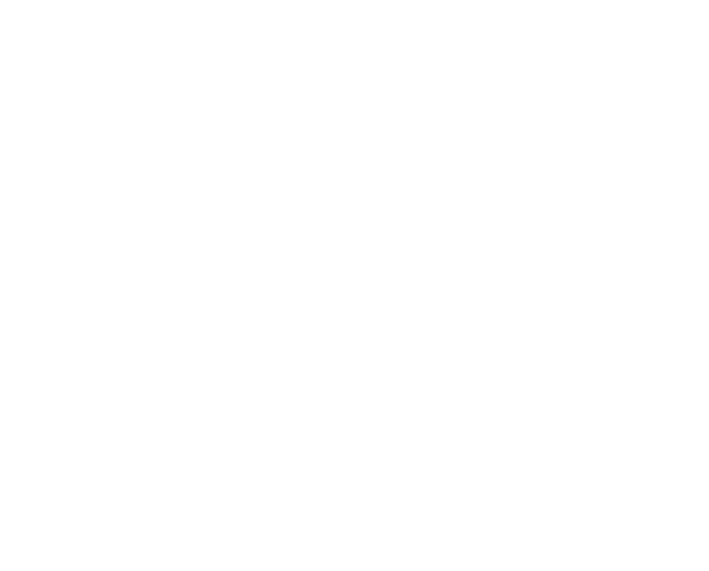{:height 264, :width 298}
				- Only applies for uniform electric fields through flat surfaces
			- For a **closed surface**  with no internal charges, the ^^net flux^^  through the surface mustbe zero
		- ### Gauss' Law
			- The **total electric flux** through any ^^closed^^ is directly proportional to the **net charge enclosed by the surface**
				- $$\Phi_E = \frac{Q_{enc}}{\epsilon_0}$$
			- Known as **Gauss's Law**:
				- $$\oint \vec{E} \cdot d\vec{A} = \frac{Q_{enc}}{\epsilon_0}$$
			- Steps for solving a Gauss' Law Problem
				- **Pick a Gaussian surface** such that integral is constant
					- The value $\vec{E} \cdot d\vec{A}$ should be equal to all points on the surface
				- **Determine the charge enclosed** by your Gaussian surface
				- Carry out integral and solve for $\vec{E}$, the electric field
			- ### Spherical Symmetries
				- Gauss's law problesm are spherically symmetric if the charge distribution depends only on the ^^distance from the origin^^
					- Ex. point charge, spheres, spherical shells
				- The Gaussian surface to use is a **sphere**
				- In the Gauss's Law integral, the electric field and area vectors are always parallel, so the integral reduces to:
					- $$\oint \vec{E} \cdot d\vec{A} = |\vec{E}| \oint dA = |\vec{E}| 4 \pi R^2$$
			- ### Cylindrical Symmetries
				- Gauss's Law problems have cylindrical symmetry if the charge distribution depensd only on the ^^distance from the axis^^
					- Ex. Line of charge, cylindrical cavities
				- The Guassian surface to use is a **cylinder**
				- In the Gauss's Law integral, the electric field and area vectors are always parallel for the curved face, and are perpendicular to the flat face (giving zero flux contribution)
					- $$\oint \vec{E} \cdot d \vec{A} = |\vec{E}| 2 \pi RL$$
			- ### Planar Symmetries
				- Gauss's Law problems for infinite sheets or slabs have planar symmetry
				- The Gaussian surface to use is called a **Gaussian pillbox**
				- In the Gauss's Law integral, the electric field and area vectors are always parallel for the two flat pillbox faces, and are perpendicular for the curved face (giving zero flux contribution)
					- $$\oint \vec{E} \cdot d\vec{A} = 2 |\vec{E}|A$$
- # Electromagnetism
	- ## Magnetic Fields
		- ### Magnetism and Magnetic Fields
			- **Magnetism**
				- There are two types of magnetism:
					- **Permanent magnetism** refers to magnetic fields produced by the inherent properties of certain materials
					- **Electromagnetism** refers to magnetic fieldes that are created by charges in motion
						- If the charges stop moving, the magnetic field disappears
				- **Magnetic Field**
					- **Magnetic field** is related to the magnetic force that a moving electric charge **would** experience at some location
					- Magnetic field is a **vector**
						- It usually takes the variable $B$ and is measured in units of **Tesla (T)**
					- Earth has a very weak magnetic field of $5.0 \times 10^{-5}T$
						- The other unit of magnetic field is **Gauss** ($1 T = 10^4 G$)
							- Earth's magnetic field is $0.5G$
					- The **total magnetic field** due to multiple magnetic fields in the same location is the **vector sum** of the individual fields
						- $$\vec{B}_{total} = \sum_i \vec{B}_i$$
				- **Magnetic Field Lines**
					- The strength and direction of magnetic field can be visualized with **magnetic field lines**
					- The **density** of magnetic field lines is an indication of magnetic field strength
					- The **tangent** to a magnetic field line gives the direction of the magnetic field
					- 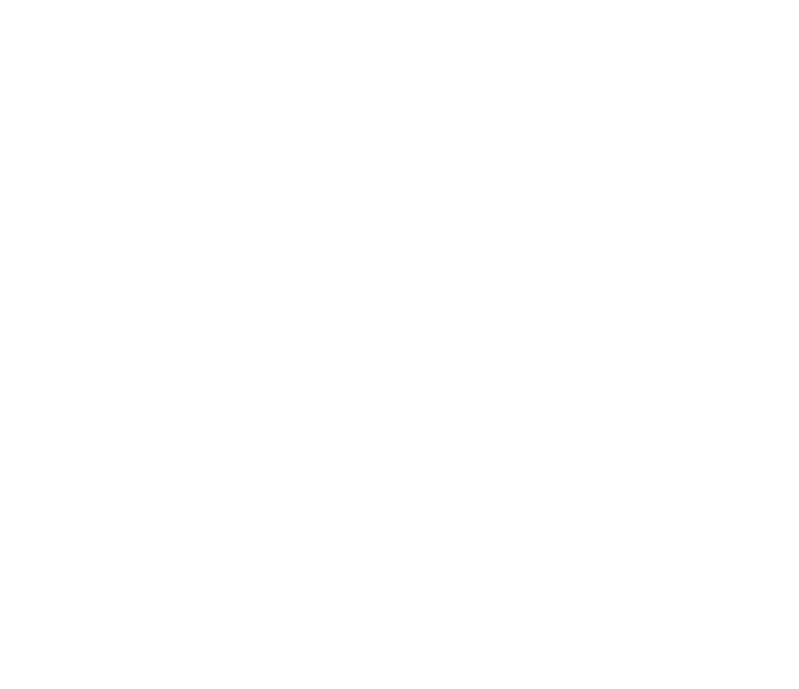{:height 299, :width 315}
					- Unlike electric fields, magnetic fields cannot have starting or ending points
						- They must form **closed loops**
						- Magnetic monopoles do not exist
				- **Magnetic Materials**
					- When **ferromagnetic** materials are placed in a magnetic field, a magnetic field is created inside the material that is in the ^^same direction^^ as the external field
						- When ferromagnetic materials are removed from the external field, they retain **magnetization**
					- **Paramagnetic** materials behave like ferromagnetic materials
						- They ^^do not retain magnetization^^ from the field
					- When **diamagnetic** materials are placed in a magnetic field, the internal field produced is in the ^^opposite direction^^ of the external field
		- ### Magnetic Force on a Moving Charge
			- An electric charge moving in a magnetic field experiences a force proportional to the **magnitude** and **velocity** of the charge, as well as the **magnetic field strength**
				- $$\vec{F} = q\vec{v} \times \vec{B} \quad |\vec{F}| = qvB \sin \theta$$
			- If the velocity of the particle is ^^parallel or anti-parallel^^ to the magnetic field, then the magnetic force is ^^zero^^
			- ^^Uncharged^^ particles do not feel a force produced by the magnetic field
			- If a charged particle is experiencing both an electric field and a magnetic field, the total force is the **Lorentz Force**
				- $$\vec{F} = \vec{F}_{elec} + \vec{F}_{mag} = q(\vec{E} + v \times \vec{B})$$
		- ### Circular Motion in a Magnetic Field
			- If the magnetic force is the only force acting on a charge, then the **acceleration** must be **perpendicular** to the field and the velocity
			- Because the acceleration and velocity are perpendicular, the direction of motion is constantly changing
				- The result is **uniform circular motion** with respect to the magnetic field
					- This is sometimes called ^^cyclotron motion^^
			- 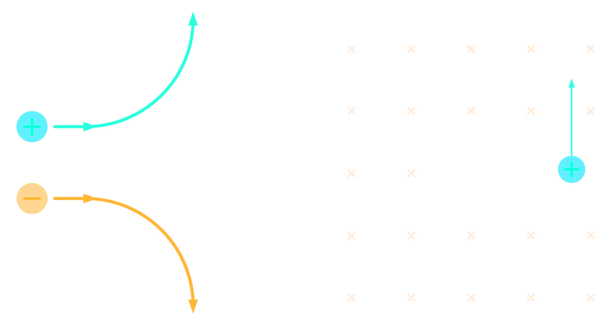
			- We can use **Newton's Second Law** and formula for **centripetal acceleration** to find the radius of the motion
				- $$r = \frac{mv_\perp}{qB}$$
			- The component of the velocity **perpendicular to the magnetic field** is used. It is possible for a charged particle to also have a parallel component, which results in **helical motion**
			- We can take this analysis a step further to find the **period (T)** of the circular motion, which is ^^time required for one full circle^^
				- $$T =\frac{\text{distance}}{\text{speed}} =   \frac{2\pi m}{qB}$$
			- The **frequency (f)** of the circular motion is the inverse of the period, and represents ^^how many full circles are completed per second^^
				- $$f = \frac{1}{T} = \frac{qB}{2\pi m}$$
			- The **angular frequency** can also be defined
				- $$\omega = 2 \pi f = \frac{qB}{m}$$
		- ### Velocity Selectors
			- A charged particle moving through a magnetic field and electric field will experience **two forces**
				- The ^^electric force:^^$|F_{elec}| = qE$
				- The ^^magnetic force:^^$|F_{mag}| = qvB\sin \theta$
			- By Newton's Second Law, if the net force is zero, then there is zero acceleration, and there cannot be circular motion
			- The two forces must be **equal and opposite**
				- $$\sum \vec{F} = m\vec{a} \\ |F_{elec}| = |\vec{F}_{mag}|$$
			- Magnitude can be found $v = \frac{E}{B}$
			- These setups are sometimes called **velocity selectors** because any particles not moving at this exact speed will not travel in a straight line
				- This effectively **filters** particles travelling with a certain speed
		- ### Torque on a Current Carrying Wire
			- A curved that is place in a magnetic field will epxeriecne a different force at each point along its lenth
				- This can result in the wire experience a **torque** even if the net force is zero
			- The torque on a loop of current is found with the following equation
				- $$\tau = \vec{\mu} \times \vec{B}$$
			- We have introduced the **magnetic dipole moment** $\vec{\mu}$
				- $$|\vec{\mu}| = IA$$
			- 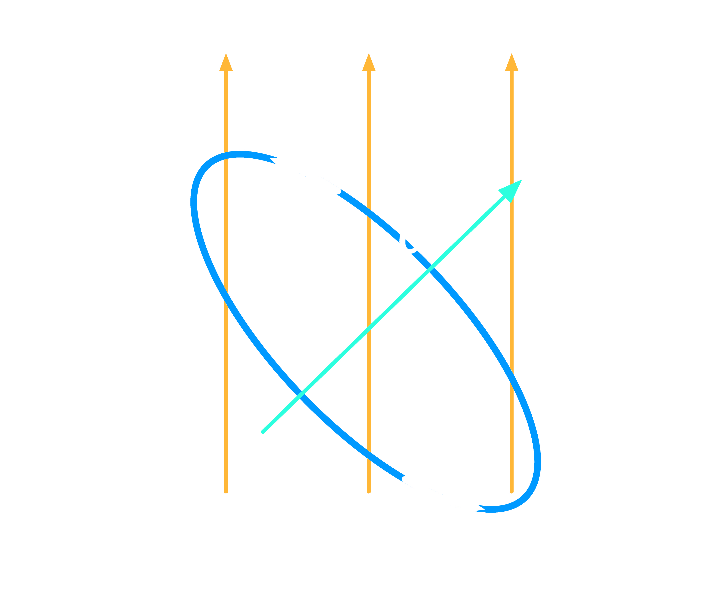{:height 331, :width 398}
			- The magnitude of the torque on a current loop can be written as follows
				- $$|\tau| = NIAB \sin \theta$$
				- The variable $N$ represent the **number of loops of current**
		- ### Hall Effect
			- The motion of electrons inside conductors is affected by external magentic fields
			- This effect is called the **Hall effect** and can be used to develop sensors that measure the strength of magnetic fields
			- **Experimental Setup:**
				- Consider an experiment with the following properties
					- Rectangular slab of **conducting material**
					- **External magnetic field** points out of the page
					- **Current** pointing to the right, that is positive charges are moving to the right with speed $v$ and charge $q$
					- The charge **accumulates on one edge** of the conductor and **charge seperation** is achieved
			- **Results:**
				- Because the charges are seperated, there is an **electric field** across the conductor, $E_H$
				- This electric field builds up until the electric force **cancels out** the magnetic force
					- $$v = \frac{E_H}{B}$$
				- This is the **speed of electrons** moving in the material
				- There is also a **potential difference** across the conductor
					- $$\Delta V_H = E_H d$$
					- $$\Delta V_H = vBd$$
					-
			- ^^**Note:**^^
				- In conductors, it's actually electrons that are moving, but positive current is used as a convention. This does not change the direction of our magnetic force - if both the charge and the velocity direction were swapped, the force still points down the page
	- ## Sources of Magnetic Fields
		- ### Biot-Savart Law
			- A moving charge generates a magnetic field
				- The purpose of **Biot-Savart Law** is to determine the exact magnetic field that is generated by moving charges
			- Consider a point charge $q$ moving with velocity $\vec{v}$
			- If  that point in space is seperated from the point charge by $\vec{r}$, the magnetic field produced at that point is:
				- $$\vec{B} = \frac{\mu_0}{4\pi} \frac{q \vec{v} \times \vec{r}}{|\vec{r}|^2} \quad |\vec{B}| = \frac{\mu_0}{4\pi} \frac{q |\vec{v}| \sin \theta}{|\vec{r}|^2}$$
				- The **permeability of free space:** $\mu_0 = 4\pi \times 10^{-7} \frac{\text{m kg}}{s^2 A^2}$
				- The angle $\theta$ is the angle between the position vector and the velocity vector
			- The magnetic field lines around a moving charged particle form **closed circles**
			- 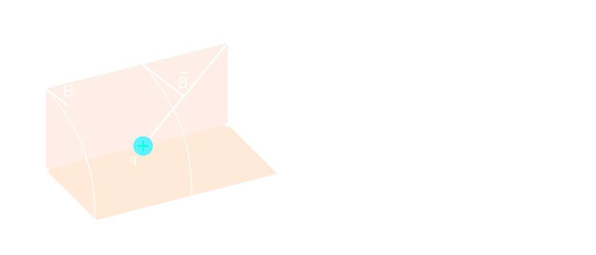
	- ### Magnetic Force on Parallel Wires
		- When two current-carrying wires are close to each other, the magnetic field generated by one wire will exert a force on the charges in the other wire
			- Consider a wire with current pointing **up** the page
				- At any point to the right of this wire, the magentic field points ^^into the page^^
			- Consider a second wire placed to the right of the first wire, also with current pointing **up** the page
				- We can now use $\vec{F} = I \vec{l} \times \vec{B}$ to find the direction of force
				- The right hand rule gives force pointing to the **right**
			- Shows that ^^parallel currents attract^^
				- 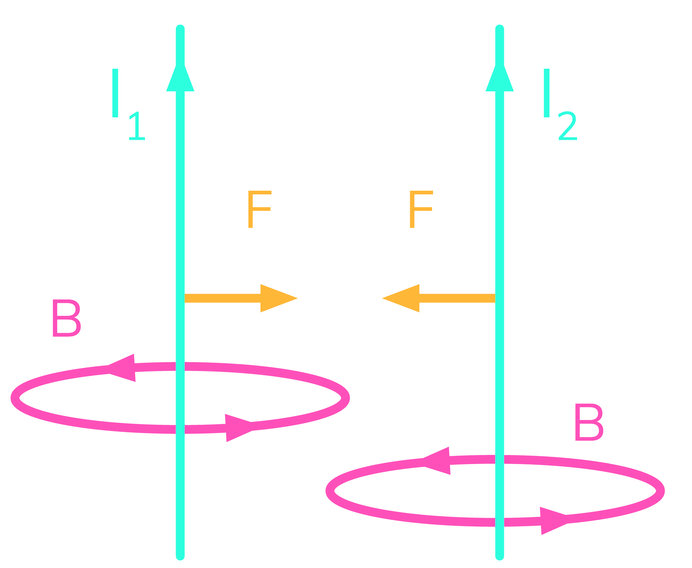{:height 319, :width 348}
			- By repeating the analysis with two current in opposite directions, one can observe ^^opposite currents repel^^
				- 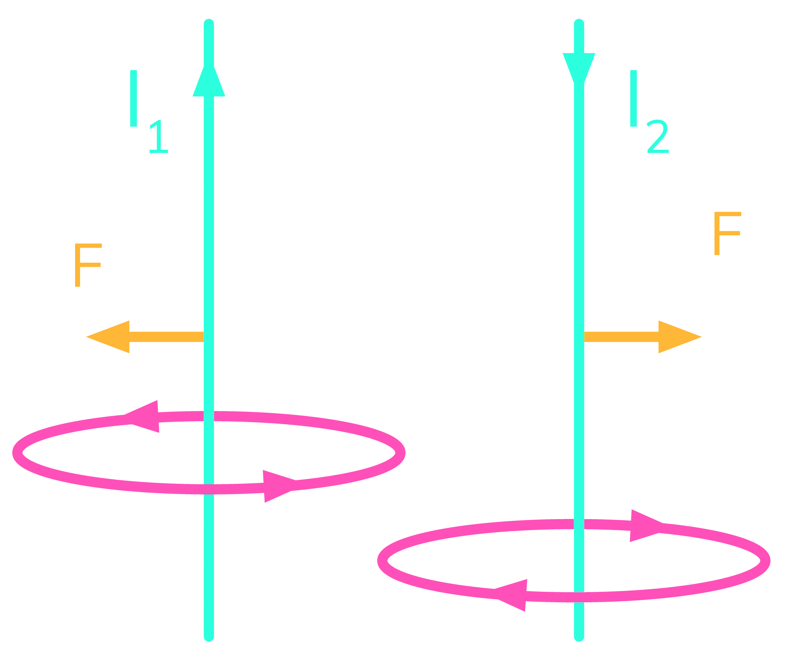{:height 300, :width 350}
			- The **magnitude** of the force (per unit length of wire) is given as follows where $r$ is the distance between the wires
				- $$\frac{F}{l} = \mu_0 \frac{I_1 I_2}{2 \pi r}$$
	- ###  Magnetic Force on a Wire
		- For an individual charge, the formal for magnetic force was $\vec{F} = q \vec{v} \times \vec{B}$
			- To find the magnitude, we can use $|\vec{F}| = qvB \sin \theta$
		- For current of charge:
			- $$\vec{F} = I \vec{l} \times \vec{B} \quad |\vec{F}| = IlB \sin \theta$$
			- The vector $\vec{l}$ has magnitude equal to the length of the wire segment, and the direction is equal to direction of positive current direction
			- 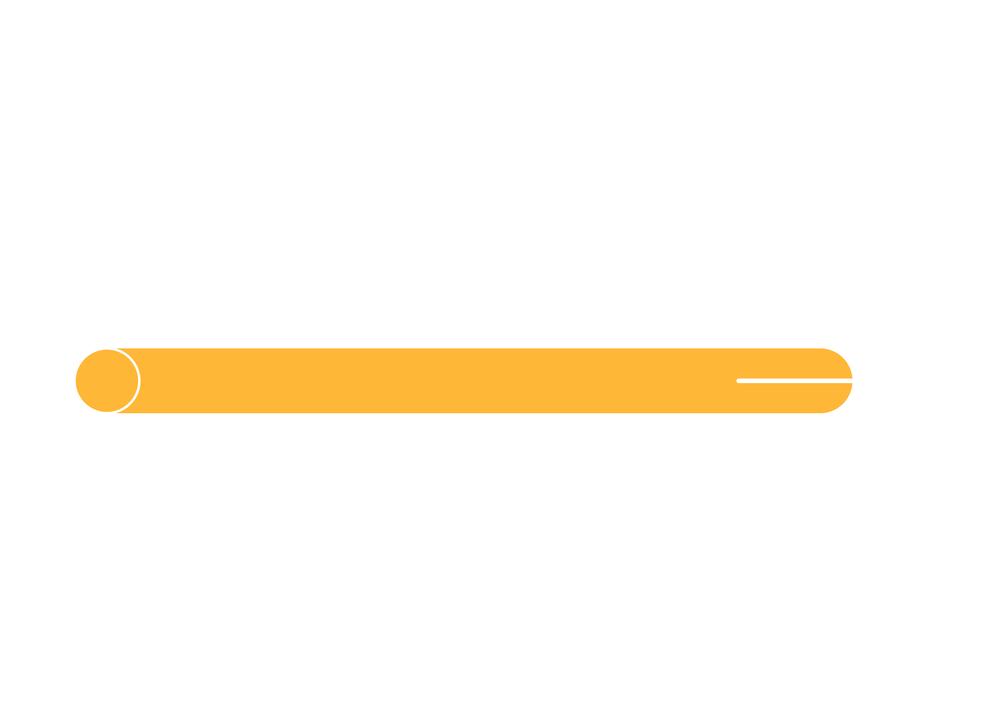{:height 333, :width 429}
		- If there is a **closed loop** of current in a **uniform** magnetic field, the toal magnetic force on the wire will be ^^zero^^
		- For a wire of arbitrary shape, the force on an infinitesimal piece of wire, $d\vec{l}$ is
			- $$d\vec{F} = I d \vec{l}$$
		- The total force is then bound by integrating over the entire wire:
			- $$\vec{F} = \int d \vec{F} = \int I d\vec{l} \times \vec{B}$$
			- This can be used for curved wires, or cases where the magnetic field or current is no constant for all points on the wire
	- ### Magnetic Field of Current-Carrying Wire
		- For a **long, straight wire**, the magnetic field experience at a perpendicular distance $r$ from the wire is as follows:
			- $$B = \frac{\mu_0 I}{2 \pi r}$$
		- **Solenoids:**
			- A **solenoid** is a tightly wound coil of current
			- The magnetic field ^^outside^^ a solenoid is ^^zero^^
			- The magnetic field ^^inside^^ a solenoid is given as follows:
				- $$B = \frac{\mu_0 NI}{L}$$
				- $L$ is the length of the solenoid, and $N$ is the number of twists in the coil
			- The formula can also be written in terms of **current loops per unit length**, $n= \frac{N}{L}$
		- **Current Loop:**
			- At the **centre of a loop of current**, the magnetic field is given by
				- $$B = \frac{\mu_0 I}{2R}$$ where $R$ is the radius of the current loop
	- ### Ampere's Law
	  id:: 66131709-db69-4b5a-8b8f-aea8d65e4a1c
		- Finding the magnetic field due to a current distribution can be made easier using **Ampere's Law**
			- Gives a easier way to find magnetic fields if the current distribution has a high degree of symmetry
		- To use Ampere's Law, one needs to draw an **Amperian Loop**
			- The magnetic field at all points the loop must be **equal**
			- Once a loop is defined, Ampere's Law is
				- $$\int \vec{B} \cdot d\vec{l} = \mu_0 I_{enclosed}$$
				- 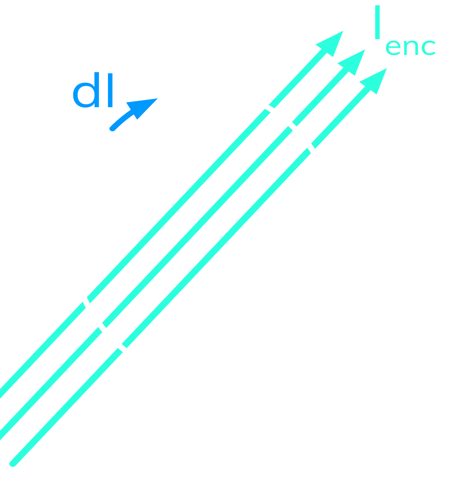{:height 452, :width 470}
- # Special Theory of Relativity
	- ### Basics of Special Relativity
		- **Lorentz Transformation**
			- Basis of Special Relativity:
				- The **laws of physics are the same** in all inertia reference frames
				- The **speed of light is constant** (in vacuum) in all inertail reference frames is approximately equal to $c = 3 \times 10^8 \text{m/s}$
			- **Inertial reference frames** are systems of coordinates that move with a constant speed relative to each toher, but do not accelerate with respect to each other
			- In special relativity, every event is represented in $4$-dimensional **spacetime** as $(x,y,z,t)$, where $x,y$ and $z$ are the spatial coordinates and show the point at which this event happens, and $t$ is time at which it happens
			- All 4 coordinates are measured from an arbitrary "origin" at which they're all zero
			- Consider an shown by $(x,y,z,t)$ in frame $K$
			- The coordinates $(x',y'z',t')$ describes the same event in another frame $K'$ which is moving along the $x$-axis with a constant speed $v$ relative to $K$
			- The **Lorentz Transformation**:
				- $$t' = \gamma \Big( t - \frac{vx}{c^2}\Big)$$
				- $$x' = \gamma(x-vt)$$
				- $$y' = y \quad z'=z$$
			- Where $\gamma$ is defined as:
				- $$\gamma = \frac{1}{\sqrt{1 - \frac{v^2}{c^2}}}$$
			- Gamma is also called the **dilation factor**, and since $v < c$ always we have $\gamma > 1$
				- When the speed $v$ is very small, $\gamma$ is close to 1
				- As speed $v$ approaches the speed of light, $\gamma$ approaches infinity
		- **Time Dilation and Length Contraction**
			- The time between two events in not the same in inertial reference frames are moving with respect to each other
			- Clocks run slower in a moving frame compared to a stationary frame, the way to measure the two events:
				- $$\Delta t = \frac{\Delta t_0}{\sqrt{1 - \frac{v^2}{c^2}}} = \gamma \Delta t_0$$
					- where $\Delta t_0$ is the time interval between the two events in the rest frame, callled **proper time**
					- Since $\gamma > 1$, the time interval in the moving frame is greater than proper time (time dilation)
			- Length is also relative, and the length of a moving object seen from an inertial reference frame at rest is:
				- $$l = l_0 \sqrt{1 - \frac{v^2}{c^2}} = \frac{l_0}{\gamma}$$
				- where $l_0$ is the length of the object at rest, is called the **proper length**
				- Since $\gamma > 1$, the length in the moving frame is smaller than proper length (length contradiction)
		- **Relativistic Velocity Transformation**
			- Imagine an inertial reference frame $K'$ that is moving with a constant speed $v$ relative to another inertial reference frame $K$
			- Moving object with respect to $K'$ with velocity of $u'$
			- The **velocity** of the object with respect to $K$ reference frame is called $u$:
				- $$u = \frac{u'+ v}{1 + \frac{u'v}{c^2}}$$
			- The **reverse** of this transformation can be found $u \leftrightarrow u'$ and $v \leftrightarrow -v$, given by
				- $$u' = \frac{u - v}{1 - \frac{uv}{c^2}}$$
		- **Relavistic Momentum and Energy**
			- **Relativistic Momentum** is given by:
				- $$p = \gamma mv$$
			- **Relativistic Energy** is:
				- $$E^2 = p^2c^2 + m^2c^4$$
			- If the object is at rest, then $p =0$ and we have **rest mass energy**, $E_0 = mc^2$
			- The **relativistic kinetic energy** could be found using $KE = mc^2 (\gamma -1)$
	- ### Nuclear Forces and Binding Energy
		- The **strong nuclear force** is responsible for holding the nucleus together
			- This force is much stronger than the repulsion between protons
		- The **binding energy** is the energy needed to break a nucleusinto its constituents protons and neutrons
		- The binding energy is given by **mass defect**, $\Delta m$ which is the difference between the mass of the seperated nucleons and mass of the whole nucleus
			- The mass defect is always **positive**: a system of seperated nucleans always has a greater mass than a system of bound nucleons
			- When a nucleus **forms**, the **mass defect is transformed into binding energy**
			- When a nucleus **breaks apart**, **binding energy is transformed into mass**.
		- Einstein's equation tells us how **mass and energy** can be converted into each
			- $$E = \Delta mc^2$$
	- ### Photoelectric Effect
		- When light is incident on some metals, electrons can be ejected from the metal surface
		- The **Photoelectric effect**
			- The incoming photon energy is used by the electron to break free from the metal
				- Energy is called the **work function**, and is specific to each metal
			- If there's any energy left afterwards, it will become the **electron's kinetic energy**
		- Using **conservation of energy** we get:
			- $$hf = W + \frac{1}{2}mv^2$$
				- $h$ is Planck's constant
				- $f$ is frequency of the incoming photon
				- $W$ is the work function of the metal
				- $m$ is the mass of the electron
				- $V$ is the speed of the electron
			- The work function is the amount of energy that holds an electron to the
	- ### The Compton Effect
	- ### Wave-Particle Duality
	- ### Radioactivity
	-