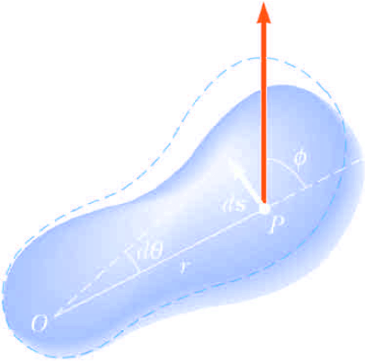

### Lecture 10-17 #[[PHY 1124]]
- ## [[Momentum, Impulse and Collisions]]
  collapsed:: true
	- Centre of Mass
		- Special point in a system or object, that moves as if all the mass of the system is concentrated at that point
		- System will move as if an external force were applied to a single particle of mass $M$ located at the centre of mass
		- $$x_{CM} \equiv \frac{m_1 x_1 + m_2 x_2}{m_1 + m_2}$$
		- {:height 217, :width 301}
		-
		-
	- Motion of System of Particles
		- We can describe the **motion of the system** in terms of ^^the velocity and acceleration of the centre of mass of the system^^
		- Newton's Second Law for a System of Particles
			- The centre of mass of a system of particles of combined mass $M$ moves like an equivalent particle of mass $M$ would move under the influence of the net external force on the system
		- Momentum of a System of Particles
			- The total linear momentum of a system of particles is conserved if no net external force is acting on the system
	- Rocket Propulsion
		- The operation of a rocket depends on the law of conservation of linear momentum as applied to a system of particles, where the system is the rocket plus its ejected fuel
		- The **initial mass** if rocket with all fuel is $M + \Delta m$
		- **Initial momentum** of the system is $\vec{p}_i = (M + \Delta m)\vec{v}$
		- After some time, rocket mass reduces to $M$, with $\Delta m$ amount of fuel ejected, causing increase in velocity
		- Gases are given momentum when ejected out of engine, rocket recieves compensating momentum in opposite direction, acting as thrust
		- In free space, centre of mass of system moves independently of propulsion process
		- $v_e$ - speed of the ejected fuel relative to the rocket
		- $v - v_e$ - speed of the ejected fuel relative to the Earth
		- The increase in rocket speed is proportional to the speed of the escape gases $(v_e)$
		- The increase in rocket speed is also proportional to the natural log of the ratio $M_i/M_f$
		- Thrust on the rocket is the force exerted on it by the ejected exhaust gases
			- Thrust increases as exhaust speed increases, rate of change of mass, burn rate also increases
	- ### Equations:
	  background-color:: green
		- $$x_{cm} \equiv \frac{m_1x_1 + m_2x_2 + m_3x_3 + ... + m_nx_n}{m_1 + m_2 + m_3 + ... + m_n} = \frac{\sum_{i=1}^n m_ix_i}{\sum_{i=1}^n m_i} = \frac{\sum_{i=1}^n m_i x_i}{M}$$
		- Centre of Mass, Coordinates
			- $$x_{cm} = \frac{\sum_i m_ix_i}{M} \qquad y_{cm} = \frac{\sum_i m_i y_i}{M} \qquad z_{cm} = \frac{\sum_i m_i z_i}{M}$$
		- Centre of Mass, Position Vector
			- $$\vec{r}_{cm} = \frac{\sum_i m_i\vec{r}_i}{M}$$
		- Centre of Mass, Extended Object
			- $$x_{cm} = \lim_{\Delta m_i \rightarrow 0} \frac{\sum_i x_i \Delta m_i}{M} = \frac{1}{M} \int xdm$$
			- $$y_{cm} = \lim_{\Delta m_i \rightarrow 0} \frac{\sum_i x_i \Delta m_i}{M} = \frac{1}{M} \int ydm$$
			- $$z_{cm} = \lim_{\Delta m_i \rightarrow 0} \frac{\sum_i x_i \Delta m_i}{M} = \frac{1}{M} \int zdm$$
		- Velocity and Momentum of a System of Particles
			- $$\vec{r}_{cm} = \frac{\sum_i m_i \vec{r}_i}{M} \qquad v_{cm} = \frac{d\vec{r}_{cm}}{dt} = \frac{1}{M} \sum_i m_i \frac{d\vec{r}_i}{dt} = \frac{\sum_i m_i \vec{v}_i}{M}$$
			- $$M\vec{v}_{cm} = \sum_i m_i \vec{v}_i = \sum_i \vec{P}_i = \vec{P}_{tot}$$
		- Acceleration of the Centre of Mass
			- $$v_{cm} = \frac{\sum_i m_i \vec{v}_i}{M}$$
			- $$a_{cm} = \frac{d \vec{v}_cm}{dt} = \frac{1}{M} \sum_i m_i \frac{d\vec{v}_i}{dt} = \frac{1}{M}$$
			- $$M\vec{a}_{CM} = \sum_i m_i \vec{a}_i = \sum_i \vec{F}_i$$
		- Momentum of System of Particles
			- $$M\vec{a}_{cm} = M \frac{d \vec{v}_{cm}}{dt} = \frac{d (M \vec{v}_{cm})}{dt} = 0$$
		- Rocket Propulsion
			- $$(M + \Delta m) m = M(v+ \Delta v) + \Delta m(v- v_e)$$
			- $$M\Delta v = v_e \Delta m$$
			- A $\Delta t \rightarrow 0$, $\Delta v \rightarrow dv$ and $\Delta m \rightarrow dm$
				- $$dm = - dM$$
				- $$Mdv = v_e dm = - v_e dm$$
				- $$\int_{v_i}^{v_f} = - v_e \int_{M_i}^{M_f} \frac{dM}{M}$$
			- $$v_f - v_i = v_e \ln(\frac{M_i}{M_f})$$
		- Thrust
			- $$M dv = - v_e dM$$
			- $$M \frac{dv}{d} = |v_e \frac{dM}{dt}|$$
- ## [[Rotation of Rigid Bodies]]
  collapsed:: true
	- Rigid Bodies
		- A rigid object is a nondeformable object
		- The relative location of all the particles are constant
	- Angular Position and Displacement
		- **Axis of rotation** is the centre of the disk, and point $P$ is fixed distance from $r$ which is viewed through a **fixed reference frame**
		- Point $p$ will rotate about $O$ in a circle of radius $r$, and $\therefore$ $P$ will be located at $(r,\theta)$ **clockwise** from ref. line
		- {:height 216, :width 236}
		- As particle moves, $\theta$ changes, through an **arc length** $s$
		- The **angular position** of the rigid object is the angle $\theta$ between the ^^reference line on the object^^ and the f^^ixed reference line in space^^
		- The **angular displacement** is defined as the angle the object ^^rotates^^ through some time interval $\Delta \theta = \theta_f - \theta_i$
			- {:height 164, :width 211}
	- Angluar Speed and Acceleration
		- Angular speed is **positive** if $\theta$ is ^^increasing^^, ^^counterclockwise^^, and $\theta$ **decreases** is **negative angular speed**
		- Angular acceleration will be **positive** if object rotating ^^counterclockwise, speeding up^^ and **negative** if object rotating ^^clockwise, slowing down^^
	- Angular Motion
		- When a rigid object **rotates about a fixed axis** in a ^^given time interval^^, every portion on the object rotates through the same angle in ^^given time interval^^ and has **same angular speed** and **angular acceleration**
			- So, $\theta, \omega, \alpha$, all characterize the motion of the **entire rigid object** as well as the ^^individual particles in the object^^
		- The acceleration $(\omega, \alpha)$ are the magnitudes of the velocity and acceleration vectors
			- $\alpha$ is parallel to $\omega$ if $\omega$ is increasing with time
			- $\alpha$ is antiparallel to $\omega$ if $\omega$ is decreasing with time
	- Angular and Linear Quantities
		- Every particle of the object moves in a circle with centre of axis of rotation
		- Linear velocity is tangential to circular path (**tangential velocity**)
		- Every point has same *angular speed* but not **tangential speed** (same applies for acceleration)
		- {:height 358, :width 188}
		- The ^^tangential quantities^^ depend on $r$, and $r$ is not the same for all points on the object
	- Rotational Kinetic Energy
		- An object rotating some axis with angular speed, $\omega$ has ^^rotational kinetic energy^^ even though it may not have ^^translational kinetic energy^^
		- There is an analogy between the kinetic energies associated with linear motion and kinetic energy associated with rotational motion
		- Units of rotational kinetic energy are Joules $(J)$
	- Moment of Inertia
		- Quantitatively measure of the rotational inertia of a body
	- Parallel-Axis Theorem
		- **Axis of Rotation** coincides with $$I_z = \frac{1}{2} \pi (\frac{M}{\pi R^2 L})LR^4 = \frac{1}{2}MR^2$$ of object
		- The theorem states $I = I_{cm} + MD^2$
			- $I$ is about any axis ^^parallel^ to the axis through the centre of mass of the object
			- $I_{cm}$ is about the axis through the centre of mass
			- $D$ is the distance from the centre of mass axis to the arbitrary axis
			- {:height 405, :width 250}
	- ### Equations:
	  background-color:: green
		- Arc Length
			- $s = \theta r$
		- Angular Speed
			- $$\overline{\omega} = \frac{\theta_f - \theta_i}{t_f - t_i} = \frac{\Delta \theta}{\Delta t}$$
		- Instantaneous Angular Speed
			- $$\omega \equiv \lim_{t \rightarrow 0} \frac{\Delta \theta}{\Delta t} = \frac{d\theta}{dt}$$
		- Angluar Average Acceleration
			- $$\overline{\alpha} = \frac{\omega_f - \omega_i}{t_f -t_i} = \frac{\Delta \omega}{\Delta t}$$
		- Instantaneous Angular Acceleration
			- $$\alpha \equiv \lim_{\Delta t \rightarrow 0} \frac{\Delta \omega}{\Delta t} = \frac{d \omega}{dt}$$
		- Rotational Kinematic Equations ($\alpha =$ constant)
			- $$\omega_f = \omega_i + \alpha t$$
			- $$\theta_f = \theta_i + \omega_i t +\frac{1}{2} \alpha t^2$$
			- $$\omega_f^2 = \omega_i^2 + 2 \alpha (\theta_f - \theta_i)$$
			- $$\theta_f = \theta_i + \frac{1}{2}(\omega_i + \omega_f) t$$
		- Tangential Velocity
			- $$v = \frac{ds}{dt} = \frac{d(r\theta)}{dt} = r \frac{d\theta}{dt} = r \omega$$
		- Acceleration Comparision
			- $$a_t = r \alpha$$
			- $$a_r = \frac{v^2}{r} = r \omega^2$$
			-
			- $$\vec{a} = \vec{a}_t + \vec{a}_r$$
			- $$a = r\sqrt{\alpha^2 + \omega^2}$$
		- Rotational Kinetic Energy
			- $$K_R = \sum_i K_i = \sum \frac{1}{2} m_i r_i^2 \omega^2$$
			- $$K_R = \frac{1}{2} (\sum_i m_i r_i^2)\omega^2 = \frac{1}{2}I \omega^2$$
		- Moment of Inertia
			- $$I \equiv \sum_i m_ir_i^2$$
			- $$I = \int \rho r^2 dV$$
			- Uniform Thin Hoop
				- $$I = MR^2$$
			- Uniform Rigid Rod
				- $$I_y = \int r^2 \ dm  \\ \qquad = \int_{-L/2}^{L/2} x^2 \frac{M}{L} dx\\ \qquad = \frac{M}{L} \int_{-L/2}^{L/2} x^2 dx = \frac{M}{L} [\frac{x^3}{3}]_{-L/2}^{L/2} = \frac{1}{12}  ML^2$$
			- Uniform Solid Cylinder
				- $$dm = \rho dV = \rho L (2 \pi r) dr$$
				- $$I_z = \frac{1}{2} \pi (\frac{M}{\pi R^2 L})LR^4 = \frac{1}{2}MR^2$$
			- Parallel Axis Theorem
				- $$I = I_{CM} + MD^2$$
- ## [[Dynamics of Rotational Motion]]
	- Torque
		- **Torque** , $\tau$ is the tendency of a force to rotate an object about some axis
		- The moment arm $d$, is the **perpendicular distance** from the rotation axis to line of action of $\vec{F}$
	- Torque vs. Force
		- Forces can cause a change in linear motion, and change in rotational motion
	- Torque and Angular Acceleration
		- The tangential force provides a tangential acceleration $F_t = ma_t$
			- {:height 250, :width 193}
		- **Magnitude of the torque** produced by $F_t$ around the centre of the circle
		- **Tangential acceleration** is related to **angular acceleration**
		- $mr^2$ is the moment of inertia of a particle
		- The ^^torque is directly proportional to the angular acceleration^^ and the constant of proportionality is the moment of inertia
		- ^^The net torque about the rotation axis is proportional to the angular acceleration, with the proportionality factor being the moment of inertia^^
	- Work in Rotational Motion
		- Work done by $\vec{F}$ on an object as it rotates a distance $ds = r \ d \theta$
			- {:height 231, :width 162}
	- Work-Kinetic Energy Theorem of Rotational Motion
		- Net work done by external forces on a object in its **total** kinetic energy, the ^^sum of translational and rotational kinetic energies^^
	- Rolling Motion
		- In *pure rolling motion*, an object rolls without slipping
		- As a cylidner rotates through angle $\theta$, its centre of mass moves a linear distance $s = R\theta$
		- The condition for **pure rolling motion** is $V_{CM} = R \omega$
		- All points on a cylinder have the same angular speed
		- All points on a rolling move in a direction perpendicular to an axis through the instantaneous point of contact
		- The total kinetic energy of a rolling object is the sum of the rotational kinetic energy *about* the centre of mass and the translational kinetic energy *of* the centre of mass
	- Rolling Down an Incline
		- Acclelerated rolling motion is possible only if friction is present between sphere and incline, where friction produces the net torque required for rotation
		- There is **no loss** of mechanical energy since the contact point is at rest relative to surface at any instance
	- Angluar Momentum
		- Instantaneous Angular Momentum $L$ of a particle relative to the origin $O$ is defined as the cross product of particle's instantaneous position vector $\vec{r}$ and linear momentum $\vec{p}$
			- $$\sum \tau = \frac{d\vec{L}}{dt}$$
	- Torque and Angular Momentum
		- Torque acting on a particle is equal to the time rate of change of the particle's angular momentum
		- A particle in uniform circular motion has a constant angular momentum about an axis through the centre of its path
		- The total angular momentum of a system of particles is defined as the vector sum of the angular momentum of individual particles
		- Any torque associated with internal forces acting in a system of particles are zero
		- Net external torque acting on a system about some axis passing through an origin in a intertial frame equals the time rate of change of the total angular momentum of the system about the origin
		- Total angular momentum of a system can vary with time if a net external torque is acting on the system
		- Each particle of an object rotates in $xy$ plane about $z$ axis with angular speed $\omega$
		- Rotational form of Newton's 2nd Law is valid for a rigid object rotating about a moving axis if it passes through the centre of mass and is a symmetry axis
		- If a symmetrical object passes rotates about fixed axis passing through centre of mass, $L = I \omega$ holds, the total angular momentum w.r.t axis or rotation
	- Conservation Law
		- Total Angular Momentum of a system is constant in both magnitude and direction if the resultant external torque acting on the system is zero
			- $$\sum \tau_{ext} = \frac{d \vec{L}_{tot}}{dt} = 0 \rightarrow L_{tot} = \text{constant}$$
		- If the mass of an isolated system undergoes redistribution, the moment of inertia changes
		- Conservation of angular momentum requires a compensating change in angular velocity ($I_i \omega_i = I_f \omega_f$)
		- For a isolated system:
			- Conservation of Energy $\rightarrow E_i = E_f$
			- Conservation of Linear Momentum $\rightarrow p_i = p_f$
			- Conservation of Angular Momentum $\rightarrow L_i = L_f$
		- Moment of inertia of the system is the moment of inertia of the ^^platform^^ plus the moment of inertia of the mass
		- As the person moves toward the centre of rotating platform, the angular speed will increase
	- Motion of a Top
		- The only external forces acting on the top are the normal and gravitational force
		- Direction of angular momentum along the axis of symmetry
		- Normal force produces no torque
		- Top undergoes precessional motion
			- Precessional motion is the motion of the symmetry axis about the vertical
			- Precession is usually slow relative to the spinning motion of the top
	- Gyroscope
		- A gyroscope can used to illustrate precessional motion
		- Gravitational force produces a torque about the pivot, and this torque is perpendicular to the axle
		- Normal force produces no torque
		- Torque results in a change in angular momentum in a direction perpendicular to the axle
		- The gyroscope experiences precessional motion
	- ### Equations:
	  background-color:: green
		- Torque
			- $$\tau = rF \sin \theta = Fd$$
		- Magnitude of Torque around Circle
			- $$\tau = F_t r = (ma_t)r$$
			- $$\tau = (ma_t)r = (mr\alpha)r = (mr^2)\alpha$$
		- Work in Rotational Motion
			- $$dW = \vec{F} \cdot d \vec{s} = (F \sin \phi) r \ d \theta$$
		- Power in Rotational Motion
			- $$ P = \tau \omega$$
			- $$\sum \tau = I \alpha = I \frac{d \omega}{dt} = I \frac{d \omega}{d \theta} \frac{d \theta}{dt} = I \frac{d \omega}{d\theta} \omega$$
			- $$dW = \sum \tau d \theta =I \omega d \omega$$
			- $$\sum W = \int_{\omega_i}^{\omega_f} I \omega d \omega = \frac{1}{2}I \omega^2_f - \frac{1}{2} I \omega^2_i$$
		- Rotational Motion about a Fixed Axis
			- Angular Speed/Acceleration
				- $$\omega = d\theta / dt$$
				- $$\alpha = d\omega/dt$$
			- Net Torque $\sum \tau = I \alpha$, if $\alpha$ is constant
				- $$\omega_f = \omega_i  + \alpha_t$$
				- $$\theta_f = \theta_i + \omega_i t + \frac{1}{2} \alpha t^2$$
				- $$\omega_f^2 = \omega_i^2 + 2 \alpha (\theta_f - \theta_i)$$
			- Work
				- $$W = \int_{\theta_i}^{\theta_f} \tau d \theta$$
			- Rotational Kinetic Energy
				- $$K_R = \frac{1}{2} I \omega^2$$
			- Angular Momentum/Net Torque
				- $$L = I \omega$$
				- $$\tau = dL/dt$$
		- Linear Motion
			- Linear Speed/Acceleration
				- $$v = dx/ dt$$
				- $$a = dv/dt$$
			- Net force $\sum F = ma$ if $a$ is constant
				- $$v_f = v_i + at$$
				- $$x_f = x_ i + v_it+ \frac{1}{2}at^2$$
				- $$v_f^2 = v_i^2 + 2a(x_f - x_i)$$
			- Work
				- $$W = \int_{x_i}^{x_f} F_x \ dx$$
			- Kinetic Energy
				- $$K = \frac{1}{2}mv^2$$
			- Linear Momentum/Net Force
				- $$p = mv$$
				- $$\sum F = dp/dt$$
		- Velocity of Centre of Mass
			- $$V_{CM} = \frac{ds}{dt} = R \frac{d\theta}{dt} = R \omega$$
		- Acceleration of Centre of Mass
			- $$a_{CM} = \frac{dV_{CM}}{dt} = R \frac{d \omega}{dt} = R \alpha$$
		- Total Kinetic Energy of a Rolling Object
			- $$K = \frac{1}{2} I_P \omega^2$$
			- $$I_P = I_{CM} + MR^2$$
			- $$K = \frac{1}{2} I_{CM} \omega^2 + \frac{1}{2} MR^2  \omega^2$$
			- $$V_{cm} = R \omega$$
			- $$K = \frac{1}{2} I_{CM} \omega^2 + \frac{1}{2} Mv^2  \omega^2$$
			- $$\alpha = \frac{F(R \sin \theta - \tau}{I + MR^2}$$
		- Rolling Down an Incline
			- $$K = \frac{1}{2} I_{CM} \omega^2 + \frac{1}{2}Mv^2_{CM}$$
			- $$K = \frac{1}{2} I_{CM}(\frac{v_{CM}}{R})^2  \frac{1}{2}Mv^2_{CM} = K = \frac{1}{2} (\frac{I_{CM}}{R^2} +M)v^2_{CM}$$
			- $$K_f + U_f = K_i + U_i$$
			- $$\frac{1}{2} (\frac{I_{CM}}{R^2} +M)v^2_{CM} + 0  = 0 + Mgh$$
			- $$V_{CM} = \sqrt{\frac{2gh}{1 +\frac{I_{CM}}{MR^2}}}$$
			- $$a_{CM} = \frac{g \sin \theta}{1 + \frac{I_{CM}}{Mr^2}} = \frac{g \sin \theta}{1 + c}$$
			- $$\theta_{CR} = \arctan(\frac{1+c}{c}\mu_s)$$
				- If $\theta > \theta_{CR}$, $c$-object will slip down incline
		- Angular Momentum of a Particle
			- $$L = mvr$$
			- $$\sum_{i} \tau_i$$
			- $$L_i= m_i r_i^2 \omega$$
		- Rotation Form of Newton's Second Law
			- $$\sum t_{ext} = I \alpha$$
		- Angular Moment of a Ball
			- $$L = \frac{2MR^2}{5}$$
			- $$L_z = I \omega$$
			-
		- Rotating Wheel
			- $$\tau = \Delta L / \Delta t$$
			- $$\Delta L = \tau \Delta t$$
			- $$\Delta L= L_f - L_i$$
			- $$L_f = L_i +\Delta L$$
		- Motion of a Top
			- $$\omega_p = \frac{Mgh}{I \omega}$$
			-
		-
- ## [[Periodic Motion]]
	- Periodic Motion
		- **Periodic motion** is the repeating motion of an object in which it continues to return to a given position after fixed time interval
		- Repetitive movements are called *oscillations*
			- A special kind of periodic motion occurs in mechanical systems when the force acting on the object is proportional to the position of the object relative to some equilibrium position
				- If force is always directed toward equilibrium position, the motion is called **simple harmonic motion**
	- Motion of a Spring Mass System
		- 
	- Acceleration
		- When block is displaced from equilibrium point and released, it is a particle under a net force and therefore has an acceleration
			- Acceleration is proportional to the displacement of the block
			- Direction of the acceleration is opposite direction of displacement from eqb
		- An object moves with *simple harmonic motion* whenever its acceleration is proportional to its position and is oppositely directed to displacement from equilibrium
		- Acceleration is **not** constant
			- Therefore, the kinematic equations cannot be applied
			- If block is released from some
	- Simple Harmonic Motion
		- $$x(t) = A \cos(\omega t + \phi)$$
			- $A$ is amplitude of motion, the maximum position of the particle in either direction
			- $\omega$ is the angular frequency $$\sqrt{\frac{k}{m}}$$
			- $\phi$ is the phase constant or the initial phase angle
		- $A$ and $\phi$ are determined uniquely by the position and velocity of the particle at $t = 0$
		- The phase of the motion is its quantity
		- The frequency/period only depend on the mass of the particle and force constant of the spring
		- SHM is one dimensional
		- The total mechanical is constant and proportional to the square of amplitude
	- Simple Pendulum
		- A simple pendulum exhibits periodic motion
		- Motion occurs in the vertical plane and is driven by gravitational force
			- 
			  id:: 65f344e3-e5b5-483d-8391-3ff53d425618
			- When $\theta$ is small, a simple pendulum motion can be modeled as SHM about equilibrium
		- The tangential component of gravitational force is restoring force
		- The function $\theta$ is written as $\theta = \theta - \cos( \omega t + \phi)$
		- Frequency and period only depend on lenght and $a_g$
		- All simple pendula of **equal length** and are at the same oscillate with **same period**
	- Physical Pendulum
		- If a hanging object oscillates about a fixed axis that does not pass through $C.O.M.$ and the object cannot be approximated as a particle, is the system of a **physical pendulum**
		- {:height 444, :width 289}
	- Torsional Pendulum
	- Damped Oscillations
	- Types of Damping
	- Forced Ocillations
		- It is possible to compensate for loss of energy in a damped system by applying an external force
		- Amplitude of motion remains constant if the energy input per cycle exactly equals the decrease in mechanical energy in each cycle that results from resistive forces
		- After sufficient period of time, when the energy input per cycle from the driving force equals the amount of the mechanical energy transformed to internal energy
		- Forced oscillator vibrates at the frequency of the driving force
		- The amplitude is constant as it being driven by an external force
		- The dramatic increase in amplitude near the natural frequency is called **resonance**, and the natural frequency is called **resonance** and the natural frequency is called the **resonance frequency** of the system
	- Resonance
		- The applied force is in phase witht he velocity and the power transferred to the oscillator is a maximum
		- Applied force and $v$ are both proportional to $\sin(\omega t + \phi)$
	- ### Equations
		- $$\omega = 2 \pi f =\frac{2\pi}{T}$$
		- $$\omega = \sqrt{\frac{k}{m}}$$
		- $$T = \frac{2 \pi}{\omega}$$
		- Simple Pendulum
			- $$F_t = - mg\sin \theta = m \frac{d^2s}{dt^2}$$
			- $$\frac{d^2 \theta}{dt^2} = - \frac{g}{L} \sin \theta$$
		- Angular Frequency of Driving force
			- $$F(t) = F_0 \sin \omega t$$
			- $$x = A \cos (\omega t + \phi)$$
			-
			- $$A = \frac{F_0/m}{\sqrt{(\omega^2 - \omega_0^2})^2 + (\frac{b \omega}{m})^2}$$
		- Resonance
			- $$F = F_0 \sin \omega t$$
			- $$x = A \cos(\omega t + \phi)$$
- ## [[Electric Charge and Electric Fields]]