## [[Applying Newton's Laws]] #[[PHY 1124]]
	- ## 5.4 Dynamic of Circular Motion
	  id:: 65b7ab2b-b2d9-4484-b384-ab1f83a370fe
		- ### Uniform Circular Motion
			- A force $F_r$, is directed towards the centre of a the circle
			- This force is associated with an acceleration $a_c$
			- Applying Newton's Second law along the radial direction gives us:
				- $$\sum F = ma_c = m \frac{v^2}{r}$$
			- A force causing a centripetal acceleration acts toward the centre of the circle
			- It causes a change in direction of velocity vector
			- If force vanishes the object would move in a straight-line path tangent to the circle
			- 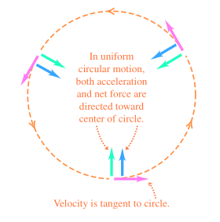
			- Uniform circular motion can result from *any* combination of forces, just so the net force $\sum \vec{F}$ is always directed toward the centre of the circle and has constant magnitude
				- 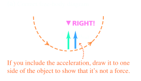 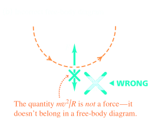
		- ### Centripetal Force
			- Force causing the centripetal acceleration can be called the **centripetal force**
			- The force acting in the role of a force that causes circular motion
			- 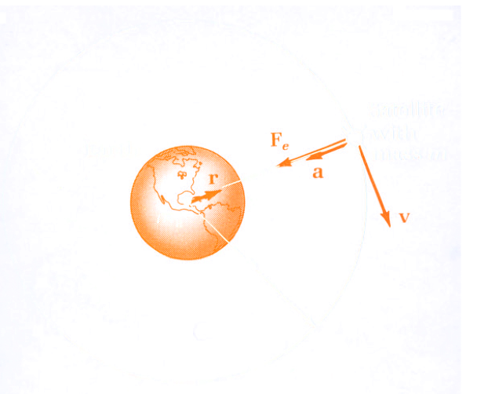{:height 248, :width 440}
			- $$\sum \vec{a} = m\vec{a}$$
			- $$\frac{Gmm_e}{r^2} = m (\frac{v^2}{r})$$
			- $$v = \sqrt{{\frac{Gm_e}{r}}}$$
		- ### Conical Pendulum
			- The object is in equilibrium int he vertical direction and undergoes uniform circular motion in the horizontal direction
				- 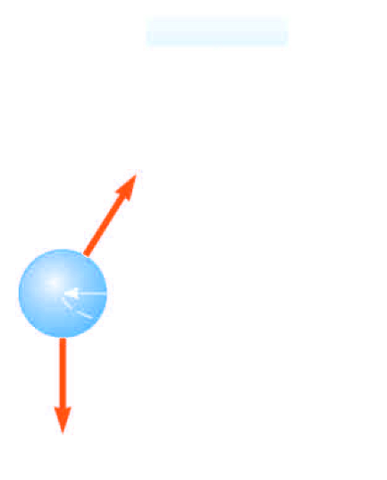
			- $$T \cos \theta = mg$$
			- $$\sum F = T \sin \theta = ma_c = \frac{mv^2}{r}$$
			- $$\tan \theta = \frac{v^2}{rg} \rightarrow v = \sqrt{rg\tan \theta}$$
			- $$r = L \sin \theta \qquad v = \sqrt{gL \sin \theta \tan \theta}$$
			- $v$ is independent of $m$
		- ### Motion in a Horizontal Circle
			- 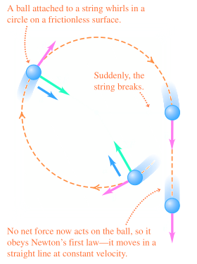
			- $T$ is the maximum tension the cord can withstand
			- Maximum $v = ?$
			- Centripetal force is supplied by the tension
			- $$T = m \frac{v^2}{r} \qquad v = \sqrt{\frac{Tr}{m}}$$
		- ### Horizontal (Flat) Curve
			- Variables given: $m, \mu_s, r \rightarrow v_{max} = ?$
			- The force of static friction supplies the centripetal force
				- $$f_s = m \frac{v^2}{r}$$
			- The maximum speed at which the car can negotiate the curve is:
				- $$v_{max} = \sqrt{\frac{(f_s)_{max}r}{m}} = \sqrt{\frac{\mu_s m g r}{m}} = \sqrt{\mu_s gr}$$
			- Does not depend on the mass of the car
		- ### Banked Curve
			- There are designed with friction equating zero
				- 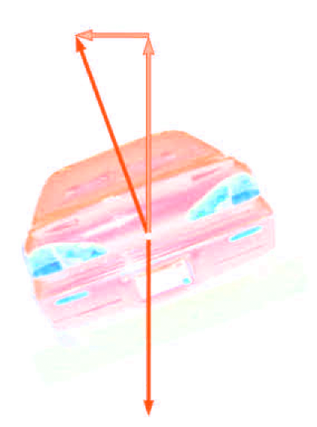{:height 367, :width 223}
			- Variables given: $m, v, r \rightarrow \theta = ?$
			- There is a component of centripetal force
			- $$\sum F_r = n_x = n \sin \theta = \frac{mv^2}{r}$$
			- $$F_y  = n_y - F_g = n \cos \theta - mg = 0$$
			- $$n \cos \theta = mg$$
			- $$\tan \theta = \frac{v^2}{gr}$$
			- $$\theta = \arctan(\frac{v^2}{gr})$$
		- ### Non-Uniform Circular Motion
			- $a = a_r + a_t$
			- The acceleration and force have tangential components
			- $F_r$ produces the centripetal acceleration
			- $F_t$ produces the tangential acceleration
			- $$\sum F = \sum F_r + \sum F_t$$
	- ## 5.5 The Fundamental Forces of Nature
	  id:: 65b7ab5a-d221-480f-9ceb-fdc67f613d69
		- ### Motion in Accelerated Frames
			- Newton's laws: valid in **inertial** frames of reference
				- 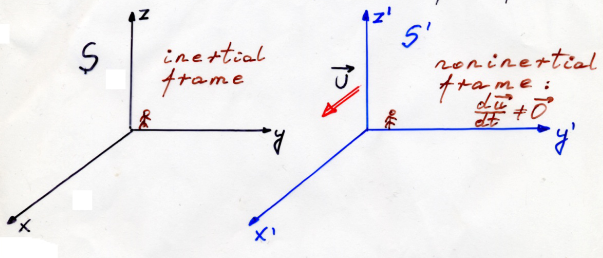
			- Non-inertial frame of reference:
				- The one that is accelerating (Newton's first law is not valid)
					- $$\vec{v}' = \vec{v} - \vec{u}$$
					- $$\frac{d\vec{v}'}{dt} = \frac{d\vec{v}}{dt} - \frac{d\vec{u}}{dt}$$
					- $$\frac{d\vec{u}}{dt} \ne 0$$ (non-inertial frame)
					- $$\vec{a}' = \vec{a} - \vec{a}_i \qquad  \vec{a}_i = \frac{d\vec{u}}{dt}$$
					- **S:**   $$\vec{F} = m \vec{a}$$
					- **S':**   $\vec{F}' = m\vec{a}' = m(\vec{a} - \vec{a}_i) = \vec{F} - m\vec{a}_i$
			- The non-inertial observer measures a force different from that of the inertial observer
				- $$\vec{F}' = \vec{F} - \vec{F}_i$$
				- Fictitious force are invoked by an observer in a non-inertial frame of reference in order to make Newton's second Law seem to be valid
			- A **fictitious force** results from an accelerated frame of reference
				- A fictitious force appears to act on an object in the same way as a real force, but you cannot identify a second object for the fictitious force
		- ### Centrifugal Force
			- A car approaching a curved exit ramp
			- From the frame of the passenger, a force appears to push her towards the door
			- The outward force is often called a **centrifugal** force
				- It is a fictitious force due to the acceleration associated with car's change in direction
		- ### Fictitious Force, examples
			- Although fictitious forces are not real forces, they can have real effects
			- Example:
			  background-color:: blue
				- Objects in the car do slide
				- You feel pushed to the outside of a rotating platform
				- The Coriolis force is responsible for the rotation of weather systems and ocean currents
			- The observer (a) sees
				- $\sum F_x = T \sin \theta = ma$
				- $\sum F_y  = T \cos \theta - mg = 0$
				- 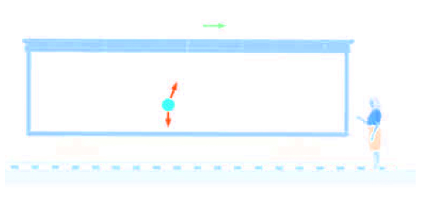
			- The non-inertial observer (b) sees
				- $$\sum F_x' = T \sin \theta - F_{ficticious} = 0$$
				- $$F_{fictitious} = ma$$
				- $$\sum F_y' = T \cos \theta - mg = 0$$
				- 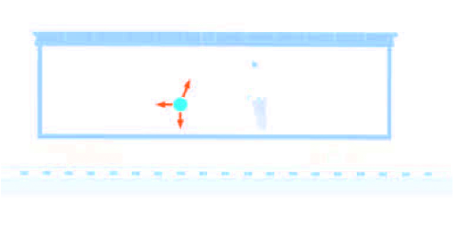
		- ### Fictitious Forces in a Rotating System
			- 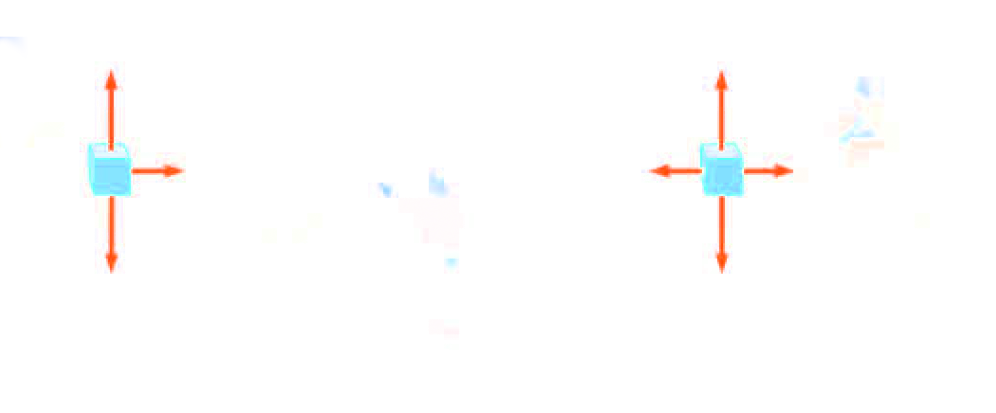
			- According to the inertial observer, the tension is the cetripetal force
				- $$T = \frac{mv^2}{r}$$
			- The non-inertial observer sees
				- $$T - F_{ficticious} = T - \frac{mv^2}{r} =0$$
		- ### Coriolis Force
			- $\omega$ is angular speed
			- $v$ is velocity in the rotating reference frame
			- $$v_a = r_a \omega; r_B \omega \rightarrow v_B - v_A = (r_B - r_A) \omega$$
			- $v_B > v_A$ (because $r_B > r_A$)
			- Coriolis acceleration
				- $r_B - r_A = vt$
				- $S_A = v_at; S_B = v_Bt$
				- $S = S_B - S_A = (v_B - v_A)t = (r_B - r_A) \omega t = \omega v t^2$
				- $S = \frac{1}{2}(2 \omega v)t^2 = \frac{1}{2}a_{Cor}t^2$
				- $a_{Cor} = 2 \omega v$
				- $a_{Cor} = -2\omega \times \vec{v}$
				- $F_{cor} = m\vec{a}_{Cor}$
			- 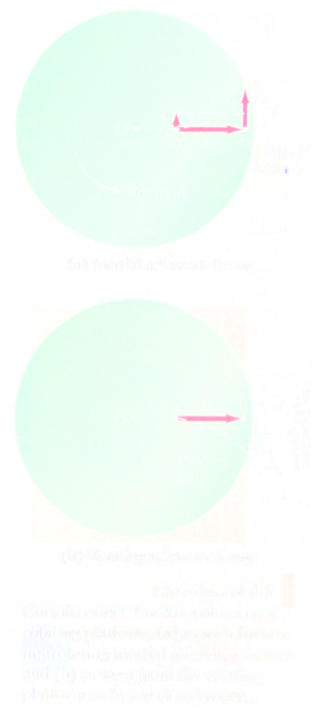
		- The Earth rotates **eastward**
			- 
				- $\lambda$ - the lattitude
				- $R$ - radius of the Earth
				- $v = \omega r$
				- $r = R\cos \lambda$
				- $v = \omega R \cos \lambda$
			- 
				- Objects travelling away from the equation will be deflected east by the coriolis force
				- Objects travelling toward the equator will be deflected east by Coriolis force
				- Objects travelling towards the equator will be deflected west by the Coriolis force
			- In the ^^Northern Hemisphere^^, the Coriolis force acts to deflect a body which is moving northwards or southwards to its^^right^^
			- In the ^^Southern Hemisphere^^, the Coriolis force acts to deflect a body which is moving northwards or southwards to its ^^left^^
		- ### Foucault Pendulum
			- $$T(\lambda) = \frac{2 \pi}{w \sin \lambda}$$
		- ### Apparent Weight
			- $$F_N = F_{ps}  \qquad F_{ps} = -F_{sp}$$
			- $$\sum F_y = F_N - mg = ma \rightarrow F_N = m(g+a)$$
			- $F_N = F_{ps} \rightarrow$ Apparent Weight
			- $a = 0 \rightarrow F_N = mg$
			- $a > 0 \rightarrow F_N > mg$
			- $a < 0 \rightarrow F_N < mg$
			- $a = -g$ (free fall) $\rightarrow F_N = 0$ (apparent "weightlessness")
		- **Gravitational interactions** include the familar force of you *weight* which results from the earth's gravitational attraction acting on you
		- **Electromagnetic interactions** includes electric and magnetic forces
		- **Strong interaction** is responsible for holding the nucleus of an atom together
		- **Weak interaction** ties into radioactive decay
		- ### Artificial Gravity
			- $$F_c = m(4 \pi^2 f^2 r) = mg$$
			- $$f = \frac{1}{2 \pi} \sqrt{\frac{g}{r}}$$
			- $$T = \frac{1}{f}$$
	- ## 5.6 Motion (Stadnik Lore Entry)
		- ### Motion with Resistive Forces
			- Motion can be through a medium, either gas or liquid
			- The medium exerts a *resistive force* $\vec{R}$, on an object moving through the medium
			- The magnitude of $\vec{R}$ depends on the medium
			- The direction of $\vec{R}$ is opposite the direction of motion of the object relative to the medium
			- $\vec{R}$ nearly always increases with increasing speed
			- The magnitude of $\vec{R}$ can depend on the speed in complex ways:
				- $\vec{R}$ is proportional to $\vec{v}$
					- Good approximation for slow motions or small objects
				- $\vec{R}$ is proportional to $\vec{v}^2$
					- Good approximation for large objects
		- ### $\vec{R}$ is Proportional to $\vec{v}$
			- Resistive force can be expressed as $\vec{R} = -b \vec{v}$
			- $b$ depends on the property of the medium, and on the shape and dimensions of the object
			- Negative sign indicates $\vec{R}$ is in opposite direction to $\vec{v}$
			- Initially, $v = 0$ and $\frac{dv}{dt} = g$
			- As $t$ increases, $R$ increases and $a$ decreases
			- Acceleration approaches 0 when $R \rightarrow mg$
				- $\vec{v}$ approaches the **terminal speed** of the object
				- {:height 589, :width 158}
			- Analysing the motion results
			- $$mg - bv = ma = m \frac{dv}{dt}$$
			- $$a = \frac{dv}{dt} = g - \frac{b}{m}v \qquad \qquad \int_0^v \frac{dv}{\frac{b}{m}v - g} = - \int_0^t \ dt$$
			- $$\int \frac{dx}{ax+b} = \frac{1}{a} \ln(ax+b)$$
			- $$\frac{m}{b} \ln(\frac{b}{m}v -g) - \frac{m}{b} \ln(-g) = -t$$
			- $$\ln(1-\frac{b}{mg}v) = - \frac{b}{m}t \rightarrow v = \frac{mg}{b} (1- e^{-\frac{b}{m}t})$$
				- 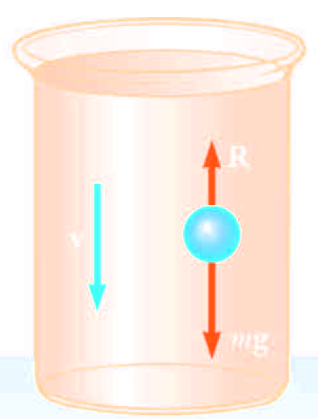{:height 273, :width 199}
			- $$v = \frac{mg}{b} (1- e^{-\frac{b}{m}t})$$
			- $$v_T = \frac{mg}{b}$$ (Terminal speed)
			- $$v = v_T (1- e^{-\frac{b}{m}t}) = v_T (1- e^{-\frac{t}{\tau}})$$
			- $$\tau = \frac{m}{b}$$
			- 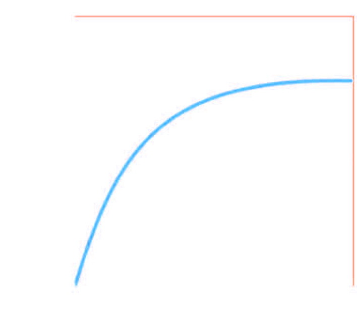{:height 368, :width 383}
		- ### $\vec{R}$ Proportional to $\vec{v}^2$
			- For objects moving at high speeds through air, the resistive force is approximately equal to the square of the speed
			- $$R = \frac{1}{2}D \rho Av^2$$ where
				- $D$ is a dimensionless empirical quantity that called the drag coefficient
				- $\rho$ is the density of the air
				- $A$ is the cross-sectional area of the object
				- $v$ is the speed of the object
			- Analysis of an object falling through air accounting for air resistance
				- $\sum F = mg - \frac{1}{2}D \rho Av^2 = ma$$
				- $$a = g - (\frac{D\rho A }{2m})v^2$$
				- The terminal speed will occur when the acceleration goes to zero
				- Solving the equation gives
					- $$v_T = \sqrt{\frac{2mg}{D \rho A}}$$
					- 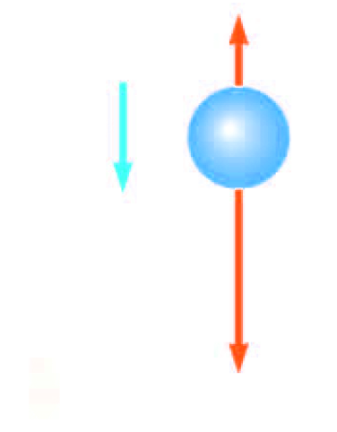{:height 189, :width 228}
		- ### Process for Problem-Solving: Analytical Method
			- Apply the method using this proccedure
				- Sum all the forces acting on the particle to find the net force, $\sum F$
				- Net Force used to determine the acceleration from the relationship $a = \sum \frac{F}{M}$
				- Acceleration used to determine the velocity from the relationship $\frac{dv}{dt} =a$
				- Velocity used to determine the position from the relationship  $\frac{dx}{dt} = v$
			- Applying the proccedure:
				- $$F_g = ma_y = - mg$$
				- $$a_y = -g \text{ and } \frac{dv_y}{dt} = -g$$
				- $$V_y(t) = v_{yi} - gt$$
				- $$y(t) = y_i + v_{yi}t - \frac{1}{2} gt^2$$
		- ### Process for Problem-Solving: Numerical Method
			- Numerical modelling can be used in place of the analytical method for these more complicated situations
			- In Euler's Method, derivatives are approximated as ratios of finite differences
			- $\Delta t$ is assumed to be very small, such that the change in acceleration during the time interval is also very small
			- $$a(t) \approx \frac{\Delta v}{\Delta t} = \frac{v(t + \Delta t) - v(t)}{\Delta t}$$
			- $$v(t+ \Delta t) \approx v(t) + a(t) \Delta t$$ and
			- $$v(t) \approx \frac{\Delta x}{\Delta t} \approx \frac{x(t+\Delta t) - x(t)}{\Delta t}$$
			- $$x(t + \Delta t) \approx x(t) + v(t) \Delta t$$
			- $$a(x,v,t) = \frac{\sum F(x.v.t)}{m}$$
			- 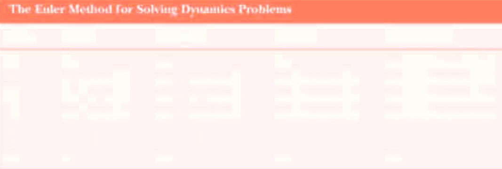
			- One advantage is that dynamics are not obscured
				- Relationships among acceleration. force, velocity and position are clearly shown
			- Time interval must be small
				- Method is completely reliable for infinitesimally small time increments
				- For practical reasons a finite increment must be chosen
				- Time increment can be chosen based on initial conditions and used throughout the problem
			-
- ## [[Work and Kinetic Energy]] #[[PHY 1124]]
	- ## 6.1 Work
	  id:: 65c2cce1-7f67-409e-8ee8-36775aae3021
		- The work $W$ done on a system by an agent exerting a constant force on the system is the product of magnitude, $F$ of the force the magnitude $\Delta r$ of the displacement of the point of application of the force, and $\cos \theta$, where $\theta$ is the angle between the force and displacement vectors
		- $W = F \Delta r \cos \theta$
		- 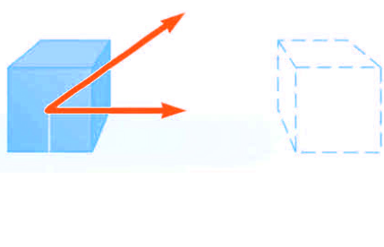
		- The displacement is that of the point of application of the force
		- Force does no work on the object if the force does not move through a displacement
		- Work done by a force on moving object is zero when the force applied is perpendicular to the displacement of its point of application
		- The normal force, $n$, and the gravitational force $mg$, do no work on the object
			- $$\cos \theta = \cos 90 \degree = 0$$
		- The force $\vec{F}$ does no work on the object
		- 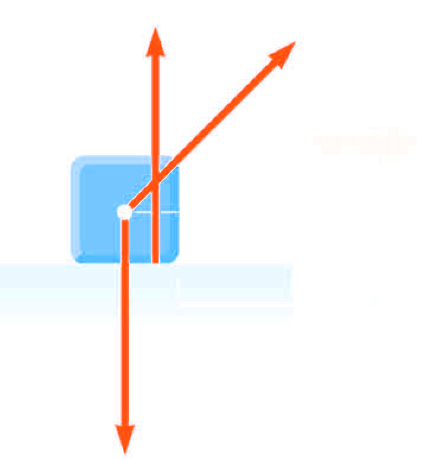{:height 261, :width 354}
		- The sign of the work depends on the direction $\vec{F}$ relative to $\Delta r$
			- Work is positive when the projection is in the opposite direction
		- Work is a scalar quantity
			- The unit of work is a joule ($J$)
			- 1 joule = 1 newton $\cdot$ 1 meter
			- J = N $\cdot$ M
		- ### Scalar Product of Two Vectors
			- The scalar product of two vectors is written as $\vec{A} \cdot  \vec{B}$
				- It is a dot product
			- $\vec{A} \cdot \vec{B} = AB \cos \theta$
				- $\theta$ is the angle *between* $\vec{A}$ and $\vec{B}$
			- 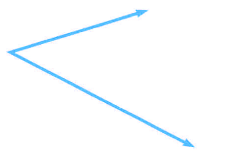
		- $$W = F \Delta r \cos \theta = \vec{F} \cdot \Delta \vec{r}$$
		- The scalar product is **commutative**
			- $\vec{A} \cdot \vec{B} = \vec{B} \cdot \vec{A}$
			- The scalar product obeys the **distributive law of multiplication**
			- $$A \cdot (B + C) = A \cdot \vec{B}  + \vec{A} \cdot \vec{C}$$
		- ### Dot Product of Unit Vectors
			- $$\hat{i} \cdot \hat{i} = \hat{j} \cdot \hat{j} = \hat{k} \cdot \hat{k}  = 0$$
			- Using component form with $\vec{A}$ and $\vec{B}$
				- $$A = A_x \hat{i} + A_y \hat{j} + A_z \hat{k}$$
				- $$B = B_x \hat{i} + B_y \hat{j} + \hat{k}$$
				- $$C = C_x \hat{i} + C_y \hat{j} + C_z \hat{k}$$
		- ### Work Done By a Varying Force
			- Assume that during a very small displacement, $\Delta x$, $F_x$ is approximately constant
			- For that displacement $W \approx F_x \Delta x$
			- For all of the intervals,
				- $$W \approx \sum_{x_i}^{x_f} F_x \Delta x$$
				- 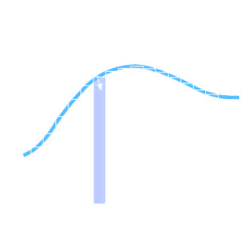
			- $$\lim_{\Delta x  \rightarrow 0} \sum_{x_i}^{x_f} F_x \Delta x = \int_{x_i}^{x_f}F_x \  dx$$
			- $$\therefore W = \int_{x_i}^{x_f} F_x \ dx$$
				- 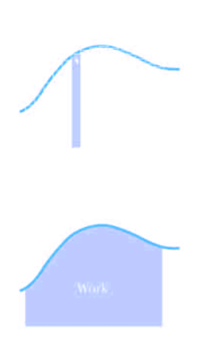
		- ### Work Done by Multiple Forces
			- If more than one force acts on a system and the particle can be modelled as a particle, the total work done on the system is the work done by the net force
				- $$\sum W = W_{net} = \int_{x_i}^{x_f} (\sum F_x ) \ dx$$
			- If the system cannot be modelled as a particle, then the total work is equal to the algebraic sum of the work done by the individual forces
				- $$W_{\text{net}} = \sum W_{\text{by individual forces}}$$
	- ## 6.3 Work and Energy with Varying Forces
	  id:: 65c2cce1-1625-4ad0-a071-595566e4d946
		- $$W = \int_{x_1}^{x_2} F_x \ dx$$
			- $W$ is **work** done on a particle by a **varying** $x-$**component of force** $F_x$ during **straight-line displacement** along $x-$axis
			- $x_2$ (upper limit) is the final position
			- $x_2$ (lower limit) is the initial position
			- $F_x$ is the integral of $x-$component of force
		- ### Work Done By a Varying Force
			- Assume that during a very small displacement, $\Delta x$, $F_x$ is approximately constant
			- For that displacement $W \approx F_x \Delta x$
			- For all of the intervals,
				- $$W \approx \sum_{x_i}^{x_f} F_x \Delta x$$
				- 
			- $$\lim_{\Delta x  \rightarrow 0} \sum_{x_i}^{x_f} F_x \Delta x = \int_{x_i}^{x_f}F_x \  dx$$
			- $$\therefore W = \int_{x_i}^{x_f} F_x \ dx$$
				- 
		- ### Work Done by Multiple Forces
			- If more than one force acts on a system and the particle can be modelled as a particle, the total work done on the system is the work done by the net force
				- $$\sum W = W_{net} = \int_{x_i}^{x_f} (\sum F_x ) \ dx$$
			- If the system cannot be modelled as a particle, then the total work is equal to the algebraic sum of the work done by the individual forces
				- $$W_{\text{net}} = \sum W_{\text{by individual forces}}$$
		- ### Work Done by a Varying Force in Three Dimensions
			- $$\Delta = \vec{F} \cdot \Delta \vec{r}$$
			- $$W \approx \sum \Delta W = \sum \vec{F} \cdot \vec{r}$$
			- 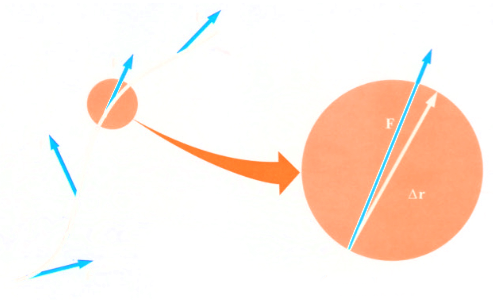{:height 277, :width 409}
			-
		- ### Hooke's Law
			- The force exerted by the spring is
				- $F_s = -kx$
				- $x$ is the position of the block with respect to the equilibrium position $(x=0)$
				- $k$ is called the spring constant or force constant and measures the stiffness of the spring
				- When $x$ is positive, (spring is stretched), $F_s$ is negative
				- When $x$ is 0 (at the equilibrium position), $F_s$ is 0
				- When $x$ is negative, (spring is compressed), $F_s$ is positive
			- The force exerted by the spring is always directed opposite to the displacement from equilibrium
			- $F_s$ is called the **restoring force**
			- If the block is released it will oscillate back and forth between $-x_{max}$ and $x_{max}$
			- 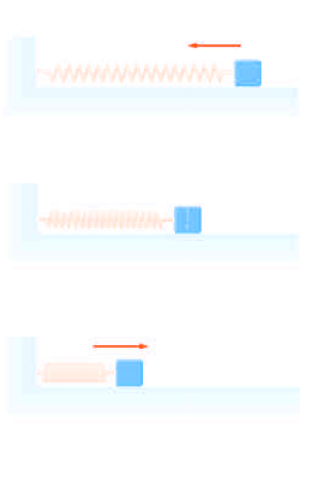
		- ### Work Done by a Spring
			- Calculate the work as the block moves from $x_i = - x_{max}$ to $x_f = 0$
				- $$W_s = \int_{x_i}^{x_f} F_x \ dx = \int_{-x_{max}} ^ 0 (-kx) \ dx = \frac{1}{2} k x^2 _{max}$$
				- $W_s$ is the area of the shaded triangle
				- The total work as the block moves from $-x_{max}$ to $x_{max}$ is zero
			- 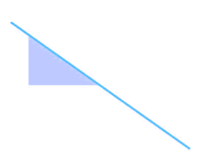
			- #### Block Undergoing Arbitrary Displacment from $x = x_i$ to $x = x_f$
				- $$W_s = \int_{x_i}^{x_f} (-kx) \ dx = \frac{1}{2} kx^2_i - \frac{1}{2}kx^2_f$$
		- ### Spring with Applied Force
		- On a graph of force as a function of position, the total work done by the force is represented by the area under the curve between the initial and final position
		- Suppose an external agent $F_{app}$, stretches the string from $x_i = 0$ to $x_f = x_{max}$
		- The applied force is equal and opposite force to the spring force
		- $F_{app} = -F_s = -(-kx) = kx
		- Work done by $F_{app}$ is equal to
			- $$W_{F_{app}} = \int_0^{x_{max}} F_{app} \ dx = \int_0^{x_{max}} kxdx = \frac{1}{2} kx^2_{max}$$
			- 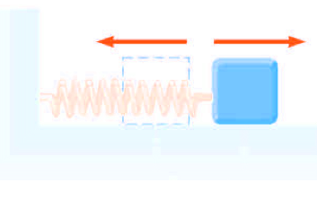
		- Work done by $F_{app}$ on a block-spring system between arbitrary positions o f the block
			- $$W_{F_{app}} = \int_0^{x_{max}} F_{app} \ dx = \int_0^{x_{max}} kxdx = \frac{1}{2} kx^2_f - \frac{1}{2} kx^2_i$$
			- This is the negative of
				- $$W_s = \int_{x_i}^{x_f} (-kx) \ dx = \frac{1}{2} kx^2_i - \frac{1}{2}kx^2_f$$
		-