## [[Work and Kinetic Energy]] #[[PHY 1124]]
	- ## 6.2 Kinetic Energy and the Work-Energy Theorem
	  id:: 65c2cce2-03df-4fc9-b2d4-5d62bc704b0e
		- Total work done on an object by external forces is related the object's displacement
		- Total work is related to changes in *speed* of the object
		- When a particle undergoes a displacement, it speeds up if $W_{tot} > 0$, slows down if $W_{tot} < 0$ and maintains same speed if $W_{tot} = 0$
			- 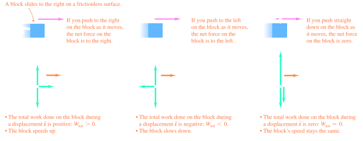
		- The particle's acceleration is constant and given by Newton's second law $F= ma_x$
		- ### Kinetic Energy
			- $$K = \frac{1}{2}mv^2$$
			- So the kinetic energy of a particle is equal to the total work that particle can do in the process of being brought to rest
		- ### Work-Energy Theorem
			- The Work-Kinetic Energy Theorem states
				- $$\sum W = K_f - K_i = \Delta K$$
			- When work is done on a system and the only change in the system is in the speeds of its members, the net work done on the system equals the change in kinetic energy of the system
			- When $W_{tot}$ is *positive*, the kinetic energy **increases** and the particle is going fasster at the end of the displacement then at the beginning
			- When $W_{tot}$ is *negative*, the kinetic energy **decreases** and the speed is less after the displacement
			- When $W_{tot} = 0$, the kinetic energy stays the same and the speed is unchanged
			- Work-Energy Theorem by itself tells us only about changes in *speed*, not velocity, since the kinetic energy doesn't depend on direction of motion
	- ## 6.4 Power
	  id:: 65c2cce2-db78-4aec-8756-434d6d84c3e0
		- The time rate of energy transfer is called **power**
			- The average power is given by $\overline = \frac{W}{\Delta t}$
			- when the method of energy is work
		- The **instantaneous power** is the limiting value of the average power as $\Delta t$ approaches zero
			- $$P \equiv \lim_{\Delta t \rightarrow 0} \frac{W}{\Delta t} = \frac{dW}{dt}$$
			- $$dW = \vec{F} \cdot d \vec{r}$$
			- $$P = \frac{dW}{dt} = \vec{F} \cdot \frac{d\vec{r}}{dt} = \vec{F} \cdot \vec{v}$$
		- ### Units of Power
			- The SI unit of power is called the watt
				- 1 watt = 1 joule/second = 1 $\text{kg} \cdot \text{m}^2/\text{s}^2$
				- A unit of power in US Customary system is horsepower (1 hp = 746 W)
			- Units of power can also be to express units work or energy
				- 1 $\text{kWh} = (1000 \text{W})(3600\text{s}) = 3.6 \times 10^6 \text{J}$
- ## [[Potential Energy and Conservation]] #[[PHY 1124]]
	- ## 7.1 Gravitational Potential Energy
	  id:: 65c2cce2-8027-4a54-b29f-9fcf028b9cd7
		- ### Potential Energy
			- Potential energy is the energy associated with the configuration of a system of objects that exert forces on each other
				- This can be used only with *conservative* forces
				- When conservatives forces act within an isolated system, the kinetic energy **gained** or **lost** by the system as its members change relative positions is balanced by equal **loss** or **gain** in potential energy
				-
		- ### Types of Potential Energy
			- Many forces of potential energy
				- Gravitational
				- Electromagnetic
				- Chemical
				- Nuclear
			- One form of energy in a system can be converted into another
		- ### System with Multiple Particles
			- A system can include multiple objects
			- Force can be internal to the system
			- The kinetic energy of the system is the algebraic sum of the kinetic energies of the individual objects
				- Sometimes, the kinetic energy of one of the objects may be negligible
		- ### Potential Energy
			- The energy storage mechanism is called **potential energy**
			- A potential energy can only be associated with specific types of forces
			- Potential energy is always associated with a system of two or more interacting objects
		- ### Gravitational Potential Energy
			- Gravitational Potential Energy is associated with an object at a given distance above Earth's surface
			- Assume the object is in equilibrium and moving at constant velocity
			- The work done on the object is done by $F_{app}$ and the upward displacement is
				- $$\Delta \vec{r} = \Delta y \hat{j}$$
				- 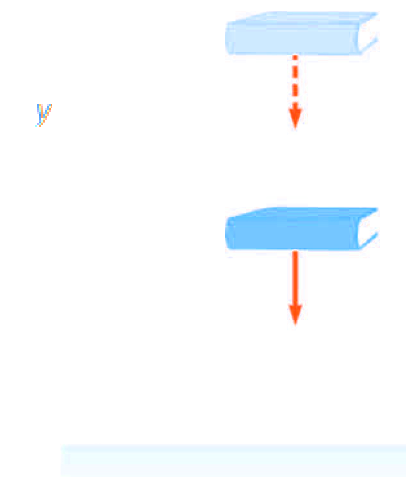
			- $$W = (\vec{F}_{app}) \cdot \Delta \vec{r}$$
				- $$W = (mg \hat{j}) \cdot [(y_b - y_a) \hat{j}]$$
				- $$W = mgy_b - mgy_a$$
				- The quantity $mgy$ is defined as the **gravitational potential energy**, $U_g$
					- $U_g = mgy$
				- Units are joules
				- $$W = mgy_b - mgy_a = \Delta U_g$$
				- The work done on the system appears as a change in the gravitational energy of the system
				- Object moved along a frictionless incline
					- $$\Delta \vec{r} = [(x_b - x_a) \hat{i} + (y_b - y_a) \hat{j}]$$
					- $$W = (F_{app}) \cdot \vec{r} \\  = (mg \hat{j}) \cdot [(x_b - x_a) \hat{i} + (y_b - y_a) \hat{j}] \\ = mgy_b - mgy_a$$
			- The gravitational potential energy depends only on the **vertical height of the object** above Earth's surface
			- One must choose a reference configuration for which the gravitational potential energy is set equal to some reference value, normally zero
				- The choice is arbitrary because you normally need the *difference* in potential energy, which is independent of the choice of reference configuration
			- ### Work on the Book by Gravitational Force
				- 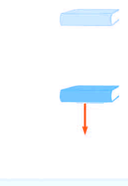
				- $$W_{\text{on book}} = (m\vec{g}) \cdot \Delta \vec{r} = (mg \hat{j}) \cdot [ (y_b - y_a) \hat{j}] \\ = mgy_b - mgy_a$$
				- Work-kinetic energy theorem:
					- $$W_{\text{on book}} = \Delta K_{\text{book}}$$
					- $$\Delta K_{\text{book}} = mgy_b - mgy_a \\ = -(mgy_a - mgy_b) = - (U_f - U_i) \\ = - \Delta U_g $$
					- $\Delta K_{\text{book}} = \Delta K \rightarrow \Delta K + Delta U_g = 0$
		- ### Conservation of Mechanical Energy
			- The mechanical energy of a system is the algebraic sum of the kinetic and potential energies in the system
				- $E_{\text{mech}} = K + U_g$
				- $\Delta K + \Delta U_g = 0$
				- $(K_f - K_i) + (U_f - U_i) = 0$
				- $K_f + U_f = K_i + U_i$
			- The statement of **Conservation of Mechanical Energy** for an isolated system is $K_f + U_f = K_i + U_i$
				- An **isolated system** is one for which there are no energy transfers across the boundary
				- The energy in such a system is conserved - ^^the sum of kinetic and potential energies remains constant^^
			- Example:
			  background-color:: blue
				- 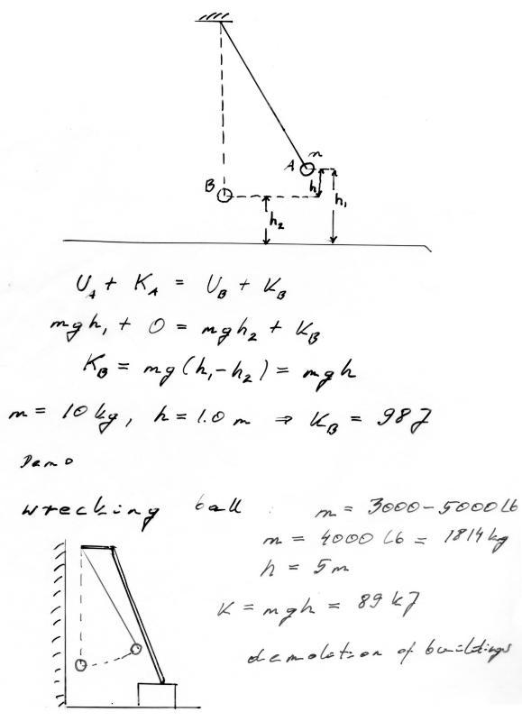
				- 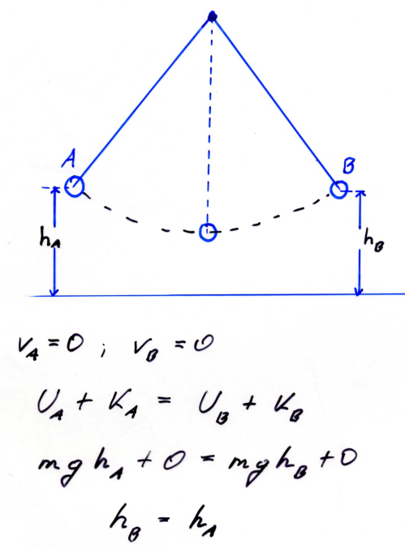
				- 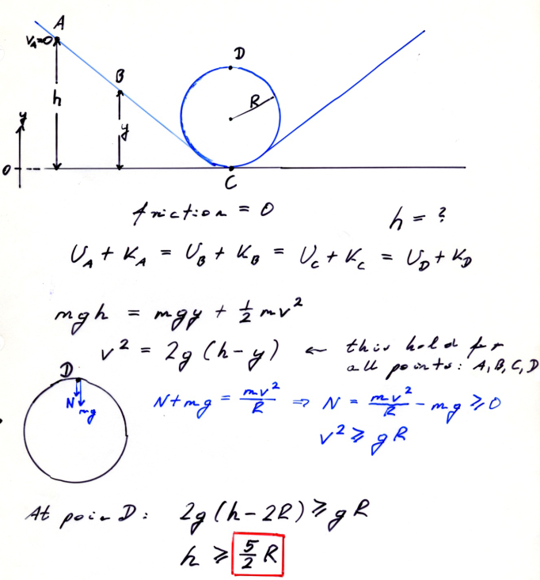
				-
	- ## 7.2 Elastic Potential Energy
	  id:: 65c2cce2-03de-4065-a417-f9f9ce70da0e
		- **Elastic Potential Energy** is associated with a spring
		- The force the spring exerts (on a block, for example) is $F_s = -kx$
		- The work done by an external applied force on a spring-block system is:
			- $$W_{F_{app}} = \frac{1}{2} kx^2_f - \frac{1}{2} kx^2_i$$
			- The work is equal to the difference between initial and final values related to the configuration of the system
		- The ^^elastic potential energy^^:
			- $$U_s = \frac{1}{2} kx^2$$
			- The elastic potential energy can be thought of as the energy stored in a deformed spring
			- The stored energy can be converted into kinetic energy
			- 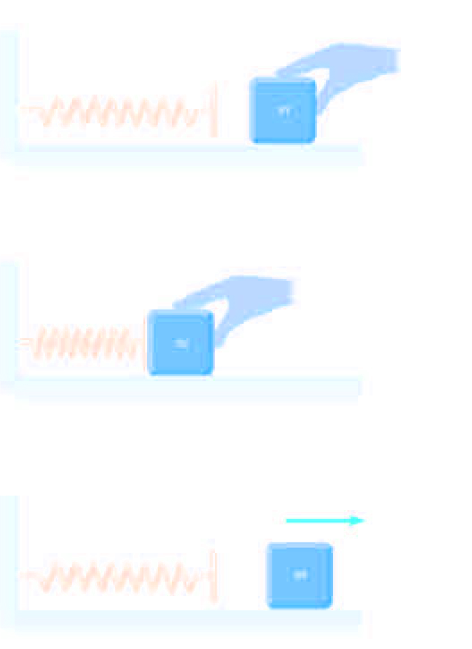
		- The elastic potential energy stored in a spring is zero whenever the spring is not deformed
			- ($U_s = 0$ when $x = 0$)
			- The energy is stored in the spring only when the spring is stretched or compressed
		- The elastic potential energy is a maximum when the spring has reached its maximum extension or compression
		- The elastic potential energy is always positive
			- $x^2$ will always be positive
		- ## Problem-Solving Strategy - Conservation of Mechanical Energy
			- #### Define the isolated system and the initial and final configuration of the system
				- The system may include two or more interacting particles
				- The system may also include springs or other structures in which elastic potential energy can be stored
				- Also include all components of the system that exert forces on each other
			- #### Identify the configuration for zero potential energy
				- Include both gravitational and elastic potential energies
				- If more than one force is acting within the system, write an expression for the potential energy associated with each force
			- #### If friction or air resistance is present, mechanical energy of the system is not conserved
			- #### Use energy with non-conservative forces instead
			- If the mechanical energy of the system **is** conserved, write the total energy as:
				- $E_i = K_i + U_i$ for the initial configuration
				- $E_f = K_f + U_f$ for the final configuration
			- #### Since mechanical energy is conserved, $E_i = E_f$ and it can be solved for unknown quantity
			- ### Conservation of Energy, Example (Drop a Ball)
				- Initial Conditions:
					- $E_i = K_i  + U_i = mgh$
					- The ball is dropped, so $K_i = 0$
				- The configuration for zero potential energy is the ground
				- Conservation rules applied at some point $y$ above the ground gives
					- $$\frac{1}{2} mv^2_f + mgy = mgh$$
					- $$v_f = \sqrt{2g (h-y)}$$
	- ## 7.3 Conservative and Non-Conservative Forces
	  id:: 65c2cce2-ae11-4179-b3fb-4b571c263f8b
		- ### Conservative Forces
			- The work done by a conservative force on a particle moving between any two points is **independent of the path** taken by the particle
			- The work done by a conservative force on a particle moving through any closed path is zero
				- A closed path is one in which the beginning and ending points are the same
			- Examples of conservatives forces:
				- **Gravity**  $W_g = mgy_i - mgy_f$
				- **Spring force** $W_s = \frac{1}{2}kx^2_i - \frac{1}{2} kx_f^2$
			- We can associate potential energy for a system with any conservative member acting between the members of the system
				- This can only be done for conservative forces
				- $W_c = U_i - U_f = - \Delta U$
		- ### Non-Conservative Forces
			- A nonconservative force does not satisfy the conditions of conservative forces
			- Nonconservative forces acting in a system cause a *change* in the mechanical energy of the system
			- The work done against friction is greater along the blue path than along the orange path
				- 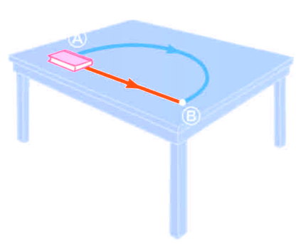
				- Because the work done depends on the path, friction is a nonconservative force
		- ### Mechanical Energy and Nonconservative Forces
			- In general, if friction is acting in a system,
				- $\Delta E_{mech} = \Delta K + \Delta U = - f_k d$
				- $\Delta U$ is the change in all forms of potential energy
				- If friction is zero, this equation becomes the same as Conservation of Mechanical Energy
		- ## Problem Solving Strategies - Nonconservative Forces
			- Define the isolated system and the initial and final configuration of the system
			- Identify the configuration for zero potential energy
				- These are the same as for conservation of energy
			- The difference between the final and initial energies is the change in mechanical energy due to friction
			- ### Nonconservative Forces, (Connected Blocks)
				- 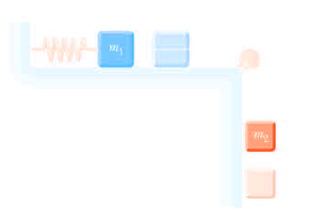
				- The system consists of the two blocks, the spring, and Earth
				- Gravitational and potential energies are involved
				- The kinetic energy is zero if our initial and final configurations are at rest
				- Block 2 undergoes a change in gravitational potential energy
				- The spring undergoes a change in elastic potential energy
				- The coefficient of kinetic friction can be measured
					- $$\Delta E_{mech} = \Delta U_g + \Delta U_s$$
					- $$\Delta E_{mech} = - f_kh = - \mu_k m_1 gh$$
					- $$\Delta U_g = 0 - m_2gh = -m_2gh$$
					- $$\Delta U_s = \frac{1}{2} kh^2 - 0 = \frac{1}{2}kh^2$$
					- $$-\mu_k m_1 gh = - m_2 gh + \frac{1}{2} kh^2 \rightarrow \mu_k = \frac{m_2g - \frac{1}{2}kh}{m_1g}$$
	- ## 7.4 Force and Potential Energy
	  id:: 65c2cce2-0ecf-4a5b-b772-77bc9b72085f
		- $$F_x(x) = - \frac{dU(x)}{dx}$$ where
		- $F_x(x)$ is **force from potential energy** in **one-dimensional motion**, the value of a conservative force at point $x$
		- and it is the negative of the derivative at $x$ of the associated potential energy fucntion
		- **A conservative force always acts to push the system towards lower potential energy**
		- 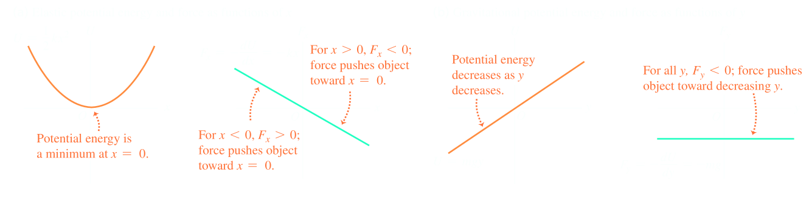
		- Define a potential energy function, $U$, such that the work done by a conservative force equals the decrease in the potential energy of the system
		- Work done by such a force $F$, is
			- $$W_c = \int_{x_i}^{x_f} F_x \ dx = - \Delta U$$
			- $$\Delta U = U_f - U_i = - \int_{x_i}^{x_f} F_x \ dx$$
			- $\Delta U$ is negative when $F_x$ and $dx$ are in the same direction (object lowered in a gravitational field or a spring pushing an object toward equilibrium)
		- ### Conservative Forces and Potential Energy
			- $$\Delta U = U_f - U_i = - \int_{x_i}^{x_f} F_x \ dx \\ ... \\ F_x = - \frac{dU}{dx}$$
			- The conservative force is related to the potential energy function through
				- $$F_x = - \frac{dU}{dx}$$
				- The $x$ component of a conservative force acting on an object within a system equals the negative of the potential energy of the system with respect to $x$
				- $$\vec{F} = -\frac{\delta U}{\delta x} \hat{i} - \frac{\delta U}{\delta y}\hat{j} - \frac{\delta U}{\delta z} \hat{k} $$
			- Look at the case of a deformed spring:
				- $$F_s = -\frac{dU_s}{dx} = - \frac{d}{dx} (\frac{1}{2} kx^2) = -kx$$
				- This is Hooke's Law
	- ## 7.5 Energy Diagrams
	  id:: 65c45a99-f507-49e1-84d8-f9486378d6ad
		- **Energy diagrams** are  graphs which shows both the potential energy function $U(x)$ and the energy of the particle subjected to the force that corresponds to $U(x)$
		- 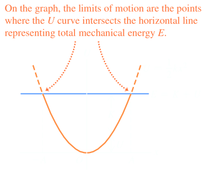
		- Any minimum in a potential-energy curve is a **stable equilibrium** position
		- Any maximum in a potential-energy curve is a **unstable equilibrium** position
		- 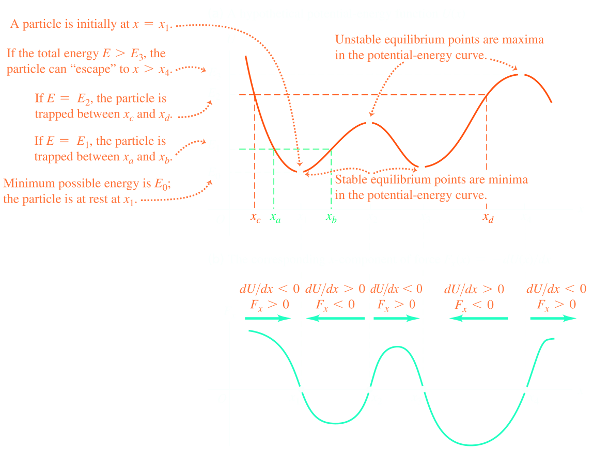
		- **Neutral Equilibrium** occurs in a configuration when $U$ is constant over some region
			- A small displacement from a position in this region will produce neither restoring or disrupting forces
- ## [[Momentum, Impulse and Collisions]] #[[PHY 1124]]
	- ## 8.1 Momentum and Impulse
	  id:: 65c5250a-615f-4e5b-8af8-c18400068dd9
		- ### Impluse
			- Impluse is a vector quantity
			- Magnitude of the impulse is equal to the area under the force-time curve
				- 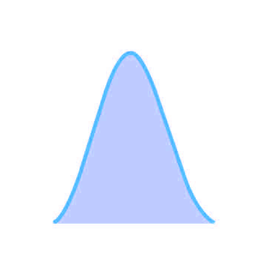{:height 430, :width 248}
			- Impulse in not a property of the particle, but a measure of the change in the momentum of the particle
			- Impulse is given to a particle $\Rightarrow$ momentum is transferred from an external agent to that particle
			- Impulse can be found using the time averaged force
				- $$\vec{F} \equiv \frac{1}{\Delta t} \int_{t_i}^{t_f} \vec{F} \ dt \\ \vec{I} = \vec{F} \Delta t$$
				- $\vec{F}$ would give the same impulse as the time-varying force does
		- ### Impulse and Momentum
			- Form Newton's Second Law $\vec{F} = \frac{d \vec{p}}{dt}$
			- Solving for $d\vec{p}$ gives $d \vec{p} = \vec{F} \ dt$
			- Integrating to find change in momentum over interval is the ^^impulse^^
		- ### Impulse-Momentum Theorem
			- $$\Delta = p_f - p_i = \int_{t_i}^{t_f} \vec{F} \ dt$$
			- This equation expressed the **impulse-momentum theorem**
				- The impulse of the force $\vec{F}$ acting on a particle equals the change in momentum of the particle
				  background-color:: red
		-
	- ## 8.2 Conservation of Momentum
	  id:: 65c52514-190d-4f5d-9e16-1fea9867703d
		- ### Linear Momentum
			- The **linear momentum** of a particle or an object that can be modelled as a particle of mass $m$ moving with a velocity $\vec{v}$ is defined to be the product of the mass and velocity
				- $\vec{p} = m \vec{v}$
					- Terms momentum and linear momentum can be used **interchangeably**
			- Linear momentum is a vector quantity
				- Same direction as $\vec{v}$
				- Dimensions of momentum are $ML/T$
					- SI units are $\text{kg} \cdot \text{m/s}
				- Momentum can be expressed in ^^component form^^
					- $$p_x = mv_x \qquad p_y = mv_y \qquad p_z = mv_z$$
		- ### Newton and Momentum
			- Newton called the product $m\vec{N}$ the **quantity of motion** of the particle
			- Newton's second law can be used to relate the momentum of a particle to the resultant force acting on it
				- $$\sum F = m\vec{a} = m \frac{d\vec{v}}{dt} = \frac{d(m\vec{v})}{dt} = \frac{d \vec{p}}{dt}$$ with constant mass
			- The time rate of change of the liner momentum of a particle is equal to the net force acting on the particle
				- Form in which Newton's second law is presented
		- ### Impulse Approximation
			- One force acting on a particle will be much greater than any other force acting on the particle
			- The force will be called impulse force
				- $\vec{p}_f$ and $\vec{p}_i$ represent the momenta ^^immediately before and after the collision^^
			- Particle is assumed to move very little during the collision
		- ### Conservation of Linear Momentum
			- Whenever two or more particles in an isolated system interact, the total momentum of the system remains constant
				- The momentum of the *system* is conserved, not necessarily the momentum of an individual particle
				- The total momentum of an isolated system equals its initial momentum
	- ## 8.3 Momentum Conservation and Collisions
	  id:: 65c5251e-9809-4869-8131-1e040c888da7
		- **Collisions** represent an event during which two particles come close to each other and interact by means of force
		- Time interval during which the velocity changes from its initial to final values is assumed to be short
		- The interaction force is presumed to be greater than the external forces present
		- Collisions may be result of direct contact
			- 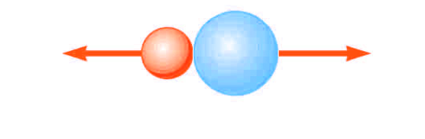{:height 213, :width 308}
		- It is not necessary to include physical contact as their are forces between particles
			- 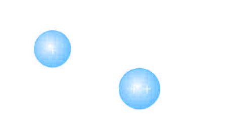{:height 201, :width 279}
		- ### Types of Collisions
			- In an **elastic** collision, momentum and kinetic energy are conserved
				- Perfectly elastic collisions occur on a microscopic level
				- In macroscopic collisions, only approximately elastic collisions actually occur
			- In **inelastic** collision, kinetic energy is not conserved although momentum is still conserved
				- If objects stick together after the collision, it is a *perfectly elastic* collision
				- In an inelastic collisions, some kinetic energy is lost, but the objects do not stick together
			- Elastic and perfectly inelastic collisions are limiting cases, most actual collisions fall in between two types
			- Momentum is conserved in all collisions
		- ### Perfectly Inelastic Collisions
			- Since objects stick together, they share the same velocity after collision
				- 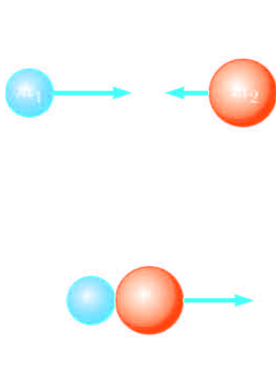{:height 351, :width 246}
				- $$m_1 \vec{v}_{1i} + m_2 \vec{v}_{2i} = (m_1 + m_2) \vec{v}_f$$
				- $$\vec{v}_f = \frac{m_1 \vec{v}_{1i} + m_2\vec{v}_{2i}}{m_1 + m_2}$$
	- ## 8.4 Elastic Collisions
	  id:: 65c52530-47d4-4a84-a695-f3f383709918
		- Both momentum and kinetic energy are conserved
		- 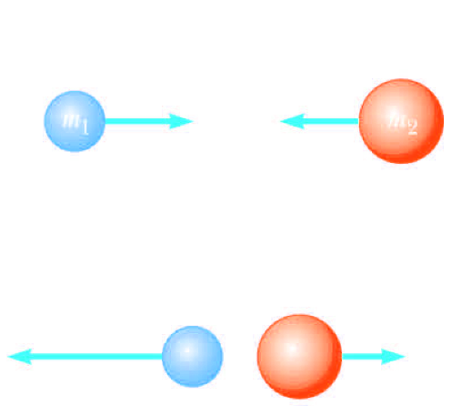
		- The *relative* velocity of the two particles before the collision, $\vec{v}_{1i} - \vec{v}_{2i}$, equals the negative of the relative velocity after the collision, $-(v_{1f} - v_{2f})$
		- This equation, along with **conservation of momentum**, can be used to solve for the unknowns
			- Can be used with a one dimensional elastic collision between two objects
		- ### Equations
			- $$m_1 v_{1i} + m_2 v_{2i} = m_1 v_{1f} + m_2 v_{2f}$$
			- $$\frac{1}{2}m_1 v_{1i}^2 + \frac{1}{2}m_2 v_{2i}^2 = \frac{1}{2}m_1 v_{1f}^2 + \frac{1}{2}m_2 v_{2f}^2$$
			- $$v_{1i} - v_{2i} = - (v_{1f} - v_{2f})$$
			-
		- ### Special Case: $m_1 = m_2$
			- $$v_{1f} = (\frac{m_1 - m_2}{m_1+m_2}) v_{1i} + (\frac{2m_2}{m_1+m_2})v_{2i}$$
			- $$v_{2f} = (\frac{2m_2}{m_1+m_2})v_{1i}+ (\frac{m_1 - m_2}{m_1+m_2}) v_{2i}$$
			- The particles exchange velocities
		- ### Special Case: $v_{2i} = 0$
			- $$V_{1f}(\frac{m_1 - m_2}{m_1+m_2})v_{1i}$$
			- $$v_{2f} = (\frac{2m_2}{m_1+m_2})v_{1i}$$
			- If $m_1 > m>2, v_{1f} \approx v_{1i}$ $v_{2f} \approx 2v_{1i}$
				- When a very heavy particle collides head-on with a very light one initially at rest, the heavy particle continues in motion unaltered and the light particle rebounds with a speed twice the initial speed of the very heavy particle
				  background-color:: blue
			- If $m_2 > m_1, v_{1f} \approx -v_{1i}$ and $v_{2f} \approx 0$
				- When a light particle collides with a very heavy particle initially at rest, the light particle has its velocity reversed and the velocity approximately remains at rest
				  background-color:: purple
		- ### Two-Dimensional Collisions
			- The momentum is conserved for all directions
				- 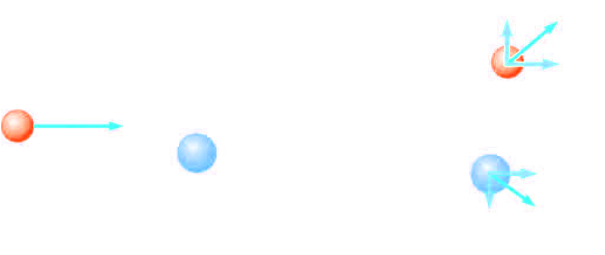
			- If collision is elastic, use conservation of kinetic energy as second equation
			- $$m_1v_{1i} = m_1v_{1f} \cos \theta + m_2 v_{2f} \cos \phi$$
			- $$0 = m_1 v_{1f} \sin \theta - m_2 v_{2f} \sin \phi$$
			- $$\frac{1}{2} m_1 v_{1i}^2 = \frac{1}{2} m_1 v_{1f}^2 + \frac{1}{2} m_2 v_{2f}^2$$
			-
-
-