# [[Dynamics of Rotational Motion]]
id:: 65e76f2e-5576-4a63-b2b2-9572daa64b1d
	- ## 10.1 Torque
		- **Torque**, $\tau$ is the tendency of a force to rotate an object about some axis
			- Torque is a vector
			- $\tau = r F \sin \phi =Fd$
				- $F$ is the force
				- $\phi$ is the angle the force makes with the horizontal
				- $d$ is the *moment arm*
			- The **moment arm**, $d$ is ^^the perpendicular distance from the rotation axis to the line of action$
				- 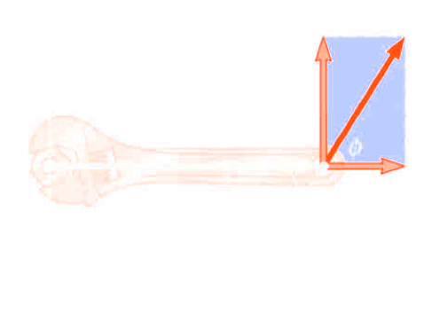{:height 235, :width 309}
			- Only the vertical component of $F$ has tendency to produce a rotation
			- Horizontal component of $F$ has no tendency to produce a rotation
			- Torque will have direction
				- If turning tendency of the force is counterclockwise, the torque will be $+$
				- If turning tendency of the force is clockwise, the torque will be $-$
		- ### Torque vs. Force
			- Forces can cause a change in linear motion
				- Described by Newton's Second Law
			- Forces can cause a change in rotational motion
				- The effectiveness of this change depends on the force ^^and^^ the moment arm
				- Change in rotational motion depends on the torque
		- ### Torque Units
			- The SI units of torque are $N \cdot m$
	- ## 10.2 Torque and Angular Acceleration for a Rigid Body
		- Consider a particle of mass $m$ rotating in a circle of radius $r$ under the influence of tangential force $\vec{F}_t$ and a radial force $\vec{F}_r$
			- 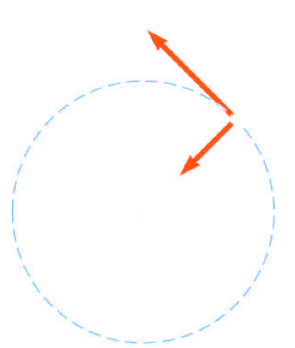{:height 240, :width 187}
		- The tangential force provides a tangential acceleration:
			- $F_t = ma_t$
		- The **magnitude of the torque** produced by $F_t$ around the centre of the circle is
			- $$\tau = F_t r = (ma_t)r$$
		- The **tangential acceleration** is related to the **angular acceleration**
			- $$\tau = (ma_t)r = (mr\alpha)r = (mr^2)\alpha$$
		- Since $mr^2$ is the moment of inertia of a particle
			- $\tau = I \alpha$
			- The ^^torque is directly proportional to the angular acceleration^^ and the constant of proportionality is the moment of inertia
		- Consider the object consists of an infinite number of mass elements $dm$ of infinitesimal size
		- Each mass element rotates in a circle about the origin, $O$
		- Each mass element has a tangential acceleration
		- From Newton's Second Law
			- $$dF_t = (dm)a_t$$
		- The torque associated with the force and using the angular acceleration gives
			- $$d\tau = r dF_t = a_t r  \ dm = \alpha r^2 \ dm$$
		- 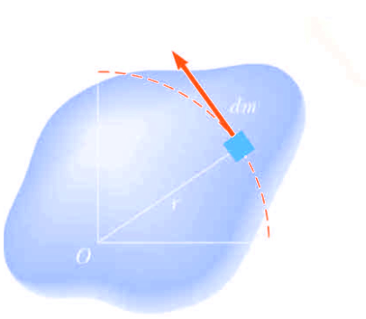{:height 201, :width 219}
		- $$d\tau = \alpha r^2 \ dm$$
		- Finding the net torque
			- $$\sum \tau = \int \alpha r^2 \ dm = \alpha \int r^2 \ dm$$
			- This becomes $\sum \tau = I \alpha$
				- This the same relationship that applied to a particle
				- ^^The net torque about the rotation axis is proportional to the angular acceleration, with the proportionality factor being the moment of inertia^^
	- ## 10.4 Work and Power in Rotational Motion
		- ### Work in Rotational Motion
			- Find the work done by $\vec{F}$ on the object as it rotates through the infinitesimal distance $ds = r \ d \theta$
			- 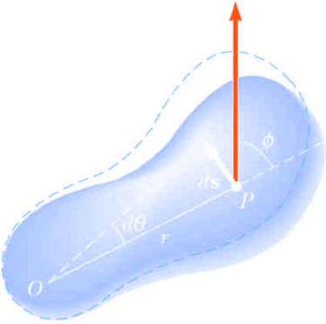{:height 223, :width 216}
			- $$dW = \vec{F} \cdot d \vec{s} = (F \sin \phi) r \ d \theta$$
				- $F \sin \phi$ is the tangential component of $\vec{F}$
				- The radial component of $\vec{F}$ does no work because it is perpendicular to the displacement
					- $$dW = \tau \ d \theta$$
		- ### Power in Rotational Motion
			- The rate at which work is being done in a time interval $dt$ is the
				- $$P = \frac{dW}{dt} = \tau \frac{d\theta}{dt} = \tau \omega$$
				- $$\therefore P = \tau \omega$$
			- This analogous to $P= Fv$ in a linear system
			- $$\sum \tau = I \alpha = I \frac{d \omega}{dt} = I \frac{d \omega}{d \theta} \frac{d \theta}{dt} = I \frac{d \omega}{d\theta} \omega$$
			- $$dW = \sum \tau d \theta =I \omega d \omega$$
			- $$\sum W = \int_{\omega_i}^{\omega_f} I \omega d \omega = \frac{1}{2}I \omega^2_f - \frac{1}{2} I \omega^2_i$$
		- ### Work-Kinetic Energy Theorem of Rotational Motion
			- $$\sum W =  \frac{1}{2}I \omega^2_f - \frac{1}{2} I \omega^2_i$$
			- The net work done by the external forces in rotating a symmetric rigid object about a fixed friction-free axis equals the change in the object's rotational kinetic energy
			- The net work done by external forces on an object is the change in its **total** kinetic energy, which is the ^^sum of the translational and rotational kinetic energies^^
			- **For example,** when a pitcher throws a baseball, the work done by the pitcher’s hands appears as kinetic energy associated with the ball moving through space as well as rotational kinetic energy associated with the spinning of the ball
			- 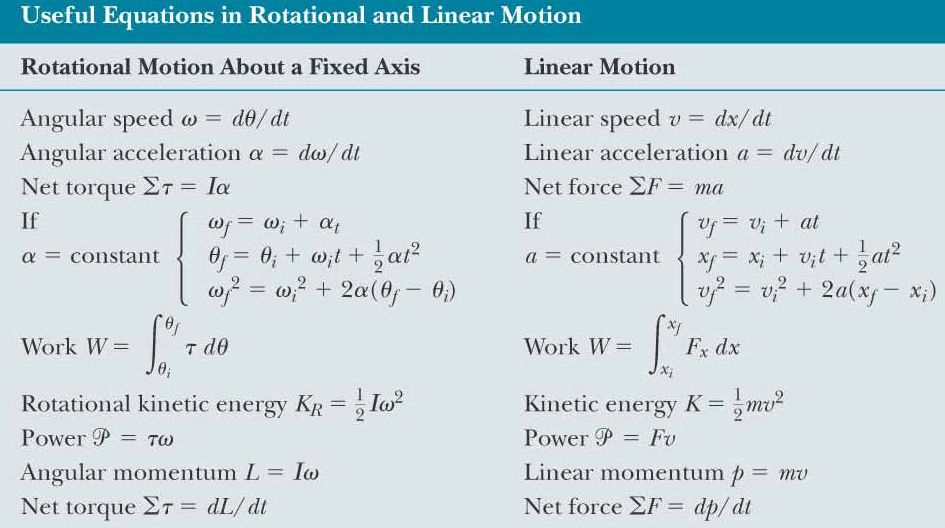{:height 319, :width 556}
	- ## 10.5 Angular Momentum
		- ### Rolling Object
			- 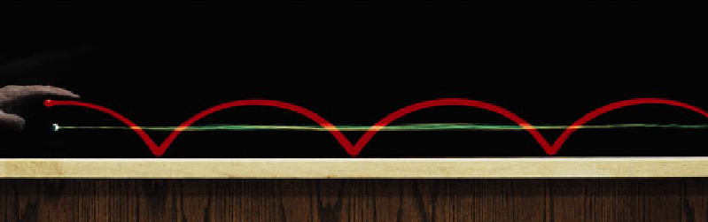
			- Two points on a rolling object take different paths through space
			- The **red curve** shows the path moved by a **point on the rim of the object**
				- This path is called **cycloid**
			- The ^^green line^^ shows the path of the ^^centre of mass^^ of the object
		- ### Pure Rolling Motion
			- In *pure rolling motion*, an object rolls without slipping
			- In such a case, there is a simpe relationship between its rotational and translational motions
		- ### Rolling Object, Centre of Mass
			- As the cylinder rotates through an angle $\theta$, Its centre of mass moves a linear distance $s = R\theta$
			- 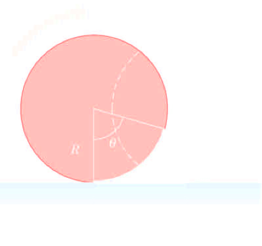{:height 188, :width 285}
			- The velocity of the centre of mass is
				- $$V_{CM} = \frac{ds}{dt} = R \frac{d\theta}{dt} = R \omega$$
			- $\omega$ is the angular speed of the cylinder
			- The acceleration of the centre of mass is
				- $$a_{CM} = \frac{dV_{CM}}{dt} = R \frac{d \omega}{dt} = R \alpha$$
				- $\alpha$ is the angular acceleration of the cylinder
			- The condition for **pure rolling motion is**  $V_{CM} = R \omega$
		- ### Rolling Object, Other Points
			- A point on the rim, $P$ rotates to various positions such as $Q$ and $P'$
				- 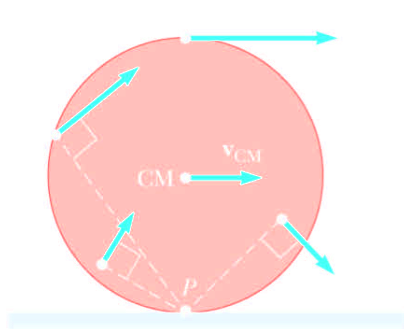{:height 219, :width 233}
			- At any instant, the point on the rim located at point $P$ is at rest relative to the surface since no slipping occurs
			- All points on a rolling object move in a direction perpendicular to an axis through the instantaneous point of contact $P$, that is all points rotate about $P$
			- All points on a cylinder have the same angular speed
		- ### Rolling Motion
			- Rolling motion can be modeled as a combination of pure translational motion and pure rotational motion
			- The contact between the surface and object (in third figure) has a translational speed of zero
			- At this instant, the rolling object is moving in exactly the same way as if the surface were removed and the object were pivoted at point $P$ and spun about an axis passing through $P$
			- 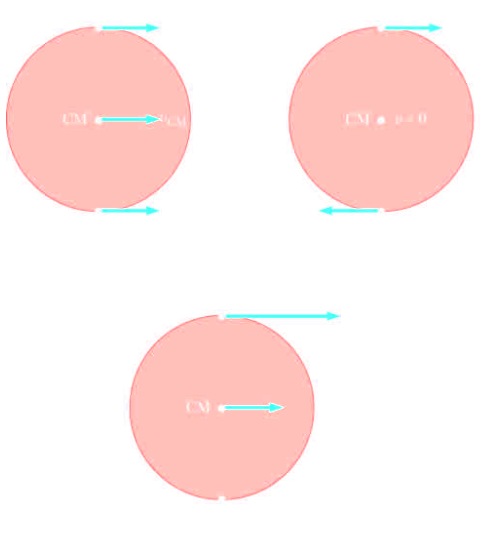{:height 365, :width 317}
		- ### Total Kinetic Energy of a Rolling Object
			- $$K = \frac{1}{2} I_P \omega^2$$
			- $$I_P = I_{CM} + MR^2$$
			- $$K = \frac{1}{2} I_{CM} \omega^2 + \frac{1}{2} MR^2  \omega^2$$
			- $$V_{cm} = R \omega$$
			- $$K = \frac{1}{2} I_{CM} \omega^2 + \frac{1}{2} Mv^2  \omega^2$$
				- The total kinetic energy of a rolling object is the sum of the rotational kinetic energy *about* the centre of mass and the translational kinetic energy *of* the centre of mass
		- ### Rolling Down an Incline
			- Accelerated rolling motion is possible only if friction is present between the sphere and the incline
				- The friction produces the net torque required for rotation
			- 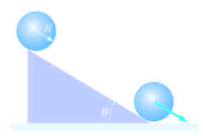{:height 226, :width 301}
			- $$K = \frac{1}{2} I_{CM} \omega^2 + \frac{1}{2}Mv^2_{CM}$$
			- $$K = \frac{1}{2} I_{CM}(\frac{v_{CM}}{R})^2  \frac{1}{2}Mv^2_{CM} = K = \frac{1}{2} (\frac{I_{CM}}{R^2} +M)v^2_{CM}$$
			- $$K_f + U_f = K_i + U_i$$
			- $$\frac{1}{2} (\frac{I_{CM}}{R^2} +M)v^2_{CM} + 0  = 0 + Mgh$$
			- $$V_{CM} = \sqrt{\frac{2gh}{1 +\frac{I_{CM}}{MR^2}}}$$
			- Despite the presence of friction, there is no loss of mechanical energy since the ^^contact point^^ is at ^^rest^^ relative to the surface at any instance
			- On the contrary if the rigid body were to slide, mechanical energy would be lost as motion progressed
			- For symmetrical objects, of mass $M$ and radius $R$
				- $$I_{CM} = cMR^2 , \ \ 0 < c \le 1$$
				-
	- ## 10.6 Conservation of Angular Momentum
		- ### Angular Momentum
			- Consider a particle of mass $m$ located at the vector position $r$ and moving with linear momentum $p$
				- $\sum F =\frac{d\vec{p}}{dt}$
				- $\sum \tau = r \times \frac{d\vec{p}}{dt} + \frac{d\vec{r}}{dt} \times \vec{p} = \frac{d(\vec{r} \times \vec{p})}{dt}$
			- 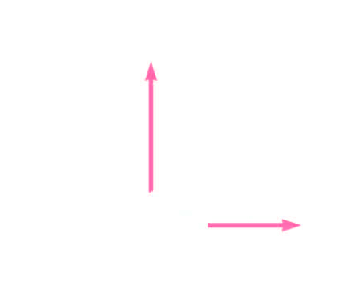
			- The instantaneous angular momentum $L$ of a particle relative to the origin $O$ si defiend as the cross product of the particle's instantaneous position vector $\vec{r}$ and its instantaneous linear momentum $\vec{p}$
				- $$\sum \tau = \frac{d\vec{L}}{dt}$$
			- This the rotational analog of Newton's Second Law, $\sum \vec{F} = \frac{d\vec{p}}{dt}$
		- ### Torque and Angular Momentum
			- $$\sum \tau = \frac{d\vec{L}}{dt}$$
			- **Torque acting on a particle is equal to the time rate of change of the particle's angular momentum**
			- $\sum \tau$ and $\vec{L}$ must be measured about the same origin
			- This expression is valid for any origin fixed in an inertial frame
			- The SI units of angular momentum are $\text{(kg} \cdot \text{m}^2)/ \text{s}$
			- Both magnitude and direction of $\vec{L}$ depend on origin
			- Magnitude of $\vec{L} = mvr \sin \phi$
			- Direction of $L$ is perpendicular to plane
		- ### Angular Momentum of a Particle
			- Vector $\vec{L} = \vec{r} \times  \vec{p}$ is pointed out of diagram
				- Magnitude is $L = mvr \sin 90^{\circ} = mvr$ (since $v$ is perpendicular to $r$)
			- A particle in uniform circular motion has a constant angular momentum about an axis through the centre of its path
			- 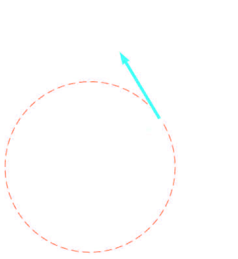{:height 416, :width 307}
			- The total angular momentum of a system of particles is defined as the vector sum of the angular momenta of the individual partidcles
			- Any ^^torques^^ associated with the ^^internal forces^^ acting in a system of particles are ^^zero^^
				- Therefore, $\sum \tau_{ext} = \frac{d\vec{L}_{tot}}{dt}$
			- The net external torque acting on a system about some axis passing through an origin in an inertial frame equals the time rate of change of the total angular momentum of the system about the origin
			- The total angular momentum of a system can vary with time if a net external torque is acting on the system
			- ^^**Note:**^^ $\sum \tau_{ext} = \frac{d\vec{L}_{tot}}{dt}$ is the rotational analog of $\sum F_{ext} = \frac{d \vec{p}_{tot}}{dt}$ for a system of particles
		- ### Angular Momentum of a Rotating Rigid Object
			- Each particle of the object rotates in the $xy$ plane about the $z$ axis with an angular speed of $\omega$
			- The angular momentum of an individual particle is $L_i = m_iv_ir_i = m_ir_i^2 \omega$
			- $\vec{L}_i$ and $\omega$ are directed along $z$ axis
			- 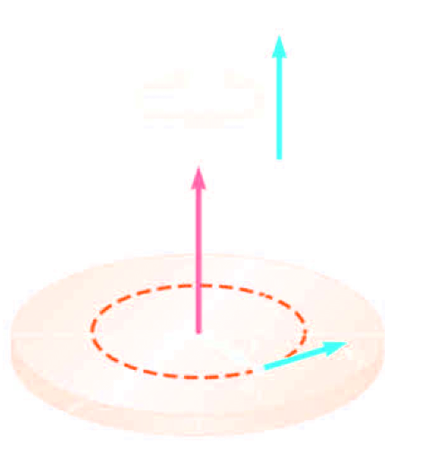
			- To find the angular momentum of the entire object, add the angular momenta of all individual particles
			- $L_z = I \omega$
			- Gives the **rotational form of Newton's Second Law**
				- $\sum \tau_{ext} = I \alpha$
			- The rotational form of Newton's Second Law is also valid for a rigid object rotating about a moving axis provided it:
				- Passes through the centre of mass
				- Is a symmetry axis
			- If a symmetrical object rotates about a fixed axis passing through its centre of mass, the vector $\vec{L} = I \omega$ holds
		- ### Conservation of Angular Momentum
			- The total angular momentum of a system is constant in both magnitude and direction if the resultant external torque acting on the system is zero
			- If the mass of an isolated system undergoes redistribution, the moment of inertia changes
				- The conservation of angular momentum requires a compensating change in angular velocity
				- $I_i \omega_i = I_f \omega_f$
				- This holds for rotation about a fixed axis and for rotation about an axis through the centre of mass for a moving system, where net torque must be zero
	- ## 10.7 Gryroscopes and Precession
		- ### Motion of a Top
			- The only external forces acting on the top are the normal force $\vec{n}$ and gravitational force $mg$
			- Direction of angular momentum is along the axis of symmetry
			- The normal force produces no torque
			- 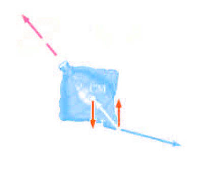{:height 273, :width 398} 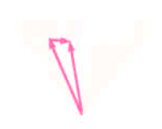
			- The top undergoes precessional motion
				- The **precessional motion** is the ^^motion of the symmetry axis about the vertical^^
					- Precession is usually slow relative to the spinning motion of the top
		- ### Gyroscope
			- A gyroscope can be used to illustrate precessional motion
				- 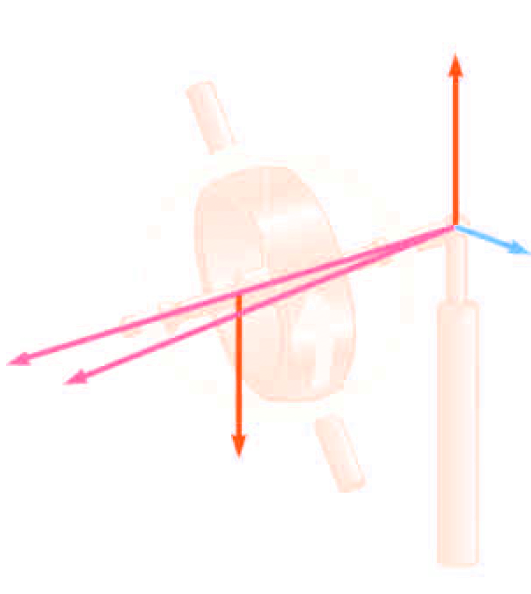
				  id:: 66021380-dc17-471b-85a9-ec602e328a7a
			- The gravitational force $mg$ produces a torque about the pivot, and ^^this torque is perpendicular to the axle^^
			- The normal force produces no torque
			- The torque results in a change in angular momentum $d\vec{L}$ ina direction perpendicular to the axle
				- The axle sweeps out an angle $d \phi$ in a time interval $dt$
			- The direction, not magnitude of $L$ is changing]
			- $$\omega_p = \frac{Mgh}{I \omega}$$