## [[Units, Physical Quantities, and Vectors]] #[[PHY 1124]]
	- ## 1.1 Nature of Physics
	  id:: 659ee8e6-5003-4d2e-8805-035f424db719
		- Physics is *experimental science*
		- Physicists observe the phenomena of nature and find patterns in them
		- ^^**CAUTION**^^
			- **Theory** is not a random thought or concept
			- It is an explanation of natural phenomena based on observation and accepted fundamental principles
	- ## 1.2 Solving Physics Problems
	  id:: 659f0afd-41c0-416b-99c3-7f10c08b9c81
		- ### Idealized Models
			- A **model** is a simplified version of a physical system that is too complicated to analyze in full detail
			- Example:
			  background-color:: blue
				- Analysing the motion of a baseball in flight
					- 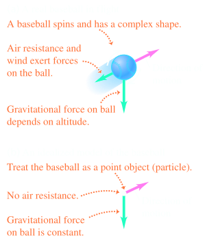
			- The size, shape and rotation of an object can be ignored and turned into a **particle**
	- ## 1.3 Standards and Units
	  id:: 659f0ff6-56c8-4ac4-9943-bbf50a94d6e4
		- A number that is used to quantitatively describe a physical phenomenon is called a **physical quantity**
			- Ex. weight, and height
		- An **operational definition** is a physical quantity that can only be defined by how to measure it
			- Ex. Measuring distance using a ruler, stopwatch to measure a time interval
		- A physical quantity can be defined by describing how it is calculate it from other quantities that we can measure
			- Ex. Define the average speed of a moving object / time
		- A **unit** is a standard of quantity
			- Ex. $m$ is unit of distance, $s$ is unit of time
		- ### Some of units of Length, Mass, and Time
			- ^^**Length**^^
				- 1 nanometer $= 1 \text{nm} = 10 ^{-9}\text{m}$
					- (a few times the size of the largest atom)
				- 1 micrometer $= 1 \mu \text{m} = 10 ^{-6}\text{m}$
					- (size of bacteria and other cells)
				- 1 millimetre $= 1  \text{cm} = 10 ^{-3}\text{m}$
					- (diameter of the point of a ballpoint pen)
				- 1 centimeter $= 1  \text{mm} = 10 ^{-2}\text{m}$
					- (diameter of your little finger)
				- 1 kilometer $= 1 \text{km} = 10 ^{3}\text{m}$
					- (distance in a 10 minute walk)
			- ^^**Mass**^^
				- 1 microgram = 1 $\mu \text{g} = 10^{-6} \text{g} = 10^{-9} \text{kg}$
					- (mass of a very small dust)
				- 1 milligram = 1 $\text{mg} = 10^{-3} \text{g} = 10^{-6} \text{kg}$
					- (mass of a grain of salt)
				- 1 gram = $1 \text{g} = 10^{-3} \text{kg}$
					- (mass of a paper clip)
			- ^^**Time**^^
				- 1 nanosecond = 1 $\text{ns} = 10^{-9}s$
					- (time for light to travel 0.3$\text{m}$)
				- 1 microsecond = 1 $\text{ns} = 10^{-6}s$
					- (time for space station to move 8 $\text{mm}$)
				- 1 millisecond = 1 $\text{ms} = 10^{-3}s$
					- (time for car moving at a freeway speed to travel 3 cm)
	- ## 1.4 Using and Converting Units
	  id:: 659f50c7-009c-4ff9-acbf-3bb4876a5ce1
		- An equation must be **dimensionally consistent** and the correct quantities or units must be used appropriately.
	- ## 1.5 Uncertainty and Significant Figures
	  id:: 659f55f3-8e04-4094-8de2-2a029ad008e5
		- **Uncertainty** is the degree of accuracy of measuring a quantity and can called the **error** as it is the difference between measured difference and true value
		- **Accuracy** is the % value of how close the measured value is to the true value, or can be **percent error** or **fractional error**
		- The uncertainty is indicated by the numbers of meaningful digits or **significant figures**
	- ## 1.6 Estimates and Orders of Magnitude
	  id:: 659f55e1-0159-4ca9-ae39-429d6dc419c5
		- Rough approximates that are too big to calculate are called **order-of-magnitudes estimates**
	- ## 1.7 Vectors and Vector Addition
	  id:: 659f56dd-4bb1-4e70-9b0b-ce5bc1bf9d30
		- Certain physical quantities can be described entirely by a single number with a unit
		- When described by a single number we call it a **scalar quality**
		- A **vector quantity** has both **magnitude**(distance or quantity) and direction
		- **Displacement** is change in the in the position of the object
			- a) Represented with arrow, $\vec{A}$
			- b) Only a straight arrow
			- c) If a movement is in a straight line
			- 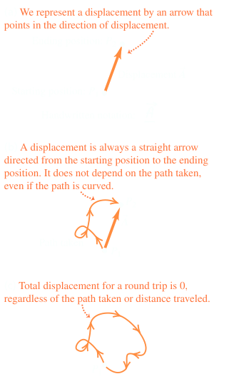
		- If two vectors are in the same direction and magnitude, they are **parallel**
		- a) A vector can have the same magnitude but opposite and directions, being the **negative of a vector**
		- b) Two vectors that have opposite directions, regardless of magnitude are **antiparallel**
			- 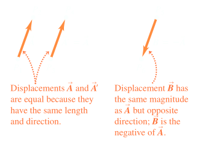
		- (Magnitude of $\vec{A}$) $= A = |\vec{A}|$
			- Magnitude of a vector quantity is a scalar quantity and *is always positive*
		- ### Vector Addition and Subtraction
			- Suppose a particle undergoes a displacement $\vec{A}$ following by second displacement $\vec{B}$
			- Final result would be same if it goes from initial point to final point, in a single displacement, $\vec{C}$
			- Displacement $\vec{C}$ is the **vector sum** or the **resultant** of $\vec{A}$ and $\vec{b}$
				- Expressed as $\vec{C} = \vec{A} + \vec{B}$
					- 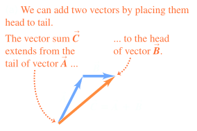
			- Reversing the order of $\vec{A}$ and $\vec{B}$ yields the same results
				- 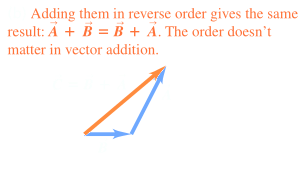
			- 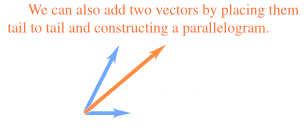
			-
			- **Vector Addition** obeys *commutative law*
			- ^^**CAUTION**^^ - Magnitudes in vector addition
				- $\vec{C} = \vec{A} + \vec{B} \ne |\vec{C}| = |\vec{A}| + |\vec{B}|$
				- Generally, $C < A + B$
				- Only when the vectors $\vec{A}$ and $\vec{B}$ are *parallel*, $|\vec{C}| = |\vec{A}| + |\vec{B}|$
			- Finding the vector of three vectors can be also performed with combined sums
			- 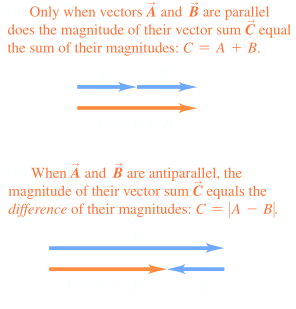
			- 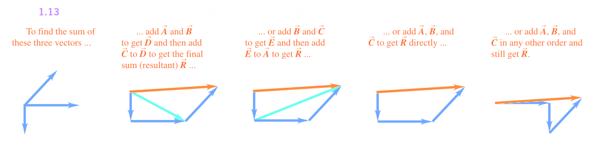
			- 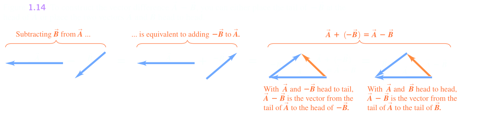
			- A vector can be multiplied by a positive scalar to change the magnitude, but not its direction,
			- A negative scalar can be reverse the vector in the opposite direction
			- 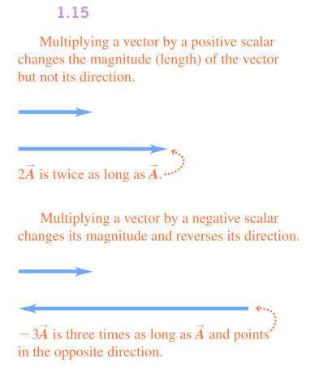
	- ## 1.8 Components of Vectors
	  id:: 659f6665-7c1b-4737-940f-6a1b5f4329e5
		- A vector can be split into **components** along the $x$-axis, $y$-axis, such as $A_x$ and $A_y$ for $\vec{A}$
			- 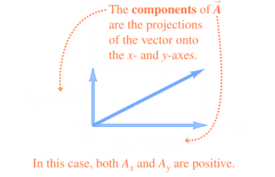
		- Trigonometric functions can be used to find components, when measured from a positive axis can be:
			- $$\frac{A_x}{A} = \cos \theta \ \ \ \frac{A_y}{A} = \sin \theta$$
			- $$A_x = A\cos \theta \ \ \ A_y = \sin \theta$$
		- Components can be in both the negative and positive axes
			- 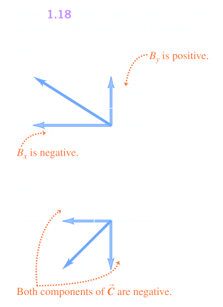
		- ### Using Components to Do Vector Calculations
			- **Finding a vector's magnitude and direction from its components**
			  logseq.order-list-type:: number
				- A vector can be described by its magnitude and direction in its $x-$ and $y-$ components
				  logseq.order-list-type:: number
				- Applying pythagorean can find the magnitude of vector $\vec{A}$
				  logseq.order-list-type:: number
					- logseq.order-list-type:: number
					  $$\vec{A} = \sqrt{A_x^2 + A_y^2}$$
				- Angle can be measured in the same regard:
				  logseq.order-list-type:: number
					- logseq.order-list-type:: number
					  $$\tan \theta = \frac{A_y}{A_x} \ \ \ \ \theta = \arctan \frac{A_y}{A_x}$$
					- 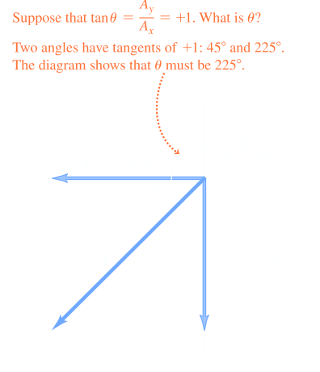
					  logseq.order-list-type:: number
			- **Multiplying a vector by a scalar**
			  logseq.order-list-type:: number
				- If we multiply a vector $\vec{A}$ by a scalar, it is the product of $C$ to and the corresponding component of $\vec{A}$
				  logseq.order-list-type:: number
			- **Using components to calculate the vector sum(resultant) of two or more vectors**
			  logseq.order-list-type:: number
				- Shows two vectors $\vec{A}$ and $\vec{B}$ and their resultant $\vec{R}$
				  logseq.order-list-type:: number
				- $\vec{R_x} = \vec{A_x} + \vec{B_x}$
				  logseq.order-list-type:: number
				- $\vec{R_y} = \vec{A_y} + \vec{B_y}$
				  logseq.order-list-type:: number
				-
		-