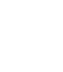

# [[Inheritance]]
	- OO Languages offer tools to structure large systems
	- Inheritance allows to organize classes hierarchically
	- The class immediately above is called the **superclass** or **parent class** while the class immediately below is called the **subclass, child class**
		- 
		- For example, $Bird$ is a superclass of **Pigeon**, and therefore Pigeon is the subclass of bird
	- The Java "is a" relationship is expressed using the reserved keyword `extends`
	- ```
	  public class Pigeon extends Bird{}
	  ```
	- ### What does it mean?
		- A class inherits all the characteristics (variables and methods) of its superclass(es)
			- A subclass inherits all methods and variables of its superclass(es)
			  logseq.order-list-type:: number
			- A subclass can introduce/add new methods and variables
			  logseq.order-list-type:: number
			- A subclass can override the methods of its superclass
			  logseq.order-list-type:: number
		- It can better understood as a **specialization** of a superclass
	- ### `super()`
		- The statement `super()` is an explicit call to the constructor of the immediate super calss
			- This particular construction can only appear in a constructor
			- Can only be the first statement of the constructor
			- The `super()` will be automatically inserted unless you insert a `super()` yourself
			- If the first statement of a constructor is not an explicit call `super()`, Java inserts a call `super()` which means the superclass has to have arity 0, or else a compile time error will occur
				- Arity is number of arguments or operands
			- The default constructor is no longer present if a constructor has been defined
	- The declaration of an instance variable `private` prevents subclasses from accessing the variable
	- The method `final` prevents subclasses from overriding methods