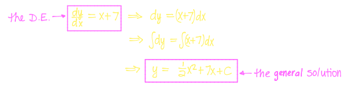
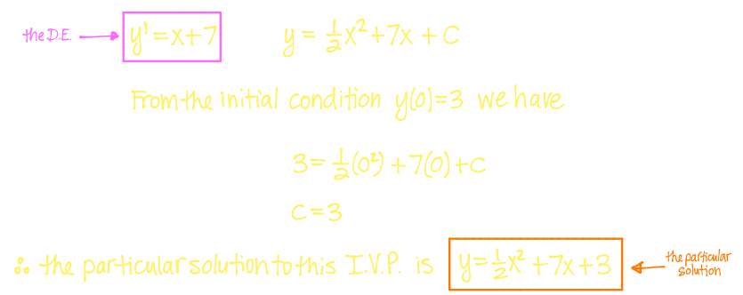
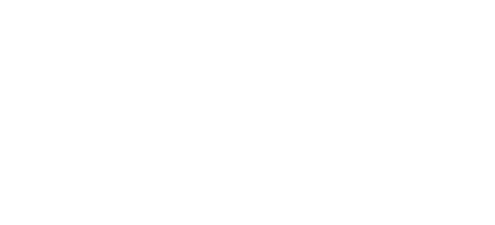
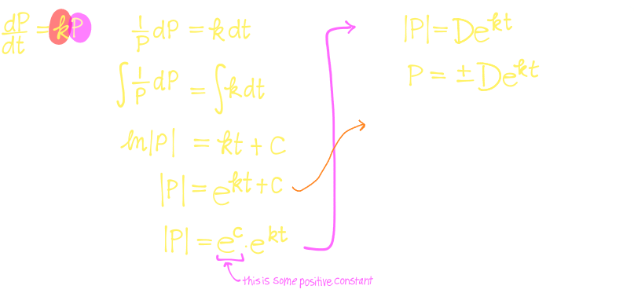
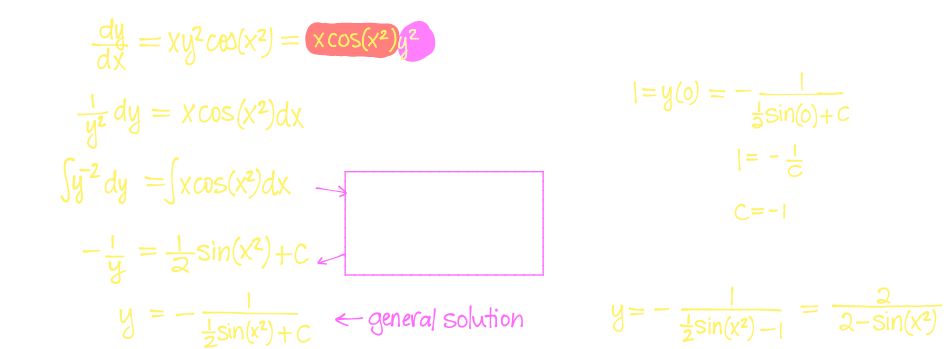
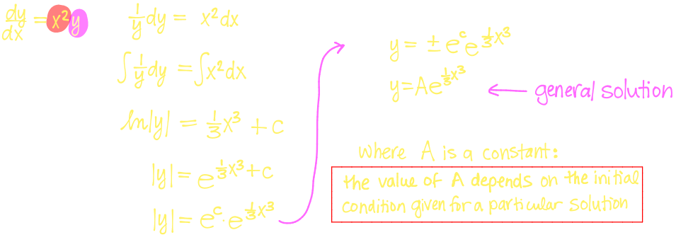
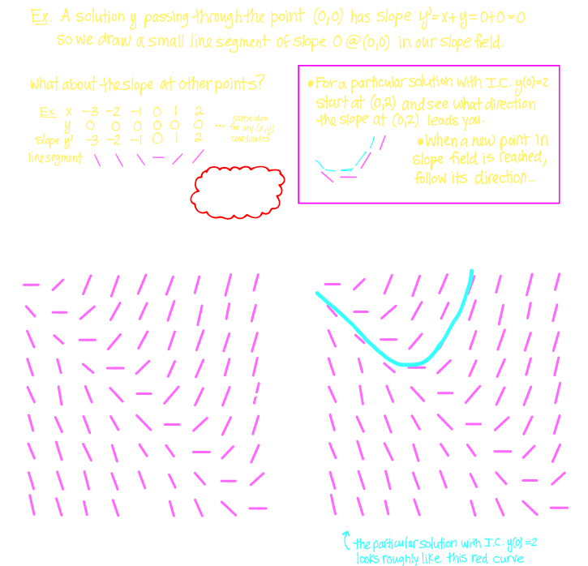
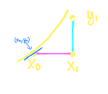

## 7. [[Differential Equations]] #[[MAT 1322]]
	- ### Differential Equations
	  id:: 65b8298f-f7eb-4893-98ad-cebb64cdb5af
		- A **differential equation** is an equation involving an *unknown* function, say $y(x)$, its derivative(s), such as $y', y^n$, etc. and an indepent variable $x$
		- The **order** of a differential equation is the order of the highest-order derivative appearing in the equation
		- The **solution** to a differential equation is a function $y(x)$ satisfying the equation
		- ### Initial Value Problem
			- Example:
			  background-color:: blue
				- Find the solution the differential equation $\frac{dy}{dx} = x+7$
					- 
			- In the example, the solution to the differential equation contains an **arbitrary constant**
			- With the arbitrary constant, a solution is called the **general solution**
			- The **general solution** represents an entire family of solutions i.e curves, that have a slope $x+7$
			- Given an **initial condition** such as $y(x_0)$ = y_0$, we can solve for $C$ and obtain a **particular solution**
			- An **initial condition** gives us a specific point that the graph of the solution must pass through
				- Only one member of the family of all solutions must pass through a given point $(x_0, y_0)$
				- A **particular solution** is the unique solution passing the the point given by the initial condition
			- A differential equation together with an initial condition is called an **initial value problem**
			- Example:
			  background-color:: blue
				- Solve the initial value problem $y' = x+7$ with initial condition $y(0) = 3$
					- 
	- ### Model for Population Growth
	  id:: 65b82ae8-c0d4-4ea1-89a2-b5c011abcfec
		- Suppose a population is growing under "ideal" conditions
		- In this situation, a reasonable and simple model for growth is:
			- Population grows at a rate proportional to the size of the population
				- $$\frac{dP}{dt} = kP$$(the differential equation) where
					- $k$ is the proportionality constant
					- $t$ is time (independent variable)
					- $P$ is population size (dependent variable)
					- $P(t)$ is the unknown function (solution)
		- What properties of population growth does this model capture?
			- Assume $P > 0$
			- If $k >0$, then $\frac{dP}{dt} = kP > 0$ so population is always increasing
			- As $P$ increases $\frac{dP}{dt}$ increases aswell
		- For an exponential function $f(x) = b^x$, it's derivative satisfies:
			- $$\frac{df}{dx}  = \frac{d}{dx} [b^x] = f'(0) \cdot b^x = k \cdot f(x)$$
		- Example:
			- Verify that $P(t) = Ce^{kt}$ is a solution the differential equation $\frac{dP}{dt} = kP$. What does the constant $C$ represent in terms of this population?
				- 
	- ### Separable Differential Equations
	  id:: 65b82ca1-6bfb-4bd3-9708-f21b8dc32aab
		- A first order differentiable equation in which the expression for $dy/dx$ can be factored as the product of a function of $x$ and a function of $y$ is called a **separable differential equation**
			- So a separable differential equation is of the form $\frac{dy}{dx} = f(x,y)$,
			- Where the function $f(x,y)$ can be factored as $f(x,y) = g(x)h(y)$
		- **Method for Solving a Separable Differential Equation**
		- Example:
		  background-color:: blue
			- Our guess for the exponential solution to our model seems like dumb luck; however, now we notice that $\frac{dP}{dt} = kP$ is a separable differential equation
				- 
			- Solve the **initial value problem** given by $\frac{dy}{dx} = xy^2 \cos(x^2) \quad y(0) =1$
				- 
			- Find the **general solution** to the differential equation $\frac{dy}{dx} = x^2y$
				- 
	- ### Direction Fields
	  id:: 65b83020-3982-4e32-8bec-516cb48d4a13
		- Suppose we have a first order differential equation of the form $y' = f(x,y)$
			- ^^**Idea**^^
				- If we are trying to solve $y' = f(x,y)$, then we know that the slope of $y$ must be equal to $f(x,y)$ at the point (coordinates) $(x,y)$
				-
				- At the coordinates $(x,y)$, on the $xy-$plane, calculate $y' = f(x,y)$ and plot a small line segment that indicates this slope
				- Do this for many points to obtain what is called a **slope field** or a **direction field**
				- Each line segment of a particular slope indicates the direction a solution curve passing through those coordinates is heading
			- Example:
			  background-color:: blue
				- Draw a slope/direction field for the differential equation $y' = x+y$. Trace a rough graph of the particular solution with initial condition $y(0) = 2$
					- 
				-
- ## 8. [[Euler's Method and Applications of DEs]] #[[MAT 1322]]
	- ### Euler's Method
	  id:: 65bacb2b-4ab3-46a6-ae17-c600eded2653
		- Suppose we have a first-order differential equation $y ' = f(x,y)$ and an initial condition $y(x_0) = y_0$
			- From what we've just done with slope fields, we know that $y'$ gives us a direction to head in
			- **Euler's method** is the same idea but we use a *numerical* method instead of *graphical*
		- **^^The Execution:^^**
			- **Given:** a first-order DE: $y'f(x,y)$ and $y(x_0) = y_0$
			- **Idea:** start at initial point $(x_0,y_0)$
				- From $(x_0)$ take a small step of size $(\Delta x)$
					- $\Rightarrow x_1 = x_0 + \Delta x = x_0 + h$
				- Since $f(x,y) = y' \approx \frac{\Delta y}{\Delta x}$ we see that the ^^approximate corresponding change in^^ $y$ ^^is^^ $\Delta y = f(x_0, y_0) \Delta x$
					- 
			- Our new $y-$value is
				- $$y_1 = y_0 + \Delta y = y_0 + f(x_0, y_0) \Delta x = y_0 + f(x_0, y_0) h$$
			- At new point $(x,y)$ we have slope $y' = f(x_1, y_1)$ so if we take another step of size $\Delta x (=h)$, then $x_2 = x_1 + \Delta x = x_1 +h$ and $\Delta y = f(x_1, y_1) \Delta x$
				- $$\Rightarrow y_2 = y_1 + f(x_1, y_1) \Delta x$$
			- By iterating this process we end up generating a sequence of points $(x_0, y_0), (x_1, y_1), (x_2, y_,2),... (x_n, y_n)$
			- #### The General Formula for Euler's Method with step size $\Delta x$ (or $h$) is
				- $$x_{n+1} = x_n + \Delta x$$
				- $$y_{n+1} = y_n + f(x_n, y_n) \Delta x$$ for $n = 0,1,2,...$
			- Example:
			  background-color:: blue
				- Use 4 steps of Euler's method with step size $h = \Delta x = 0.5$ to approximate the solution the initial value problem given by $y' = x+y$ and $y(-4) = 3.5$
	- ### Exponential Growth and Decay
	  id:: 65bace0c-0dae-406c-99fb-93c981b5e5a2
		- Recall that the solution to the differential equation $\frac{dy}{dt} = ky$ is $y = Ae^{kt}$
			- If the proportionality constant $k > 0$, then this DE represents **exponential growth**
			- If the proportionality constant $k < 0$, then the DE represents **exponential decay**
		- #### Population Growth
			- In the simple model for exponential growth, $\frac{dP}{dt} = kP$, the constant $k$ is called the **relative growth rate** since
				- $$\frac{1}{P} \frac{dP}{dt} = k$$
			- So $k = \frac{dP/dt}{P}$ is the rate of change of population per member
			- Example:
			  background-color:: blue
				- Suppose a population grows at a relative rate of $3%$ per year. If the initial population is 1000, with the population size 10 years later
				- Suppose a certain population bacteria rows exponentially. Initially the population size is 250, and 5 hours later, there are 400 bacteria. Find the function $P(t)$ that models this population as a function of $t$ the number of hours since the initial population count
		- **Radioactive Decay**
			- The mass of a radioactive element decays exponentially
				- i.e.$\frac{dm}{dt} = km$ so $m(t) = m_0e^{kt}$
			- The half life of the element is the time required to reduce the amount present by half
				- $$m(t_{1/2}) = frac{1}{2} m_ 0 \Rightarrow e^{kt_{1/2}} = 1/2 \\ \Rightarrow kt_{1/2} - \ln (\frac{1}{2}) \\ \Rightarrow K = \frac{\ln(1/2)}{t_{1/2}}$$
				- This the solution is
					- $$m(t) = m_0e^{(\frac{ln(1/2)}{t_{1/2}})t} = m_0(e^{\ln(\frac{1}{2}))^{\frac{t}{t_{1/2}}}}$$
			- Example:
				- $C^{14}$ has a half life of 5730 years. Carbon dating works by comparing the fraction of $C^{14}$ left in a dead thing to the amount that is present in living things. A fossil was found to have only 15% of $C^{14}$ How old is it?
	- ### Newton's Laws of Heating and Cooling
	  id:: 65bad0d2-8914-4927-a092-2c0514eeeae2
		- The temperature of an object increases or decreases at a rate that is proportional to the difference between its temperature and the temperature of its surroundings
			- $$\frac{dT}{dt} = k(T - T_s)$$
		- The constant of proportionality depends on the materials the object is comprised of
		- Example:
			- Say we have a cup of coffee initially at 40 $\degree C$ and a glass of water originally at 8 $\degree C$ and we leave them in a room with temperature 21 $\degree C$
	- ### Mixing Problems
	  id:: 65bad22a-6b32-49ac-bafa-bc15c13be049