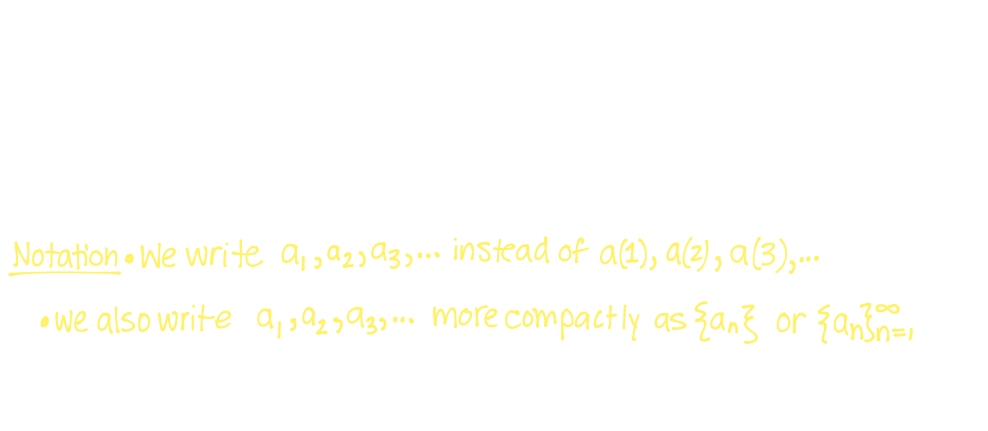
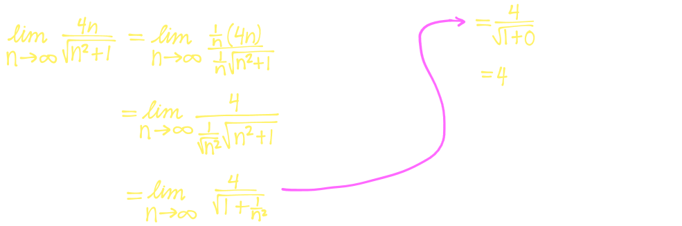
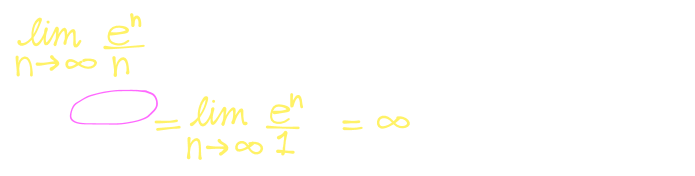
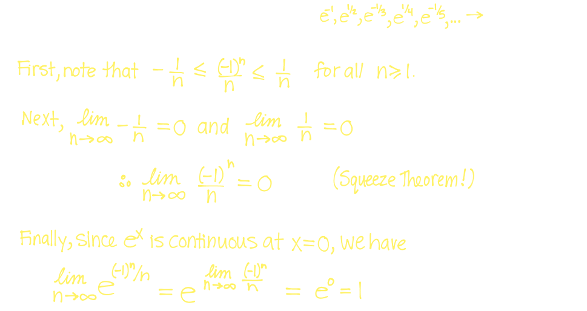

## 9. [[Sequences]] #[[MAT 1322]]
	- ### Sequences
	  id:: 65caa720-d29d-4aa4-92dc-22e808c29d75
		- A **sequence** can be thought of as an ordered list of numbers:
			- $$a_1, a_2, a_3, ..., a_n, a_{n+1}, ...$$
		- The number $a_1$ is the first term, $a_2$, the second term, $a_n$ is the $n$th term, and so on
		- Each number $a_n$ in the sequence has a **successor** $a_{n+1}$ sot that the sequence is infinite
		- For every positive integer $n \ge 1$ we can think of the term $a_n$ of the sequence as the value of $f(n)$ of a funciton $f$ whose domain is $\mathbb{Z}^+$ and whose codomain is $\mathbb{R}$
		- 
		-
	- ### Limits of Sequences
	  id:: 65caa794-5c20-4ad0-9800-164035bc9a7e
		- A sequence $\{a_n\}$ is called **convergent** if
			- $$\lim_{n \rightarrow \infin} a_n = L$$ for some unique real number $L$
		- As with limits of functions, we say that the **limit** of $\{a_n\}$ exists and equals $L$ if the terms $a_n$ become *arbitrarily close* to a unique number $L$ by taking $n$ to be *sufficiently large*
		- It means, as $n \rightarrow \infin$, the terms $a_n$ approach $L$, getting arbitrarily close to $L$ and stay close to $L$
		- More precisely, the limit exists and equals $L$ if, for every $\epsilon > 0$, there is a corresponding integer $N_{\epsilon}$ such that
			- $n > N_{\epsilon} \text{ implies} |a_n -L| < \epsilon$
		- If $\lim_{n \rightarrow \infin} a_n$ does not exist, then we say that the sequence $\{a_n\}$ is **divergent**
		- ^^**Theorem**^^
			- If $\lim_{x \rightarrow \infin} f(x) = L$ and the terms of a sequence $\{a_n\}$ are defined as $a_n = f(n)$, then,
				- $$\lim_{n \rightarrow \infin} a_n = L$$
		- Thus,w e can use all our tools for limits at infinity of functions to determine whether a sequence is convergent or divergent
		- Example:
			- Determine whether each of the following sequences are convergent or divergent
				- $a_n = 2^n$
					- 
				- $a_n = \sin(\pi/2n)$
					- 
				- $a_n = \frac{4n}{\sqrt{n^2 +1}}$
					- 
				- $a_n = \frac{e^n}{n}$
					- 
		- ### Limit Laws and Properties for Sequences
			- Suppose $\{a_n\}$ and $\{b_n\}$ are **convergent sequences** and that $c, p \in \mathbb{R}$ are constants. Then,
			- $$\lim_{n \rightarrow \infin} (a_n + b_n) = \lim_{n \rightarrow \infin} a_n + \lim_{n \rightarrow \infin} b_n$$
			- $$\lim_{n \rightarrow \infin} (a_n - b_n) = \lim_{n \rightarrow \infin} a_n - \lim_{n \rightarrow \infin}$$
			- $$\lim_{n \rightarrow \infin} ca_n = c( \lim_{n \rightarrow \infin} a_n)$$
			- $$\lim_{n \rightarrow \infin} (a_n b_n) = (\lim_{n \rightarrow \infin} a_n) ( \lim_{n \rightarrow \infin} b_n)$$
			- $$\lim_{n \rightarrow \infin}(\frac{a_n}{b_n}) = \frac{\lim_{n \rightarrow \infin} a_n}{\lim_{n \rightarrow \infin} b_n} \text{ provided } \lim_{n \rightarrow \infin} b_n \ne 0$$
			- $$\lim_{n \rightarrow \infin} (a_n)^p = (\lim_{n \rightarrow \infin} a_n)^p \text{ if } p > 0 \text{ and } a_n >0$$
			- #### The Squeeze Theorem for Sequences
				- Let $\{a_n\}, \{b_n\}, \{c_n\}$ be sequences
				- If $a_n \le b_n \le c_n$ for all $n \ge n_0$ and
					- $$\lim_{n \rightarrow \infin} a_n = L \lim_{n \rightarrow \infin} c_n$$
					- for some unique real number $L$ then,
						- $$\lim_{n \rightarrow \infin} a_n = L \le \lim_{n \rightarrow \infin} b_n \le L = \lim_{n \rightarrow \infin} c_n$$
						- $$\therefore \lim_{n \rightarrow \infin} b_n =L$$
			- #### Continuous Functions Applied to Sequences
				- If $f$ is continuous at $L$, and $\lim_{n\rightarrow \infin} a_n = L$, then $\lim_{n \rightarrow \infin} f(a_n) = f(L)$
				- That is ,
					- $$\lim_{n \rightarrow \infin} f(a_n) = f (\lim_{n \rightarrow \infin} a_n)$$
			- Example:
			  background-color:: blue
				- Is the sequence $\{e^{(-1)^n/n}\}$ convergent or divergent
					- 