## 12. [[Remainder Estimate Error Bounds & Limit Comparision Test]] #[[MAT 1322]]
	- ### Error Bounds for the Integral Test
	  id:: 65e76f2e-f587-4460-a177-67611bb24350
		- ^^**Recall:** The Integral Test^^
			- Suppose $f$ is a continuous positive, decreasing function on  $[1, \infin)$, and let $a_n = f(n)$
			- Then, ($\sum_{n=1}^\infin a_n$ is convergent) if and only if ($\int_1^\infin f(x) \ dx$ is convergent)
		- Suppose that $\sum_{n=1}^\infin a_n$ is convergent by virtue  of the integral
		- How close is $\int_1^\infin f(x) \ dx$ to the actual sum $\sum_{n=1}^\infin a_n$
		- It can be measured by the goodness of an estimate based on the **remainder**
		- $$R_n = \sum_{k = n+1}^\infin a_k = a_{n+1} + a_{n+2} + a_{n+3} + ...$$
		- $R_n$ is the "infinite tail" of the series
		- 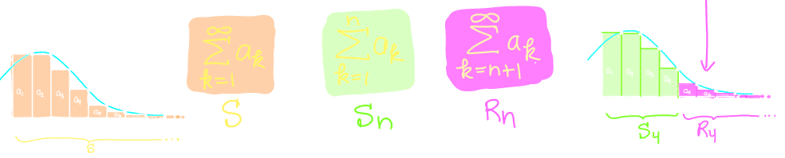
	- ### Remainder Estimate for Integral Test
	  id:: 65e76f2e-f271-4a35-8a46-b9aa0e74c335
		- Suppose $a_k = f(k)$, where $f(x)$ is continuous, positive, decreasing function for $x \in n$, and $\sum_{k=1}^\infin$ is convergent
		- Let $R_n = S - S_n$ be the remainder, that is, the difference between the exact sum $S = \sum_{k=1}^\infin a_k$ and the $n$th partial sum $S_n = \sum_{k=1}^n a_k$
		- Then,
			- $$\int_{n+1}^{\infin} f(x) \ dx \le R_n \le \int_n^\infin f(x) \ dx$$
			- 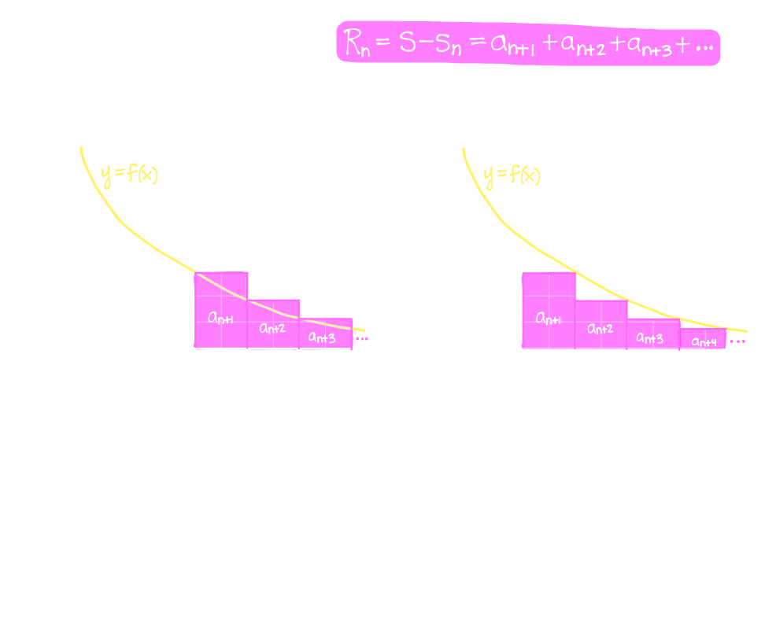
		- Example:
		  background-color:: blue
			- Consider the infinte series $$\sum_{k=1}^\infin \frac{1}{k^3}$$
				- 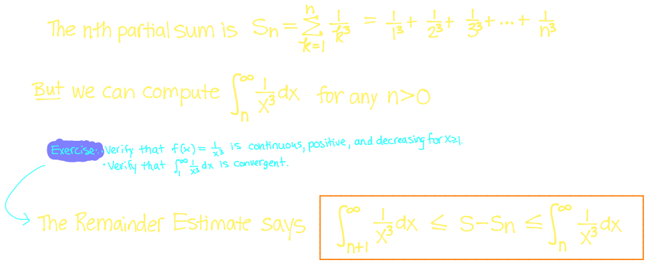
			- How many terms do we need so that  an estimate using $n$th partial sum is accurate to within $0.0005$
			  id:: 65e919a4-83a9-4f2e-b094-396ee4a2b7b8
				- 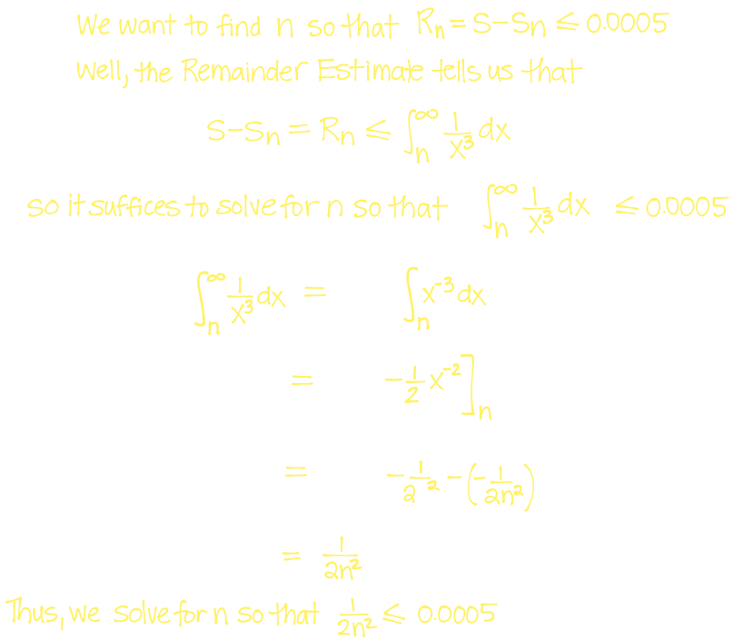
				- 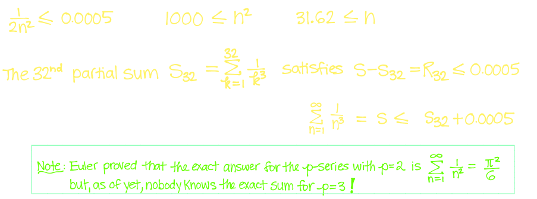
				- 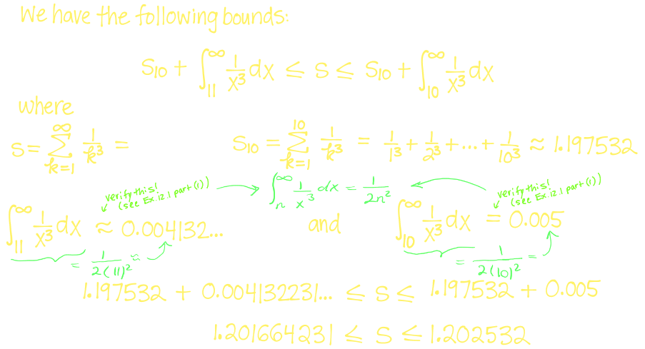
			- Give lower and upper bounds on the exact sum of the series $\sum_{k=1}^\infin \frac{1}{k^3}$ by using the 10th partial sum $S_{10}$ and the Remainder Estimate for the Integral Test
				- 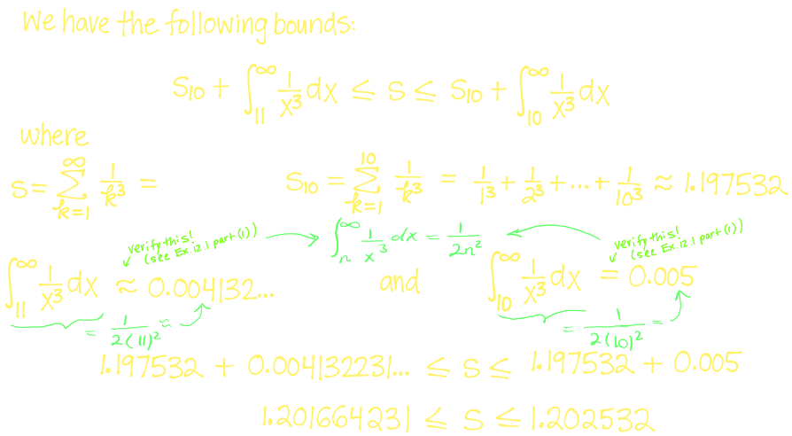{:height 297, :width 526}
		- By adding $S_n$ to all sides of the bounds given by the **Remainder Estimate for the Integral Test** we have
			- $$\int_{n+1}^\infin f(x) \ dx \le S-S_n \le \int_{n}^\infin f(x) \ dx$$
			- $$\therefore S_n + \int_{n+1}^\infin \le S \le S_n + \int_n^\infin f(x) \ dx$$
	- ### Limit Comparision Test
	  id:: 65e8d303-cfd2-4470-8325-8977e502936a
		- Suppose $\sum a_n$ and $\sum b_n$ are series with ^^positive^^ terms
		- If,
			- $$\lim_{n \rightarrow \infin} \frac{a_n}{b_n} = c$$
			- where $c$ is finite number and $c > 0$ then $\sum a_n$ and $\sum b_n$ behave the same:
				- either both **converge** or **diverge**
		- Example:
		  background-color:: blue
			- Determine whether the series $\sum_{n=1}^\infin \frac{1}{3^n -2}$ converges or diverges
				- 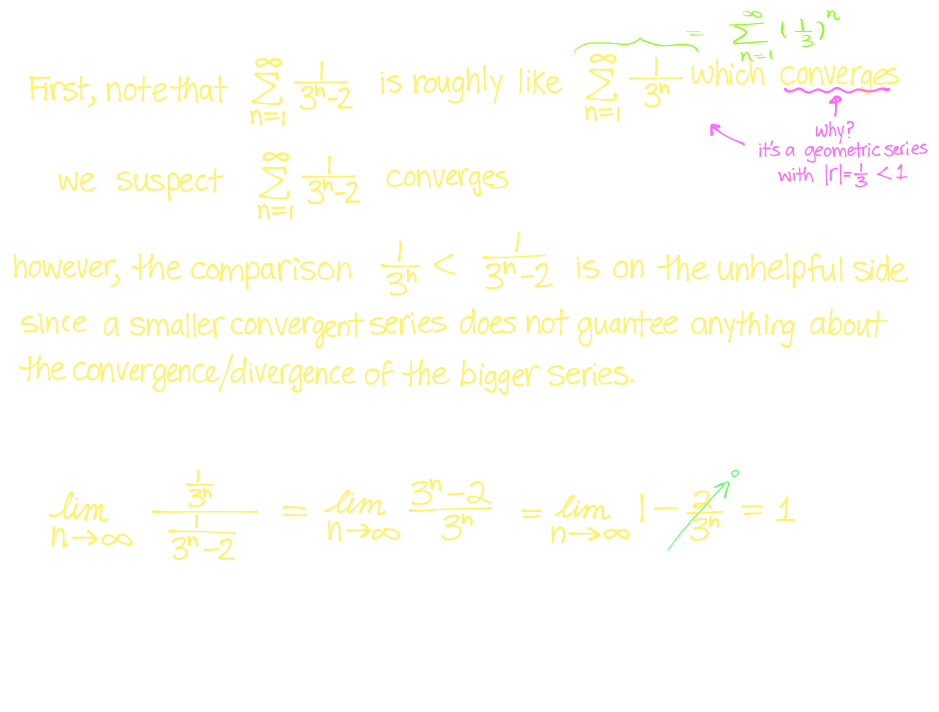{:height 413, :width 535}
			- Does the series $\sum_{k=1}^\infin \frac{2k+1}{\sqrt{k^3 +1}}$ converge or diverge?
				- 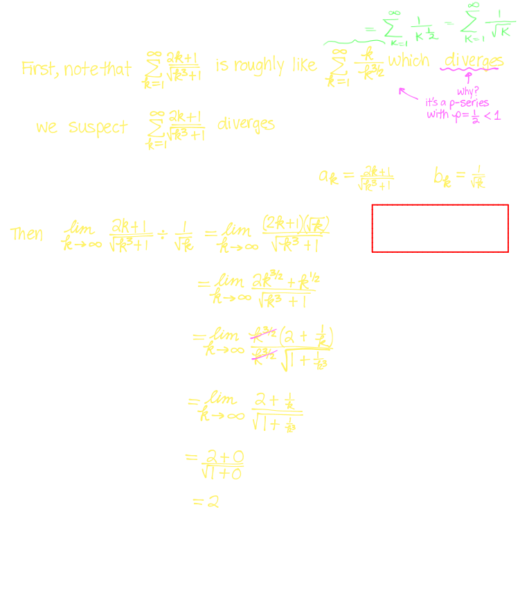
- ## 13. [[Alternating Series & Absolute/Conditional Convergence]]
	- ### Alternating Series
	  id:: 65e8d303-ef4e-4d09-a6ea-235297709426
		- A series $\sum a_n$ in which consecutive terms have opposite signs called an alternating series
			- 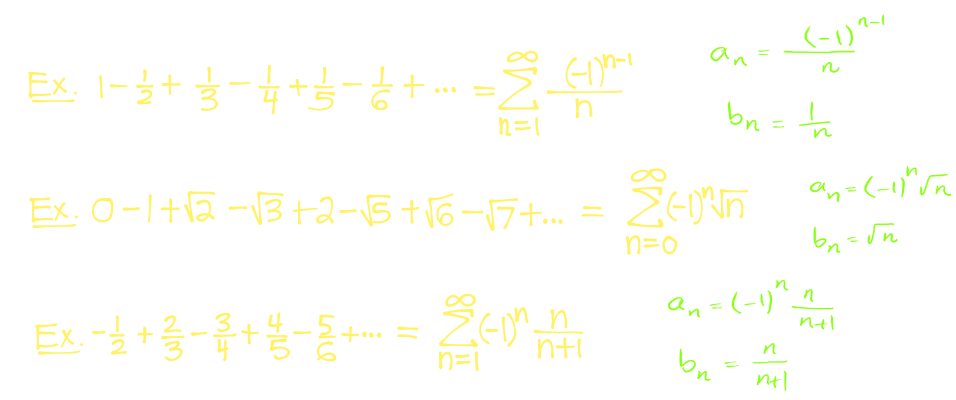
		- Suppose $\sum a_n$ is an alternating series
		- For all $n$, if we define $b_n = |a_n|$, then the $n$th term of the alternating series is of the form
			- $a_n = (-1)^{n-1}bn$ or $a_n = (-1)^n b_n$
		- Example:
		  background-color:: blue
			- For $\sum_{n=1}^\infin \frac{(-1)^{n-1}}{n}$ we have $a_n = \frac{(-1)^{n=1}}{n}$ and $b_n = |a_n| = \frac{1}{n}$
	- ### Alternating Series Test
	  id:: 65e8d303-887e-418f-96b1-9a86c5772be6
		- If the alternating series $\sum_{n=1}^\infin (-1)^{n-1} b_n = b_1 - b_2 + b_3 - b_4 + b_5 - b_6 + ...$ (where $b_n > 0$ for all $n$) satisfies
			- $b+{n+1} \le b$ for all $n$
			- $\lim_{n \rightarrow \infin} b_n = 0$
		- then the series is convergent
		- 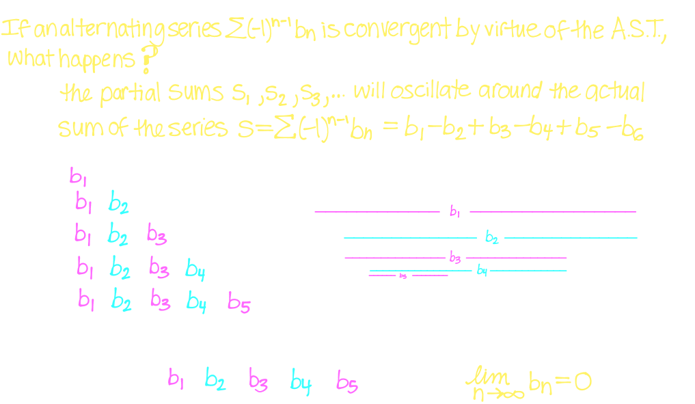
		- Example:
		  background-color:: blue
			- $$1 - \frac{1}{2} + \frac{1}{3} - \frac{1}{4} + \frac{1}{5} - \frac{1}{6} + ...$$
				- 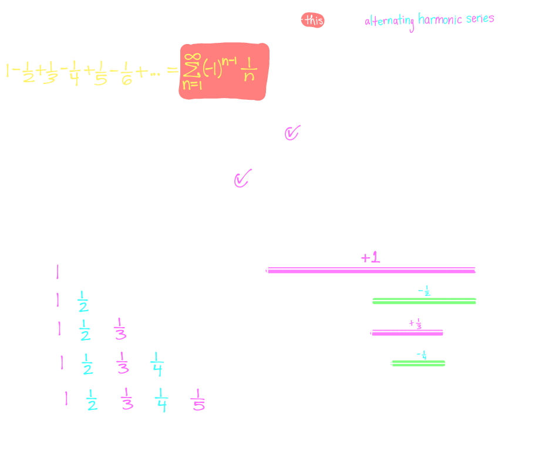{:height 570, :width 657}
			- $$\sum_{n=1}^\infin \frac{(-1)^n n}{n^2 +1}$$
				- 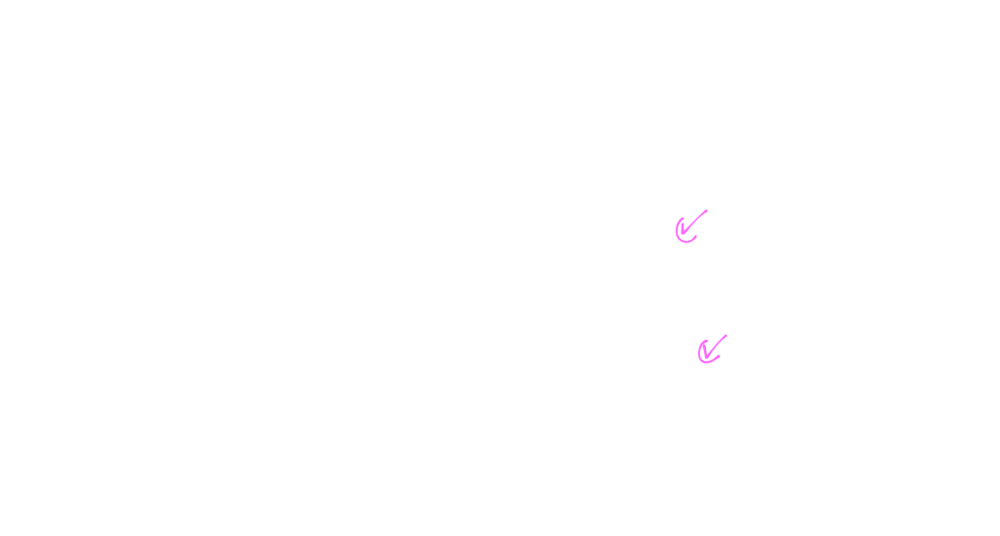
			- $$\sum_{n=1}^\infin \frac{(-1)^n 2n}{5n+1}$$
				- 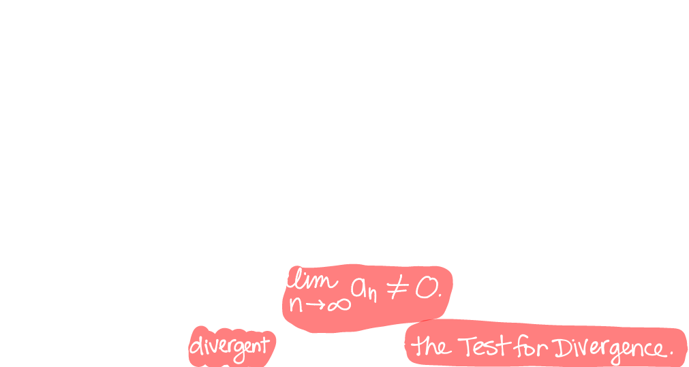
	- ### Alternating Series Estimation Theorem
	  id:: 65e8d303-5101-476c-842b-17456f4e78f3
		- If $b_n > 0$ and $S = \sum(-1)^{n-1}b_n$ is the sum of an alternating series that satisfies
			- $b_{n+1} \le b_n$ and $\lim_{n \rightarrow \infin} b_n = 0$
		- then
			- $$|R_n| = |S - S_n| \le b_{n+1}$$
		- Example:
		  background-color:: blue
			- $\sum_{k=0}^\infin \frac{(-1)^k}{k!}$ How many terms do we need so that error $= |S - S_n = |R_n| < 0.01$?
				- 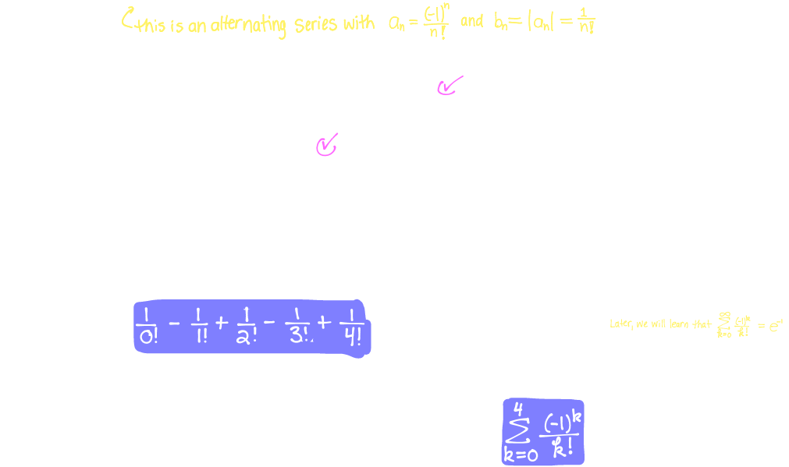
			- Find the sum of $\sum_{n=1}^\infin \frac{(-1)^{n-1}}{n^2}$ to within $0.005$
				- 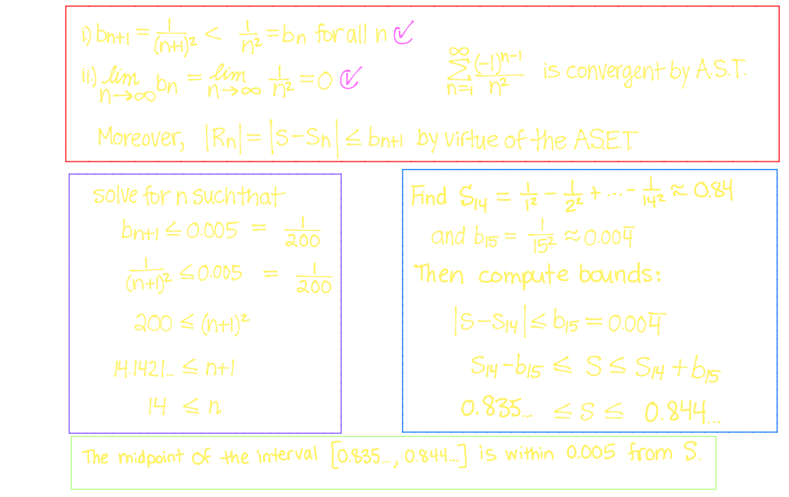{:height 339, :width 526}
	- ### Absolute vs. Conditional Convergence
	  id:: 65e8d303-76b1-4da9-958f-db7f667453d3
		- A series $\sum_{n=1}^\infin a_n$ is called **absolutely convergent** if the series $\sum_{n=1}^\infin |a_n|$ is convergent
			- $\sum_{n=1}^\infin \frac{(-1)^n}{n^2}$ is ^^absolutely convergent^^ $(|a_n| = \frac{1}{n^2})$
		- **Theorem:**
			- If a series $\sum a_n$ is ^^absolutely convergent^^. then it is **convergent**
				- $$(\sum |a_n| \text{ converges } \rightarrow (\sum a_n \text{ converges})$$
			- A series $\sum_{n=1}^\infin a_n$  is **conditionally convergent** if the series $\sum_{n=1}^\infin |a_n|$ is divergent while the series itself $\sum_{n=1}^\infin a_n$  is convergent
		- Example:
			- $\sum_{n=1}^\infin \frac{(-1)^n n}{n^2 +1}$ divergent? Is it absolutely or conditionally convergent?
				- 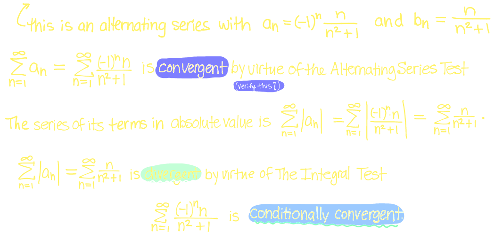
			- Discuss the converenge of the alternating harmonic series. Is it divergent? If not, is it absolutely convergent, or is it conditionally convergent
				- 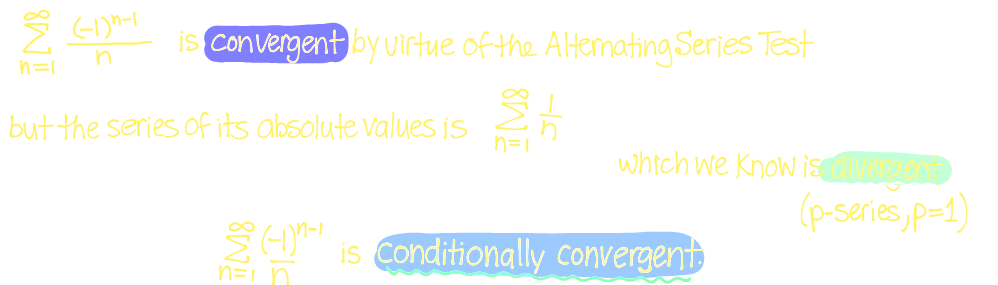
			- Show that the series $\sum_{n = 0}\frac{\sin(3n)}{3^n}$ is convergent
				- 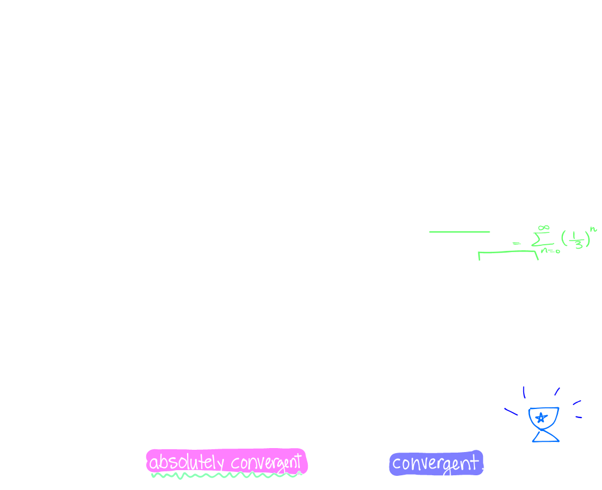{:height 543, :width 657}