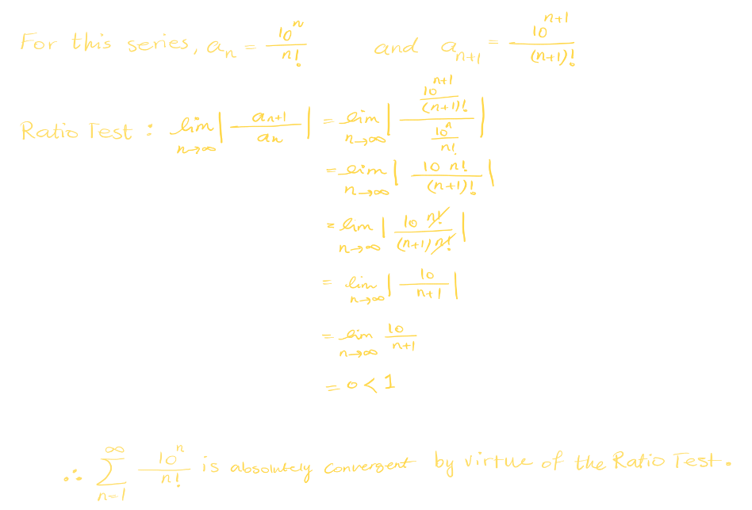
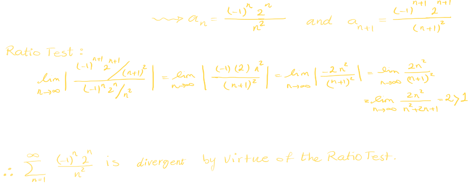
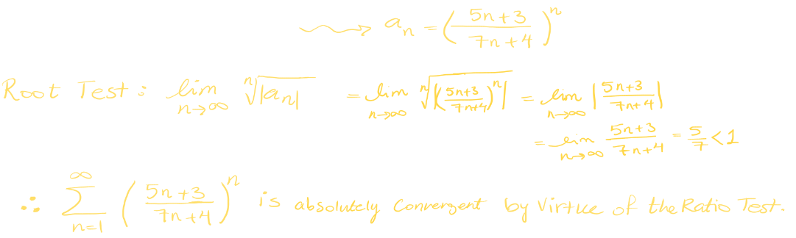
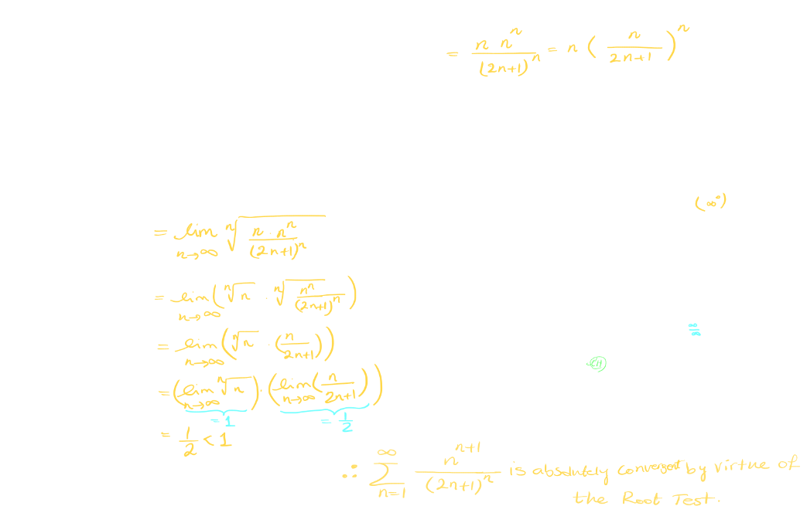
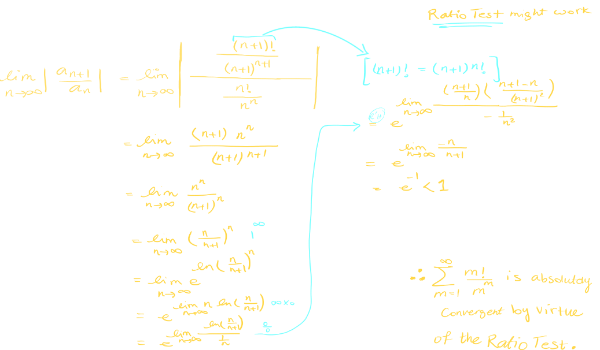
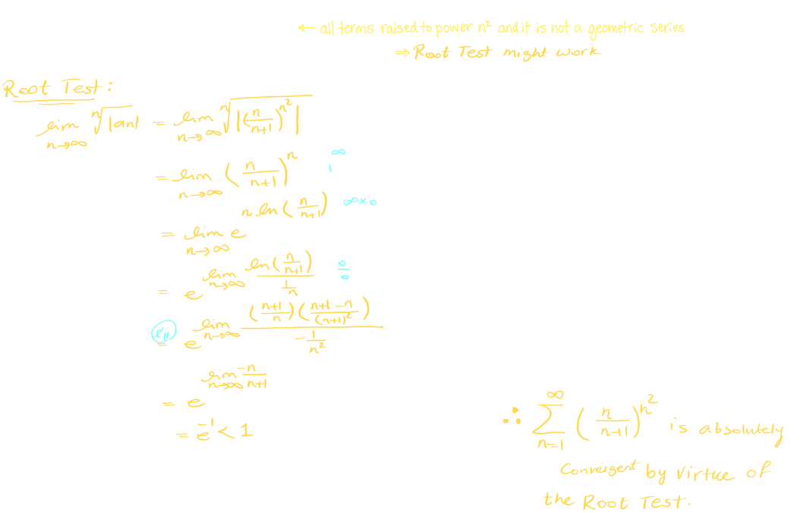
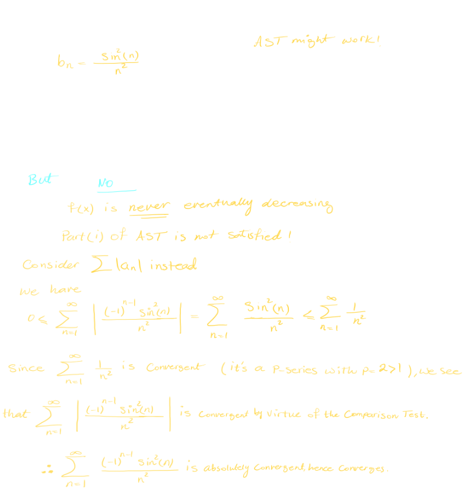

## 14. [[Ratio & Root Tests & General Strategies for Testing Series]] #[[MAT 1322]]
	- ### The Ratio Test
		- If $\lim_{n \rightarrow \infin} | \frac{a_{n+1}}{a_n}| = L$ and $L < 1$, then $\sum_{n=1}^\infin a_n$ is ^^absolutely convergent^^
		- If $\lim_{n \rightarrow \infin} | \frac{a_{n+1}}{a_n}| = L$ and $L > 1$, then $\sum_{n=1}^\infin a_n$ is ^^divergent^^
		- If $\lim_{n \rightarrow \infin} | \frac{a_{n+1}}{a_n}| = L$ and $L = 1$, then Ratio Test is ^^inconclusive^^
		- ### Factorial
			- Let $n \in \mathbb{Z} , n \ge 0$
				- Then "n factorial", denoted $n!$ is defined as recursively as follows:
					- $0! = 1$ for $n \ge 1 = n(n-1)!$
					- hence $n! = n(n-1)(n-2)(n-3)...(2)(1)$
		- Example:
		  background-color:: blue
			- $$\sum_{n=1}^\infin \frac{10^n}{n!}$$
				- 
			- $$\sum_{n=1}^\infin \frac{(-1)^n 2^n}{n^2}$$
				- 
	- ### The Root Test
		- If $\lim_{n \rightarrow \infin}  \sqrt[n]{|a_n|}= L < 1$, then $\sum_{n=1}^\infin a_n$ is ^^absolutely convergent^^
		- If $\lim_{n \rightarrow \infin}  \sqrt[n]{|a_n|}=L > 1$, then $\sum_{n=1}^\infin a_n$ is ^^divergent^^
		- If $\lim_{n \rightarrow \infin}  \sqrt[n]{|a_n|}=L = 1$, then Root Test is ^^inconclusive^^
		- Example:
		  background-color:: blue
			- $$\sum_{n=1}^\infin (\frac{5n+3}{7n+4})^n$$
				- 
			- $$\sum_{n=1}^\infin (\frac{-2n}{n+1})^5n$$
				- 
				- $$\sum_{n=1}^\infin \frac{n^{n+1}}{(2n+1)^n}$$
					- 
	- ### Strategies for Testing Series
		- $$\sum_{m=1}^\infin \frac{m!}{m^m}$$
			- 
		- $$\sum^\infin (\frac{n}{n+1})^{n^2}$$
			- 
		- $$\sum^\infin ke^{-k^2}$$
			- 
		- $$\sum_{n=1}^\infin \frac{(-1)^{n-1} \sin^2(n)}{n^2}$$
			- 
		-
		-