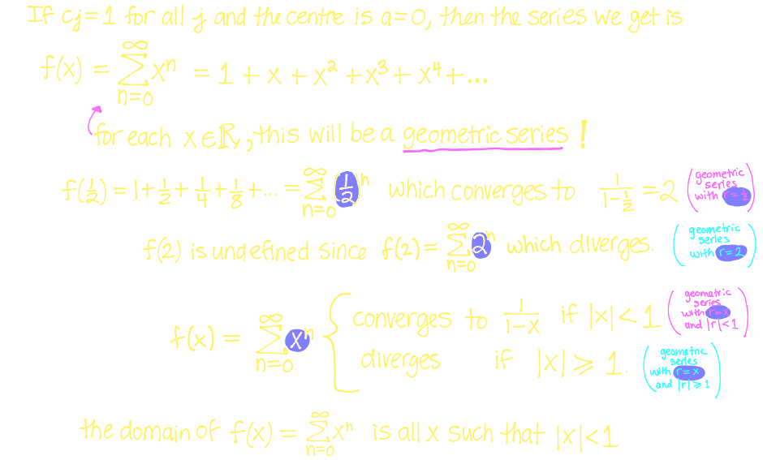
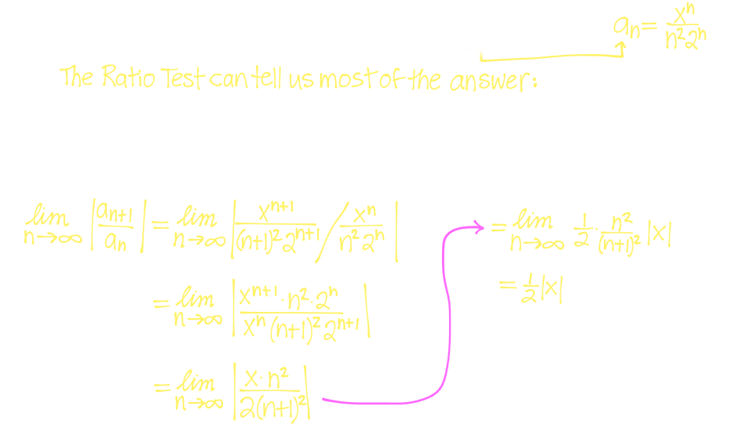
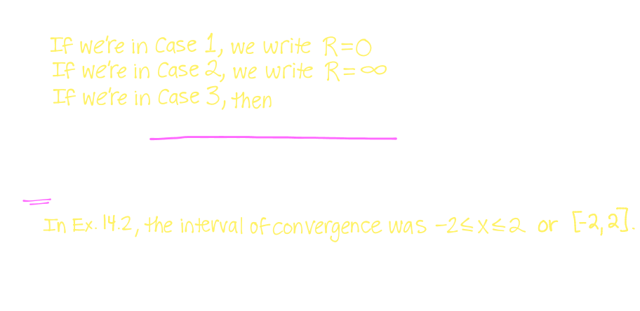
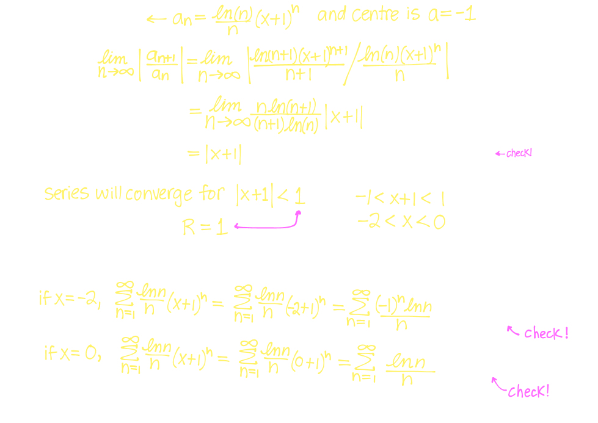
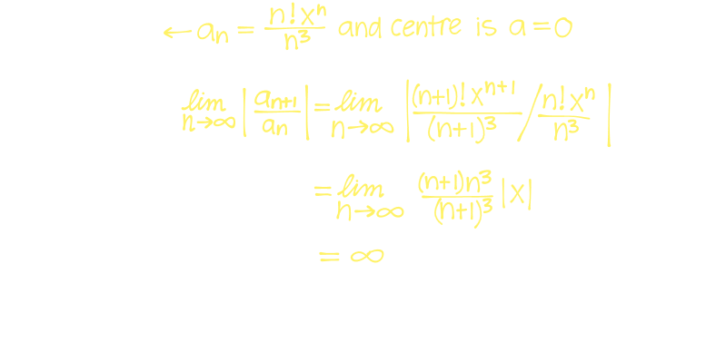
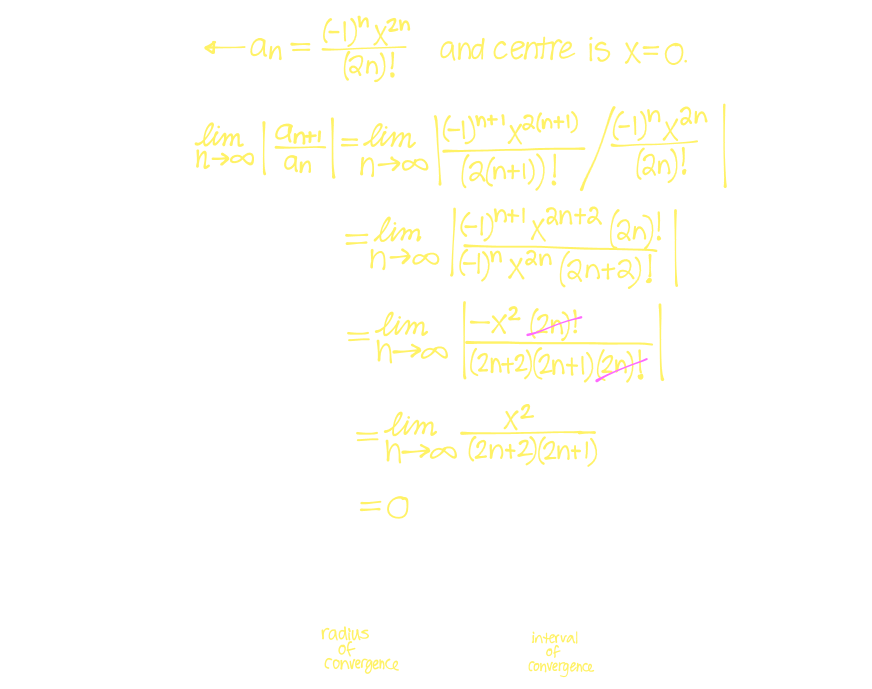

## 14. [[Ratio & Root Tests & General Strategies for Testing Series]] #[[MAT 1322]]
	- ### The Ratio Test
		- If $\lim_{n \rightarrow \infin} | \frac{a_{n+1}}{a_n}| = L$ and $L < 1$, then $\sum_{n=1}^\infin a_n$ is ^^absolutely convergent^^
		- If $\lim_{n \rightarrow \infin} | \frac{a_{n+1}}{a_n}| = L$ and $L > 1$, then $\sum_{n=1}^\infin a_n$ is ^^divergent^^
		- If $\lim_{n \rightarrow \infin} | \frac{a_{n+1}}{a_n}| = L$ and $L = 1$, then Ratio Test is ^^inconclusive^^
		- ### Factorial
			- Let $n \in \mathbb{Z} , n \ge 0$
				- Then "n factorial", denoted $n!$ is defined as recursively as follows:
					- $0! = 1$ for $n \ge 1 = n(n-1)!$
					- hence $n! = n(n-1)(n-2)(n-3)...(2)(1)$
		- Example:
		  background-color:: blue
			- $$\sum_{n=1}^\infin \frac{10^n}{n!}$$
				- {:height 364, :width 526}
			- $$\sum_{n=1}^\infin \frac{(-1)^n 2^n}{n^2}$$
				- 
	- ### The Root Test
		- If $\lim_{n \rightarrow \infin}  \sqrt[n]{|a_n|}= L < 1$, then $\sum_{n=1}^\infin a_n$ is ^^absolutely convergent^^
		- If $\lim_{n \rightarrow \infin}  \sqrt[n]{|a_n|}=L > 1$, then $\sum_{n=1}^\infin a_n$ is ^^divergent^^
		- If $\lim_{n \rightarrow \infin}  \sqrt[n]{|a_n|}=L = 1$, then Root Test is ^^inconclusive^^
		- Example:
		  background-color:: blue
			- $$\sum_{n=1}^\infin (\frac{5n+3}{7n+4})^n$$
				- 
			- $$\sum_{n=1}^\infin (\frac{-2n}{n+1})^5n$$
				- 
				- $$\sum_{n=1}^\infin \frac{n^{n+1}}{(2n+1)^n}$$
					- 
	- ### Strategies for Testing Series
	  id:: 65e76f2e-c41e-4c42-bd36-8e53493cfa39
	  collapsed:: true
		- $$\sum_{m=1}^\infin \frac{m!}{m^m}$$
			- 
		- $$\sum^\infin (\frac{n}{n+1})^{n^2}$$
			- 
		- $$\sum^\infin ke^{-k^2}$$
			- 
		- $$\sum_{n=1}^\infin \frac{(-1)^{n-1} \sin^2(n)}{n^2}$$
			- 
		-
- ## 15. [[Power Series]]
	- ### Power Series
		- A **power series centred at** $x = a$ has the form
			- $$\sum_{n=0}^\infin c_n (x-a)^n = c_0 + c_1(x-a) + c_2(x-a)^2 + c_3(x-a)^3 +....$$
		- A power series **may** have a convergent series for some values of $x$
		- If $x = a$ (the **centre**), then we have:
			- $$\sum_{n=0}^\infin c_n (a-a)^n = c_0 + c_1(0) + c_2(0)^2 +.... = c_0$$
			- $\therefore$ All power series converge at their ^^centre^^ $x=a$
		- The convergence of a power series will depend on the **coefficients**, the $c_i$'s
		- If a power series is centred at $a = 0$, then it looks like
			- $$\sum_{n=0}^\infin c_n (x-0)^n = \sum_{n=0}^\infin c_n x^n  c_0 + c_1x + c_2x^2 + c_3x^3 +....$$
			- A power series defines a functions and its domain is all $x$ for which the series $f(x)$ is convergent
		- Example:
		  background-color:: blue
			- Suppose a power series has coefficients $c_j = 1$ for all $j$ and is centerd at $a = 0$. What does the series look like and what is it's domain
				- 
			- For what values of $x$ is the power series $\sum_{n=1}^\infin \frac{x^n}{n^2 2^n}$ convergent?
				- {:height 310, :width 526}
				- 
	- ### Radius and Interval of Convergence
	  id:: 65e8f22d-82f9-4abb-8d2a-a5bec7dfbc88
		- ^^**Theorem:**^^
			- For a power series $\sum_{n=0}^\infin c_n (x-a)^n$ there are only 3 possibilities
				- The series converges only when $x = a$
				  logseq.order-list-type:: number
				- The series converges for all $x \in \mathbb{R}$
				  logseq.order-list-type:: number
				- There is a positive number $R$ such that 
				  logseq.order-list-type:: number
					- The series converges if $|x-a| < R$
					  logseq.order-list-type:: number
					- The series diverges if $|x-a| > R$ 
					  logseq.order-list-type:: number
				- Called the **radius of convergence** of the power series
		- #### Conventions for $R$
			- 
		- Example:
		  background-color:: blue
			- Find the radius and interval of convergence of each of the following power series:
				- $$\sum_{n=1}^\infin \frac{\ln n}{n}(x+1)^n$$
					- {:height 358, :width 495}
				- $$\sum_{n=1}^\infin \frac{n! x^n}{n^3}$$
					- 
				- $$\sum_{n=0}^\infin \frac{(-1)^n x^{2n}}{(2n)!}$$
					- 