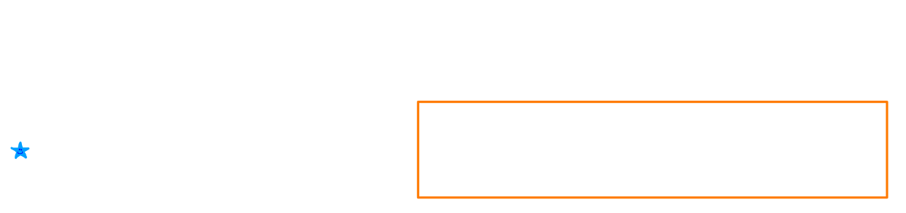
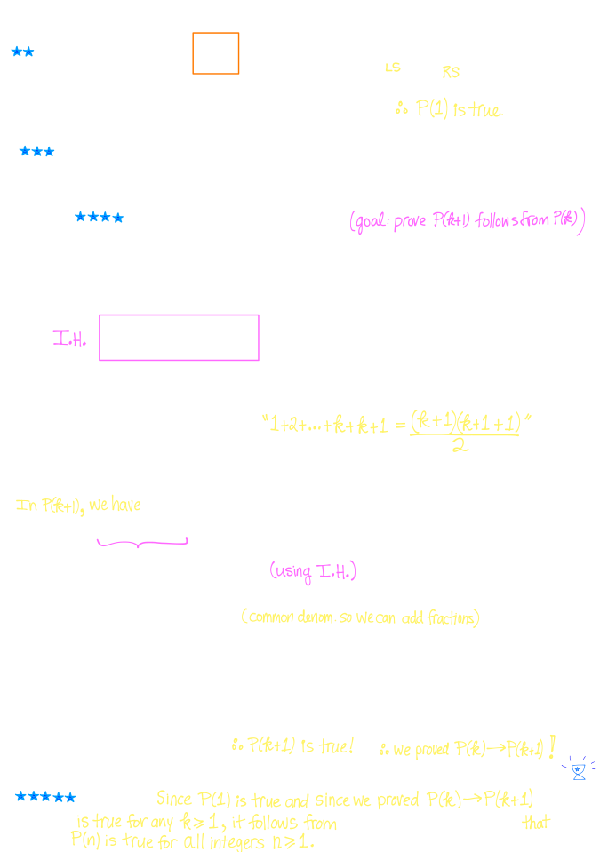
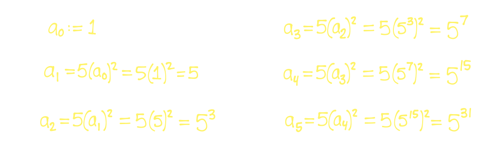
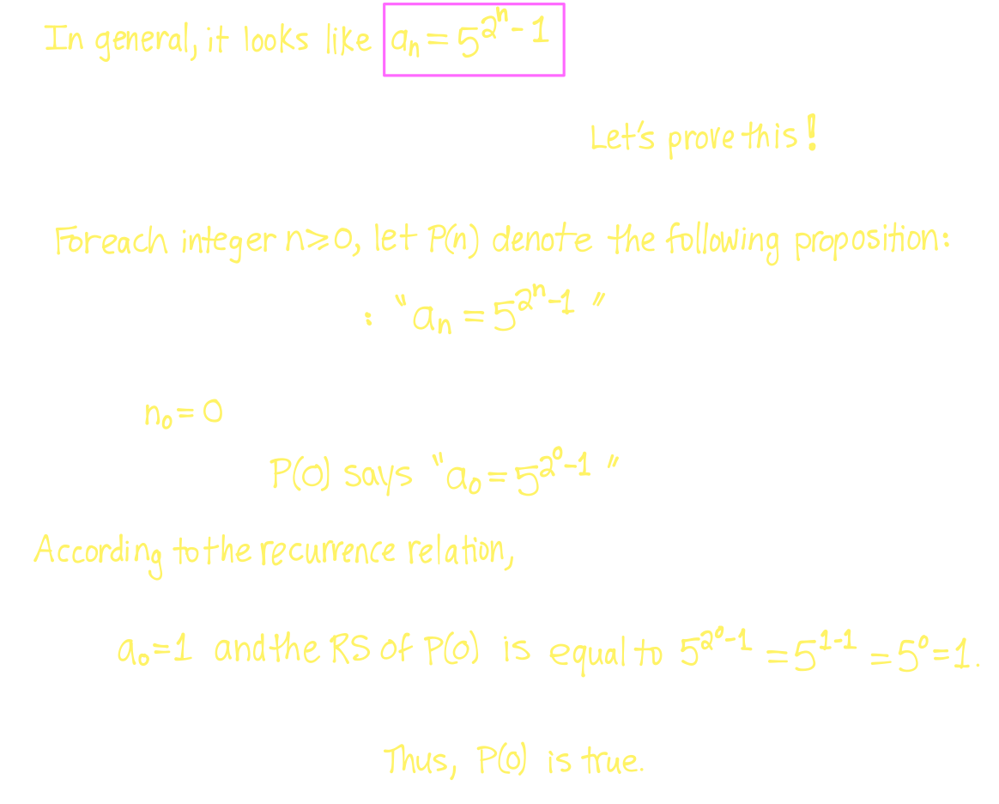
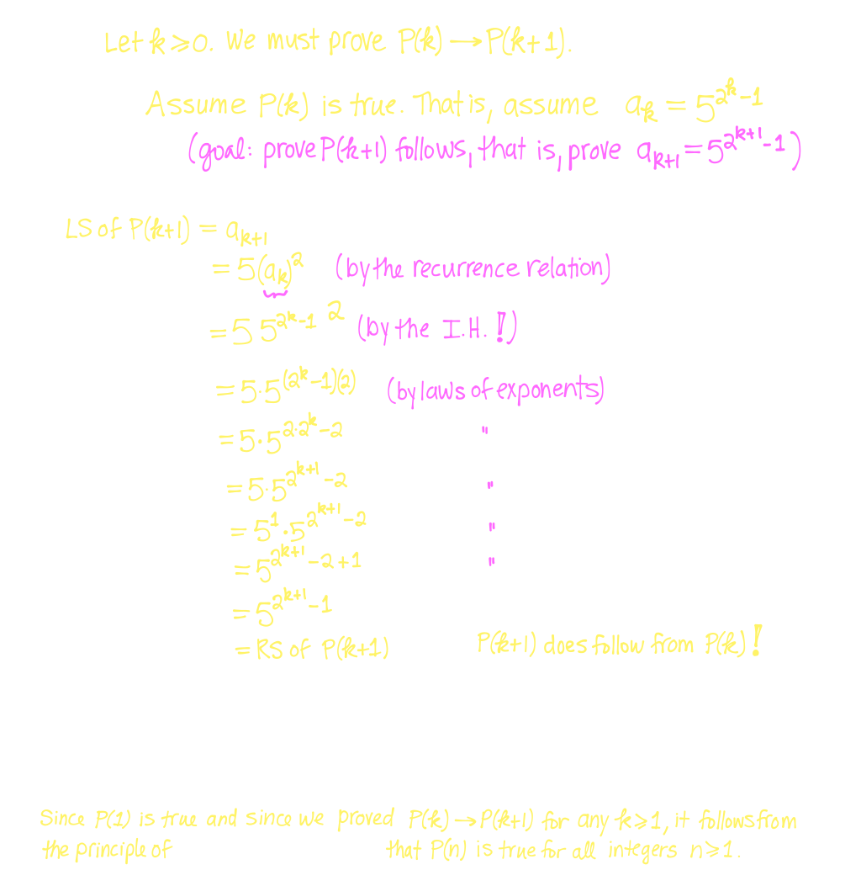
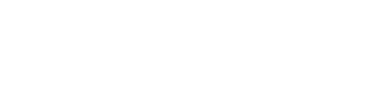
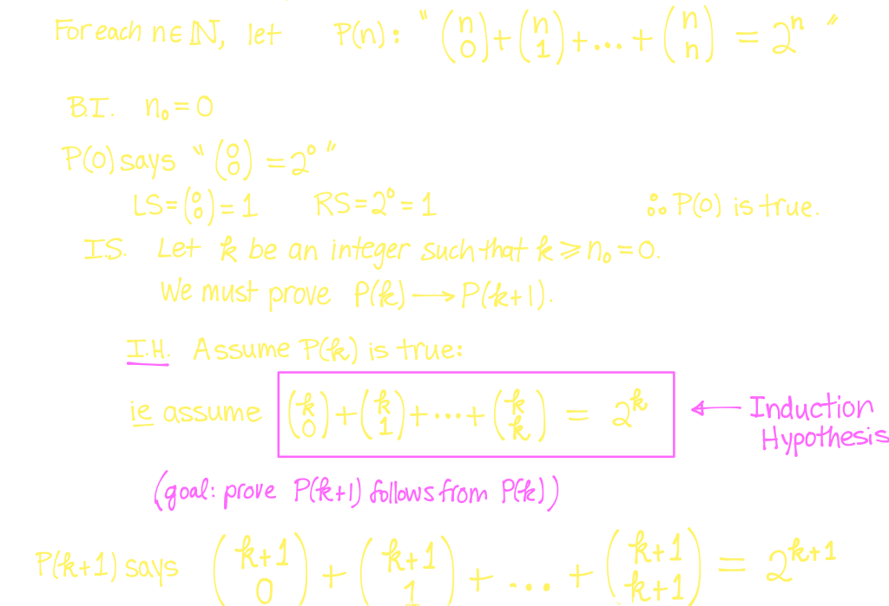
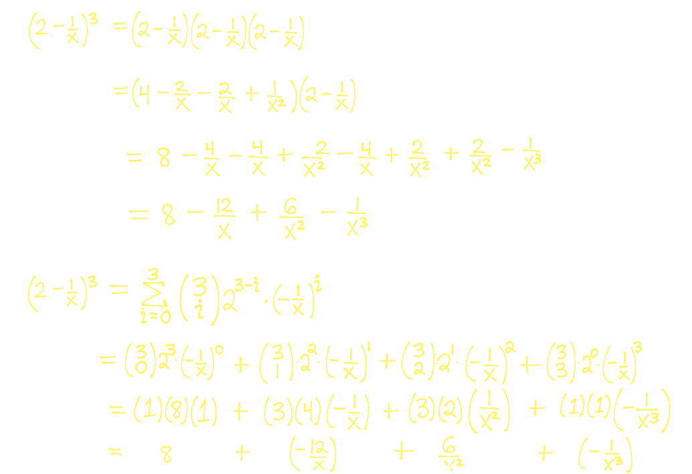
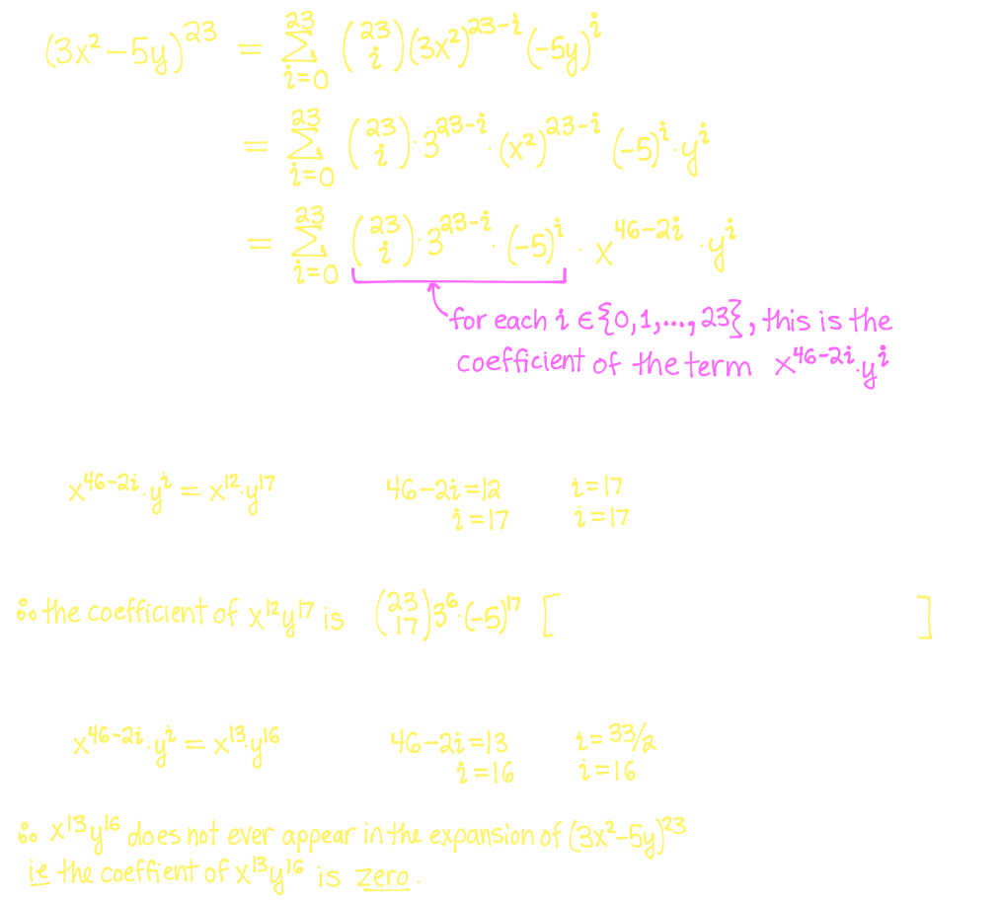

## [[Induction]]
	- ## 7.1 Induction Principle
		- Let $P(n)$ be a proposition involving the positive integers $n$. If
			- $P(n_0)$ is true and
			  logseq.order-list-type:: number
			- $P(n) \rightarrow P(n+1)$ is true for all n $\ge n_0$
			  logseq.order-list-type:: number
		- then, $P(n)$ is true for all $n \ge n_0$
		- To write a proof of induction, we need to do the following:
			- For $n \in \mathbb{N}$, define the proposition $P(n)$
			- For the initial value $n_0$, we show $P(n_0$ is true)
		- Let $k \ge n_0$ and suppose $P(k)$ is true
		- We show $P(k+1)$ is true
		- We conclude that since P(n_0) is true and $P(k) \rightarrow P(k+1)$ is true for all $k \ge n_0$ then $P(n)$ is true for all $n \ge n_0$
		- Examples:
		  background-color:: blue
			- Use **Mathematical Induction** to prove that the following formula holds for all integers $n \ge 1$
				-  
			- Let $a_0,a_1, a_2, a_3,...$ be a sequence of numbers defined according to the following **reccurence relation**:
				- $a_0:=1$
				- for each integer $n \ge 1, a_n = 5(a_{n-1})^2$
			- Using the **recurrance relation**, compute the values for $a_1, a_2, a_3$ and $a_4$
				- 
			- What is the **general solution** to this reccurance relation? That is, what does $a_n$ equal as a function  of $n$?
				- Prove this solution using a **Proof fo Induction**
					-  
- ## [[Binomial Theorem]]
	- ## 8.1 Introduction
	  id:: 66048b1e-f316-40ce-8c3a-fc3831d2b6b3
		- Recall that if $0 \le r \le n$, then
			- $$C(n,r) = \begin{pmatrix} n \\ r \end{pmatrix} = \frac{n!}{r!(n-r)!}$$
			- $\begin{pmatrix} n \\ r \end{pmatrix}$ represents the number of subsets of size $r$ in a set of size $n$
			- Called a **binomial coefficient**
		- A **combinational proof** is the proof of the equality of two expressions
			- A combinatorial proof uses one of the following techniques
				- Proof by ^^double counting^^: count the elements of a set in two different ways
				- Proof by ^^bijection^^: Find a bijective function between two sets thus shwoing the two sets have the same cardinality
	- ## 8.2 Pascal's Identity
	  id:: 66048b1e-3e6d-40c6-ad90-303278f61689
		- ^^**Theorem:**^^
			- Let $n \ge k + 1$ and $k \ge 0$ be integers, then
				- $$\begin{pmatrix} n \\ k \end{pmatrix} + \begin{pmatrix} n \\ k+1 \end{pmatrix} = \begin{pmatrix} n+1 \\ k+1 \end{pmatrix} $$
			- ^^**Proof**^^ (Combinatorial)
				- We count the number of subsets of $\{1,2,3,..., n+1\}$ of size $k+1$ in two different ways
			- Pascal's identity is used to build **Pascal's triangle**
			- When evaluating these expressions, we get
			- The sum of each row of Pascal's triangle is 1,2,4,8,16
				- 
		- ^^**Theorem**^^
			- For all integer $n \ge 0$:
				- $$\sum_{i=0}^n \begin{pmatrix} n \\ i \end{pmatrix} = \begin{pmatrix} n \\ 0 \end{pmatrix}  + \begin{pmatrix} n \\ 1 \end{pmatrix} + ... + \begin{pmatrix} n \\ n \end{pmatrix} = 2^n$$
				- ^^**Proof**^^ (Combinatorial)
					- 
					  collapsed:: true
						- $\therefore$, the number of subsets of $A$ is $|P(A)| = 2^n$
	- ## 8.3 Binomial Theorem
	  id:: 66048b1e-b91b-409e-9b5f-b94cd8339b5e
		- ^^**Theorem:**^^
			- Let $x$ and $y$ be variables, and let $n \ge 0$ be an integer, then
				- $$(x+y)^n = \sum_{i=0}^n \begin{pmatrix} n \\ i \end{pmatrix} x^{n-i}y^i = \begin{pmatrix} n \\ 0 \end{pmatrix} x^n y^0 + \begin{pmatrix} n \\ 1 \end{pmatrix} x^{n-1}y^1 + \begin{pmatrix} n \\ 2 \end{pmatrix} x^{n-2}y^2 + ... + \begin{pmatrix} n \\ n \end{pmatrix} x^0y^n$$
		- Examples:
			- Fully evaluate $\Big( 2- \frac{1}{3}\Big)^3$ first from scratch, then using the Binomial Theorem
				- 
			- Find the coefficients of $x^{12}y^{17}$ and $x^{13}y^{16}$ in the expansion of $(3x^2-5y)^{23}$
				- 
			-
	-