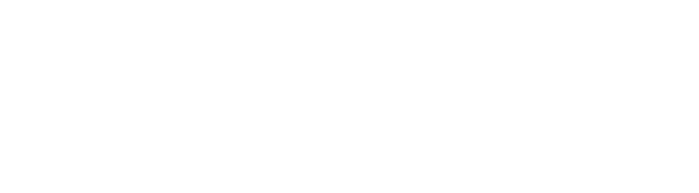

## [[Proposition Logic]] #[[MAT 1348]]
	- ## 1.13 Laws of Logic
	  id:: 65aedcf1-6d99-4ea6-bf8c-6ad016d37392
	  collapsed:: true
		- $P \rightarrow Q \equiv \neg \vee Q$ (Implication law)
		  logseq.order-list-type:: number
		- $P \leftrightarrow Q \equiv (P \wedge Q) \vee (\neg P \wedge \neg Q)$ (Biconditional Law)
		  logseq.order-list-type:: number
		- $P \leftrightarrow Q \equiv (P \rightarrow Q) \wedge ( Q \rightarrow P)$ (Biconditional Law)
		  logseq.order-list-type:: number
		- $P \vee \neg P \equiv V$ (Negation Law)
		  logseq.order-list-type:: number
		- $P \vee \neg P \equiv F$ (Negation Law)
		  logseq.order-list-type:: number
		- $P \vee F \equiv P$ (Identity Law)
		  logseq.order-list-type:: number
		- $P \wedge V \equiv P$ (Identity Law)
		  logseq.order-list-type:: number
		- $P \vee V \equiv V$ (Dominion Law)
		  logseq.order-list-type:: number
		- $P \wedge F \equiv F$ (Dominion Law)
		  logseq.order-list-type:: number
		- $P \vee P \equiv P$ (Idempotent Law)
		  logseq.order-list-type:: number
		- $P \wedge P \equiv P$ (Idempotent Law)
		  logseq.order-list-type:: number
		- $\neg \neg P \equiv P$ (Double Negation Law)
		  logseq.order-list-type:: number
		- $P \vee Q \equiv Q \vee P$ (Commutativity)
		  logseq.order-list-type:: number
		- $P \wedge Q \equiv Q \wedge P$ (Commutativity)
		  logseq.order-list-type:: number
		- $(P \wedge Q) \vee R \equiv P \vee (Q \wedge R)$ (Assoociativity)
		  logseq.order-list-type:: number
		- $(P \vee Q) \wedge R \equiv P \wedge (Q \wedge R)$ (Assoociativity)
		  logseq.order-list-type:: number
		- $P \vee (Q \wedge R)  \equiv (P \vee Q) \wedge (P \vee R)$ (Distributivity)
		  logseq.order-list-type:: number
		- $P \wedge (Q \vee R)  \equiv (P \wedge Q) \vee (P \wedge R)$ (Distributivity)
		  logseq.order-list-type:: number
		- $\neg (P \wedge Q) \equiv \neg P \vee \neg Q$ (De Morgan's Law)
		  logseq.order-list-type:: number
		- $\neg (P \vee Q) \equiv \neg P \wedge \neg Q$ (De Morgan's Law)
		  logseq.order-list-type:: number
		- $P \vee (P \wedge Q) \equiv P$ (Absorption Law)
		  logseq.order-list-type:: number
		- $P \wedge (P \vee Q) \equiv P$ (Absorption Law)
		  logseq.order-list-type:: number
	- ## 1.14 Truth Trees
	  id:: 65aee2ba-1075-4f97-827c-ba59737e9876
	  collapsed:: true
		- A truth tree is a structure used to determine under which condition a compound proposition $X$ is true
		- As opposed to the truth table, the size of the truth tree does not necessarily grow exponentially with the number of variables
		- To create a truth table, for $X$, we set $X$ as the **root** of the tree
		- We then apply **branching rules**
			- 
		- Each proposition in the truth tree is **verified** if:
			- The proposition is a literal (a variable or its negation), **or**
			- The branching rule for this proposition has been applied to all paths starting at this proposition
		- Starting at the top, for each proposition that is not verified, we apply the branching rule to all paths starting at this proposition
		- The proposition then becomes verified
		- A **leaf** of a truth tree is a proposition at the end of a path starting at the root
		- For each leaf, there is a unique direct path from it the root
		- Such a path is **inactive** if it contains verified propositions
		- A truth tree is **complete** when each path is either inactive or complete
	- ## 1.15 Consistent Sets
	  id:: 65aee6c0-e41a-4225-844b-8861cd6f9399
	  collapsed:: true
		- ^^**Definition:**^^ A set of compound is **consistent** if there exists and assignment of truth values to the propositional variables that make all the compound propositions true
			- $$\{P_1, ..., P_n\}$$ is **inconsistent** if the conjuction $P_1 \wedge ... \wedge P_n$ is a contradiction
		- In other words, the set ${P_1, ..., P_n}$ is consistent if the proposition $P_1 \wedge ... \wedge P_n$
		- The set ${P_1,..., P_n}$ is consistent, we build the truth tree with the following root:
			- $$\begin{bmatrix}P_1 \\ P_2 \\... \\P_n \end{bmatrix}$$
		- If the tree has no active paths, then $P_1 \wedge ... \wedge P_n$ is a contradiction , so $\{P_1, ...,P_n\}$ is inconsistent
		- If the tree has an active path, then each of the active paths give an assignment of truth values to the variables which makes each of $P_1,...,P_n$
		-
-