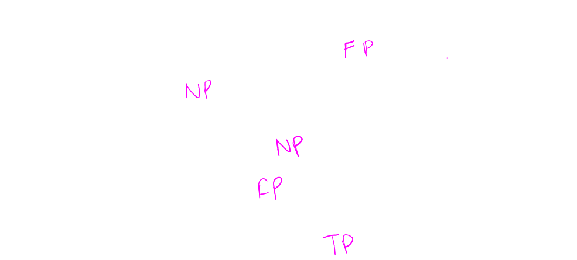
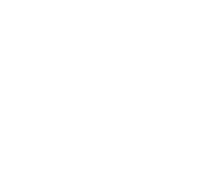
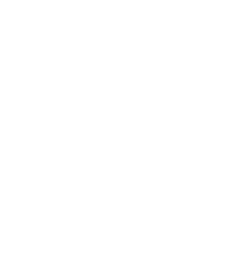
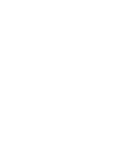
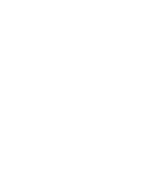
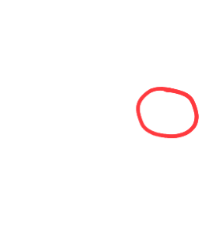
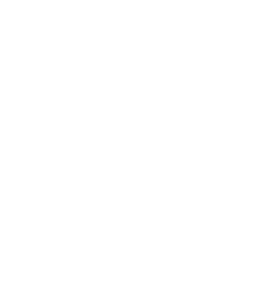
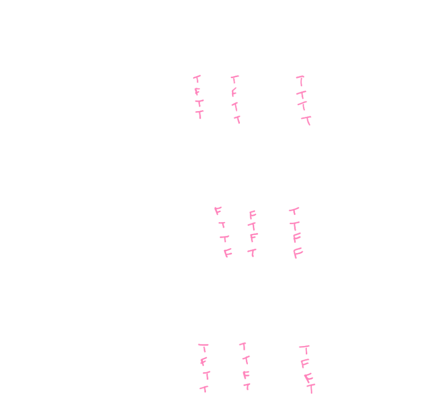

## [[Proposition Logic]] #[[MAT 1348]]
	- ### [[1.1 Propositions]]
		- ^^**Definition:**^^
			- A **proposition** is a declarative sentence that is either true or false, but not both
				- If a proposition is ^^true^^, then its **truth value** is **T** for **True**
				- If a proposition is ^^false^^, then its **truth value**  is **F** for **False**
			- Example:
			  background-color:: blue
				- $\text{Ottawa is the capital of Canada}$
					- True Proposition
				- $1 + 2 = 3$
					- True Proposition
				- $2+2 = 3$
					- False Proposition
				- $1 + x = 3$
					- Not a Proposition
				- $\text{There exists a integer } x \text{ such that } 1 + x = 3$
					- True Proposition
				- 
	- ### [[1.2 Variables and Propositions]]
		- Variables can be used to represent propositions
id:: 659cce55-b06d-48a7-a8ca-277c5181a586
		- These variables are **propositional variables** or **atoms**
		- Example:
			- $p = \text{"I love mathematics"}$
			- $q = \text{"2+2=3"}$
		- We form **compound propositions** by combining propositional variables using logical operators
	- ### [[1.3 Logical Operators]]
		- #### Negation
			- Let $p$ be a propositional variable
			- ^^Negation^^, denoted by $\neg p$ or "not-$p$" is the following proposition:
				- $\text{p is false}$
			- {:height 130, :width 152}
			- The truth value of $\neg p$ is the opposite of the truth value of $p$
		- #### Conjuction
			- Let $p$ and $q$ be propositional variables
			- ^^Conjunction^^, denoted by $p \wedge q$ or "$p$ and $q$", is the following proposition:
				- $\text{ p and q}$
			- {:height 213, :width 175}
			- $p \wedge q$ is true when $p$ and $q$ are both true. Otherwise $p \wedge q$ is false
		- #### Disjunction
			- Let $p$ and $q$ be propositional variables
			- ^^Disjunction^^, denoted by $p \vee q$ or "$p$ or $q$", is the following proposition:
				- $\text{ p or q}$
			- {:height 201, :width 183}
			- $p \vee q$ is false when both $p$ and $q$ are both false. Otherwise $p \vee q$ is true
		- #### Exclusive Or
			- Let $p$ and $q$ be propositional variables
			- ^^Exclusive Or^^, denoted by $p \oplus q$ or "$p$ exclusive or $q$" is the following proposition:
				- $\text{p or q, but not both}$
			- {:height 204, :width 179}
			- $p \oplus q$ is true when one variable is true and other is false. Otherwise $p \oplus q$ is false
		- #### Implication
			- Let $p$ and $q$ be propositional variables
			- ^^Implication^^, denoted by $p \rightarrow q$ or "if $p$, then $q$" is following proposition:
				- $\text{If p, then q}$
			- {:height 188, :width 158}
			- $p$ is the **hypothesis** or **premise**, $q$ is the conclusion
			- $p \rightarrow q$ is false only when $p$ is true and $q$ is false
		- **Biconditional Statement**
			- Let $p$ and $q$ be propositional variables
			- ^^Biconditional Statement^^, denoted by $p \leftrightarrow q$, or "$p$ if and only if $q$"
				- $\text{p if and only if q}$
			- $p \leftrightarrow q$ is true when $p$ and $q$ have the same truth value
			- {:height 162, :width 132}
			-
	- ### [[1.4 Truth Table]]
		- Writing truth tables of a compound proposition with variables $p_1, p_2, ..., p_k$ we follow these conventions:
			- $2^k$ rows for the $k$ variables $p_1, p_2, ..., p_k$
			- The truth tables are $T$ and $F$
			- Each variable has its own column
			- In the column of the right-most variable, we alternate $T,F,T,F,...$ from top to bottom
			- In the column to the left of the right-most variable, we alternate $2T, 2F$
			- To the left, we alternate $4T, 4F$,...
		- Example:
		  background-color:: blue
			- 
			-
	- ### [[1.5 Tautology, Contradiction and Contingency]]
		- A **tautology** is a compound proposition that is always true, regardless of the truth values of the propositional variables involved
		- A **contradiction** is a compound proposition that is always false, regardless of the truth values
		- A **contingency** is a compound proposition that is neither a tautology or a contradiction
		-
-