# Kinematics and Dynamics of a Particle
	- ## Physics and Measurement
	- ## Motion in 1-D
	- ## Motion in 2-D
	- ## Laws of Motion
	- ## Applications of Newton's Laws
- # Work-Energy Principle
	- ## Work and Kinetic Energy
	  collapsed:: true
		- ### Mechanical Work
			- **Mechanical work** is defined as the dot product of displacement vector and force vector
				- ^^For a constant force^^ applied over the object in $\Delta \vec{r}$ distance, the work done by the force is:
					- $$W = \vec{F} \cdot \Delta \vec{r}  = F \Delta r \cos \theta$$
					- 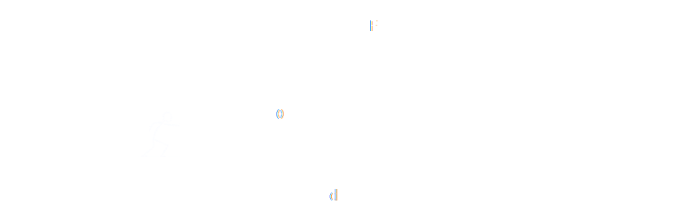
			- ^^For a varying force^^, work is defined as:
				- $$W = \int_{r_1}^{r_2} \vec{F} \cdot d\vec{r}$$
					- If the curve of force as a function of $x$ is given for a force along the motion, the area under the curve is the work done by the force
			- The SI unit of work is the **joule** $1 J = 1 \text{ N} \cdot \text{m}$
			- **Mechanical Work Sign**
				- Work is a scalar quantity and can be either positive, negative or zero
					- If the applied force $F$ (and the displacement $d$ are in the ^^same direction^^, work is ^^positive^^)
					- If $F$ and $d$ are in the ^^opposite direction^^, work done is ^^negative^^
					- Work is ^^zero^^ if either ^^displacement is zero^^ or $\theta = 90^\circ$
				- 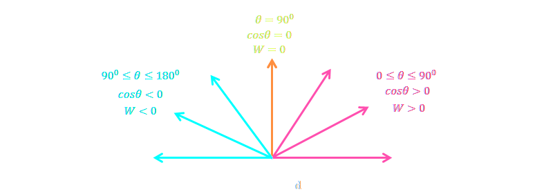{:height 249, :width 657}
			- Example:
			  background-color:: blue
				- Which one the four forces does the most negative work on a particle that undergoes a displacement of $\Delta \vec{r}$
					- 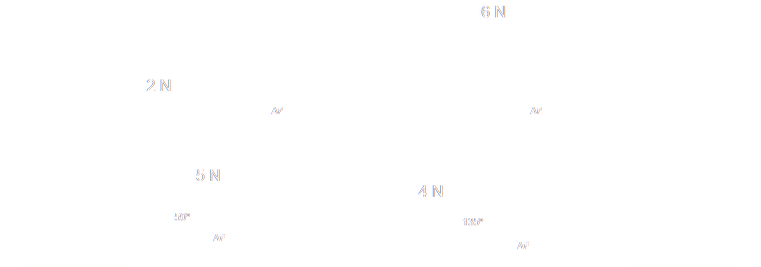
				- A $20 \text{kg}$ wagon rests on an inclined plane with angle $30^\circ$. The wagon is pulled up the inclined plane by a $200 \text{N}$ tension force along the plane and is displaced by $2 \text{m}$ . The coefficient of kinetic friction between the surfaces is $0.3$. What is the net work done on this box? (Hint: You can find the net work by finding the work done on it by all the forces acting on it)
		- ### Work-Energy Theorem
			- An object moves with velocity $v$ has **kinetic energy** calculated by
				- $$K = \frac{1}{2}mv^2$$
				- Kinetic energy is a scalar quantity and measured in joules
			- **Work-Energy Theorem**
				- The ^^work done by all forces^^ acting on a body is equal to the **change in the body's kinetic energy**
					- $$W_{net} = \Delta K = \frac{1}{2} mv^2_f - \frac{1}{2}mv_i^2$$
				- If $W > 0$ net force speeds up the object, while $W < 0$ slows down the object
			- Example:
			  background-color:: blue
				- A 200-kg load is lifted 20.0 m vertically with an acceleration a = 0.160g by a single cable. Determine
					- (a) the tension in the cable,
					- (b) the net work done on the load,
					- (c) the work done by the cable on the load,
					- (d) the work done by gravity on the load, and
					- (e) the final speed of the load assuming it started from rest
		- ### Conservative vs. Non-Conservative Forces
			- Two types of work coming from different forces
				- **Conservative forces** perform work that ^^do not depend on the path^^ taken (gravity, spring force)
					- The energy is converted into potential energy
					- ^^Path independent^^
				- **Nonconservative forces** perform work that ^^depends on the path^^(friction)
					- The energy is dissipated by heat or sound
					- Any non-zero nonconservative work **will change the mechanical energy**
					- ^^Path dependent^^
			- **Conservative Forces and Potential Energy**
				- Work done by any ^^conservative forces^^ is proportional to the **change in the potential energy** associated with that force:
					- $$W_c = - \Delta U$$
				- **Potential energy** is a type of energy which is stored inside the ojbect and can be converted into other energies such as kinetic energy
					- Potential energy is usually shows by $U, PE$ or $U_p$
						- Gravitational Potential Energy (Earth): $\Delta U_g = mg\Delta y$
						- Gravitational Potential Energy (Any Planet): $\Delta U_g = -G \frac{m_1 m_2}{r^2}$
						- Spring Potential Energy: $U_s = \frac{1}{2}kx^2$
					- A conservative force is always toward the points with lower potential energies
					- If work is done by only conservative forces, then the mechanical energy of the system is conserved
				- **Potential energy** can also be described as the
					- $$\Delta U = - \int_{r_1}^{r^2} \vec{F}_c \cdot \vec{d}r$$ and as a differential equation
						- $$\vec{F}_c = -\frac{dU_p}{\vec{dr}}$$
		- ### Power
			- **Power** is defined as the rate of energy generation or consumption or the rate of whcih work is done
				- The SI Unit for power is Watts, $1 \text{ W} = 1 \text{ J/s}$
				- $$P = \frac{\Delta E}{\Delta t} \text{ or }  P = \frac{\text{Work}}{\text{Time}}$$
				- Or also written as $P = \vec{F} \cdot \vec{v} = Fv \cos \theta$
			- Example:
				- A bin of wood slabs is raised upwards through a vertical height of $12.0 \text{m}$ at a constant velocity in $4.2$ minutes by a crane with a power input of $30\text{W}$. What is the mass of the wood?
				- A tow car is towing a $900\text{kg}$ car up on a $10^\circ$ hill with constant speed of $36 \text{km/h}$. The hill is sandy and exerts constant friction force of $300 \text{N}$ on the car. How much power does the tow car supply to tow the car? Select the closest answer.
	- ## Conservation of Energy
	  collapsed:: true
		- The total **mechanical energy** of a system is the sum of kinetic and potential energies at a given time
			- $W_{net} = \Delta K$ using Work-Energy Theoren
				- Also for conservative force, $W_c = - \Delta U$, therefore:
				- $$\Delta K = W_{net} = W_c + W_{nc} = - \Delta U + W_{nc}$$
			- Solving for $W_{nc}$,
				- $$W_{nc} = \Delta K + \Delta U = \Delta E$$ where
				- $W_{nc}$ is total work done by non-conservative forces and $\Delta E$ is the total change in mechanical energy
					- If positive, mechanical energy is increased (ex. pulling force)
					- If negative, mechanical energy is decreased (ex. friction)
					- If zero, energy is conserved
				- $$W_{added} + K_i + U_i = K_f + U_f + W_{lost}$$
		- ### Energy Conservation
			- If there **no non-conservative work** and there is ^^no dissipated energy^^, there is ^^no change in energy^^
				- $$\Delta E = 0 \rightarrow \Delta K + \Delta U = 0$$
			- Example:
			  background-color:: blue
				- A car parked on a $32^\circ$ steep hill loses its traction and starts to slide down. It travels $160 \text{m}$ down the hill until it reaches speed of $72 \text{km/h}$. What is the kinetic coefficient of friction between the car and the surface?
					- 
				- A $2 \text{kg}$ block is pushed against a spring with negligible mass and force constant $k= 400 \text{N/m}$, compressing it $0.220 \text{m}$. When the block is released , it moves along a friction-less , horizontal surface and then up a friction-less incline with slope $37^\circ$
					- 
					- (a) What is the speed of the block as it slides along the horizontal surface after having lost the contact with the spring?
					- (b) How far does the block travel up the incline before starting to slide back down?
		-
- # Collisions
	- Goober hours
	  collapsed:: true
		- ### Momentum and Impulse
			- Momentum is the mass in motion
				- Vid
				  collapsed:: true
					- {{video https://www.youtube.com/watch?v=NIVNfI0RN2k}}
				- $p = mv$
			- Impulse is the change of momentum of the particle
				- Magnitude of impluse is equal to the area under the Force-Time curve $F \Delta t$
			- ### Elastic Collisions
				- Momentum and Kinetic Energy are conserved
					- $$m_1v_{1i} + m_2v_{2i} = m_1v_{1f}+ m_2 v_{2f}$$
					- $$\frac{1}{2}m_1v_{1i}^2 +\frac{1}{2} m_2v_{2i}^2 = \frac{1}{2}m_1v_{1f}^2+ \frac{1}{2}m_2 v_{2f}^2$$
					- $$v_{1f} = \Big( \frac{m_1 - m_2}{m_1 + m_2} \Big)v_{1i} + \Big (\frac{2m_2}{m_1+m_2} \Big)v_{2i}$$
					- $$v_{2f} = \Big( \frac{2m_1}{m_1 + m_2} \Big)v_{1i} + \Big (\frac{m_2 - m_1}{m_1+m_2} \Big)v_{2i}$$
				- ### Inelastic Collsion
					- Kinetic energy is not conserved although momentum is still conserved, where the objects stick together
					- $$m_1 v_{1i} = m_2v_{2i} = (m_1 + m_2)v_f$$
			- Vido
				- {{video https://www.youtube.com/watch?v=9YRgHikdcqs}}
		- ## Centre of Mass
		  collapsed:: true
			- The **centre of mass** is the point that moves if all of the mass of the system is concentrated at that point
			  collapsed:: true
				- {{video https://www.youtube.com/watch?v=2uszSnvzBEU}}
			- $$P_{cm} \frac{\sum m_i x_i}{\sum m_i}$$
	- ## Linear Momentum and Impulse
	  collapsed:: true
		- **Linear momentum** is defined as the ^^product of mass and velocity of an object^^
			- Momentum is a vector measured in $\text{kg} \cdot \text{m/s}$
				- $$\vec{P} = m \vec{v}$$
			- If a force is applied to an object, Newton's Second Law
				- $$\vec{F} = \frac{\Delta \vec{P}}{\Delta t}$$
		- **Impulse** is defined as the ^^change in momentum^^ of the object if a ^^constant^^ external force of F is applied to the object
			- $$\vec{J} = \Delta \vec{P} = \vec{F} \Delta t$$
			- For a **net external force which is changing with time**, impulse is defined as:
				- $$\vec{J} = \Delta \vec{P} = \int_{t_i}^{t_f} \vec{F}(t) \ dt$$
		- ^^**Note:**^^
			- If a Force vs Time plot is provided, **Impulse** is the area under the curve
			- When **net external force** is ^^zero^^, momentum remains ^^conservered^^
		- Example:
		  background-color:: blue
			- A soccer player applied an average force of 180 N during a kick. The kick accelerates a 0.45 kg soccer ball from rest to a speed of 18m/s. What is the impulse measured on the ball
				- 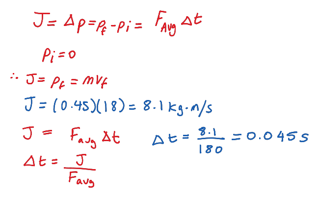{:height 263, :width 423}
			- A 2.5 kg Dodge ball hits the back wall of a school gym at 15 m/s at an angle of 50º to the wall. The ball is in contact with the wall for 0.15s before bouncing back at 12 m/s at an angle of 60º to the wall.  What average force was exerted by the ball on the wall? 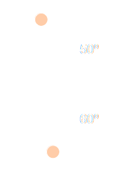{:height 271, :width }
				- 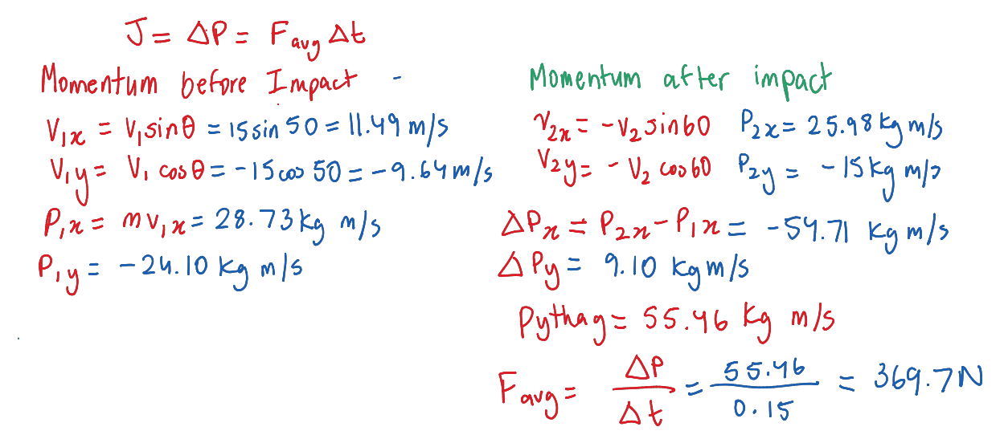
		- A force $F  = (2t^2 -5)N$ is acting on a moving object with mass of 2*kg* in the direction of its motion for 5 seconds. If the initial speed of the particle is 5*m/s.*
			- 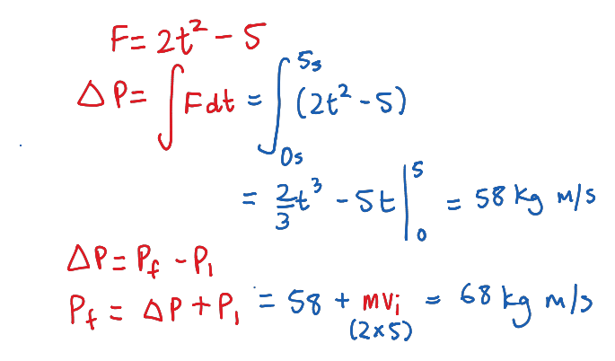
	- ## Conservation of Momentum
	  collapsed:: true
		- **Conservation of momentum** means that the change in momentum (^^impulse^^) is zero
			- $$\Delta \vec{p} = 0 \qquad \rightarrow \qquad \vec{p}_f = \vec{p}_i$$
		- If the **net external force on a system of objects is zero**, the impulse of the system will be zero and the total **momentum of the system remains constant**
		- Note that ^^sum of all internal forces^^ between elemetns of a system should be ^^zero^^ because of Newton's third law
	- ## Collisions
	  collapsed:: true
		- ### **Elastic Collision**
			- In a **perfectly elastic collision**, two objects completely bounce off each other
				- Assume there is ^^no loss of energy^^ in this collision because there is **no deformation**
			- ^^**Note:**^^
				- During this collision, **total momentum** and **total kinetic energy** of the two objects are **conserved**, from before and after the collision
			- **Conservation of Kinetic Energy:**
			  background-color:: green
				- $$\frac{1}{2}m_Av^2_{A1} + \frac{1}{2}m_Bv^2_{B1} = \frac{1}{2}m_Av^2_{A2} + \frac{1}{2}m_Bv^2_{B2}$$
			- **Conservation of Total Momentum**
			  background-color:: green
				- $$m_A\vec{v}_{A1} + m_B\vec{v}_{B1} = m_A\vec{v}_{A2} + m_B\vec{v}_{B2}$$
		- ### **Elastic Collision with One Object Intitially at Rest**
			- It is very commom to have **one of the objects initially at rest**
				- Since we still have elastic collision, both kinetic energy and total momentum are conserved
			- **Equation for One Moving Object**
			  background-color:: green
				- $$v_{A2} = \frac{m_A - m_B}{m_A + m_B} v_{A1}$$
		- ### **Perfectly Inelastic Collision**
			- In a **perfectly inelastic collision**, the two objects ^^stick together^^ after collision
				- The **kinetic energy** is not ^^conserved^^ because part of the energy is lost due to **deformation**
				- **Total momentum** is ^^conserved^^
			- **Kinetic Energy**
			  background-color:: green
				- $$\frac{1}{2}m_Av^2_{A1} + \frac{1}{2}m_Bv^2_{B1} > \frac{1}{2}m_Av^2_{A2} + \frac{1}{2}m_Bv^2_{B2}$$
			- **Conservation of Total Momentum**
				- $$m_A\vec{v}_{A1} + m_B\vec{v}_{B1} = (m_A + m_B)\vec{v}_{2}$$
		- Example:
		  background-color:: blue
			- A 3000 kg truck traveling at 50 km/hr strikes a stationary 1000 kg car, locking the two vehicles together. (a) What is the final velocity of the two vehicles? (b) How much of the initial kinetic energy is lost to the collision?
			- Two carts on a friction less surface collide and stick to each other. What is the velocity of the two carts after collision?
				- 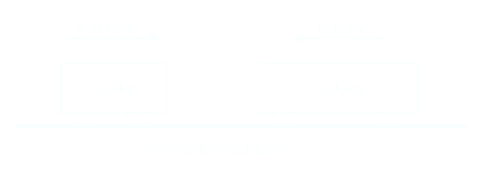
			- A cart with mass 340 g moving on a frictionless linear air track at an initial speed of 1.2 m/s undergoes an elastic collision with an initially stationary cart of unknown mass. After the collision, the first cart continues in its original direction at 0.66 m/s.
			- A firework explodes and forms three fragments of equal mass. One fragment travels directly upward at 14 m/s and the second fragment moves at 25 m/s at 25° below the horizontal to the right. Determine the velocity of the third fragment immediately after the explosion.
			- Two objects slide over a frictionless horizontal surface. The first object, m1=5m1​=5 kg, is propelled with a speed of $v_{1i}=4.5 \text{m/s}$ toward the second object, $m_2=2.5\text{kg}$ which is initially at rest. After the collision, both objects have velocities which are directed at $θ=30°$ on either side of the original line of motion of the first object. What are the final speeds of the two objects? Is the collision elastic or inelastic?
		- ### Shell Explosion
			- **Momentum Conservation in the Centre of Mass Frame**
				- The centre of mass behaves as if it were a **single particle of combined mass** $M$ located at an imaginary point, where that net external foce would be applied
				- Location of centre of mass is where the mass of the entire system would be concentrated
				- The motion of the center of mass depends only on the **net external force** acting on the entire system
				- If there is **no external force**, momentum is conserved
				- If there is **external force**, there will be ^^impulse^^ on the centre of mass
- # Rotational Kinematics and Dynamics
  collapsed:: true
	- ## Dynamics of Rotational Motion
	  collapsed:: true
		- ## Torque
			- **Torque** is simply tendency of rotation
			- It is a rotational equivalent of force defined as
				- $$\tau = |\vec{r} \times \vec{F}| = rF \sin \theta$$ where
					- $r$ is the magnitude of vector $\vec{r}$ which is deifned from **centre of rotation** (^^ref. point^^) to **point of exertion of force** (^^point of action^^)
					- $\theta$ is the angle
			- Forces that cause NO torque are
				- Parallel to axis of rotation $(\sin \theta = 0)$
				- Acting at centre of rotation $(r=0)$
			- Example:
				- You and your friend are trying to push open a gate that has a single hinge on one side. The gate starts opening if you apply a force of 60N perpendicular to the gate, at a point that is 60cm horizontally away from the hinge, parallel to the ground. If your friend is only able to push the gate with a force of 40N perpendicular to the door, where should they apply the force in order to open the gate?
				- Seven forces are applied to a beam supported at the center as shown. Rank the torques produced by each force about the hinge from greatest to least, labeling the forces from 1-7 starting left to right (2F forces make an angle of 45 °45 °respect to the beam)
					- 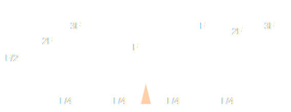{:height 206, :width 523}
		- ## Rotational Kinematics
			- The parameters describing the translational motion have an analogue in rotational mtion
				- **Kinematic Equations for Rotational Motion**
				  background-color:: green
					- $$\theta_f = \frac{1}{2}\alpha t^2 + \omega_i t + \theta_i$$
					- $$\omega_f = \alpha t + \omega_i$$
					- $$\omega_f^2 - \omega_i^2 = 2 \alpha \Delta \theta$$
					- $$\frac{1}{2} (\omega_f + \omega_i)t = \Delta \theta$$
				- ^^**Note:**^^ For **uniform circular motion**, $\alpha - 0$
			- Example:
			  background-color:: blue
				- A flywheel turns through 60 revolutions as it slows from an angular speed of 2 rad/s to a stop.
					- Assuming a constant angular acceleration, find the time for it to come to rest.
					- What is its angular acceleration?
					- How much time is required for it to complete the first 20 of the 60 revolutions
		- ## Moment of Inertia
			- ### Moment of Inertia of Discrete partices
				- The **moment of inertia** of an object is a measure of the ^^resistance^^ of the object to ^^changes^^ in **rotational motion**
					- The quanity shows how the mass of an object is distributeed about its *axis of rotation*
				- For point masses $m_i$ at distances $r_i$ from axis of rotation, the moment of inertia is
					- $$I = \sum m_i \cdot r_i^2$$
						- with units $\text{kg} \cdot \text{m}^2$
				- ^^**Note:**^^ The value of $I$ changes if the axis of rotation changes
			- ### Moment of Inertia of Objects with a Continuous Mass
				- When there is an extended object with a **continuous mass distribution**, the the moment of inertia can be found with:
					- $$I = \int r^2 \ dm$$
			- Example:
			  background-color:: blue
				- Calculate the moment of inertia of a rotating disk with radius of R and mass M about an axis which is passing through its center and it is perpendicular to the disc.
		- ## Parallel Axis Theorem
			- If the object is rotating about an unknown axis, **Parallel Axis Theorem** to calculate the moment of inertia about this new axis
			- If we know that the moment of inertia about an axis that extends through the body's **centre of mass** $(I_{COM})$, the moment of inertia about an axis that is ^^parallel^^ to this axis is
				- $$I = I_{COM} + M \cdot h^2$$
				- where $h$ is the **distance between the axes** and the $M$ is the total mass of the object
					- 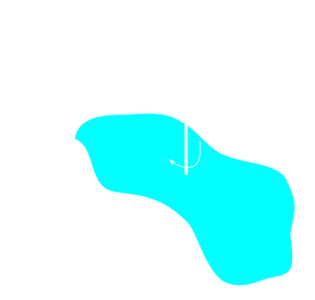
			- ### Moment of Inertia in Composite Shapes
				- For **composite shapes**, you can use the moment of inertia of their sub-components to the moment of inertia, as long as you are **careful with the axis of rotation** for each ^^sub-component^^
			- Example:
				- Tom and Jerry decide to build a snowmen at the edge of a cliff.  The snowman consists of three spheres with radii 90 cm, 60 cm and 30 cm, and the density of snow is $300\text{kg/m}^3$.  They fight and Tom pushes the snowman over the cliff.  The snowman begins to rotate around its center of mass as it falls.  What is the moment of inertia of the snowman as it’s falling?
					- For a solid sphere, $I_{cm} = \frac{2}{5} MR^2$ and $V = \frac{4}{3}\pi R^3$
						- 
				- Two thin Hoops each of mass M and radius of R are joined together as shown in the figure. What is the moment of inertia for rotations in the plane of the page about pint *O*?
				- (The moment of inertia of a hoop with mass M and Radius R about an axis perpendicular to it and passing through its center is equal to $MR^2$)\
					- 
		- ## Rotational Analog of Newton's Second Law
			- Torque is the rotational analog for force
			- When torque is applied, the angular acceleration changes
				- This change is given by **Newton's Second Law for rotations**:
					- $$\sum \tau = I \cdot \alpha$$
					- where $\alpha$ is in $\text{rad/s}^2$
			- Example:
			  background-color:: blue
				- A thin uniform rod (length=1m, mass = 5kg) is pivoted about a horizontal, frictionless pin through one end of the rod. The rod is released when it makes an angle of 60° above the horizontal. What is the angular acceleration of the rod at the instant it is released? (The moment of inertia of a rod with length of L and mass of m about one of its ends is $I = \frac{1}{3} mL^2$)
					- 
				- A 10 kg mass is hanging from a rope wrapped around a cylindrical pulley. The falling mass causes the pulley to rotate. The mass of the pulley is 3 kg.  (The moment of inertia of a solid cylinder with radius R and mass of M about its axis of symmetry is $I = \frac{1}{2}MR^2$
		- ## Rotational Kinetic Energy
			- When an object is rotating, we have **rotational kinetic energy** from all the mass elements rotating
				- $$K = \frac{1}{2} I \cdot \omega^2$$
				- The kinetic energy of a rigid body with **both translation and rotation**
					- $$K = \frac{1}{2}I \omega^2 + \frac{1}{2}Mv^2_{cm}$$
			- ### Conservation of Energy
				- Similar to translational motion, if there is no friction or other non-conservative forces, total mechanical energy is conserved
			- Example:
			  background-color:: blue
				- A stone with a mass of 9.5kg is hung vertically from the end of a rope that is wound around a pulley on a boat. The moment of inertia of the pulley is 0.47kg $\text{m}^2$ and the radius is 0.25m. The stone is released from rest and falls toward the water, causing the pulley to rotate. After the stone has fallen 2.5 m, what is the angular velocity of the pulley? (Mass of the rope is negligible)
				- A thin rod with mass of M and length of L is hinged to the wall at one end. The rod is held horizontally and then released. What is the speed of the tip of the rod as it hits the wall? Assume the hinge is frictionless. The moment of inertia for a thin rod about one of its ends is $\frac{1}{3}ML^2$
		- ## Rotational Work and Torque
			- When torque is applied to an object, work is beign performed
				- Work done by a torque caused by a force which is along the angular displacement is:
					- $$W = \tau (\theta_f - \theta_i)$$
				- or integral
					- $$W = \int \vec{\tau} \cdot d\vec{\theta}$$
				- If the force is opposite the direction of angular displacement, then the torque is doing negative work; if in the same direction, then positive work
			- Example:
			  background-color:: blue
				- A wheel whose rotational inertia is 10 $\text{kg} \cdot \text{m}^2$  starts from rest and accelerates under a constant torque of 3.0 $\text{N} \cdot \text{m}$ for 8.0 seconds. What is the wheel's rotational kinetic energy at the end of the 8 seconds?
		- ## Rolling Motion
			- Roling without slipping is a combination of two mtions
				- A ^^translational motion^^ of the centre of the mass with the velocity:
					- $$v_{cm} = R \cdot \omega$$
				- A ^^rotational motion^^ of all points on the object
			- In rolling without slipping, the **point of contact** is instananeously at rest
				- All points of the rolling object are rotating about this point of contact
				- 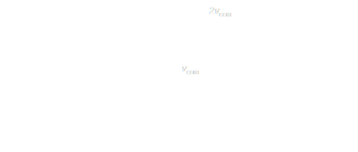
			- The rolling without slipping motion is usually caused by the static friction between the point of contact and surface
			- For rolling without slipping:
			  background-color:: green
				- $v_{cm} = R \omega$
				- $a_{cm} = R \alpha$
				- $d_{cm} = R \theta$
				- Since a rolling object has **both translational and rotational motion**, the total kinetic energy for an object rolling without slipping is:
					- $$K =  \frac{1}{2}mv^2 + \frac{1}{2}I_{cm} \omega^2 $$
					- First term is translational kinetic energy of centre of mass, and second is rotational kinetic energy of the object
			- Example:
			  background-color:: blue
				- Show that the friction for a round object of radius R rolling (without slipping) down an incline of angle $\theta$ has magnitude given by
					- $$f = \frac{mg \sin \theta}{1+ \frac{mR^2}{I}}$$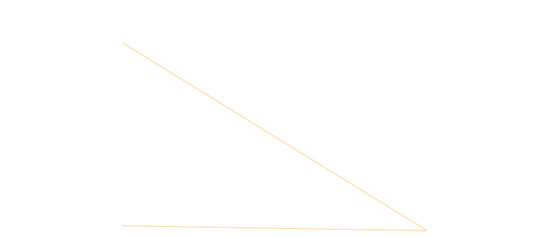{:height 226, :width 429} $\\$ Let clockwise rotation be positive, and let the x and y directions be along the slope and perpendicular to the slope. Positive is up for y, and downward along the slope for x.
				- A marble starts from rest and rolls without slipping on the loop-the-loop track in the figure. Find the minimum starting height h from which the ball will remain on the track throughout the loop. Assume the marble's radius is small compared with R. The moment of inertia for a solid sphere is $\frac{2}{5}Mr^2$ Enter your answer by using R = 70 cm (radius of the loop) and r = 1.0 cm (radius of the marble). Your answer should be in meters with three significant figures
					- 
		- ## Angular Momentum
			- **Angular momentum** is a vector the cross product of position vector and momentum vector
				- $$\vec{L} = \vec{r} \times \vec{P}$$
			- **Magnitude** of this vector is equivalent to $|\vec{L}| = |\vec{r}||\vec{p}| \sin \theta$
			- For rigid bodies rotating around an axis with angular frequency $\omega$, the magnitude of angular momentum in analogy to  linear momentum can be represented by
				- $$L  = I \omega$$
			- ### Angular Momentum and Torque
				- $$\vec{\tau} =  \vec{r} \times \vec{F} =  \vec{r} \times \frac{\vec{dP}}{dt} = \frac{\vec{dL}}{dt}$$
				- If the **net externl torque** about an axis acting on a rotating body is **zero**, the **angular momentum about the same axis remains constant**
					- $$L_f = L_i$$
			- Example:
			  background-color:: blue
				- An object of mass $m$ and speed $v_0$ strikes a bob pendulum with mass $M$ and length of $l$ which is hanging from the ceiling and sticks to it and they both move (oscillate) to the right. Find the size and direction of the angular momentum with respect to where the rope is attached to the ceiling .
				- In an isolated system, the moment of inertia of a rotating object is halved. What happens to the angular velocity of the object?
				- You're sitting on a rotating stool, initially rotating at 3.0 radians per second. You're holding a 5.0 kg dumbbell very close to you, 0.05 meters away from your center of rotation. You then extend your arms 1.0 meters away from you with the dumbbell. The moment of inertia of you and the stool is 4.0 $\text{kg} \cdot \text{m}^2$. Neglect the mass of your arms and any rotational friction in the seat. What is your new angular velocity?
	- ## Periodic Motion
		- ### Basic Concepts of Oscillation
			- **Simple Harmonic Motion** (SHM) is a type of periodic motion in which
				- The restoring force is ^^proportional to the displacement from the equilibrium position^^
				- The force direction is ^^opposite to that of displacement^^
					- $$F = - kx$$
				- Any physical system with the above type of the force undergoes a Simple Harmonic Motion
			- The **mathematical description** of SHM is a sinusoidal function of time:
				- $$x(t) = A \cos (\omega t + \varphi )$$
			- These are the parameters we use to describe a simple harmonic motion
				- **Amplitude (A)**
					- The maximum displacement of the object from the equilibrium
				- **Period(T)**
					- The time it takes for one complete oscillation (Period is measured in seconds)
						- $$T = \frac{\text{Total time}}{\text{Number of cycles}}$$
				- **Frequency (f)**
					- The number of oscillations per unit of time (Frequency is measured in Hertz (1$\text{Hz}$ = $\frac{1}{s}$)
						- $$f = \frac{1}{T}$$
				- **Angular Frequency (**$\omega$**)**
					- The rate at which argument of sinusoidal function describing oscillation changes in time (Angular frequency is measured in $\text{rad/s}$)
						- $$\omega = 2 \pi f = \frac{2 \pi}{T}$$
				- **Phase Constant (**$\varphi$**)**
					- A term which determines the initial condition of oscillation (phase constant is measured in $\text{rad}$)
					- Phase constant causes a shift in the oscillating function which changes the starting point of oscillation:
						- 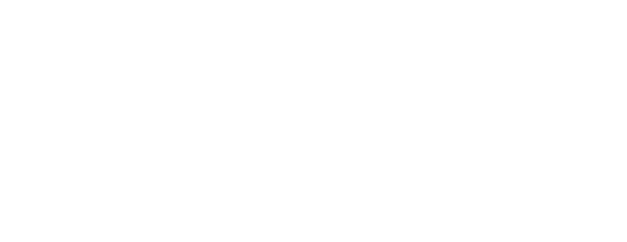
					- To calculate the **phase constant** $\varphi$, we need to solve this equation
						- $$x(t=0) = A \cos (\varphi) \rightarrow \varphi = \cos^{-1} \Big( \frac{x(0)}{A}\Big)$$
						- Solving the equation for the phase constant will give two answers between $0$ and $2\pi$:
							- $\varphi = 0$ or $2 \pi - \theta$, $0 \le \theta < \pi$
					- Use the inormation at **time equal to zero** to find two possible soltuions for the phase constant by using the above equations
					- Use the **slope of tangent line** to the curve at the same moment to pick the right angle
						- Example:
							- The velocity $\text{cm/s}$ vs. time $s$ of a mass-spring on a SHM is shown in the graph
								- Find the equation representing position against time, and draw that graph
								- 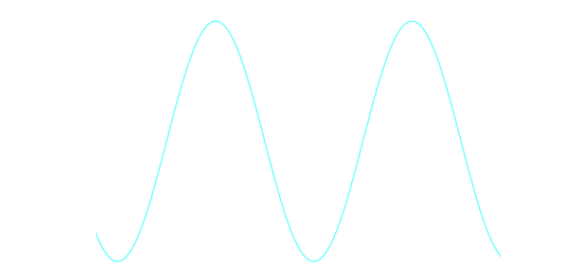
							- The displacement graph of a simple harmonic motion over time is shown below
								- Write the equation for displacement as a function of time
									- 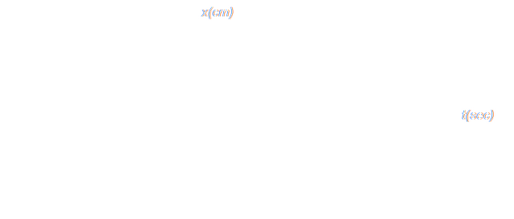
			- Example:
			  background-color:: blue
				- A girl on a swing is pushed such that she oscillates with a frequency of $2.3 \text{ Hz}$ and an amplitude of $1.7 \text{ m}$. (Mass of the girl is $60\text{ kg}$)
					- Write an equation (position as a function of time) to describe the motion of the girl on the swing assuming that she starts at amplitude
		- ### Velocity and Acceleration
			- Displacement of an oscillator with respect to the equilibrium position is found by $x(t) = A \cos (\omega t + \varphi )$
				- 
			- **Velocity**
				- The **velocity of an oscillator** can be found by taking the derivative of displacement with respect to time
					- $$v(t) = \frac{dx}{dt} = -A \omega \sin (\omega t + \varphi)$$
						- 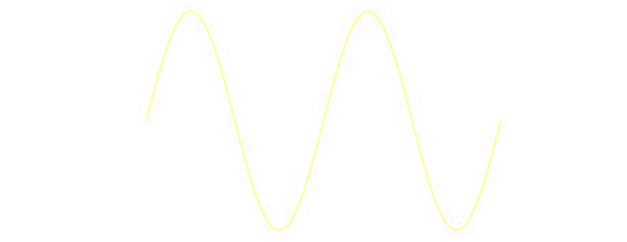
					- Velocity of an oscillator is an oscillating function with the **same period** as $x(t)$
					- Velocity is changing in $-A \omega \le v(t) \le + A\omega$
			- **Acceleration**
				- The **acceleration of an oscillator** can be found by taking the derivative of velocity with respect to time
					- $$a(t) = \frac{dv}{dt} = - A \omega^2 \cos (\omega t + \varphi)$$
					- 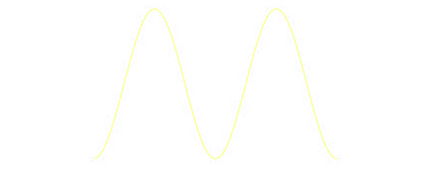
				- Accleration of an oscillator is an oscillating function with **same period** as $x(t)$ and $v(t)$
				- Acceleration is changing in $-A \omega^2 \le a(t) \le +A \omega^2$$
			- Using $a(t) = - \omega^2 x(t)$ one can find the relation between displacement and acceleration
			- #### Relation Between $\omega$ and $k$
				- A force in the form of $F = - ksx$ undergoes simple harmonic motion, where $k$ is a constant dependent on the physical properties of the system
				- By looking at Newton's Second Law, one can find the relation between the constant $k$ and angular frequency of oscillation $\omega$
					- $$\omega = \sqrt{\frac{k}{m}}$$
			- Example:
			  background-color:: blue
				- A harmonic oscillator's motion is described by the following graph
					- 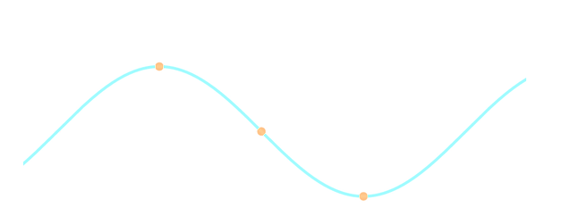
					- Which of the following statement is correct about the acceleration (NOT the magnitude) of the oscillator?
				- The position of an oscillating mass in a simple pendulum is given as: $x(t)=3.56\ cos(12t+\pi)$
					- What is the maximum velocity of the mass
					- What is the velocity of the mass at $t=0\text{s}$
					- What is the acceleration at $t = 2 \text{s}$
		- ### SHM as the Projection of Uniform Circular Motion
			- The moition of an oscillator undergoing as simple harmonic motion could be mapped to a **uniform circular motion**
				- 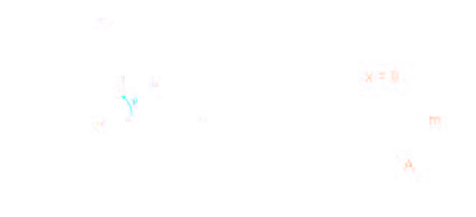
					- Angle $\theta$ is to be equal to $\omega t$ where $\omega$ is the angular frequency of SHM
					- When time passes, $\omega t$ gets larger, so the point on the circle corresponds to the angle rotating in a counter-clockwise direction
				- Trignometric realtions for the triangle at any moment can by shown by:
					- $$x(t) = \cos \theta = \cos(\omega t)$$
					- $$y(t) = \sin(\omega t)$$
				- Since both SHM and uniform circular motion over the above circle are described by the same equation, we can describe SHM as a projection of circular motion over $x$ or $y$ axis
				- Example:
				  background-color:: blue
					- The image below shows the coordinates of a particle moving around a circle at  $t=0$, as well as the direction of motion. Find the equation of its position $x$ as a $\cos$ function. Then find the velocity and acceleration equations as well.
						- 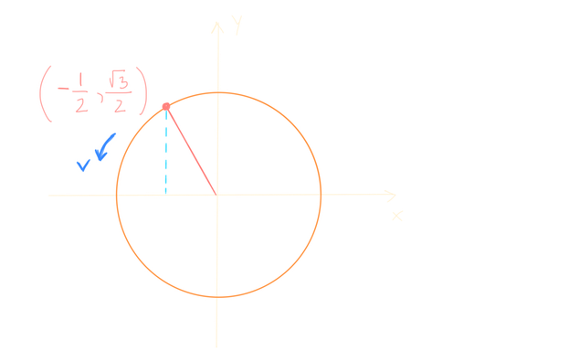
					- The image below shows the coordinates of a particle moving around a circle at  $t=0$, as well as the direction of motion. Find the equation of its position $y$ as a $\sin$ function. Then find the velocity and acceleration equations as well.
						- 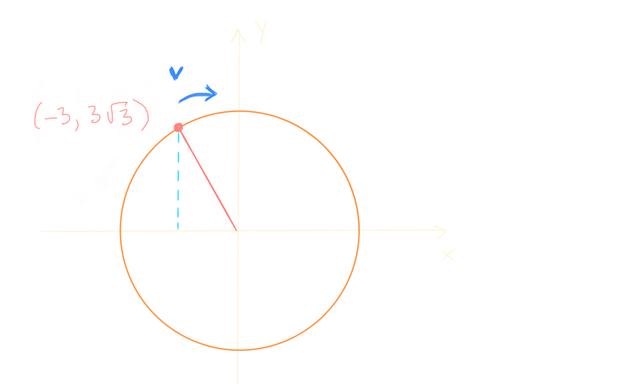
		- ### Energy of an Oscillator
			- There are two different types of energies related to an oscillation:
				- The **kinetic energy** is the energy of a moving object
					- $K = \frac{1}{2}mv^2$
				- The **potential energy** is the energy stored in the oscillation
					- For mass and spring oscillation, it is a potential energy stored inside of the spring due to stretch or compression in the length of the spring
						- $$U = \frac{1}{2}kx^2$$
			- The **total energy** of the system at any time during SHM is the sum of kinetic energy and potential energy and is ^^constant^^ because of the ^^conservation of energy^^
				- $$E = K + U = \text{constant}$$
			- **How to Find Total Energy of an Oscillator**
				- The total energy of the oscillator can be found using
					- The definition, if the **position and velocity of the oscillator  is known at any moment**
						- $$E = \frac{1}{2}m(v(t))^2 + \frac{1}{2}k(x(t))^2$$
					- Looking at **equilibrium point**
						- At equilibrium, $x = 0, v = v_{max}$
							- $$E = K + U = \frac{1}{2}mv_{max}^2+0$$
							- $$E = \frac{1}{2}mA^2\omega^2$$
					- Looking at **turning points**
						- At turning points, $x = \pm A, v = 0$
							- $$E = K + U = 0 + \frac{1}{2}kA^2$$
							- $$E = \frac{1}{2}kA^2$$
				- $$\frac{1}{2} kA^2 = \frac{1}{2}kx^2 + \frac{1}{2}mv^2$$
				- Example:
					- A block of unknown mass $m$ is attached to a horizontal spring which has a spring constant $k=4.8 \text{Nm}$. It is then set oscillating on a frictionless surface with an amplitude of $A= 12 \text{cm}$. It takes $0.5s$ for the block to complete one full cycle of oscillation. Calculate
						- The mass $m$
						- The maximum acceleration $a_{max}$
						- The total energy of the system
						- At which point(s) the kinetic energy of the mass is $\frac{1}{3}$ of the total energy of the system
					- A simple mass $m$ on a spring with spring constant $k$ oscillates about its equilibrium with amplitude $A$. If the energy of the system suddenly decreases to half of the initial value, what will be the mass' new maximum speed?
		- ### Vertical Springs
			- The main difference between a horizontal spring and a **vertical spring** is that force of gravity is along the oscillation and can affect it
			- If a mass $M$ is attached to a vertical spring and then slowly lowered to stop in a lower position, the string is stretched by
				- $$\Delta x = \frac{Mg}{k}$$
				- Changing the mass attached to a vertical spring (adding or removing a mass) shifts the position of equilibrium
				- **Any oscillation (SHM) now would be around the new equilibrium position**
			- Example:
			  background-color:: blue
				- A spring with $k=50 \frac{\text{N}}{\text{m}}$ ​and length of $10 \text{cm}$ is hanging from the ceiling (the spring is massless). If we attach a $50 \text{g}$  mass to the spring and then let it fall down:
					- a) What is the amplitude of oscillation?
					- b) What is the lowest position of the mass from the ceiling?
					- c) What is the phase constant of this oscillation?
					- d) What is the period of oscillation?
				- The springs $A$, $B$ and $C$ have the same initial length. If $k_A=k_C=0.5k_B$ ​.Different masses are added to them and they have extended to their new equilibrium position
					- 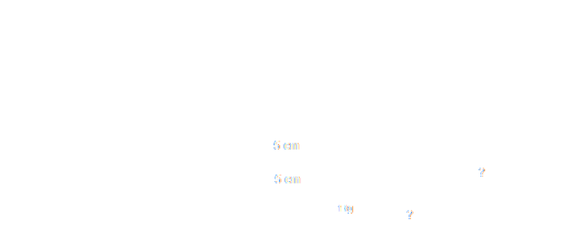
					- Find the values of $m_B, m_C$ respectively (Use $g = 10 \text{m/s}^2$)
					- Rank period of oscillation
				- A mass of $200\text{g}$ is attached to a free vertical spring with $k=5 \text{N/m}$ and natural length of $20\text{cm}$ and is set to oscillate with an initial downward velocity of $2\text{m/s}$ at the moment of attachment. Find the amplitude of this oscillation.
		- ### Simple Pendulums
			- **Simple pendulums** are pendulums for which the mass attached to the string is considered a point
				- The motion of these pendulums could be described as simple harmonic moiton
			- The driving force acting on the mass is $mg \sin \theta$ and since it is **restoring** (always pushes the mass toward equilibrium which is the lowest point), we have
				- $$F_{\theta} = - mg \sin \theta$$
					- For small $\theta, F_{\theta} = - mg\theta$
				- The distance travelled by the mass is the arc length corresponding to the angle $\theta$, and $l$, the length of the pendulum
					- $$x = l \theta$$
					- id:: 660f37e1-8f24-48b9-ae01-72ba8ce622c1
					  $$F_{\theta} = - \frac{mg}{l}x$$
			- By comparing with the general form of SHM forces the **effective spring constant** for a simple pendulum is:
				- $$\omega = \sqrt{\frac{g}{l}}$$
			- Example:
			  background-color:: blue
				- A simple pendulum is set to oscillate with an amplitude of $21 \text{cm}$. If it oscillates with a frequency of $0.50 \text{Hz}$, determine the length of the pendulum and its average speed.
				- You pull a simple pendulum to the side and release the mass at an angle of $2.23°$
					- If the length of the pendulum is $25 \text{cm}$, how much time does it take the mass to reach its highest speed?
					- What is the maximum height of the mass attached to the pendulum respect to its lowest position?
		- ### Physical Pendulums
			- If the mass is not concentrated at the lower part of the object, it can oscillate around its **pivot point**
				- This oscillation for small angles can be described by simple harmonic motion, where for this oscillation:
					- $$\theta (t) = \theta_{max} \cos (\omega t + \phi_0)$$
					- where
						- $$\omega = \sqrt{\frac{Mgl}{I}}$$
						- $I$ is the moment of inertia around the pivot point, and $l$ is the distance between pivot and centre of mass of object
			- Example:
			  background-color:: blue
				- A rod with length of $20 \text{cm}$ and the mass of $0.5\text{kg}$ is hanging from one end of it and it is set oscillating. The mass distribution along the rod is uniform and the moment of inertia for a uniform rod of length d respect to one end of it is $\frac{1}{3}Md^2$. Find the time it takes for this physical pendulum to go from maximum displacement to minimum displacement.
		- ### Underdamped Oscillations
			- **Damped Oscillation Theory**
				- In real systems, there are always **resistive forces** that oppose oscillation
					- These resistive forces cause the ^^total energy of the system to decay^^
				- A type of these resistive forces is proportional to the speed of the oscillator and is shown by
					- $$F_{resistive} = - bv$$
					- Net force acting on the oscillator is equal to $F = -kx - bv = ma$ the solution for dependent on the magnitude of the damping constant
				- Only will observe oscillations **only** for relatively small damping constants
					- This condition is known as **underdamped condition** and the oscillation in this case is known as **damped oscillation**
			- **Energy in a Damped Oscillation**
				- Energy is no longer conserved in a damped oscillation
					- The ^^total energy of the system^^ could still be obtained by
						- $$E(t) = \frac{1}{2}kA^2(t) = \frac{1}{2}kA^2_o e^{-\frac{bt}{m}}$$
			- Example:
			  background-color:: blue
				- A $0.3 \text{kg}$ mass undergoes a damped oscillation with the damping constant $5 \frac{\text{kg}}{\text{s}}$​. How long does it take for the amplitude and total energy of the oscillation to be $\frac{1}{4}$ ​of their initial values?
				- A $50 \text{kg}$ person taking a bungee jump
					- If the initial length of the bungee cord is 20 $m$ and at the lowest point the length of the cord is $25 \text{m}$, what is the spring constant of the cord
					- After the jump, the person is experiencing a damping oscillation. What is the damping constant if the amplitude of its oscillation reduces to $\frac{1}{5}$ of its original amplitude after $20 \text{s}$?
					- How many full oscillations does the person experience in this $20 \text{s}$?
		- ### Critical Damping and Over-Damping Conditions
			- **Critically Damping Condition**
				- In underdamped condtions, the oscillation decays faster at $b$
					- At a very special point $\omega_o = \frac{b}{2m}$, there would be no oscillation anymore
					- This is called **critical damping condition**
						- In this condition, $\omega' = 0$, so $x(t) = A^2_o e^{-\frac{bt}{m}} \cos \varphi$
						- There is no oscillation and the displacement decays to zero exponentially
						- 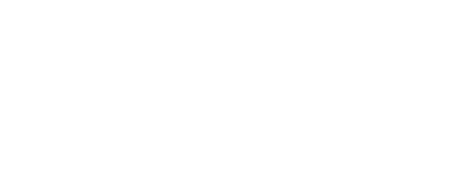
					- The system has critical damping condition if $b = 2m\omega_o = 2 \sqrt{km}$
			- **Overdamping Condition**
				- The system would be in **overdamping condition** when
					- $$\frac{b}{2m} > \omega_o$$
				- There is again no oscillation in overdamped condition
				- $x(t)$ decays to zero at a **slower rate** compared to a critically damped condition
				- The bigger the value of the damping constant, the slower $x(t)$ goes to zero
		- ### Forced Oscillation and Resonance
			- The decaying energy of a damped oscillation could be restored by applying a **driving force**
			- This type of oscillation is know as ^^forced or driven osciilation^^
			- Force is periodic in the form,
				- $$F_d = F_o \cos(\omega_d t)$$
					- where $\omega_d$ is the **driven angular frequency**, at which the force is exterted
				- ^^**Note:**^^ In driven or forced oscillation, the system oscillates with the driven angular frequency
			- The amplitude of a driven oscillation is found to be proportional to:
				- $$A \propto \frac{1}{\sqrt{(\omega_o^2 - \omega_d^2)^2 + (\frac{b\omega_d}{m})^2}}$$
				- If $\omega_d$ is close to $\omega_o = \sqrt{\frac{k}{m}}$ the amplitude becomes very large
			- The condition in which $\omega_O = \omega_d$ is called **resonance** and it is where the amplitude gets its maximum value
			- Example:
			  background-color:: blue
				- A simple pendulum with the length of $20 \text{cm}$ undergoes a damped oscillation with $b = 2 \frac{\text{kg}}{\text{s}}$ How many times per second you need to tap the pendulum at its left most position in order to get the maximum amplitude of the oscillation? (Hint: The natural frequency of a pendulum is equal to $ω_0=\sqrt{g/l}$ where $l$ is the length of the pendulum.)
- # Electrostatics
	- Goober Hours (does have videos)
	  collapsed:: true
		- ### Electric Charge
			- Carried by certain subatomic particles (protons, newtons)
			- The fundamental charge is $\pm1.602 \times 10^-{19} \text{C}$ (all charges are multiples of this)
		- ### Coulombs Law
		  collapsed:: true
			- Opposite charges attract because of the **electric force**
			- **Point charge** refers to a particle of zero size thtat carries an electric charge
			- #### Coulombs Law
				- $$F = k \frac{q_1 q_2}{r^2}$$
					- where $k = 8.99 \times 10^9 \text{N m}^2 / \text{C}^2$
				- The magnitude of electric force between two objects is equal to the constant times the charge on the objects divided by the distance between (squared)
				- Electric force increases as charge increases
		- ### Electric Fields
		  collapsed:: true
			- The electric force arises from an electric field
			- Region of space around a charged object
			- When another charged object enters the electric field, an electric force acts on it
			- #### Electric Field
				- $$E = K_c \frac{q}{r^2}$$
					- Constant times charge divided by distance from some object generating field to other object
			- **Electric dipole** on two charges equal in magnitude, but opposite in sign
			- {{video https://www.youtube.com/watch?v=PSlnlXjaHA4}}
				- $$E = k_e \frac{2 qa}{(y^2 + a^2)^{3/2}}$$
			- {{https://www.youtube.com/watch?v=Mt9Rn2Ek0SU&t=282s}}
		- ### Electric Flux
		  collapsed:: true
			- The rate of flow of the electric field through a given surface (vid)
				- {{video https://www.youtube.com/watch?v=yOv4xxopQFQ&t=393s}}
			- The product of magnitude of the electric field adn the surface area $A$, perpendicular to the field
				- Electric Flux through open surface
					- $\phi_E = EA\cos\theta$
				- Electric Flux through closed surface
					- $\phi = \int \vec{E} \cdot d\vec{A}$
		- ### Gauss's Law
		  collapsed:: true
			- The electric flux going through a closed surface, is the sum of all charges Q inside the closed surface divided by permitivity of free space $E_0$
			- $$\phi_e = \frac{q}{\varepsilon_0}$$
			-
			-
	- ## Electric Fields
		- ### Charge, Conductors, Insulators
			- **Properties of Charge**
				- There are two types of charges, ^^positive (+)^^ and ^^negative (-)^^
				- Charges with the **same sign repel** each other, while **opposite charges attract**
				- Charges is measured in units of **Coulombs**
					- Often found in $\mu C = 1 \times 10^{-6} C$ or $n C = 1 \times 10^{-9} C$
				- The total amount of charge in the Universe is constant; charge cannot be created or destroyed
					- This is the fundamental law of nature called the **conservation of charge**
				- Charge is provided by **protons** and **electrons**
					- Protons and electrons possess the smallest amount of charge possible, called the ^^fundamental charge^^
						- $$e = 1.6021892 x 10^{-19}$$
					- Charge cannot be broken down any further than the amount of charge on a proton or an electron
						- Because of this, charge is defined as **quantized**
			- **Condutors**
				- **Conductors** are materials where electrons are not bound to any particular atomic nucleus
					- They are free to move around
				- If a positively charged body is brought close to a condurctor, electrons will flow ^^towards^^ the positive charge, and a negatively charged body will flow ^^away from^^ external negative charge
				- If the charge inside a conductor moves around because of an external charge, there will be a change seperation in the conductor even if the conductor itself is neutral
					- This is **induced charge**
					- 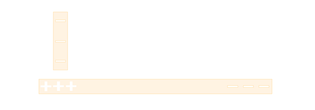
			- **Insulators**
				- **Insulators** are materials where electrons are bound to a specific atomic nucleus
					- The electrons are only able to move small distances or not at all
				- Net charge can be added to insulators by ^^contact(friction)^^
					- When charging by contact, electrons are transferred frm one insulator to the other, leaving one object with a net positive charge and the other with a net negative charge
			- **Semiconductors**
				- **Semiconductors** can be either insulators or conductors, depending on the conditions of the material (heat, or if light is shining)
		- ### Electric Force and Coulombs Law
			- Electric charges interact iwth each other by attraction and repulsion
				- These interactions are caused by **electric force**
			- The ^^magnitude^^ of force between two ^^point charges^^ is given by **Coulomb's Law**:
				- $$F = k \frac{q_1q_2}{r^2_{12}}$$
					- $k$ is the **Coulomb/Electrostatic constant**, $k = 8.99 \times 10^9 \frac{\text{Nm}^2}{C^2}$
			- The coulomb constant can also be defined in term of **vacuum permittivity**, $\epsilon_0$
				- $$k = \frac{1}{4 \pi \epsilon_0}$$
				- $\epsilon_0= 8.85 \times 10^{-12} \frac{C^2}{\text{Nm}^2}$
			- Electrostatic forces between two point charges are **always** equal and opposite, even if the charges have different magnitude
			- Example:
				- Consider two point charges fixed in place, separated by a distance of $10 \text{cm}$. Charge A is a positive charge with magnitude $5 μC$. Charge B is a negative charge of $−10 μC$.
					- a) What is the magnitude of the electrostatic force between the two charges?
					- b) Is the electrostatic force between the two charges attractive or repulsive?
					- c) How does your answer to parts (a) and (b) change if Charge B is positive instead of negative?
					- d) If you change the distance to 20 cm instead of 10 cm, by what factor does the magnitude of the force change?
				- Consider two fixed point charges separated by a fixed distance, each charge exerting an electrostatic force on the other. You want to increase the electrostatic force between the two charges by 75%.
					- a) Assume that you are not able to change the magnitude of the charges, but you are able to adjust the separation between them. By what factor does the distance between the charges need to change in order to increase the force by 75% compared to the original charge separation?
					- b) Assume you are not able to change the separation between the charges, but you are able to adjust the magnitude of one of the charges. By what factor does the magnitude on one of the charges need to change in order to increase the force by 75% compared to the original value?
				- Four charges are arranged in a square with sides of length $2.5 \text{ cm}$. Find the net force on $q_1$ (+x is to the right, and +y is upward)
					- 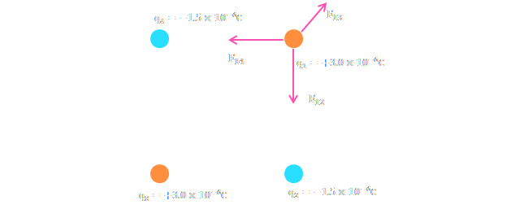
				- Two point charges are located on the x-axis as shown below.
					- {:height 232, :width 562}
					- a) Where should a third charge, $q_3=+8.00 μC$, be placed on the y-axis so that the net force on $q_2$ makes an angle of $+45°$ above the negative x-axis?
					- b) What is the magnitude of the final net force?
		- ### Principle of Superposition
			- **Electric Field Due to Point Charge**
				- At a distance $r$ from a point charge of $Q$, the **magnitude** of the electric field is:
					- $|\vec{E}| = k \frac{Q}{r^2}$
					- The **direction** of the electic friled is along the line connecting the source charge ($Q$) to the point of intereset
					- Electric fields always point ^^away from positive charges^^ and ^^towards negative charges^^
					- $F_E = q \vec{E}$
			- **Principle of Superposition**
				- When there is more than a single point charge present, the net electric field at any point in space is the vector sum of each individual electric field present at that point
					- 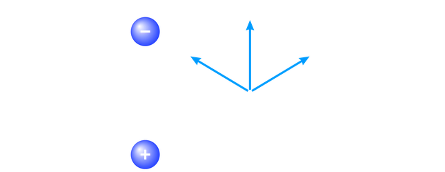{:height 211, :width 473}
				- $$\vec{E}_{tot} = \vec{E}_1 + \vec{E}_2 + \vec{E}_3 + ... = \sum_i \vec{E}_i$$
			- Example:
			  background-color:: blue
				- Two charges are located at the vertices of a triangle, as shown below. Find the net electric field at point A. Define the upward direction as positive y, and positive x points to the right.
					- 
				- 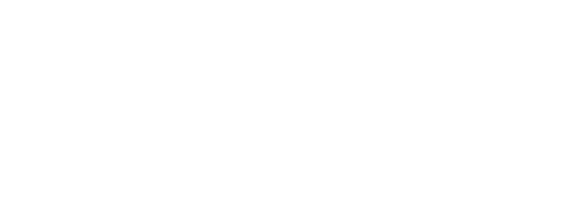
				- a) Find the magnitude of the electric field at point A due to the two point charges shown below.
				- b) Repeat the problem, but replace $q_1$​ with a positive charge of equal magnitude
			- Consider four point charges at the corners of a square, as shown below. Each side of the square has length $d$ and the charges are as shown in the figure
				- {:height 224, :width 655}
				- a) Find an expression for the electric field at some point that is a distance dd out of the page, from the center of the square. That is, the distance from each charge to this point is equal, and the distance in the z-direction is equal to one of the square side lengths
				- b) If you placed a charge of $+Q$ at this point, what must be the mass of the charge in order for it to be in equilibrium? Assume gravity points into the page. Set $Q=1.0 μC, d=0.10 \text{ m}$
		- ### Motion of a Charged Particle in an Electric Field
			- If a charged particle enters a region of space with an electric field, it will experience an electric force
				- This force will be in the ^^same direction^^ as the electric field if the charge is ^^positive^^, or in the ^^opposite direction^^ if charge is negative
			- We can connect the electric foce to the magnitude of ^^acceleration^^ of the charged particle with Newton's Second Law
				- $$a = {qE}{m}$$
			- By connecting the electric foield to the acceleration of a charged particle, we are able to use kinematic equations to describe th trajectory of a charged particle in a electric field
			- Example:
			  background-color:: blue
				- An electron is shot at an initial speed of $3.00 \times 10^6 \text{m/s}$ up the page. There is a uniform electric field that points from one parallel plate to the other, and the electron starts moving towards the plate on the right, as shown below. The electron hits the right plate at vertical distance of $6.00 \text{ cm}$ above where it started.
					- a) Based on the direction of the electron motion shown below, what is the direction of the electric field?
					- b) If the electron was $4.00 \text{ cm}$ away from the right-hand plate initially, calculate the magnitude of the electric field
				- An electron is kicked horizontally while a vertical electric field of $10 \text{N/C}$ is applied to the electron, as shown below.
					- 
					- a) Calculate the arrival time of the electron to the plate
					- b) If the length of the positively charged plate is 50 cm, what should be the minimum initial speed of the electron to pass the plate without hitting it?
		- ### Electric Dipoles
			- An **electric dipole** is made of a positive charge, and a negative charge of equal magnitude, seperated by some distance
				- 
			- The **electric dipole moment** $\vec{p}$, where $q$ is the magnitude of charge on one of the charges
				- $$\vec{p} = |\vec{q}| \vec{r}$$
			- **Electric Field Due to Dipole**
				- To find the electric field created by an electric dipole, one uses the principle of superposition and adds the two electric fields produced by the positive and negative charge
				- If looking at a point ^^far away^^ from the dipole that is ^^along the axis^^ of the electric dipole, the electric field in in the ^^same direction^^ as the electric dipole moment and has the magnitude:
					- $$\vec{E}_{dipole} = k \frac{2\vec{p}}{y^3}$$ where $y$ is the distance from the centre of the dipole
				- When looking at a point ^^along the perpendicular bisector^^ of the electric dipole, the field is in the ^^opposite direction^^ as the electric dipole moment, and has the magnitude:
					- $$\vec{E}_{dipole} = - k \frac{\vec{p}}{y^3} $$
					- 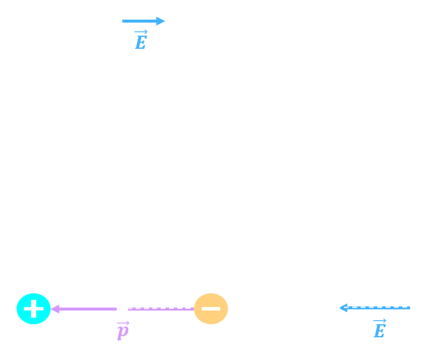{:height 235, :width 283}
				- The electric field strength of a dipole decreases with $y^3$ from the dipole
				- **Torque and Potential Energy**
					- If an electric dipole is placed in a ^^uniform^^ electric field, the net force on the dipole is ^^zero^^
						- Since the two charges have equal and opposite charges they would experience equal and opposite electric forces
					- However, the dipole may experience torque: $\vec{\tau} = \vec{p} \times \vec{E}$
					- To find the **magnitude**, $|\vec{\tau}| = |\vec{p}||\vec{E}| \sin \theta$
					- When a dipole rotates, it is doing **work** against the external electric field
						- Because the electric field is conservative, electric dipoles in an external electric field are said to have ^^potential energy^^
							- $$U = -\vec{p} \cdot \vec{E} = - pE \cos \theta$$
					- Example:
						- For each of the four arrangements below, determine if there is a net force and/or net torque on the electric dipole. If there is a net force or a net torque, determine their direction
							- 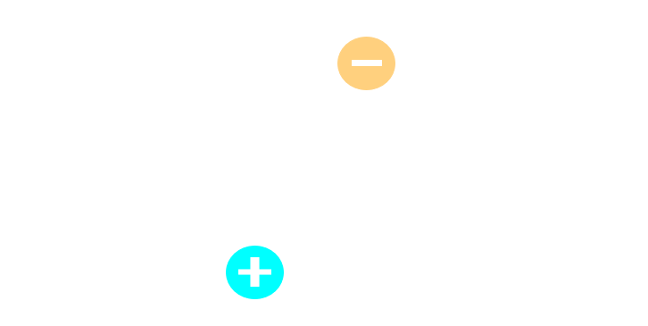{:height 206, :width 306}
								- Uniform electric field results in a net zero force for an electric dipole.
								- In this case, the torque is counterclockwise. This can be seen in one of two ways:
									- The negative charge has a force to the left, and the positive charge has a force to the right. If both charges begin to move, it will result in counter-clockwise motion
									- The electric dipole vector points from negative to positive. If you point your right-hand fingers in this direction and curl your fingers in the direction of the electric field, your fingers should turn counter-clockwise (thumb sticks out of the page).
							- 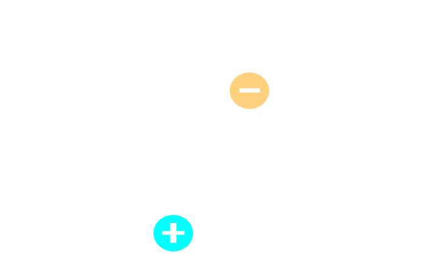{:height 269, :width 343}
								- This electric field is not uniform; the positive charge has a much stronger field, and therefore experiences a much stronger force to the right than the small force on the negative charge to the left. Therefore, there is a net force pointing to the right.
								- The net torque is the same as from part(a); it is counterclockwise.
							- 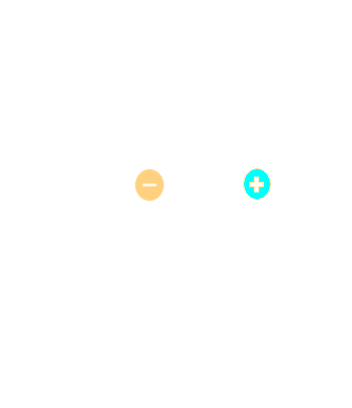{:height 322, :width 250}
								- In this case, the electric field lines are closer together near the negative charge, so the field (and resulting force on the negative charge) is stronger, resulting in a net force to the left for this dipole.
								- Both charges are on the same electric field line. In this case, the direction of the electric dipole moment and the electric field are the same, so the cross product results in a torque of zero.
							- 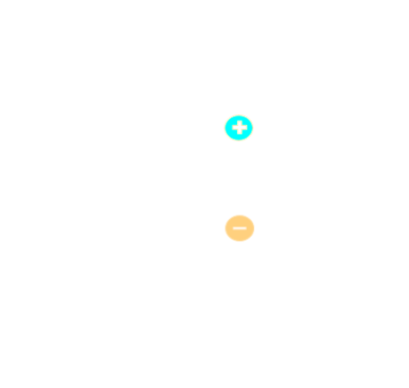{:height 262, :width 257}
								- The two charges experience roughly the same field. The electric force on the positive charge is up and to the right, while the force on the negative charge is up and to the left (remember, the electric force on a negative charge is in the opposite direction of the field lines). The two horizontal components cancel out, and the net force points directly upward.
								- In this case, the electric dipole moment vector points up the page and the electric field points to the right. The right-hand rule results in a clockwise torque (with your right hand, start with your four fingers in the direction of p⃗p
								- ​, and then curl them to the right; your fingers should turn counterclockwise with your thumb pointing into the page.
		- ### Electric Field of Continuous Charge Distributions
			- When presented with a **continuous** charge distribution, rather than a set of point charges, one needs to use **integrals** to find the electric field
			- Example:
			  background-color:: blue
				- A charge $q=5 μC$ i s placed at point P, near a uniformly charged rod of total charge $Q$
					- 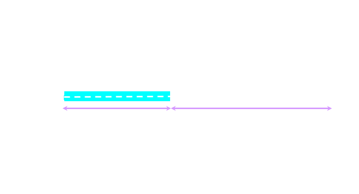{:height 248, :width 394}
					- For $Q = 70 μC$, $𝑙 = 50 \text{ cm}$ and $a = 1.0 \text{ m}$, calculate the force that the rod exerts on the test charge
				- Find an expression for the electric filed at point $P$ in the figure below
				- This integral might be useful:
					- 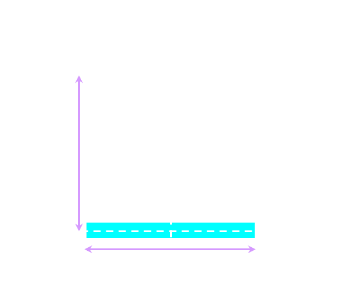{:height 296, :width 278}
					- $$\int \frac{dx}{(x^2+a^2)^{3/2}} = \frac{x}{a^2 \sqrt{a^2 +x^2}} +C$$
				- Determine the electric field at point P below, assuming that the total charge $Q$ increases non-linearly from the origin to the end of the rod. That is, the charge density is $dq = \lambda x dx$
					- 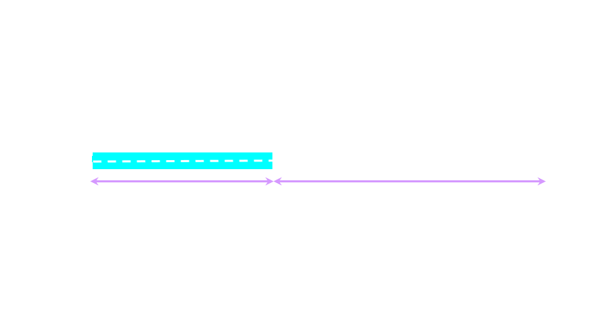{:height 201, :width 425}
					- Find the magnitude and direction
				- A rod of length $l$ has a uniform charge distribution, except the left-hand side is positively charged and the right-hand side is negatively charged. Find the electric field at point *P*  which is at a distance $a$ from the origin.
					- 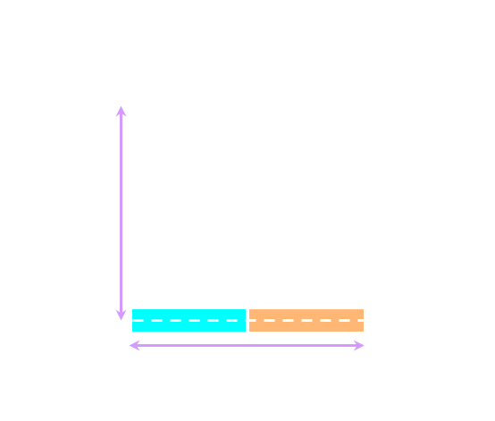{:height 304, :width 301}
				- Find the electric field at point P from the uniform positive charge distribution below
					- 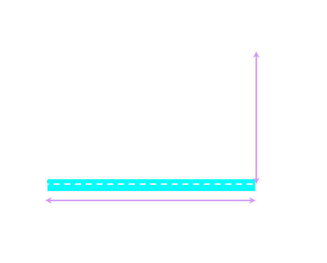{:height 267, :width 311}
				- What is the field at point P in the figure below? The total charge on the ring is $Q$ and it has a uniform positive charge distribution.
					- 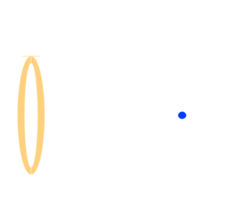{:height 299, :width 303}
				- 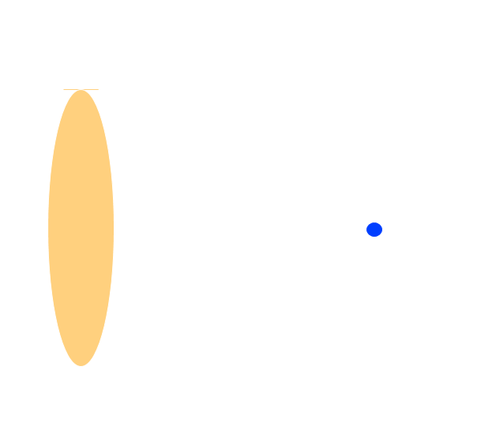{:height 308, :width 348}
					- a) What is the field at point P in the figure below, at some distance L away from a uniformly charged disc of surface charge density $σ$?
					- b) What is the field at point P if the distance L is much greater than the radius of the ring R?
					- c) What is the field at point P if the radius of the ring R is much greater than the distance L?
				- What is the field at point P in the figure below? The total charge on the charge distribution is Q and it has a uniform positive charge distribution.
					- 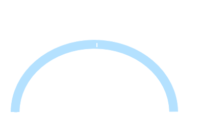
		- ### Electric Fields
			- Every charge creates an **electric field**
			- The electric field is how charges will behave with each other at any point in sapce
			- The electric force that a charged particle will experience in an electric field is:
				- $\vec{F} = q\vec{E}$
			- **Electric Field Due to One Particle**
				- Unlike the electric force which only exists if there are two or more charges, the electric field can be produced by a single point charge
				- The **magnitude** of the electric field is: $|\vec{E}| = k \frac{Q}{r^2}$
				- The **direction** of the electric field is along the line connecting the source charge to the point of interest
					- Electric fields always points ^^away from positive^^ and ^^towards negative^^ charges
			- Example:
			  background-color:: blue
				- a) Draw the electric field line distribution for two positive charges of equal magnitude.
				- b) Draw the electric field line distribution for a positive charge and a negative charge of equal magnitude.
				- c) Draw the electric field line distribution for a positive charge and a negative charge, where the positive charge has double the magnitude of charge compared to the negative charge
				- Sketch a charge distribution for a point charge of charge +Q at the center of a conducting shell. The shell has no net charge.
		- ### Properties of Conductors
			- The ^^electric field^^ inside a conductor is ^^zero^^
			- ^^Electric field lines^^ are always ^^perpendicular^^ to the surface of the conductor
			- If a conductor has a total positive or negative charge, the ^^excess charge must sit on the surfaces^^ of a conducting material
				- Excess charge cannot exist inside the volume of conductor
			- Example:
			  background-color:: blue
				- Consider a hollow spherical shell with a net charge of $Q_A=+2.0 C$. At its center is a point charge $Q_P​=−2.0 C$. Describe the location and amount of charge on the inner and outer surfaces of the spherical shell
					- 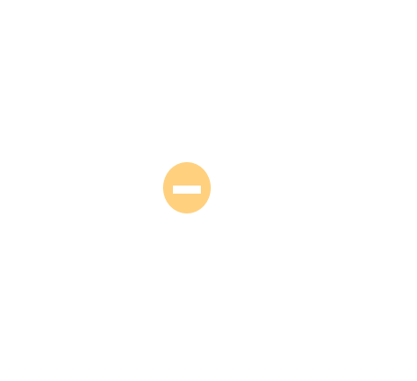{:height 207, :width 180}
				- Consider a solid cylinder of length $25.0 \text{cm}$ and radius of $5.0 \text{cm}$. The endcaps of the cylinder are made of rubber (i.e. insulating) and have zero net charge. The curved surface is made of copper (i.e. conducting) and has a total charge of $50 μC$. What is the surface charge density of the cylinder?
		- ### Electric Fields of Special Charge Distributions
			- **Conducting charged sphere**
				- $$|\vec{E}(r)| = \begin{Bmatrix} 0 \quad r < R \\ \frac{Q}{4\pi r^2 \epsilon_0} \quad r > R \end{Bmatrix}$$
			- **Conducting charged spherical shell**
				- For the space between the shells, the electric field depends only on the **interior** charge and uses the same formula as above
					- For the space outside the shells, the electric field depends on the **total**** **charge on all of the shells
				- Inside the conductors, the field is zero
			- **Infinte Line of Charge** or **Infinitely conducting charged cylinder**
				- The field is zero inside the conductor and the equation is:
					- $$|\vec{E}(r)| = \frac{\lambda}{2\pi r \epsilon_0}$$
				- The **linear charge density** $\lambda$ is the $Q/L$
			- **Infinite conducting cylindrical shell**
				- For the space between the shells, the formula used is the same as above, but only relies on the linear charge density of the **interior** line of charge (or cylinder)
				- For the space outside the shells, the formula depends on the **total**** **linear** **charge density on all of the shells
				- Inside the conductors, the field is zero
			- **Infinite Thin Plate**
				- The electric field is constant for this geometry and depends only on the charge density of the plate
					- $$|\vec{E}| = \frac{\sigma}{2\epsilon_0}$$
					- **Surface charge density** $\sigma$ is the $Q/A$
			- **Infinite Thick Insulating Plate**
				- The electric field is constant outside of the plate, but it varies linearly inside the plate
					- $$|\vec{E}(r)| = \begin{Bmatrix} \frac{\rho d}{2 \epsilon_0} \quad |z| < d/2 \\ \frac{\rho z}{\epsilon_0} \quad |z| > d/2 \end{Bmatrix}$$
					- **Volume charge density** $\rho$ is $Q/V$
			- Example:
			  background-color:: blue
				- Find the magnitude of the electric field in the figure below at any point in space. Assume the lines are infinite and each have a charge density of $λ$
					- 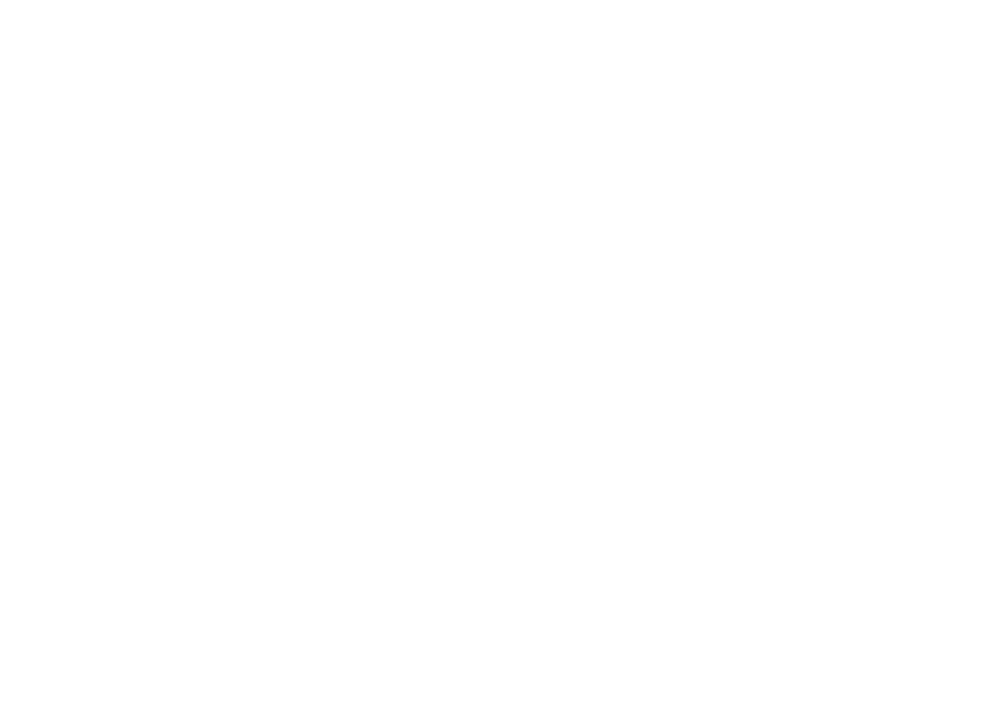{:height 319, :width 377}
				- Consider four infinite parallel plates
					- The top plate and bottom plates each have surface charge density $−σ$ and the middle two plates each have surface charge density $+2σ$
					- Find the electric field in terms of σσ and ϵoϵo​ in each region, and draw the electric field lines
	- ## Gauss' Law
		- ### Electric Flux
			- **Electric flux** is a measure of the number of electric field lines that are passing through a given area
				- Flux is a more quantitive way of thinking about electric field lines
			- For a **flat** surface and a **uniform** electric field, the electric flux $\Phi_E$ is given by
				- $$\Phi_E = \vec{E} \cdot \vec{A} = |\vec{E}||\vec{A}| \cos \theta$$
				- $\vec{A}$ is the vector with magnitude equal to area of the surface, perpendicular to it
				- $\theta$ is the angle between the angle vector and electric field
				- 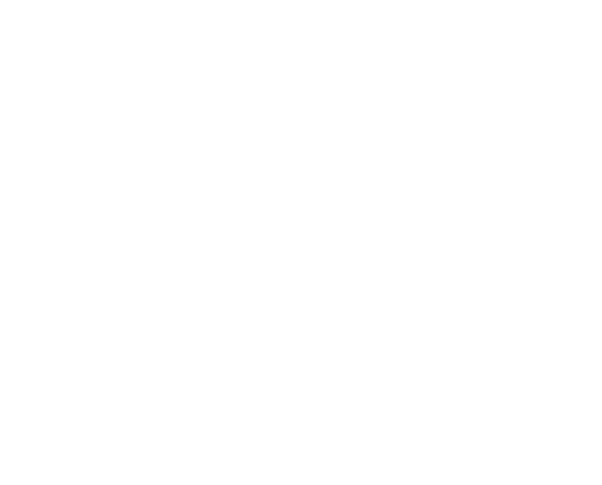{:height 264, :width 298}
				- Only applies for uniform electric fields through flat surfaces
			- For a **closed surface**  with no internal charges, the ^^net flux^^  through the surface mustbe zero
			- Example:
				- Consider a constant, uniform electric field of magnitude $3.0 \text{ N/C}$ pointing in the positive z-direction. Half of a spherical shell is placed in the field. The flat face is along the xy-plane, and the curved surface extends in the positive z direction. The radius of the hemisphere is $10 \text{ cm}$.
					- a) What is the flux through the flat surface?
					- b) What is the flux through the curved surface?
				- An electric field$\vec{E} = ax \hat{i} \text{N/C}$where alpha is a positive constant. Consider the right half of a cylindrical surface placed inside this field, centered at the origin with radius R and length L. What is the flux through the surface?
		- ### Gauss' Law
			- The **total electric flux** through any ^^closed^^ is directly proportional to the **net charge enclosed by the surface**
				- $$\Phi_E = \frac{Q_{enc}}{\epsilon_0}$$
			- Known as **Gauss's Law**:
				- $$\oint \vec{E} \cdot d\vec{A} = \frac{Q_{enc}}{\epsilon_0}$$
			- Steps for solving a Gauss' Law Problem
				- **Pick a Gaussian surface** such that integral is constant
					- The value $\vec{E} \cdot d\vec{A}$ should be equal to all points on the surface
				- **Determine the charge enclosed** by your Gaussian surface
				- Carry out integral and solve for $\vec{E}$, the electric field
				- Example:
				  background-color:: blue
					- Using Gauss’s law, find the net electric flux passing through each of the following four closed surfaces.
						- Explain why you cannot use Gauss’s law to find the electric field through these surfaces.
					- Consider a hollow spherical shell with a net charge of $Q_A=+2.0 C$ At its center is a point charge $Q_P=−3.0 C$.
						- a) Describe the location and amount of charge on the inner and outer surfaces of the spherical shell.
						- b) How do your answers change if the point charge is instead offset from the center of the sphere by $2.0 \text{ cm}$?
					- Consider a point charge $+Q$ placed at the center of a cube
						- What is the flux through each face of the cube?
					- Consider a point charge $+Q$ placed at one corner of a cube
						- What is the flux through each face of the cube?
			- ### Spherical Symmetries
				- Gauss's law problesm are spherically symmetric if the charge distribution depends only on the ^^distance from the origin^^
					- Ex. point charge, spheres, spherical shells
				- The Gaussian surface to use is a **sphere**
				- In the Gauss's Law integral, the electric field and area vectors are always parallel, so the integral reduces to:
					- $$\oint \vec{E} \cdot d\vec{A} = |\vec{E}| \oint dA = |\vec{E}| 4 \pi R^2$$
				- Example:
				  background-color:: blue
					- Find the electric field distribution from a solid metallic sphere with charge $+Q$ and radius $R$
						- Plot the electric field as a function of distance from the center of the sphere
					- Consider a hollow spherical shell with a net charge of $Q_A=+2.0 C$. The shell has a concentric spherical cavity, and at its center is a point charge $Q_P=−3.0 C$. The inner radius is $r_1$​and the outer radius is $r_2$​
						- Find the electric field distribution for this charge configuration
					- Find the electric field $E$ at any point in space for a **nonconducting** sphere with a charge of $+6μC$ (uniformly distributed through its volume) which is surrounded by a hollow *conducting* sphere with an inner radius of $R_1$​, and an outer radius $R_2$ ​and a net charge of $+10μC$. Plot the field distribution
					- A spherical insulator with a spherical hole inside is shown in the figure. The radius of the insulator is $R$, the radius of the spherical hole inside is $R/4$, and the center of the hole is $R/4$ to the right of the insulator center. The insulator is charged with uniform charge density $\rho$
						- Find the electric field at points $A$ and $B$
			- ### Cylindrical Symmetries
				- Gauss's Law problems have cylindrical symmetry if the charge distribution depensd only on the ^^distance from the axis^^
					- Ex. Line of charge, cylindrical cavities
				- The Guassian surface to use is a **cylinder**
				- In the Gauss's Law integral, the electric field and area vectors are always parallel for the curved face, and are perpendicular to the flat face (giving zero flux contribution)
					- $$\oint \vec{E} \cdot d \vec{A} = |\vec{E}| 2 \pi RL$$
				- Example:
				  background-color:: blue
					- Find the electric field distance $r$ away from an infinite wire with uniform linear charge density $\lambda$
					- Find the electric field for each region for this infinitely long metallic cylinder with a linear charge density of $+λ$ on the inner cylinder and a linear charge density of $−λ$ on the outer shell. The radius of the inner cylinder is $a$, and the inner and outer radii of the cylindrical shell are $b$ and $c$, respectively
					- A long, hollow plastic cylinder has an inner radius of $a$, an outer radius of $b$, and a uniform charge density of $\rho$. Find the electric field at all points in the charge distribution
			- ### Planar Symmetries
				- Gauss's Law problems for infinite sheets or slabs have planar symmetry
				- The Gaussian surface to use is called a **Gaussian pillbox**
				- In the Gauss's Law integral, the electric field and area vectors are always parallel for the two flat pillbox faces, and are perpendicular for the curved face (giving zero flux contribution)
					- $$\oint \vec{E} \cdot d\vec{A} = 2 |\vec{E}|A$$
				- Example:
					- Find the electric field at distance r away from an infinite plane with uniform surface charge density $\sigma$.
					- Two uniformly charged infinite planes are arranged such that they are parallel to each other. One has surface charge density $σ$, and the other has surface charge density $−σ$. Find the electric field between the plates, and outside the plates. (This is called a **parallel plate capacitor.**)
					- Find the net electric field at a distance $z$ from an infinitely large non-conducting slab with a thickness of $d$ and a uniform charge density of $ρ$
- # Electromagnetism
	- ## Magnetic Fields
		- ### Magnetism and Magnetic Fields
			- **Magnetism**
				- There are two types of magnetism:
					- **Permanent magnetism** refers to magnetic fields produced by the inherent properties of certain materials
					- **Electromagnetism** refers to magnetic fieldes that are created by charges in motion
						- If the charges stop moving, the magnetic field disappears
				- **Magnetic Field**
					- **Magnetic field** is related to the magnetic force that a moving electric charge **would** experience at some location
					- Magnetic field is a **vector**
						- It usually takes the variable $B$ and is measured in units of **Tesla (T)**
					- Earth has a very weak magnetic field of $5.0 \times 10^{-5}T$
						- The other unit of magnetic field is **Gauss** ($1 T = 10^4 G$)
							- Earth's magnetic field is $0.5G$
					- The **total magnetic field** due to multiple magnetic fields in the same location is the **vector sum** of the individual fields
						- $$\vec{B}_{total} = \sum_i \vec{B}_i$$
				- **Magnetic Field Lines**
					- The strength and direction of magnetic field can be visualized with **magnetic field lines**
					- The **density** of magnetic field lines is an indication of magnetic field strength
					- The **tangent** to a magnetic field line gives the direction of the magnetic field
					- 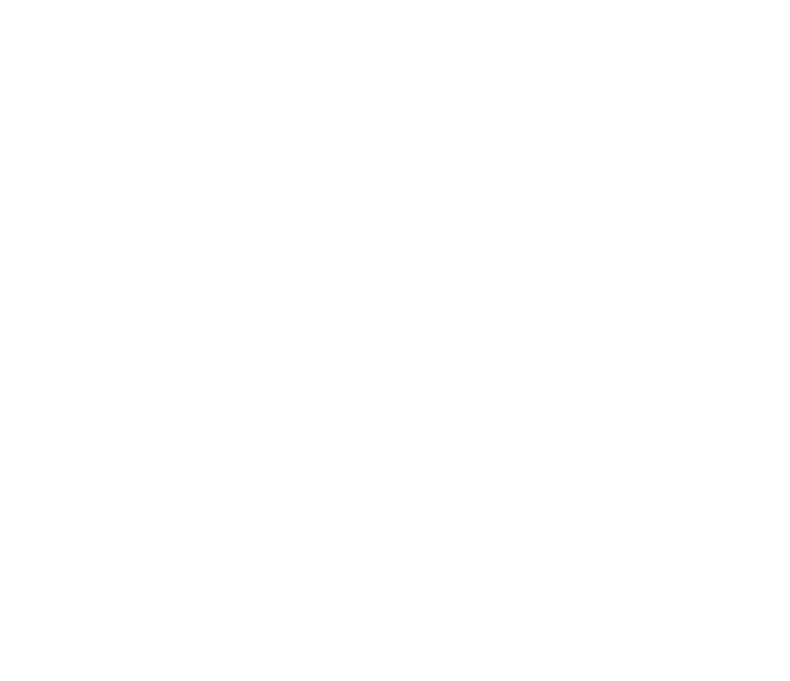{:height 299, :width 315}
					- Unlike electric fields, magnetic fields cannot have starting or ending points
						- They must form **closed loops**
						- Magnetic monopoles do not exist
				- **Magnetic Materials**
					- When **ferromagnetic** materials are placed in a magnetic field, a magnetic field is created inside the material that is in the ^^same direction^^ as the external field
						- When ferromagnetic materials are removed from the external field, they retain **magnetization**
					- **Paramagnetic** materials behave like ferromagnetic materials
						- They ^^do not retain magnetization^^ from the field
					- When **diamagnetic** materials are placed in a magnetic field, the internal field produced is in the ^^opposite direction^^ of the external field
		- ### Magnetic Force on a Moving Charge
			- An electric charge moving in a magnetic field experiences a force proportional to the **magnitude** and **velocity** of the charge, as well as the **magnetic field strength**
				- $$\vec{F} = q\vec{v} \times \vec{B} \quad |\vec{F}| = qvB \sin \theta$$
			- If the velocity of the particle is ^^parallel or anti-parallel^^ to the magnetic field, then the magnetic force is ^^zero^^
			- ^^Uncharged^^ particles do not feel a force produced by the magnetic field
			- If a charged particle is experiencing both an electric field and a magnetic field, the total force is the **Lorentz Force**
				- $$\vec{F} = \vec{F}_{elec} + \vec{F}_{mag} = q(\vec{E} + v \times \vec{B})$$
			- Example:
				- Consider the following experiment. A charge enters a magnetic field and collides with a sensor as shown in the diagram. If the particle takes the trajectory shown, what is the sign of the charge?
				- An electron moves perpendicular to a uniform magnetic field which exerts a magnetic force on the electron shown in the figures below. In each case, find the direction of the magnetic field?
				- Which of the following statements is **true** for a charged particle moving in a constant magnetic field (perpendicular to the direction of motion)? Select all true statements
		- ### Circular Motion in a Magnetic Field
			- If the magnetic force is the only force acting on a charge, then the **acceleration** must be **perpendicular** to the field and the velocity
			- Because the acceleration and velocity are perpendicular, the direction of motion is constantly changing
				- The result is **uniform circular motion** with respect to the magnetic field
					- This is sometimes called ^^cyclotron motion^^
			- 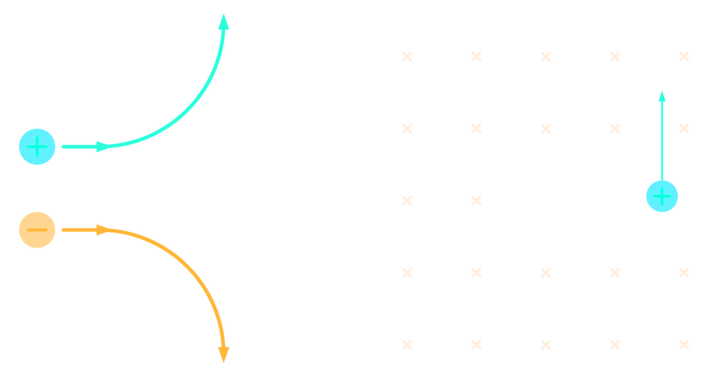
			- We can use **Newton's Second Law** and formula for **centripetal acceleration** to find the radius of the motion
				- $$r = \frac{mv_\perp}{qB}$$
			- The component of the velocity **perpendicular to the magnetic field** is used. It is possible for a charged particle to also have a parallel component, which results in **helical motion**
			- We can take this analysis a step further to find the **period (T)** of the circular motion, which is ^^time required for one full circle^^
				- $$T =\frac{\text{distance}}{\text{speed}} =   \frac{2\pi m}{qB}$$
			- The **frequency (f)** of the circular motion is the inverse of the period, and represents ^^how many full circles are completed per second^^
				- $$f = \frac{1}{T} = \frac{qB}{2\pi m}$$
			- The **angular frequency** can also be defined
				- $$\omega = 2 \pi f = \frac{qB}{m}$$
			- Example:
				- A positively charged particle of $2.01 x 10^{-5} C$ and mass $7.52 x 10^{-10} kg$ is travelling at a velocity of $2.0 x 10^2 \text{m/s}$ in the positive horizontal direction (to the right). It enters a uniform magnetic field of $1.50 \text{ T}$. The B field is due north (upwards).
					- a) What is the force on the particle as it enters the magnetic field?
					- b) Find the radius of the circular path traversed by the particle in the magnetic field
				- Two particles of the same charge, $𝑞−$ are undergoing cyclotron motion within a uniform magnetic field that is pointing in the $+𝑧$-direction. The first particle has a mass of 𝑚 and travels at a speed of $v$ while the second particle has a mass of $\frac{1}{2} m$ and is traveling at a speed of $3v$. What is the radius of motion of the second particle ($R_2$) in terms of the radius of motion of the first particle?
				- Consider three charges moving in the plane of the page through a magnetic field of constant strength that points out of the page. The paths are drawn below and have arrows showing where the motion begins, to indicate the direction of the motion
					- Charge 1 has charge $+Q$, speed $V$, and mass $2M$
					- Charge 2 has charge $+Q$, speed $2V$, and mass $2M$
					- Charge 3 has charge $–Q$, mass $M$, and speed $2V$
				- Consider an electron initially moving to the right at a speed of $2.5×10^6 \text{m/s}$. The electron encounters a magnetic field pointing out of the page of strength $1.4×10^{−4} T$
					- $m_e = 9.11 \times 10^{-31} \text{kg}$
					- $q_e = 1.6 \times 10^{-19} \text{C}$
					- $m_p = 1.67 \times 10^{-27} \text{kg}$
					- What is the radius of the circular path of the electron? What is the direction of the motion?
					- Without doing any calculations, describe how the circular motion of a proton would be similar or different to the circular motion of the electron
				- A charged particle of charge $q$ and mass $m$ is in a uniform magnetic field of strength $B$. The field is pointing into the page (negative z direction). The particle is moving with $\vec{v} = v_x\hat{i} + v_z\vec{k}$ at some instant in time
					- a) Describe the motion of the particle qualitatively. What is happening?
					- b) What is the radius of the circular motion?
					- c) After the charged particle completes one full circle of motion, how far away is it from where it started? (Hint: How long does the full circle take?)
					- d) What is the velocity vector halfway through this full circle? What about one-quarter or three-quarters of the way through a revolution?
					- e) Which of your answers above would change if the magnetic field points out of the page instead?
					- f) What changes in your answers if the magnetic field points in the x-direction instead?
		- ### Velocity Selectors
			- A charged particle moving through a magnetic field and electric field will experience **two forces**
				- The ^^electric force:^^$|F_{elec}| = qE$
				- The ^^magnetic force:^^$|F_{mag}| = qvB\sin \theta$
			- By Newton's Second Law, if the net force is zero, then there is zero acceleration, and there cannot be circular motion
			- The two forces must be **equal and opposite**
				- $$\sum \vec{F} = m\vec{a} \\ |F_{elec}| = |\vec{F}_{mag}|$$
			- Magnitude can be found $v = \frac{E}{B}$
			- These setups are sometimes called **velocity selectors** because any particles not moving at this exact speed will not travel in a straight line
				- This effectively **filters** particles travelling with a certain speed
			- Example:
				- A proton is travelling along a straight line and enters a region where both electric and magnetic fields are present. It is observed that proton does not change its line of motion and moves in a straight line
					- If the initial velocity of the proton is $6.0×10^6 \text{m/s}$ to the right, and the magnitude of electric field is $6000 \text{ N/C}$, what is the magnitude of the magnetic field?
				- Consider an electron moving to the right through uniform electric and magnetic fields. The electric field points up the page
					- Find the direction of the magnetic field
					- Provided that the electric field strength is $90 kV/m$ and magnetic field strength $0.5T$, find speed of the electron such that electron continues to travel in a straight line along the $x$-direction
		- ### Torque on a Current Carrying Wire
			- A curved that is place in a magnetic field will epxeriecne a different force at each point along its lenth
				- This can result in the wire experience a **torque** even if the net force is zero
			- The torque on a loop of current is found with the following equation
				- $$\tau = \vec{\mu} \times \vec{B}$$
			- We have introduced the **magnetic dipole moment** $\vec{\mu}$
				- $$|\vec{\mu}| = IA$$
			- 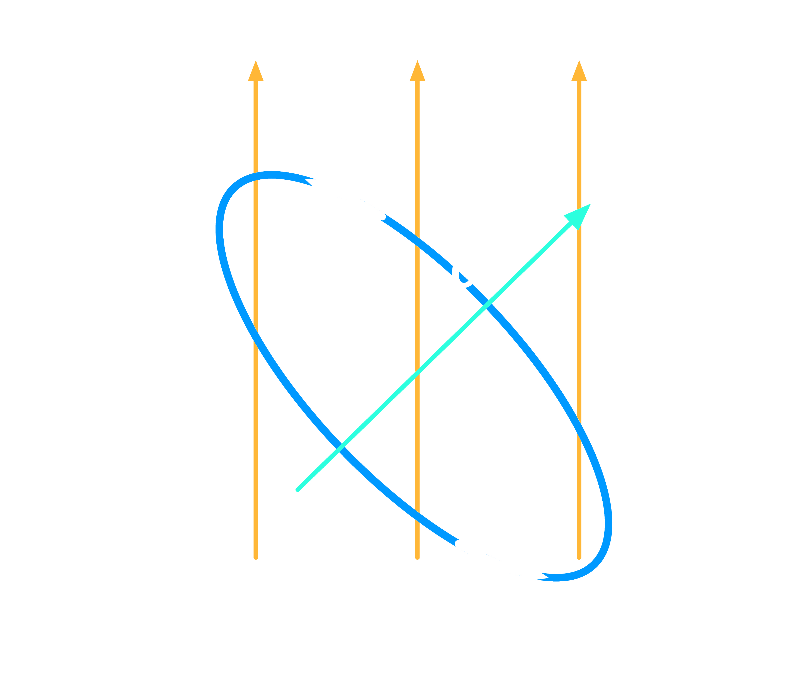{:height 331, :width 398}
			- The magnitude of the torque on a current loop can be written as follows
				- $$|\tau| = NIAB \sin \theta$$
				- The variable $N$ represent the **number of loops of current**
			- Example:
			  background-color:: blue
				- A rectangular current loop is shown below, with width xx and height yy. The current flows counter-clockwise and the magnetic field points to the right.
					- Find the net torque on the loop. Can you find the answer in two different ways?
				- A circular loop of radius 10.5 cm and 40 turns has a current of $2.50 A$ flowing through the coil. A magnetic field of strength $3.4 T$ acts at an angle of $35º$ to the normal of the plane of the loop. What is the magnitude of the net torque acting on the loop?
		- ### Hall Effect
			- The motion of electrons inside conductors is affected by external magentic fields
			- This effect is called the **Hall effect** and can be used to develop sensors that measure the strength of magnetic fields
			- **Experimental Setup:**
				- Consider an experiment with the following properties
					- Rectangular slab of **conducting material**
					- **External magnetic field** points out of the page
					- **Current** pointing to the right, that is positive charges are moving to the right with speed $v$ and charge $q$
					- The charge **accumulates on one edge** of the conductor and **charge seperation** is achieved
			- **Results:**
				- Because the charges are seperated, there is an **electric field** across the conductor, $E_H$
				- This electric field builds up until the electric force **cancels out** the magnetic force
					- $$v = \frac{E_H}{B}$$
				- This is the **speed of electrons** moving in the material
				- There is also a **potential difference** across the conductor
					- $$\Delta V_H = E_H d$$
					- $$\Delta V_H = vBd$$
					-
			- ^^**Note:**^^
				- In conductors, it's actually electrons that are moving, but positive current is used as a convention. This does not change the direction of our magnetic force - if both the charge and the velocity direction were swapped, the force still points down the page
			- Example:
			  background-color:: blue
				- To measure the magnetic field strength of a solenoid, you place a piece of copper wire inside it. The wire has a square cross-sectional area with side lengths of $2.0 \text{cm}$ and the copper wire is able to detect a Hall voltage.
					- If you measure a current of $0.20 A$ across the piece of copper, what is the magnetic field strength inside of the solenoid if the measured Hall voltage is $3.0 \text{nV}$?
					- The density of free electrons in copper is $8.48×10^{28}$ electrons per cubic meter. Enter your answer with two sig figs in units of Tesla
	- ## Sources of Magnetic Fields
		- ### Biot-Savart Law
			- A moving charge generates a magnetic field
				- The purpose of **Biot-Savart Law** is to determine the exact magnetic field that is generated by moving charges
			- Consider a point charge $q$ moving with velocity $\vec{v}$
			- If  that point in space is seperated from the point charge by $\vec{r}$, the magnetic field produced at that point is:
				- $$\vec{B} = \frac{\mu_0}{4\pi} \frac{q \vec{v} \times \vec{r}}{|\vec{r}|^2} \quad |\vec{B}| = \frac{\mu_0}{4\pi} \frac{q |\vec{v}| \sin \theta}{|\vec{r}|^2}$$
				- The **permeability of free space:** $\mu_0 = 4\pi \times 10^{-7} \frac{\text{m kg}}{s^2 A^2}$
				- The angle $\theta$ is the angle between the position vector and the velocity vector
			- The magnetic field lines around a moving charged particle form **closed circles**
			- 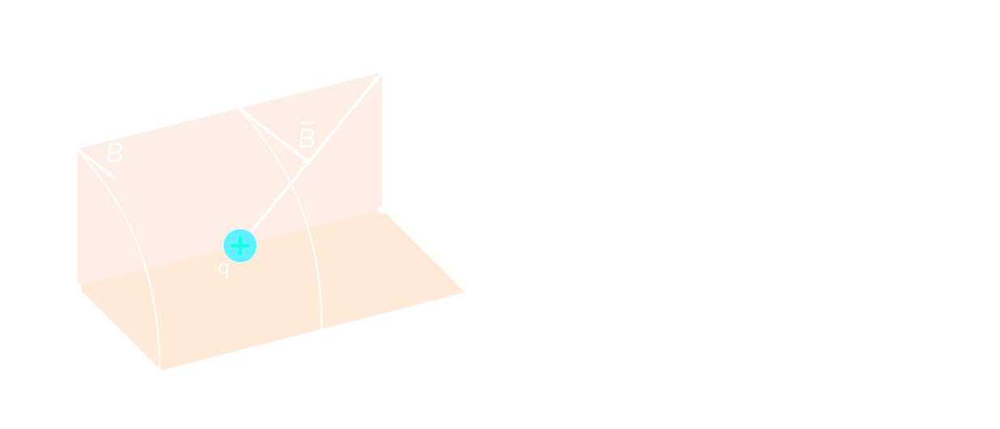
			- Example:
			  background-color:: blue
				- As seen in the following diagram, two positively charged particles of charge q move towards the origin. One charge travels in the positive-x direction at a constant speed of v, and the other travels in the positive-y direction at a constant speed of 2v
					- What is the net magnetic field at the origin if both particles are a distance d away from the origin? (Neglect the interactions between the two charges.)
					- What is magnitude of the magnetic field halfway between the two particles at the same moment?
			- Consider a **wire element** carrying a current of $I$ and flowing with direction $d\vec{l}$
				- The infinitesimal magnetic field contribution from the wire element is
					- $$d\vec{B} = \frac{\mu_0 I}{4 \pi} \frac{d\vec{l} \times \hat{r}}{|r^2|}$$
				- The total magnetic field at a point can be found by **integrating over all wire elements**
					- $$\vec{B} = \int_{wire} d\vec{B}$$
	- ### Magnetic Force on Parallel Wires
		- When two current-carrying wires are close to each other, the magnetic field generated by one wire will exert a force on the charges in the other wire
			- Consider a wire with current pointing **up** the page
				- At any point to the right of this wire, the magentic field points ^^into the page^^
			- Consider a second wire placed to the right of the first wire, also with current pointing **up** the page
				- We can now use $\vec{F} = I \vec{l} \times \vec{B}$ to find the direction of force
				- The right hand rule gives force pointing to the **right**
			- Shows that ^^parallel currents attract^^
				- 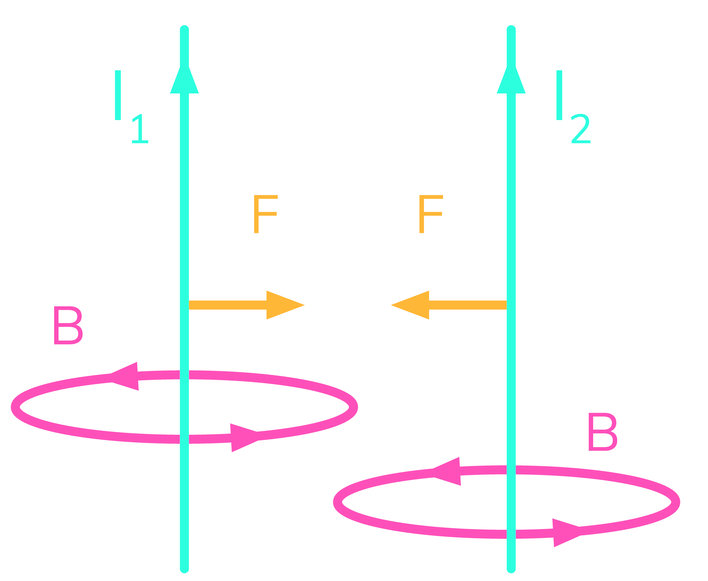{:height 319, :width 348}
			- By repeating the analysis with two current in opposite directions, one can observe ^^opposite currents repel^^
				- 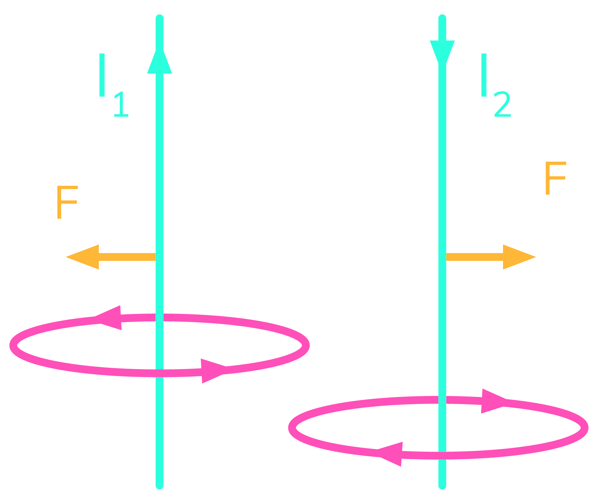{:height 300, :width 350}
			- The **magnitude** of the force (per unit length of wire) is given as follows where $r$ is the distance between the wires
				- $$\frac{F}{l} = \mu_0 \frac{I_1 I_2}{2 \pi r}$$
			- Example:
			  background-color:: blue
				- Consider two infinite wires that are parallel. They each carry current $I$ up the page and are separated by a distance $L$. We then place a third wire at the halfway point between these two wires with a current of $2I$ that also travels up the page.
					- What is the magnetic force experienced by the middle wire?
					- Assume the first wire (the farthest wire on the left) now carries a downward current instead of an upward current (the magnitude does not change). What is the new magnetic force on the middle wire?
				- A $25 \text{ cm}$ piece of straight wire is positioned directly above an infinite wire of current of $2.0 A$ which flows to the right. The two wires are oriented in the same direction. The wire segment is at rest $5 \text{ mm}$ above the infinite wire.
				- What is the magnitude and direction of the electric current passing through the top wire if the top wire has a mass of $0.25 \text{ g}$?
	- ###  Magnetic Force on a Wire
		- For an individual charge, the formal for magnetic force was $\vec{F} = q \vec{v} \times \vec{B}$
			- To find the magnitude, we can use $|\vec{F}| = qvB \sin \theta$
		- For current of charge:
			- $$\vec{F} = I \vec{l} \times \vec{B} \quad |\vec{F}| = IlB \sin \theta$$
			- The vector $\vec{l}$ has magnitude equal to the length of the wire segment, and the direction is equal to direction of positive current direction
			- 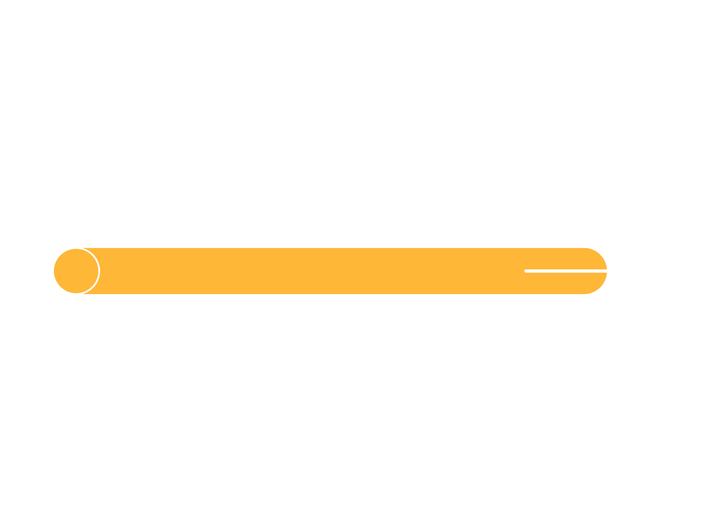{:height 333, :width 429}
		- If there is a **closed loop** of current in a **uniform** magnetic field, the toal magnetic force on the wire will be ^^zero^^
		- For a wire of arbitrary shape, the force on an infinitesimal piece of wire, $d\vec{l}$ is
			- $$d\vec{F} = I d \vec{l}$$
		- The total force is then bound by integrating over the entire wire:
			- $$\vec{F} = \int d \vec{F} = \int I d\vec{l} \times \vec{B}$$
			- This can be used for curved wires, or cases where the magnetic field or current is no constant for all points on the wire
		- Example:
		  background-color:: blue
			- A wire of length 2.0 meters carries a current of $8.0 A$ flowing in the positive y-direction (up the page). This wire is placed in an external magnetic field of strength $2.0 \text{mT}$ pointing in the positive x-direction. Find the total magnetic force on the wire
			- Calculate the force acting on a wire of length 2.0 meters which carries 8.0 A of current in the positive y-direction, through a magnetic field given by the following vector expression:
				- $$\vec{B} = 2mT\hat{i} + 3mT\hat{j} + 4mT \hat{k}$$
			- A square ring of current with side lengths a=15.0 cm lies in the x-y plane, centered at the origin. It is carrying a current I = 5.0 A, circulating counterclockwise when viewed from above the plane (i.e. from positive z). There is a uniform magnetic field of $\vec{B}=5.0mT\hat{k}$ filling the region
				- Calculate the net force on the right half of the square, where x > 0.
				- Calculate the net force on the left half of the square, where x < 0.
				- What is the net force on the ring?
			- A circular half-ring of current with radius a=15.0 cm lies in the x-y plane, centered at the origin. It covers only the first and fourth quadrants (that is, it is just the right-hand side of a circle). The wire is carrying a current I = 5.0 A, circulating counterclockwise when viewed from above the plane (i.e. from positive z). There is a uniform magnetic field of $\vec{B}=5.0mT\hat{k}$ filling the region.
				- Calculate the net force on this semicircular piece of current
	- ### Magnetic Field of Current-Carrying Wire
		- For a **long, straight wire**, the magnetic field experience at a perpendicular distance $r$ from the wire is as follows:
			- $$B = \frac{\mu_0 I}{2 \pi r}$$
		- **Solenoids:**
			- A **solenoid** is a tightly wound coil of current
			- The magnetic field ^^outside^^ a solenoid is ^^zero^^
			- The magnetic field ^^inside^^ a solenoid is given as follows:
				- $$B = \frac{\mu_0 NI}{L}$$
				- $L$ is the length of the solenoid, and $N$ is the number of twists in the coil
			- The formula can also be written in terms of **current loops per unit length**, $n= \frac{N}{L}$
		- **Current Loop:**
			- At the **centre of a loop of current**, the magnetic field is given by
				- $$B = \frac{\mu_0 I}{2R}$$ where $R$ is the radius of the current loop
		- Example:
		  background-color:: blue
			- A current of $4.50 A$ flows through a long, straight conducting wire. A positive charge of $2.50 \times 10^{-15} C$ travels at $1.24 \times 10^3 \text{m/s}$ parallel to the wire, in the same direction of the current.
				- What is the magnitude of the field created by the wire at 5 cm from the wire?
				- Determine the magnitude and direction of the magnetic force exerted on the charge.
			- What is the strength of the magnetic field in an infinitely long solenoid carrying 800 mA of current if for every 5 cm of the solenoid it has 200 loops?
	- ### Ampere's Law
	  id:: 66131709-db69-4b5a-8b8f-aea8d65e4a1c
		- Finding the magnetic field due to a current distribution can be made easier using **Ampere's Law**
			- Gives a easier way to find magnetic fields if the current distribution has a high degree of symmetry
		- To use Ampere's Law, one needs to draw an **Amperian Loop**
			- The magnetic field at all points the loop must be **equal**
			- Once a loop is defined, Ampere's Law is
				- $$\int \vec{B} \cdot d\vec{l} = \mu_0 I_{enclosed}$$
				- 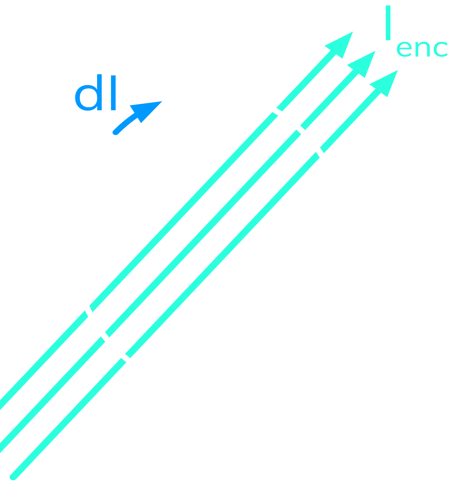{:height 452, :width 470}
		- Example:
		  background-color:: blue
			- Using Ampere’s law, find the magnetic field around a long straight wire with current $I$
			- Find the magnetic field inside an infinite solenoid carrying a current of $I$
			- The accompanying figure shows a cross-section of a long, hollow, cylindrical conductor of inner radius $r_1$ and outer radius $r_2$. A total current of $I$ is distributed uniformly over the cross-section and flows into the page.
				- Find the magnetic field produced by this current distribution
			- A coaxial cable has multiple layers of wire.
			- For this problem, consider a coaxial cable with two cylindrical layers of wire (assume there is no gap material in between). The currents are equal in magnitude and flow in opposite directions. In each of the two layers, the current density is uniform. The radius of the inner layer is $a$ and the radius of the outer layer is $b$.
				- What is the magnetic field distribution that is produced? Don't forget to consider all three regions
			- A toroid can be thought of as a solenoid wrapped into a circle to produce a donut-shape of wrapped coil. Find the magnitude of the magnetic field inside and outside of a toroid with $N$ total loops of wire carrying current $I$
			- Consider a thin, infinite sheet of current with a current density per unit length of $J$
				- (a) What is the magnetic field produced by this current distribution? (Hint: field is a vector, so your answer should include a magnitude and a direction).
				- (b) If we had two of these sheets in parallel and separated by a distance of $L$ with current flowing in the same direction, what would be the magnetic field distribution?
				- (c) Repeat part (b) if the two sheets have current flowing in opposite directions
- # Special Theory of Relativity
	- ### Basics of Special Relativity
		- **Lorentz Transformation**
			- Basis of Special Relativity:
				- The **laws of physics are the same** in all inertia reference frames
				- The **speed of light is constant** (in vacuum) in all inertail reference frames is approximately equal to $c = 3 \times 10^8 \text{m/s}$
			- **Inertial reference frames** are systems of coordinates that move with a constant speed relative to each toher, but do not accelerate with respect to each other
			- In special relativity, every event is represented in $4$-dimensional **spacetime** as $(x,y,z,t)$, where $x,y$ and $z$ are the spatial coordinates and show the point at which this event happens, and $t$ is time at which it happens
			- All 4 coordinates
	- ### Nuclear Forces and Binding Energy
	- ### Photoelectric Effect
	- ### The Compton Effect
	- ### Wave-Particle Duality
	- ### Radioactivity
	-