## [[Motion Along a Straight Line]] #[[PHY 1124]]
	- ## 2.1 Displacement, Time and Average Velocity
		- The motion of an object can be tracked on a coordinate system, with an origin, $O$ in which the object is treated as a **particle**
		- The **displacement** of a particle is a vector that points from $P_1$ to $P_2$
			- $\Delta x = x_2 - x_1$
		- 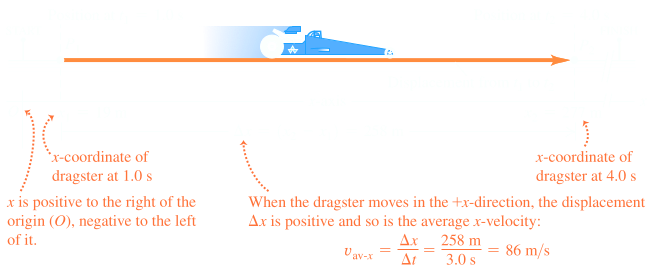{:height 231, :width 541}
		- The **average velocity** is the vector defined as the change in displacement divided by the time interval
		- The time interval $\Delta t$ can only be a positive value
		- The $x-$component of velocity, or the **average** $x-$**velocity** is denoted by
			- $$V_{av-x} = \frac{\Delta x}{\Delta t} = \frac{x_2- x_1}{t_2-t_1}$$ where
			- $v_{av-x}$ is the **average** $x-$**velocity** of a particle in a **straight-line motion**
			- $\Delta x$ is the $x-$component of the particle's displacement
			- $\Delta t$ is the time interval
			- $x_2 - x_1$ is the final $x-$coordinate minus initial $x-$coordinate
			- $t_2 - t_1$ is the final time minus initial time
		- ^^**Rules for the Sign of x-Velocity**^^
			- | **If x-coordinate is:** 	| **... x-velocity is:** 	|
			  | Positive & increasing (getting more positive) 	| Positive: Particle is moving in $+x$ direction 	|
			  | Positive & decreasing (getting less positive) 	| Negative: Particle is moving in $-x$ direction 	|
			  | Negative & increasing (getting more negative) 	| Positive: Particle is moving in $+x$ direction 	|
			  | Negative & decreasing (getting less negative) 	| Negative: Particle is moving in $-x$ direction 	|
		- The positive and negative directions of velocity is dependent on the chosen positive direction
		- 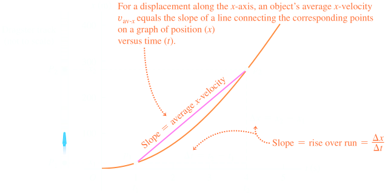
	- ## 2.2 Instantaneous Velocity
		- **Instantaneous Velocity** is velocity at the specific instant of time or point along the path
		- To compute the instantaneous velocity, the interval of $P_1$ and $P_2$ needs to be calculated at increasingly smaller $\Delta x$ and $\Delta t$
		- In Calculus, we can observe it as:
			- $$v_x = \lim_{\Delta t\rightarrow 0} \frac{\Delta x}{\Delta t} = \frac{dx}{dt}$$ where
			- $v_x$ is the **instantaneous velocity** of a particle in **straight-line motion**
			- $\lim_{\Delta t\rightarrow 0}$ equals the limit of the particles average velocity as the time interval reaches zero
			- $\frac{dx}{dt}$ equals the instantaneous rate of change of the particle
		- **Speed** is used to denote distance travelled divided by time, either on an average or instantaneous basis
		- Instantaneous *speed* measure how fast a particle is moving
		- Instantaneous *velocity* measures how fast and the direction of the moving particle
		- Instantaneous speed is the ^^magnitude^^ of instantaneous velocity, and can only be positive
		- 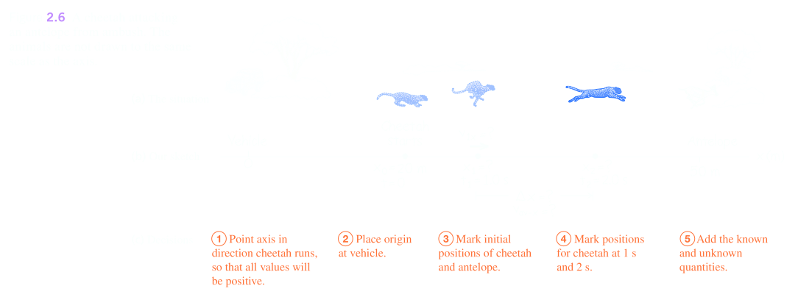
		- ### Finding Velocity on an x-t Graph
			- A graph of position as a function of time for straight-line motion, the instantaneous $x-$velocity at any point is equal to the slope of the tangent to the curve at that point
				- If tangent to $x-t$ curve slopes upward to right, slope is positive, $v_x$ is positive and motion is in positive $x-$direction
				- If tangent slopes downward to right, slope of graph and $v_x$ is negative and motion is in negative $x-$direction
				- When tangent is horizontal(0), slope and $v_x$ are zero
				- 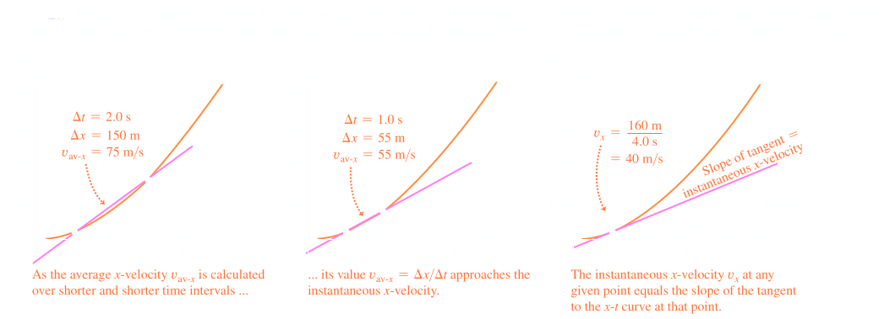
				- 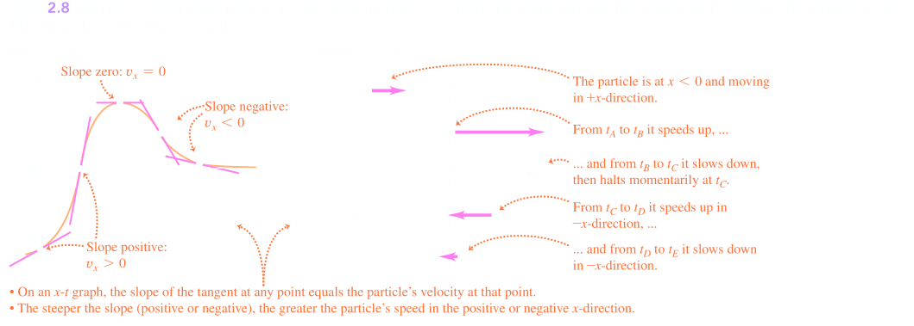
			- A **motion diagram** shows the motion of a particle at various instances as well as arrows to represent particle's velocity at each instant
				- 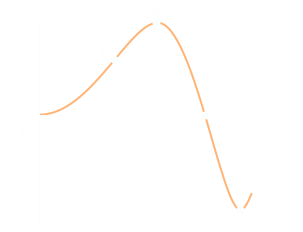
	- ## 2.3 Average and Instantaneous Acceleration
		- **Acceleration** describes rate of change of velocity with time
		- Like, velocity, it is a vector quantity
		- **Average acceleration** is the vector quantity of the change of velocity as an object travels from $P_1$ to $P_2$
			- $$a_{av-x} = \frac{\Delta v_x}{\Delta t} = \frac{v_{2x}- v_{1x}}{t_2-t_1}$$ where
			- $a_{av-x}$ is the **average** $x-$**acceleration** of a particle in a **straight-line motion** during $t_1$ to $t_2$
			- $\Delta v_x$ is the $x-$component of the particle's velocity
			- $\Delta t$ is the time interval
			- $x_2 - x_1$ is the final $x-$coordinate minus initial $x-$coordinate
		- **Instantaneous acceleration**  is the acceleration at a specific point in time
		- In Calculus, we can observe it as:
			- $$a_x = \lim_{\Delta t\rightarrow 0} \frac{\Delta v_x}{\Delta t} = \frac{dv_x}{dt}$$ where
			- $v_x$ is the **instantaneous velocity** of a particle in **straight-line motion**
			- $\lim_{\Delta t\rightarrow 0}$ equals the limit of the particles average acceleration as the time interval reaches zero
			- $\frac{dv_x}{dt}$ equals the instantaneous rate of change of the the particles velocity
		- 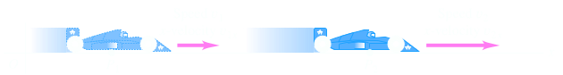
		- ### Finding Acceleration on a $v_x-t$ Graph or $x-t$ Graph
			- On a graph of $x-$velocity as a function of time, the instantaneous $x-$acceleration at any point is equal to the slope of the tangent to the curve at that point
			- 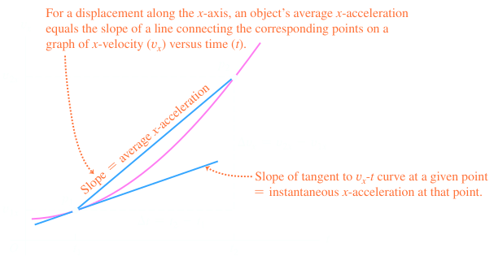{:height 334, :width 607}
			- | **If x-coordinate is:** 	| **... x-velocity is:** 	|
			  | Positive & increasing (getting more positive) 	| Positive: Particle is moving in $+x$ direction  and speeding up	|
			  | Positive & decreasing (getting less positive) 	| Negative: Particle is moving in $+x$ direction and slowing down 	|
			  | Negative & increasing (getting more negative) 	| Positive: Particle is moving in $-x$ direction and slowing down 	|
			  | Negative & decreasing (getting less negative) 	| Negative: Particle is moving in $-x$ direction and speeding up	|
			- Deceleration can be considered a decrease in speed, or negative acceleration
			- Acceleration can also be derived from a position-time graph such that:
				- $$a_x = \frac{dv_x}{dt} = \frac{d}{dt}(\frac{dx}{dt}) = \frac{d^2x}{dt^2} $$
				- The second derivative of  function is directly related to concavity and curvature
			- 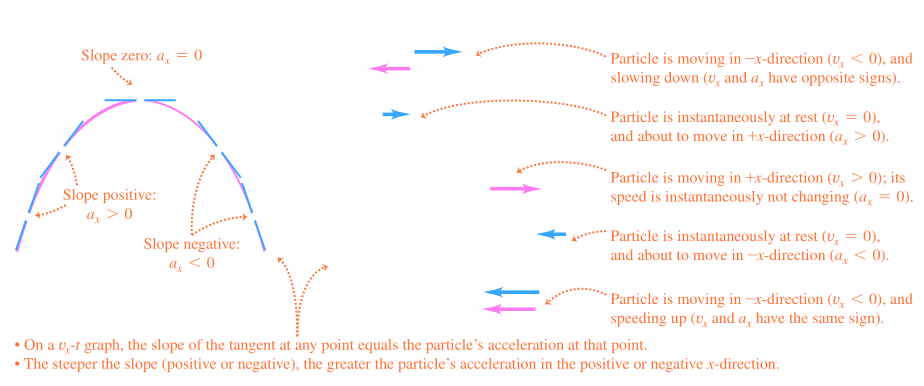
		- 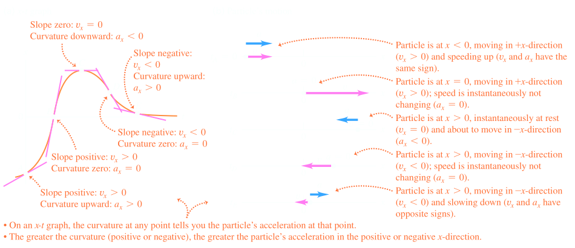
		- |  	| **On a** $x-t$ **graph** 	| **On a** $v_x-t$ **graph** 	|
		  |---	|---	|---	|
		  | Value of a graph at a given time: 	| The coordinate $x$ at that time 	| The velocity $v_x$ at that time 	|
		  | Slope of a graph at a given time: 	| The velocity $v_x$ at that time 	| Acceleration $a_x$ at that time 	|
		  | Curvature or Concavity of a graph at a given time: 	| Acceleration $a_x$ at that time 	| If acceleration a_x is changing at that time 	|
	- ## 2.4 Motion with Constant Acceleration
		- *Constant acceleration* is the simplest kind of accelerated motion in straight-line motion
		- Can be found with the equation:
			- $$a_x =\frac{v_{2x} - v_{1x}}{t_2-t_1}$$
			- 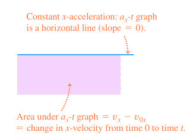
		- The final equation we can use in such a scenario becomes
			- $$a_x = \frac{v_x - v_{0_x}}{t-1}$$ or
			- $$v_x = v_{0_x} + a_xt$$ where
			- $v_x$ is the **velocity** at time $t$ of a particle with **constant acceleration**
			- $v_{0x}$ is the velocity of the particle at time 0
			- $a_x$ is the constant acceleration of the particle, and $t$ is time
			- 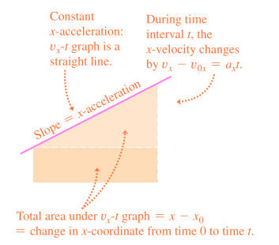
		- ### Equations:
			- $$v_{av-x} = \frac{1}{2}(V_{0_x} + V_x)$$ (constant $x-$acceleration only)
			- $$v_{av-x} = \frac{1}{2}(v_{0_x} + v_{0_x}+a_xt)$$
			- $$x = x_0 +v_{0_x}t + \frac{1}{2}a_xt^2$$ where
			- $x$ is the **position** at time $t$ of a particle with **constant** $x-$**acceleration**
			- $x_0$ is the position of the particle at time 0
			- $\frac{1}{2}a_x$ is the constant acceleration of the particle
			- $t$ is time
			- 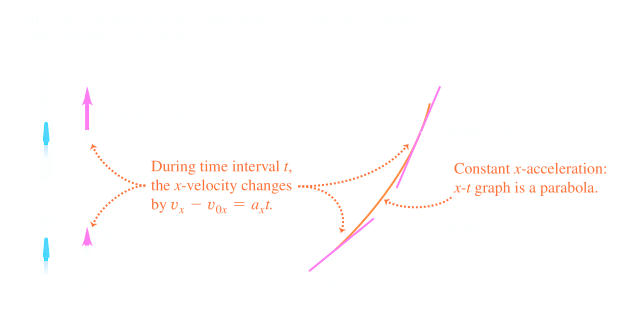
				- a) Straight line motion with constant acceleration
				- b) Position-time graph for the motion
			- 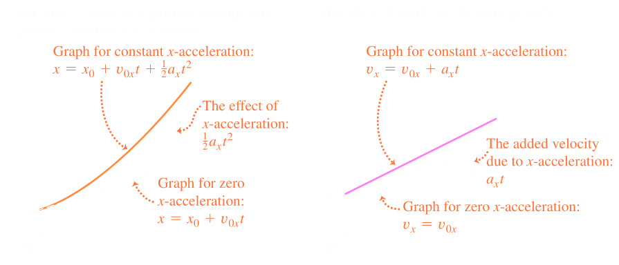
			- How constant acceleration affects a particle:
				- a)$x-t$ graph
				- b)$v_x-t$ graph
			- $$v_x^2 = v_{0_x}^2a_x(x-x_0)$$ where
				- $x-$**velocity** at time $t$ of a particle with **constant acceleration**
				- $v_{0_x}^2$ is velocity of particle at time 0
				- $2a_x$ is the constant acceleration of the particle
				- $x-x_0$ is change in position of particle over interval $[0,t]$
			- $$x-x_0 = \frac{1}{2}(v_{0_x}+v_x)t$$ where
				- $x-x_0$ is change in position of particle over interval $[0,t]$
				- $$v_{0_x}$ is velocity of particle at time 0
				- $v_{x}$ is velocity of particle at time $t$
				- $t$ is time
			- 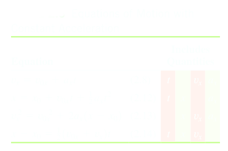
			- 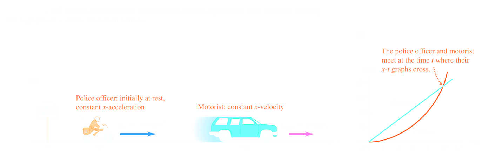
	- ## 2.5 Freely Falling Objects
		- A **free falling object** is any object moving freely under influence of gravity alone
		- It is not dependent on the initial motion of the object:
			- Dropped, released from rest
			- Thrown downward
			- Thrown upward
		- ### Acceleration of Free Fall
			- Acceleration of an object in free fall is always directed downward
			- Magnitude of free fall acceleration is $g = 9.8 m/s^2$
				- $g$ decreases with increasing altitude
				- $g$ varies with latitude
				- $9.8 m/s^2$ is the average at the Earth's surface
	- ## 2.6 Velocity and Position by Integration
- ## [[Motion in Two or Three Dimensions]] #[[PHY 1124]]
	- ## 3.1 Position and Velocity Vectors
		- The **position vector** (denoted by $\vec{r}$) is the vector of a particle at a current instance that goes from the origin of the coordinate system to a point $P$
			- Cartesian coordinates, $(x,y,z)$ of point$P$ are the components of vector $\vec{r}$
		- **Unit Vectors:**
			- $$\vec{r} = x \hat{i}+y \hat{j} + z \hat{k}$$ where
				- $\vec{r}$ is the **position vector** of a particle at a given instant
				- $x,y,z$ are the coordinates of the particle's position
				- $\hat{i}, \hat{j}, \hat{k}$ are the unit vectors in the $x,y,z$ direction
		- During a time interval $\Delta t$, the particle can move from $P_1$ (position vector $\vec{r_1}$) to $P_2$ ($\vec{r_2}$)
			- 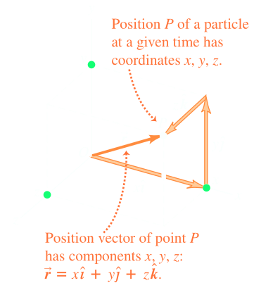
		- Change of **displacement** in vector form during this interval is:
			- $$\Delta \vec{r} = \vec{r_2} - \vec{r_1} = (x_2 - x_1) \hat{i} + (y_2 - y_1) \hat{j} + (z_2 - z_1) \hat{k}$$
		- **Average velocity**, $\vec{v}_{av}$ can be denoted by displacement divided by time interval:
			- $$\vec{v_{av}} = \frac{\vec{r}}{\Delta t} = \frac{\vec{r_2} - \vec{r_1}}{t_2 - t_1}$$ where
				- $\vec{v}_{av}$ is the **average velocity vector** of a particle during time interval $t_1$ to $t_2$
				- $\Delta \vec{r}$ is change in particle's position vector ($\vec{r_2} - \vec{r_1}$)
				- $\Delta t$ is time interval ($t_2-t_1$)
		- **Instantaneous velocity** is also defined as the instantaneous rate of change with time:
			- $$\vec{v} = \lim_{t \rightarrow 0} \frac{\Delta \vec{r}}{\Delta t} = \frac{d \vec{r}}{dt}$$ where
				- $\vec{v}$ is the **instantaneous velocity vector** of a particle
				- $lim_{t \rightarrow 0} \frac{\Delta \vec{r}}{\Delta t}$ is the limit of the average velocity vector as time approaches 0
				- $\frac{d \vec{r}}{dt}$ is the instantaneous rate of change of its position vector
			- 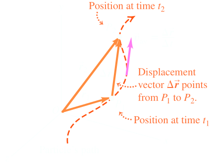
			- *Magnitude* of $\vec{v}$ is **speed** $v$ of particle at that instant and direction of particle is same as $\vec{v}$
			- At every point along the path the ^^instantaneous velocity vector is tangent to the path at that point^^
				- 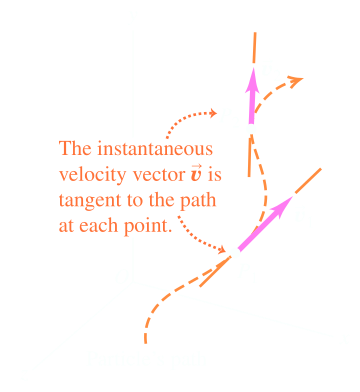
			- The easiest way to calculate the instantaneous velocity is using the same method at straight-line motion:
				- $$\vec{v_x} = \frac{dx}{dt} \qquad \vec{v_y} = \frac{dy}{dt} \qquad \vec{v_z} = \frac{dz}{dt}$$ where
					- $v_x, v_y, v_z$ each are the **component of** a particle's **instantaneous velocity vector**
					  id:: 65a8c30f-12b9-4944-af71-7abd957da82e
					- $\frac{d-}{dt}$ equal the instantaneous rate of change of corresponding coordinates
			- We can also derive based on the unit vectors, which aren't dependent on time:
				- $$\frac{d \vec{r}}{dt}  = \frac{dx}{dt}  \hat{i}+ \frac{dy}{dt} \hat{j} + \frac{dz}{dt} \hat{k}$$
			- Magnitude of instantaneous velocity $\vec{v}$ (speed), is given by components and Pythagorean theorem:
				- $$|\vec{v}| = v = \sqrt{v_x^2 +v_y^2 +v_z^2}$$
				- 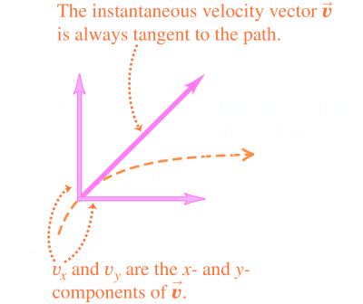
			- In 2-D plane we can also calculate angle $\alpha$ using:
				- $$\tan \alpha = \frac{v_y}{v_x}$$
	- ## 3.2 The Acceleration Vector
		- **Acceleration** describes change in velocity of a particle
		- As a vector, is describes change in magnitude and direction
		- 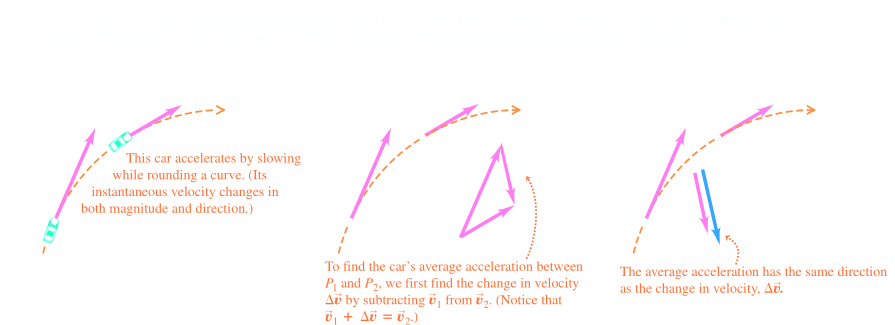
		- **Average acceleration** $\vec{a}_{av}$ is the velocity change divided by the time interval
			- $$\vec{a}_{av} = \frac{\Delta \vec{v}}{\Delta t} = \frac{\vec{v}_2- \vec{v}_1}{t_2 - t_1}$$ where
				- $\vec{a}_{av}$ is the **average acceleration vector** of a particle during time interval
				- $\Delta \vec{v}$ is change in particle's velocity ($\vec{v}_2- \vec{v}_1$)
				- $\Delta t$ is the time interval ($t_2 - t_1$)
		- **Instantaneous acceleration** $\vec{a}$ at point $P_1$ as the limit of the average acceleration vector when point $P_2$ approaches $P_1$
			- $$\vec{a} = \lim_{\Delta t \rightarrow 0} \frac{\Delta \vec{v}}{\Delta t} = \frac{d \vec{v}}{dt}$$ where
				- $\vec{a}$ is the **instantaneous acceleration vector** of a particle
				- $\lim_{\Delta t \rightarrow 0} \frac{\Delta \vec{v}}{\Delta t}$ is the limit of its average acceleration as the time interval approaches 0
				- $\frac{d \vec{v}}{dt}$ is the instantaneous rate of change of the velocity vector
			- Each component of the acceleration vector is the derivative of the corresponding component of velocity:
				- $$a_x = \frac{dv_x}{dt} \qquad a_y = \frac{dv_y}{dt} \qquad a_z = \frac{dv_z}{dt}$$ where
					- $a_x, a_y, a_z$ are **components** of a particle's **instantaneous acceleration vector**
					- $\frac{d}{dt}$ is the instantaneous rate of change of its corresponding velocity component
				- In terms of unit vectors:
					- $$\vec{a} = \frac{d \vec{v}}{dt}  = \frac{dv_x}{dt}  \hat{i}+ \frac{dv_y}{dt} \hat{j} + \frac{dv_z}{dt} \hat{k}$$
				- 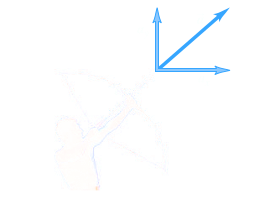
					-
			- Component of velocity is derivative of corresponding coordinate, we can express components                                 of the acceleration vector $\vec{a}$ as:
				- $$a_x = \frac{d^2x}{dt^2} \qquad a_y = \frac{d^2y}{dt^2} \qquad a_z = \frac{d^2z}{dt^2}$$
		- ### Parallel and Perpendicular Components of Acceleration
			- $\vec{a}$ is in terms of one component *parallel* to the particle's path and its velocity $\vec{v}$ and one component is *perpendicular* to path and to $\vec{v}$
				- 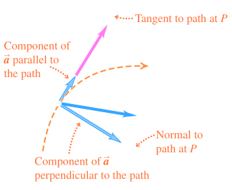
			- 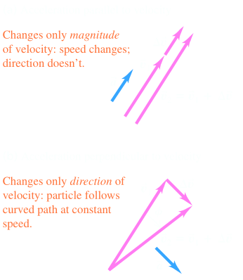
		- A particle moving along a curve path may have three situations: constant speed, increasing speed, and decreasing speed
			- If speed if constant, $\vec{a}$ is perpendicular to path and to \vec{v}$ and points towards concave side of path
			- If speed is increasing, there is a parallel component in direction of $\vec{v}$ and perpendicular component of $\vec{a}$
			- If speed is decreasing, the parallel component has opposite direction to $\vec{v}$ and $\vec{a}$ points behind normal to the path
		- 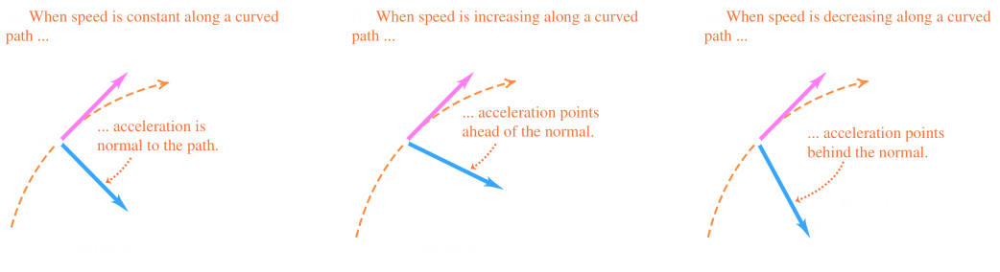
	- ## 3.3 Projectile Motion
		- A **projectile** is any object that is given an initial velocity and follows a path determined by effects of gravitational acceleration and air resistance
		- A path flowed by a projectile is called its **trajectory**
			- 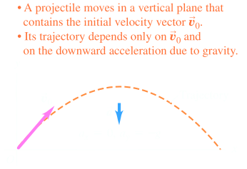
		- Projectile Motion is always confined to the vertical plane as it is determined by the direction of initial velocity and gravity, which is a purely vertical force
		- Projectile motion is therefore *two-dimensional* with the plane of motion residing in the $xy-$coordinate plane
		- Projectile motion can be analyzed as a combination of horizontal motion with constant velocity and vertical motion with constant acceleration
		- The components of $\vec{a}_g$ are $a_x = 0$ and  $a_y = -g$ (projectile motion, no air resistance)
		- ### Equations:
			- $$v_x = v_{0_x}$$
			- $$x = x_0 + v_{0_x}t$$
			- For the $y-$motion we substitute $y$ for x, $v_y$ for $v_x$, $v_{0_y}$ for $v_{0_x}$, and $a_y = -g$ for $a_x$
				- $$v_y = v_{0_y} - gt$$
				- $$y= y_0 + v_{0_y}t - \frac{1}{2}gt^2$$
			- 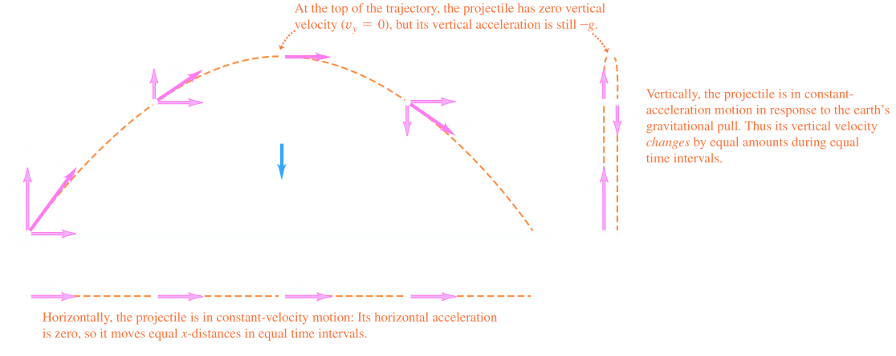
			-
	- ## 3.4 Motion in A Circle