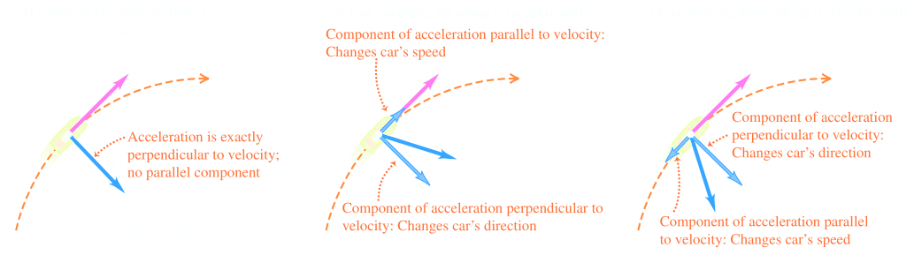
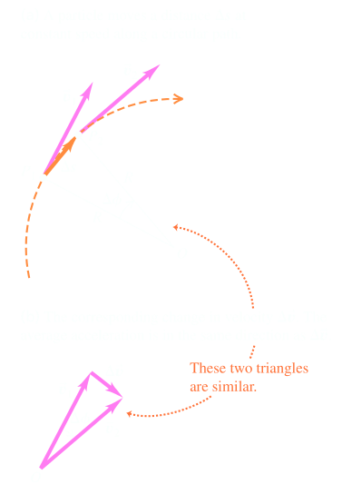
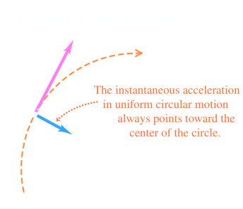
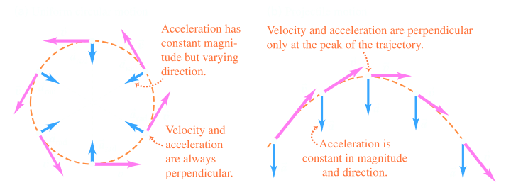
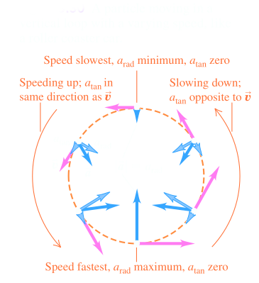
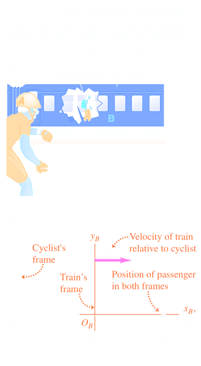
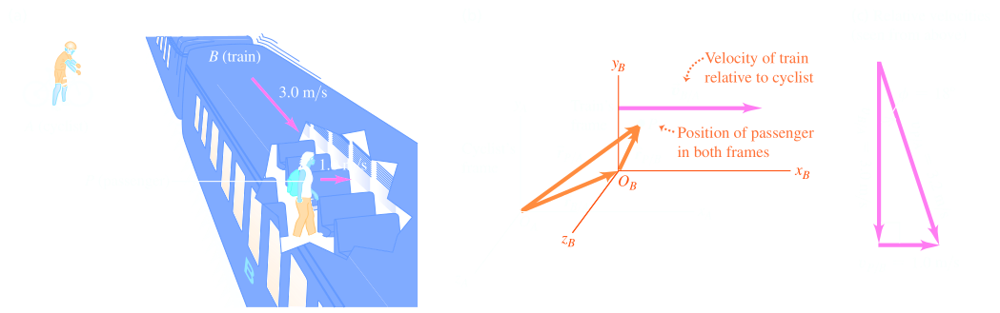

## [[Motion in Two or Three Dimensions]] #[[PHY 1124]]
	- ## 3.4 Motion In a Circle
	  id:: 65ae70db-6fd8-4794-9892-c01eeaf02e5f
		- A particle moving in a circle with *constant* speed, is in **uniform circular motion**
		- There is no component of acceleration tangent(parallel) to the path, or the speed would change
		- Acceleration vector is normal (perpendicular) to the path and therefore directed inward towards centre of circular path, causing direction of velocity to change without changing speed
		- 
		- A particle moving with with constant speed circulating around path $R$ with centre $O$
			- Particle moves $\Delta s$ from $P_1$ to $P_2$ in time interval $\Delta t$
		- Therefore the following equation can help us calculate acceleration:
			- $$a_{rad} = \frac{v^2}{R}$$ where
				- $a_{rad}$ is the magnitude of acceleration of an object in **uniform circular motion**
					- $$rad$$ denotes the direction of instantaneous acceleration at each point is always along a radius of circle (towards centre)
				- $v^2$ is the speed of the object
				- $R$ is the radius of the object's circular path
			- In **uniform circular motion**, the magnitude of $a_{rad}$ of the instantaneous acceleration is equal to the square of $v$ divided by radius $R$ of circle
			- The direction is perpendicular to $\vec{v}$ and inward along acceleration
			- This is why it can also be called **radial acceleration** or **centripetal acceleration**
			- {:height 463, :width 310} {:height 241, :width 287}
		- **Uniform Circular Motion vs. Projectile Motion**
			- In both motions, the *magnitude* of acceleration is same at all times
			- However, the *direction* of $\vec{a}$ changes continuously in uniform circular motion going inward
			- {:height 235, :width 571}
		- The magnitude of acceleration in uniform circular motion can be expressed in terms of the **period** $T$ of motion, or the time for one revolution
		- Time $T$ the particle travels a distance equal to the circumference $2 \pi R$ of the circle, so speed can be denoted as:
			- $$v = \frac{2 \pi R}{T}$$
		- The final expression can be:
			- $$a_{rad} =\frac{4\pi ^2 R}{T^2}$$ where
				- $a_{rad}$ is the magnitude of acceleration of an object in **uniform circular motion**
				- $R^2$ is the radius of object's circular path
				- $T^2$ is the period of motion
		- ### Nonuniform Circular Motion
			- When the speed varies as the particle travels around the circle, it is known as **nonuniform circular motion**
			- In nonuniform circular motion, there is still the *radial* component of acceleration $a_{rad} = v^2/R$ is always *perpendicular* to the instantaneous velocity, directed towards the centre
			- However, since speed $v$ varies, $a_{rad}$ is not constant
			- Radial or centripetal acceleration is greatest at the point in the circle where speed is also the greatest
			- In nonuniform circular motion, there is also a component of acceleration that is *parallel* to instantaneous velocity
			- This is $a_{||}$ or $a_{tan}$ called **tangential acceleration**, equal to the rate of change of *speed*
				- $$a_{rad} = \frac{v^2}{R} \text{  and  } a_{tan} = \frac{d|\vec{v}|}{dt}$$
			- The tangential component is in the same direction as the velocity if the particle is speeding, and slowing if in the opposite direction, constant speed denotes $a_{tan} = 0$
			- **Uniform vs. Nonuniform Circular Motion**
				- The two quantities:
					- $$\frac{d|\vec{v}|}{dt} \text{  and  } |\frac{d\vec{v}}{dt}|$$
					- are not the same
				- $\frac{d|\vec{v}}{dt}$ is ^^tangential acceleration^^, the rate of change of speed
					- It is zero whenever a particle moves with constant speed, even when its direction of motion changes (such as in *uniform* circular motion)
				- $|\frac{d\vec{v}}{dt}|$ is the magnitude of the vector acceleration; it is only 0 when particle acceleration *vector* is 0, when particle moves in stratight line with constant pseed
				- In ^^uniform circular motion^^:
					- $$|\frac{d\vec{v}}{dt}| = a_{rad} = \frac{v^2}{r}$$
				- In ^^nonuniform circular motion^^:
					- $$|\frac{d\vec{v}}{dt}| = \sqrt{a_{rad}^2 + a_{tan}^2}$$
				- {:height 258, :width 321}
	- ## 3.5 Relative Velocity
	  id:: 65ae90bf-36f2-44c8-b622-5cbf6359039c
		- Velocity seen *relative* to an observer is **relative velocity**
		- ### Relative Velocity in One Direction
			- Observing movement based on the relative point of view of an observer is called the **frame of reference**
				- Can be seen as a coordinate system and time scale
			- In straight-line motion, the position of a point $P$ relative to frame $A$ is given by $x_{P/A}$ (position $P$ w.r.t. $A$) and position of $P$ relative to frame $B$ is given by $x_{P/A}$
			- The amalgamation of both, is the position of origin $B$ w.r.t. the origin $A$, denoted by $x_{B/A}$
			- Summarising everything:
				- $$x_{P/A} = x_{P/B} + x_{B/A}$$
			- The $x-$velocity of $P$ relative to frame $A$ denoted by $v_{P/A-x}$ is the derivative $x_{P/A}$ w.r.t time
			- So the relationship of various velocities can be seen as:
				- $$\frac{dx_{P/A}}{dt} = \frac{dx_{P/B}}{dt} + \frac{dx_{B/A}}{dt}$$ or
				- **Relative Velocity Along a Line:**
					- $$v_{P/A-x} = v_{P/B-x} + v_{B/A-x}$$ where
					- Each value is the $x-$velocity of a point relative to a frame
			- 
		- ### Relative Velocity in Two or Three Directions
			- A frame of reference can be seen from a ground observer and a moving observer aswell
			- However this case, instead of just coordinates $x$, we also use positions vectors:
				- $$\vec{r}_{P/A} = \vec{r}_{P/B} + \vec{r}_{B/A}$$
				- 
			- The velocity of $P$ relative to $A$ is $\vec{v}_{P/A} = d \vec{r}_{P/A} / dt$ and using this we can  gather:
				- **Relative Velocity in Space**
					- $$\vec{v}_{P/A} = \vec{v}_{P/B} + \vec{v}_{B/A}$$ where
					- Velocity of an origin point in relative to a frame
					- Also known as the **Galilean Velocity Transformation**
				- Direction can be determined relative to a frame as well
					- $$\tan \phi  = \frac{v_{P/B}}{v_{B/A}}$$
				- In the case of motion along a straight line, if $A$ and $B$ are *any* two points or frames references,
					- $\vec{v}_{A/B} = -\vec{v}_{B/A}$
			-