## [[Motion in Two or Three Dimensions]] #[[PHY 1124]]
	- ## 3.4 Motion In a Circle
	  id:: 65ae70db-6fd8-4794-9892-c01eeaf02e5f
		- A particle moving in a circle with *constant* speed, is in **uniform circular motion**
		- There is no component of acceleration tangent(parallel) to the path, or the speed would change
		- Acceleration vector is normal (perpendicular) to the path and therefore directed inward towards centre of circular path, causing direction of velocity to change without changing speed
		- 
		- A particle moving with with constant speed circulating around path $R$ with centre $O$
			- Particle moves $\Delta s$ from $P_1$ to $P_2$ in time interval $\Delta t$
		- Therefore the following equation can help us calculate acceleration:
			- $$a_{rad} = \frac{v^2}{R}$$ where
				- $a_{rad}$ is the magnitude of acceleration of an object in **uniform circular motion**
					- $$rad$$ denotes the direction of instantaneous acceleration at each point is always along a radius of circle (towards centre)
				- $v^2$ is the speed of the object
				- $R$ is the radius of the object's circular path
			- In **uniform circular motion**, the magnitude of $a_{rad}$ of the instantaneous acceleration is equal to the square of $v$ divided by radius $R$ of circle
			- The direction is perpendicular to $\vec{v}$ and inward along acceleration
			- This is why it can also be called **radial acceleration** or **centripetal acceleration**
			- {:height 463, :width 310} {:height 241, :width 287}
		- **Uniform Circular Motion vs. Projectile Motion**
			- In both motions, the *magnitude* of acceleration is same at all times
			- However, the *direction* of $\vec{a}$ changes continuously in uniform circular motion going inward
			- {:height 235, :width 571}
		- The magnitude of acceleration in uniform circular motion can be expressed in terms of the **period** $T$ of motion, or the time for one revolution
		- Time $T$ the particle travels a distance equal to the circumference $2 \pi R$ of the circle, so speed can be denoted as:
			- $$v = \frac{2 \pi R}{T}$$
		- The final expression can be:
			- $$a_{rad} =\frac{4\pi ^2 R}{T^2}$$ where
				- $a_{rad}$ is the magnitude of acceleration of an object in **uniform circular motion**
				- $R^2$ is the radius of object's circular path
				- $T^2$ is the period of motion
		- ### Nonuniform Circular Motion
			- When the speed varies as the particle travels around the circle, it is known as **nonuniform circular motion**
			- In nonuniform circular motion, there is still the *radial* component of acceleration $a_{rad} = v^2/R$ is always *perpendicular* to the instantaneous velocity, directed towards the centre
			- However, since speed $v$ varies, $a_{rad}$ is not constant
			- Radial or centripetal acceleration is greatest at the point in the circle where speed is also the greatest
			- In nonuniform circular motion, there is also a component of acceleration that is *parallel* to instantaneous velocity
			- This is $a_{||}$ or $a_{tan}$ called **tangential acceleration**, equal to the rate of change of *speed*
				- $$a_{rad} = \frac{v^2}{R} \text{  and  } a_{tan} = \frac{d|\vec{v}|}{dt}$$
			- The tangential component is in the same direction as the velocity if the particle is speeding, and slowing if in the opposite direction, constant speed denotes $a_{tan} = 0$
			- **Uniform vs. Nonuniform Circular Motion**
				- The two quantities:
					- $$\frac{d|\vec{v}|}{dt} \text{  and  } |\frac{d\vec{v}}{dt}|$$
					- are not the same
				- $\frac{d|\vec{v}}{dt}$ is ^^tangential acceleration^^, the rate of change of speed
					- It is zero whenever a particle moves with constant speed, even when its direction of motion changes (such as in *uniform* circular motion)
				- $|\frac{d\vec{v}}{dt}|$ is the magnitude of the vector acceleration; it is only 0 when particle acceleration *vector* is 0, when particle moves in stratight line with constant pseed
				- In ^^uniform circular motion^^:
					- $$|\frac{d\vec{v}}{dt}| = a_{rad} = \frac{v^2}{r}$$
				- In ^^nonuniform circular motion^^:
					- $$|\frac{d\vec{v}}{dt}| = \sqrt{a_{rad}^2 + a_{tan}^2}$$
				- {:height 258, :width 321}
	- ## 3.5 Relative Velocity
	  id:: 65ae90bf-36f2-44c8-b622-5cbf6359039c
		- Velocity seen *relative* to an observer is **relative velocity**
		- ### Relative Velocity in One Direction
			- Observing movement based on the relative point of view of an observer is called the **frame of reference**
				- Can be seen as a coordinate system and time scale
			- In straight-line motion, the position of a point $P$ relative to frame $A$ is given by $x_{P/A}$ (position $P$ w.r.t. $A$) and position of $P$ relative to frame $B$ is given by $x_{P/A}$
			- The amalgamation of both, is the position of origin $B$ w.r.t. the origin $A$, denoted by $x_{B/A}$
			- Summarising everything:
				- $$x_{P/A} = x_{P/B} + x_{B/A}$$
			- The $x-$velocity of $P$ relative to frame $A$ denoted by $v_{P/A-x}$ is the derivative $x_{P/A}$ w.r.t time
			- So the relationship of various velocities can be seen as:
				- $$\frac{dx_{P/A}}{dt} = \frac{dx_{P/B}}{dt} + \frac{dx_{B/A}}{dt}$$ or
				- **Relative Velocity Along a Line:**
					- $$v_{P/A-x} = v_{P/B-x} + v_{B/A-x}$$ where
					- Each value is the $x-$velocity of a point relative to a frame
			- 
		- ### Relative Velocity in Two or Three Directions
			- A frame of reference can be seen from a ground observer and a moving observer aswell
			- However this case, instead of just coordinates $x$, we also use positions vectors:
				- $$\vec{r}_{P/A} = \vec{r}_{P/B} + \vec{r}_{B/A}$$
				- 
			- The velocity of $P$ relative to $A$ is $\vec{v}_{P/A} = d \vec{r}_{P/A} / dt$ and using this we can  gather:
				- **Relative Velocity in Space**
					- $$\vec{v}_{P/A} = \vec{v}_{P/B} + \vec{v}_{B/A}$$ where
					- Velocity of an origin point in relative to a frame
					- Also known as the **Galilean Velocity Transformation**
				- Direction can be determined relative to a frame as well
					- $$\tan \phi  = \frac{v_{P/B}}{v_{B/A}}$$
				- In the case of motion along a straight line, if $A$ and $B$ are *any* two points or frames references,
					- $\vec{v}_{A/B} = -\vec{v}_{B/A}$
- ## [[Newton's Laws of Motion]] #[[PHY 1124]]
	- ## 4.1 Force and Interactions
		- A **force** is a push or a pull
			- It can also be described as an *interaction* between two objects or between an object and it's environment
			- It always refer to an object *exerting* a force on a second object
			- **Force** is a vector quanity
		- When a force involves direct contact between two objects, such as a push or pull, it is called a **contact force**
			- 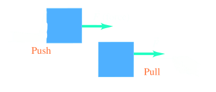
		- The **normal force** is exerted on an object by any surface with which it is in contact
			- *Normal* means that the force acts **perpendicular** to the surface of contact, no matter the angle of the surface
			- 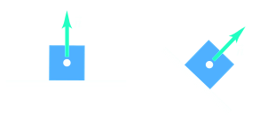
		- **Friction force** exerted on an object by a surface acts *parallel* to the surface, in the direction that opposes sliding
			- 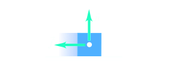
		- **Tension force** is the pulling force exerted by a stretched rope or cord when attached to an object
			- 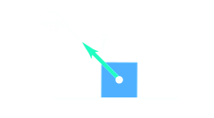
		- **Weight** is the gravitational force that the earth exerts on your body
			- 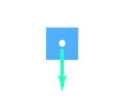
		- **Long-range forces** that act even when the objects are separated by empty space
			- Force between two magnets is an example of long-range force, as is the force of gravity
		- To describe the force vector $\vec{F}$, we need to describe the *direction* in whcih it acts as well as its *magnitude*, describes the force pushes or pulls
		- The SI unit of magnitude of force is **newton**, $N$
		- ### Superposition of Forces
			- Experiment shows that when two forces $\vec{F}_1$ and $\vec{F}_2$ act at the same time and point
			- Effect on object's motion, is same as single force $\vec{R}$
			- $\vec{R} = \vec{F}_1 +\vec{F_2}$
				- Any number of forces applied to an object have the same effect as a single force equal to the vector sum of the forces
				- This principle is known as the **superposition of forces**
				- 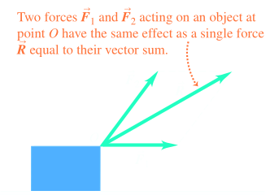
				-
			- Vector quantities like force $\vec{F}$ can be described in terms of $x$ and $y-$components $F_x$ and $F_y$ (the coordinate axis do not need to be horizontal or vertical)
				- 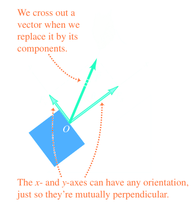
		- The **net force** is the vector sum (resultant) of *all* forces acting on object, denoted by:
			- $$\vec{R} = \sum \vec{F} = \vec{F}_1 + \vec{F}_2 + \vec{F}_3 +...$$ where
			- $\vec{R}$ is the net force acting on the object
			- $\sum \vec{F}$ is the vector sum, or resultant of all individual forces acting on the object
		- The $x$ and $y-$component can also be summed into individual forces ($R_x = \sum F_x$ or $R_y = \sum F_y$)
		- Once we have $R_x$ and $R_y$, we can find magnitude and direction of  net force $\vec{R} = \sum \vec{F}$ acting on the object
		- Magnitude is
			- $$R = \sqrt{R_x^2 + R_y^2}$$
		- and the angle $\theta$ between $\vec{R}$ and the $+x-$axis can be found the relationship $\tan \theta = R_y/R_x$
		- When dealing with 3-D problems, we can also determine magnitude with:
			- $$R = \sqrt{R_x^2 + R_y^2 + R_z^2}$$
	- ## 4.2 Newton's First Law
		- Forces that affect an object's motion are **external forces**
		- ### Newton's First Law of Motion
			- ^^An object acted on by no net external force has a constant velocity (which may be zero) and zero acceleration^^
			- The tendency of an object to keep moving once it is set in motion is **inertia**
			- It is also the tendency of an object at rest to remain at rest
			- 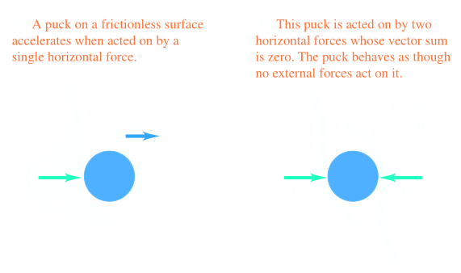
			- When a two forces, equivalent in magnitude but opposite in direction cancel each other out:
				- $$\sum \vec{F} = \vec{F}_1 + \vec{F}_2 = \vec{F}_1 +(-\vec{F}_1) =0$$
			- Newton's first law shows us that *zero net external force is equivalent to no external force at all*
			- When an object is at rest or moving with constant velocity (straight line with constant speed), the object is considered to be at **equilibrium**
			- $$\sum \vec{F} = 0$$
		- ### Inertial Frame of Reference
			- A frame of reference in which Newton's first law *is* valid is called an **inertial frame of reference**
			- Newton's first law is also sometimes referred to as the ^^law of inertia^^
			- 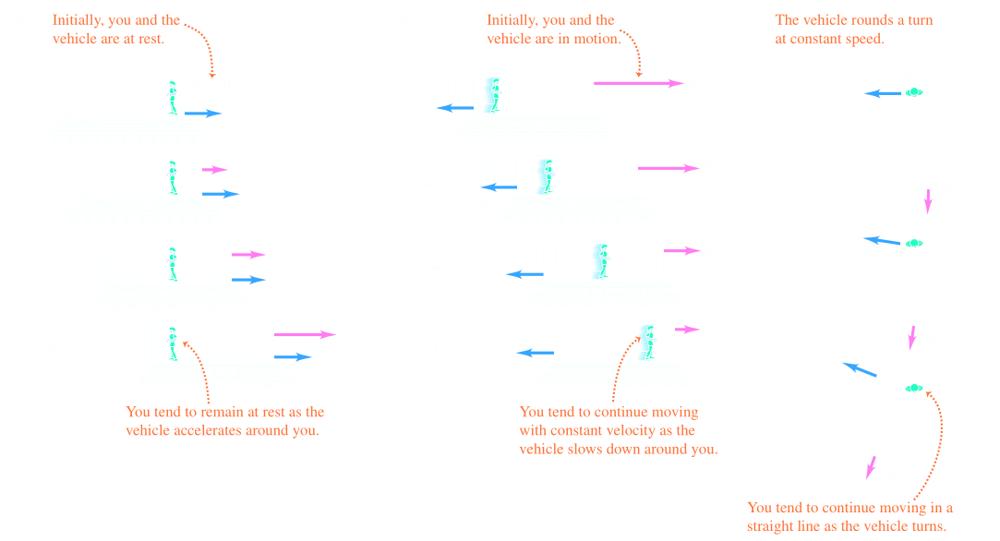
	- ## 4.3 Newton's Second Law
		- A net external force acting on an object causes the object to accelerate in the same direction as the net external force
			- If magnitude of the net external force is constant, then so is the magnitude of the acceleration
		- 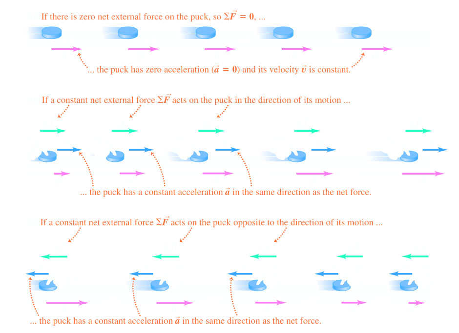
		- 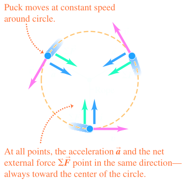
		- If we change the magnitude of the next external force, acceleration changes in the same magnitude
		- ### Mass and Force
			- The *ratio* of the magnitude $|\sum \vec{F}|$ of the net external force to the magnitude $a = |\vec{a}|$ of the acceleration is constant, regardless of net external force
			- The ratio is known as **inertial mass** or **mass**,  denoted by $m$:
				- $$m = \frac{|\sum{\vec{F}}|}{a}  \text{  or  } \qquad |\sum{\vec{F}}|= ma \text{  or  } \qquad a = \frac{|\sum \vec{F}|}{m}$$
			- Mass is the quantitative measure of inertia
			- 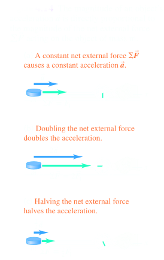
		- The SI unit of mass is **kilogram**
		- We can use the definition determined by Planck's constant
			- ^^One newton is the amount of net external force that gives an acceleration of 1 meter per second squared to an object with a mass of 1 kilogram^^
				- $$1 \text{N} = 1 \text{ kg}\cdot \text{m/s}^2$$
		- For the same net external force, the ratio of the masses of two objects is the inverse of the ratio of their accelerations:
			- $$m_1a_1 = m_2 a_2$$
			- $$\frac{m_2}{m_1} = \frac{a_1}{a_2}$$ (same net external force)
		- When two objects with masses $m_1$ and $m_2$ are fastened together, we find that the mass of the composite object is always $m_1 + m_2$
		- ### Stating Newton's Second Law
			- The net external force on an object is what causes an object to accelerate
			- A combination of forces $\vec{F}_1, \vec{F}_2, \vec{F}_3,...$ is applied to an object, the object will have the same acceleration vector $\vec{a}$ when only a single force is applied, if it is indeed a vector sum, deeming it a superposition of forces
			- **Newton's Second Law of Motion**
				- ^^If a net external force acts on an object, the object accelerates^^
				- ^^The direction of acceleration is the same as the direction of the net external force^^
				- ^^The mass of the object times the acceleration vector of the object equals the net external force vector^^
				- $$\sum \vec{F} = m \vec{a}$$
					- If there is a net external force on an object, it accelerates in the same direction as the net external force
				- Also can be seen as
					- $$\vec{a} = \frac{\sum \vec{F}}{m}$$
		- ### Using Newton's Second Law
			- Usually Newton's Second Law is split and using in its individual components:
				- $$\sum F_x = ma_x \qquad \sum F_y = ma_y \qquad \sum F_z = ma_z$$
			- The law only focuses on *external forces*
	- ## 4.4 Mass and Weigh
		- The **weight** of an object is the gravitational force that the earth exerts on the object
		- Mass characterizes the **inertial** properties of an object
		- The greater the mass, the greater the force needed to cause a given acceleration
		- Weight is the force **exerted on an object by the pull of the earth**
		- A large stone is hard to throw because of its large ^^mass^^, but hard to pick up due to large ^^weight^^
		- The magnitude of acceleration as an object falls to the ground is $9.8 \text{m/s}^2$
		- As a vector equation it can be defined as:
			- $$\vec{w} = m \vec{g}$$
		- $g$ is the magnitude of $\vec{g}$, acceleration due to gravity and therefore the *magnitude* of weight is always positive
			- 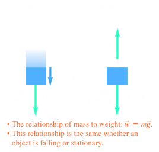
	- ## 4.5 Newton's Third Law
		- Whenever two objects interact, the two forces that they exert on each other are *equal in magnitude* and *opposite in direction*
		- ### Newton's Third Law of Motion
			- ^^If an object exerts a force on another object ("an action"), then the second object exerts a reaction force on the first^^
			- ^^Both forces have the same magnitude but opposite in direction, acting on *different* objects^^
			- $$\vec{F}_{A \text{ on } B} = - \vec{F}_{B \text{ on } A}$$
				- When two objects $A$ and $B$ exert forces on each other, the two forces have same magnitude in opposite directions
			- These two can be can be reffered to as an **action-reaction pair**
			- 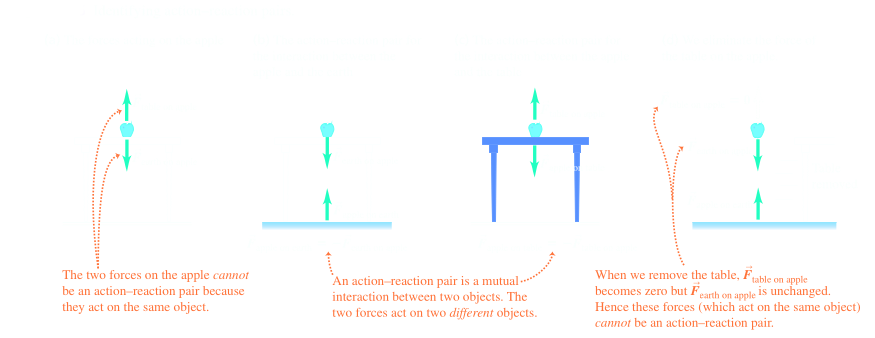
			- 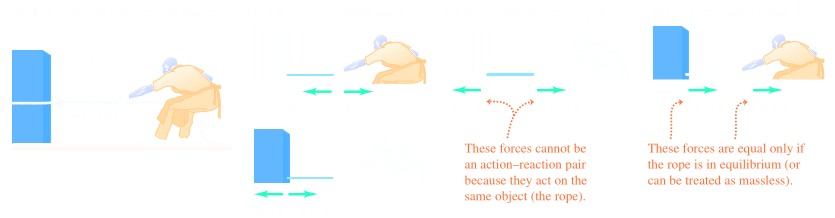
			- **Tension** at a point along a rope is the magnitude of force acting at that point
	- ## 4.6 Free Body Diagrams
		- **Newton's first and second laws apply to a specific object**
			- Whenever using Newton's first law, $\sum \vec{F} = 0$, for an equilibrium situation or Newton's second law $\sum \vec{F} = m \vec{a}$ for a nonequilibrium, it is important to define which object is being referred to
		- **Only forces acting on the object**
			- $\sum \vec{F}$ includes all forces that act *on* the object in question
			- It required to analyze all the forces acting on the object
			- In the case of Newton's third law, we also must consider the action-reaction, but on the member of pair that interacts with the object
		- **Free-Body Diagrams are essential to help identify relevant forces**
			- A **free-body** diagram shows the object with vectors drawn to show magnitude and direction of all the forces that act on the object
			- Include all forces *acting on* the object, but not forces that object *exerts on* another
- ## [[Applying Newton's Laws]] #[[PHY 1124]]
	- ## 5.1 Using Newton's First Law: Particles in Equilibrium
		- An object is in **equilibrium** when it is at rest or moving with constant velocity in a inertial frame of reference
		- The essential physical principle is Newton's First Law:
			- $$\sum \vec{F} = 0$$ is **Newton's First Law**
				- The net force on an object must be *zero* for an **object in equilibrium**
			- Sum of $x-$components of force on object must be zero ($\sum F_x =0$)
			- Sum of $y-$component of force on object must be zero ($\sum F_y = 0$)
	- ## 5.2 Using Newton's Second Law: Dynamics of Particles
		- These objects are **not** in equilibrium and instead accelerating:
			- $$\sum \vec{F} = m \vec{a}$$ where
				- $\sum \vec{F}$ is **Newton's** Second Law:
					- If the *net* force on an object is not zero, the object has *acceleration* in the same direction as the net force
				- $$\sum F_x = ma_x   \qquad \qquad \sum F_y = ma_y$$ shows that
				- Each component of the net force on the object equals the object's mass times the corresponding acceleration component
				- 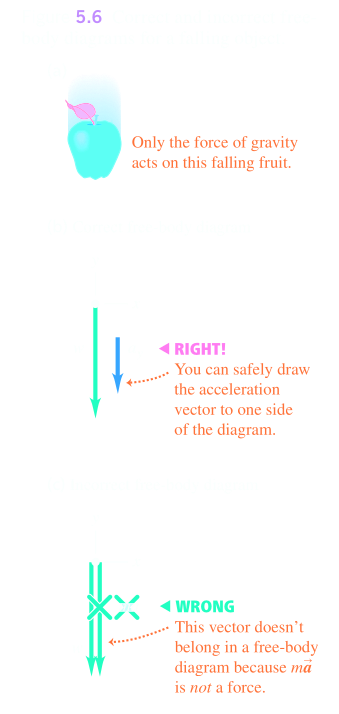{:height 473, :width 223}
		- ### Apparent Weight and Apparent Weightlessness
			- A passenger with mass $m$ rides in an elevator with $y-$acceleration $a_y$, a scale shows the passenger's apparent weight to be:
				- $n = m(g+a_y)$
			- As the elevator accelerates upward, $a_y$ is positive and $n$ is greater than the passenger's weight $w = mg$
			- As it is accelerating downward $a_y$ is negative, and $n$ is less than the weight of the passenger
			- In the case elevator has downward acceleration $a_y = -g$, it is in free fall, in which case $n = 0$ and passenger seems to be weightless
	- ## 5.3 Friction Forces