## [[Momentum, Impulse and Collisions]]
	- ## 8.5 Centre of Mass
	  id:: 65ca243a-d870-40b2-b651-dace51e4efc9
		- There is a special point in a system or object called the **centre of mass** that moves ^^as if all of the mass of the system is concentrated at that point^^
		- The system will move as if an external force were applied to a particle of mass $M$ located at the centre of mass
			- $M$ is the total mass of the system
		- ### A force is applied to a system of two particles of unequal mass connected by a light rigid rod
			- 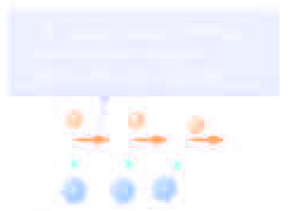 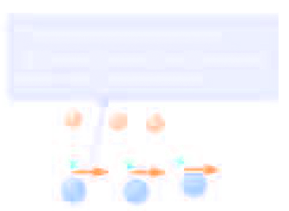
			- 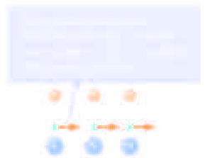
		- $$x_{cm} \equiv \frac{m_1 x_1+m_2x_2}{m_1+m_2}$$
			- 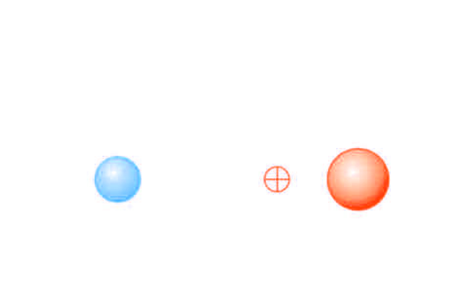
		- ### $n$ particles
			- $$x_{cm} \equiv \frac{m_1x_1 + m_2x_2 + m_3x_3 + ... + m_nx_n}{m_1 + m_2 + m_3 + ... + m_n} = \frac{\sum_{i=1}^n m_ix_i}{\sum_{i=1}^n m_i} = \frac{\sum_{i=1}^n m_i x_i}{M}$$
				- $$M = \sum_{i =1}^n m_i$$
		- ### Centre of Mass, Coordinates
			- The coordinates of the centre of mass are:
				- $$x_{cm} = \frac{\sum_i m_ix_i}{M} \qquad y_{cm} = \frac{\sum_i m_i y_i}{M} \qquad z_{cm} = \frac{\sum_i m_i z_i}{M}$$
				- where $M$ is the total mass of the system
		- ### Centre of Mass, Position Vector $r_{cm}$
			- The centre of mass can be located by its position vector, $\vec{r}_{cm}$
				- $$\vec{r}_{cm} = \frac{\sum_i m_i\vec{r}_i}{M}$$
			- $\vec{r}$ is the position of the $i$th particle, defined by
				- $$r_i = x_i \hat{i} + y_i \hat{j} + z_i \hat{k}$$
		- ### Centre of Mass, Extended Object
			- Think of the extended object as a system containing a large number of particles
			- The particle separation is small, so the mass can be considered a continuous mass distribution
				- 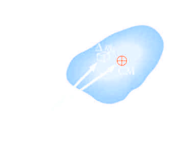
				- $$x_{cm} = \lim_{\Delta m_i \rightarrow 0} \frac{\sum_i x_i \Delta m_i}{M} = \frac{1}{M} \int xdm$$
				- $$y_{cm} = \lim_{\Delta m_i \rightarrow 0} \frac{\sum_i x_i \Delta m_i}{M} = \frac{1}{M} \int ydm$$
				- $$z_{cm} = \lim_{\Delta m_i \rightarrow 0} \frac{\sum_i x_i \Delta m_i}{M} = \frac{1}{M} \int zdm$$
			- ### Coordinates
				- The coordinates of the centre of mass of the object are
					- $$x_{cm} = \frac{1}{M} \int xdm  \qquad y_{cm} = \frac{1}{M} \int ydm \qquad z_{cm} = \frac{1}{M} \int zdm$$
			- ### Position
				- The position of the centre of mass can also be found by:
					- $$\vec{r}_{cm} = \frac{1}{M} \int \vec{r} dm$$
					- The centre of mass of any **symmetrical** object lies on an ^^axis of symmetry^^ and on any ^^plane of symmetry^^
		- ### Motion of a System of Particles
			- Assume the total mass, $M$, of the system remains constant
			- We can describe the **motion of the system** in terms of ^^the velocity and acceleration of the centre of mass of the system^^
			- We can also describe the momentum of the system and Newton's Second Law for the system
		- ### Velocity and Momentum of a System of Particles
			- The **velocity of the centre of mass** of a system of particles is
				- $$\vec{r}_{cm} = \frac{\sum_i m_i \vec{r}_i}{M} \qquad v_{cm} = \frac{d\vec{r}_{cm}}{dt} = \frac{1}{M} \sum_i m_i \frac{d\vec{r}_i}{dt} = \frac{\sum_i m_i \vec{v}_i}{M}$$
			- The momentum can be expressed as
				- $$M\vec{v}_{cm} = \sum_i m_i \vec{v}_i = \sum_i \vec{P}_i = \vec{P}_{tot}$$
			- The total linear momentum of the system equals the total mass multiplied by the velocity of the centre of mass, the **total linear momentum of the system** is ^^equal to that of a single particle of mass^^ $M$ ^^moving with a velocity^^ $\vec{v}_{cm}$
		- ### Acceleration of the Centre of Mass
			- The **acceleration of the centre of mass** can be found by differentiating the velocity with respect to time
				- $$v_{cm} = \frac{\sum_i m_i \vec{v}_i}{M}$$
				- $$a_{cm} = \frac{d \vec{v}_cm}{dt} = \frac{1}{M} \sum_i m_i \frac{d\vec{v}_i}{dt} = \frac{1}{M}$$
				- $$M\vec{a}_{CM} = \sum_i m_i \vec{a}_i = \sum_i \vec{F}_i$$
		- ### Forces in a System of Particles
			- The acceleration can be related to a force
				- $$M\vec{a}_{cm} = \sum_i F_i$$
			- If we sum over all the internal forces, they cancel in pairs and the ^^net force on the system^^ is caused only by ^^external force^^
				- $$\sum_i \vec{F}_{ext} = M\vec{a}_cm$$
		- ### Newton's Second Law for a System of Particles
			- Since the only forces are external, **the net force equals the total mass of the system multiplied by the acceleration of the centre of mass**
				- $$\sum F_{ext} = M \vec{a}_{cm}$$
			- The centre of mass of a system of particles of combined mass $M$ moves like an equivalent particle of mass $M$ would move under the influence of the net external force on the system\
			  background-color:: red
		- ### Momentum of a System of Particles
			- **The total linear momentum of a system of particles is conserved if no net external force is acting on the system**
			- If $\sum_i F_{ext} = 0$
				- $$M\vec{a}_{cm} = M \frac{d \vec{v}_{cm}}{dt} = \frac{d (M \vec{v}_{cm})}{dt} = 0$$
		- ### Motion of the Centre of Mass
			- If a projectile is fired into the air and suddenly explodes
			- With no explosion, the projectile would follow the dotted line
			- 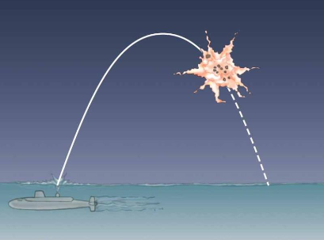
		- After the explosion, the centre of mass of the fragments still follows the dotted line, the same parabolic path the  project would have followed with no explosion
	- ## 8.6 Rocket Propulsion
	  id:: 65ca6a02-c315-4526-afa0-6ab6d0a2a428
		- The operation of a rocket depends on the law of conservation of linear momentum as applied to a system of particles, where the system is the rocket plus its ejected fuel
		- The initial mass of the rocket plus all its fuel is $M + \Delta m$ at time $t_i$ and velocity $\vec{v}$
		- The initial momentum of the system is $\vec{p}_i = (M + \Delta m)\vec{v}$
			- 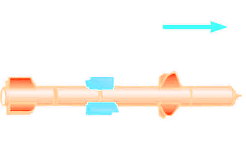
		- At some time $t + \Delta t$ the rocket's mass has been reduced to $M$ and an amount of fuel, $\Delta m$ has been ejected
		- The rocket's speed has been increase $\Delta v$
			- 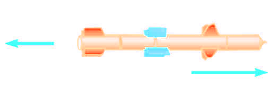
		- Because the gases are given some momentum when they are ejected out of the engine, the rocket receives a compensating momentum in the opposite direction
		- Therefore, the rocket is accelerated as a result of the "push" or thrust, from the exhaust gases
		- In free space, the centre of mass of the system (rocket plus expelled gases) moves uniformly independent of the propulsion process
			- 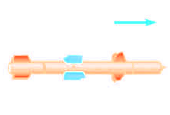{:height 178, :width 275} {:height 180, :width 377}
			-
		- ### Equations
			- $v_e$ - speed of the ejected fuel relative to the rocket
			- $v - v_e$ - speed of the ejected fuel relative to the Earth
			- $$(M + \Delta m) m = M(v+ \Delta v) + \Delta m(v- v_e)$$
			- $$M\Delta v = v_e \Delta m$$
			- A $\Delta t \rightarrow 0$, $\Delta v \rightarrow dv$ and $\Delta m \rightarrow dm$
			- $$dm = - dM$$
			- $$Mdv = v_e dm = - v_e dm$$
			- $$\int_{v_i}^{v_f} = - v_e \int_{M_i}^{M_f} \frac{dM}{M}$$
		- The **basic equation for rocket propulsion is**
			- $$v_f - v_i = v_e \ln(\frac{M_i}{M_f})$$
		- The increase in rocket speed is proportional to the speed of the escape gases $(v_e)$
			- So the exhaust speed should be very high
		- The increase in rocket speed is also proportional to the natural log of the ratio $M_i/M_f$
			- So, the ratio should be as large as possible, meaning the mass of the rocket without its fuel should be as small as possible and rocket should carry as much fuel as possible
		- ### Thrust
			- $$M dv = - v_e dM$$
			- The thrust on the rocket is the force exerted on it by the ejected exhaust  gases
			- Thrust $=$
				- $$M \frac{dv}{d} = |v_e \frac{dM}{dt}|$$
			- The thrust increases as the exhaust speed increases
			- The thrust increases at the rate of change of mass, (*burn rate*) increases
- ## [[Rotation of Rigid Bodies]]
	- ## 9.1 Angular Velocity and Acceleration
		- ### Rigid Object
			- A rigid object is one that is nondeformable
				- The relative location off all particles making up the object remain constant
				- All real objects are deformable to some extent, but the rigid object model is very useful in many situations where the deformation is negligible
		- ### Angular Position
			- Axis of rotation is centre of the disc
			- Point $P$ is fixed distance $r$ from origin when viewed through a fixed reference frame
			- 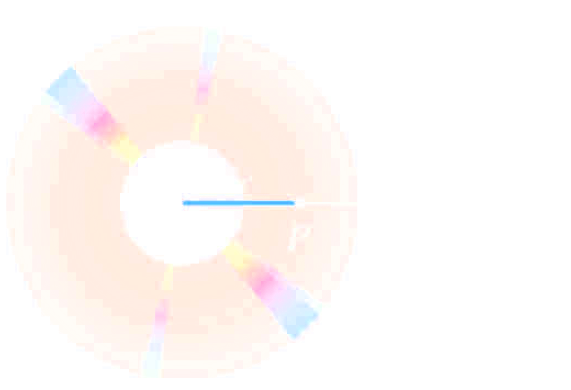
			- Point $P$ will rotate about the origin in a circle of radius $r$
			- **Every** particle on the disc undergoes circular motion about the origin, $O$
			- Polar coordinates are convenient to use to represent the position of $P$ (or any other point)
			- $P$ is located at $(r , \theta), where $r$ is the distance from the origin to $P$ and $\theta$ is **measured clockwise** from the reference line
			- 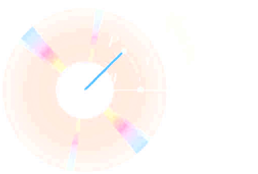
			- As particle moves, the only coordinate that changes in $\theta$
			- As particle moves through $\theta$, it moves through an arc length $s$
			- Arc length and $r$ are related
				- $s = \theta r$
			- We can associate the angle $\theta$ with the entire rigid object as well as with an individual particle
				- Remember every particle on the object rotates through the same angle
			- The **angular position** of the rigid object is the angle $\theta$ between the reference line on the object and the fixed reference line in space
				- Often the $x-$axis
		- ### Radian
			- This can also be expressed as
				- $$\theta = \frac{s}{r}$$
			- $\theta$ is a pure number, but commonly is given the artificial unit, radian
			- *One radian is the angle subtended by an arc length equal to the radius of the arc*
	- ## 9.2 Rotation with Constant Angular Acceleration
		- ### Angular Displacement
			- The *angular displacement* is defined as the angle the object rotates through some time interval
				- $\Delta \theta = \theta_f - \theta_i$
			- This is the angle that the reference line of length $r$ sweeps out
			-
			- 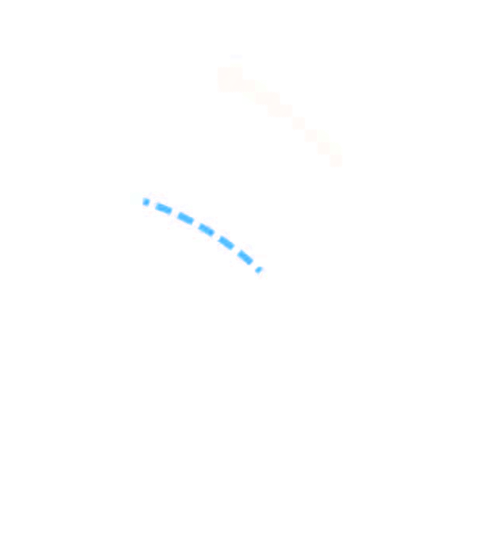{:height 226, :width 312}
		- ### Average Angular Speed
			- The average angular speed, $\overline{\omega}$ of a rotating rigid object is the ratio of the angular displacement to the time interval
				- $$\overline{\omega} = \frac{\theta_f - \theta_i}{t_f - t_i} = \frac{\Delta \theta}{\Delta t}$$
		- ### Instantaneous Angular Speed
			- The *instantaneous* angular speed is defined as the limit of the average speed as the time interval approaches zero
				- $$\omega \equiv \lim_{t \rightarrow 0} \frac{\Delta \theta}{\Delta t} = \frac{d\theta}{dt}$$
		- ### Angular Speed
			- Units of angular speed are radians/sec
			- Angular speed will be positive if $\theta$ is increasing (counterclockwise)
			- Angular speed will be negative if $\theta$ is decreasing (clockwise)
		- ### Average Angular Acceleration
			- The average angular acceleration $\overline{\alpha}$, of an object is defined as the ratio of the change in the angular speed to the time it takes for the object to undergo the change
				- $$\overline{\alpha} = \frac{\omega_f - \omega_i}{t_f -t_i} = \frac{\Delta \omega}{\Delta t}$$
		- ### Instantaneous Angular Acceleration
			- The instantaneous angular acceleration is defined as the limit of the average angular acceleration as the time goes to 0
				- $$\alpha \equiv \lim_{\Delta t \rightarrow 0} \frac{\Delta \omega}{\Delta t} = \frac{d \omega}{dt}$$
		- ### Angular Acceleration
			- Units of angular acceleration are rad/s$^{-2}$ since radians have no dimensions
			- Angular acceleration will be positive if an object rotating counterclockwise is speeding up
			- Angular acceleration will be negative if an object rotating clockwise is slowing
		- 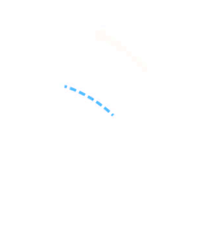
		- ### Angular Motion
			- When a rigid object rotates about a fixed axis in a given time interval, every portion on the object rotates through the same angle in a given time interval and has the same angular speed and same angular acceleration
			- So, $\theta, \omega, \alpha$, all characterize the motion of the **entire rigid object** as well as the ^^individual particles in the object^^
		- ### Directions
			- The acceleration $(\omega, \alpha)$ are the magnitudes of the velocity and acceleration vectors
			- The directions of $\omega$ is given by the **right-hand rule**
				- $\alpha$ is parallel to $\omega$ if $\omega$ is increasing with time
				- $\alpha$ is antiparallel to $\omega$ if $\omega$ is decreasing with time
	- ## 9.3 Relating Linear and Angular Kinetics
		- 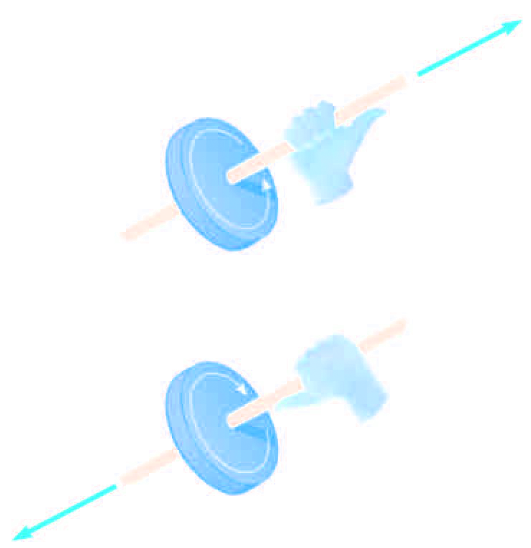
	- ## 9.4 Energy in Rotational Motion
	- ## 9.5 Parallel-Axis Theorem
	-