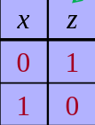
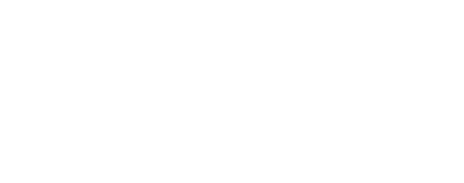
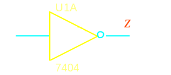
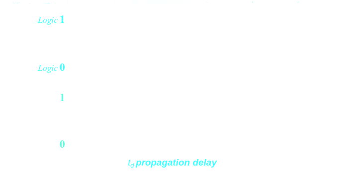
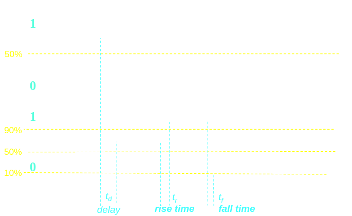
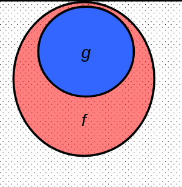
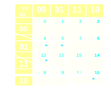

# [[Digital Logic Circuits]] #[[CEG 2136]]
	- ## Logic Functions
		- Logic function is the behaviour of a logic diagram
		- $$z_i = F_i (x_0, x_1, x_2, ...) | z_i \in \{0,1\}, i = 0,1,2, ...., m-1, x_k \in \{0,1\}, k =0,1,2, ..., n-1$$ where
		- $F_i =$ logic functions, $x_k =$ input variables, $z_i=$ output variables
		- **Logic function** $F$ can be ^^represented^^ by
			- Truth Tables
				- 
			- Block Diagrams
				- {:height 159, :width 353}
			- Logic (Boolean) expressions
			- **Logic Diagrams** (schematics) of logic circuits that implement these functions
				- {:height 134, :width 285}
			- K-Maps
		- ### Approximations of **Real** Time-Diagrams
			- **Propogation Delay**
				- Propagation delay is the amount of time required for a signal to be received after it has been sent, and the actual output is not instantaneously changed
				- 
			- **Rise Time/Fall Time**
				- Also referred to as slope or slew rate trigger, which measures the time the signal takes to transition between two voltage thresholds: from a lower threshold to an upper threshold, in rise time, or the **opposite** in fall time
				- 
	- ## Boolean Algebra
		- ### Boolean Algebra over Boolean Vectors
			- $$B_n =  \{(a_1, a_2, ..., a_n)| a_i \in \{0,1\}\}$$
			- Let $a = (a_1, a_2, ..., a_n)$ and $b= (b_1, b_2, ..., b_n) \in B^n$ define
				- $a \vee b = (a_1 \vee b_1, a_2 \vee b_2, ... a_n \vee b_n)$
				- $a \cdot b = (a_1 \cdot b_1, a_2 \cdot b_2, ... a_n \cdot b_n)$
		- ### Boolean Algebra Fundamental Theorems
			- Boolean algebra is used in digital design to ^^reduce any logical function (expression) to its simplest form^^
				- The minimization of the numbers of literals and number of terms
				- **Identities:**
					- $x + 0 = x$
					  logseq.order-list-type:: number
					- $x \cdot 1 = x$
					  logseq.order-list-type:: number
					- $x + x = x$ (Idempotency)
					  logseq.order-list-type:: number
					- $x \cdot x = x$
					  logseq.order-list-type:: number
					- $x + 1 = 1$ (Null)
					  logseq.order-list-type:: number
					- $x \cdot 0 = 0$
					  logseq.order-list-type:: number
					- $(x) = x$
					  logseq.order-list-type:: number
					- $x+y = y+x$  (Commutative)
					  logseq.order-list-type:: number
					- $xy = yx$  (Commutative)
					  logseq.order-list-type:: number
					- $x + (y + z) = (x+y) +z$ (Associative)
					  logseq.order-list-type:: number
					- $x(yz) = (xy)z$ (Associative)
					  logseq.order-list-type:: number
					- $x(y+z) = xy + xz$ (Distributive)
					  logseq.order-list-type:: number
					- $x + yz = (x+y)(x+z)$ (Associative)
					  logseq.order-list-type:: number
					- $(x+y) = x y'$ (DeMorgan)
					  logseq.order-list-type:: number
					- $(xy) = x + y$ (DeMorgan)
					  logseq.order-list-type:: number
					- $x + xy = x$ (Absorption)
					  logseq.order-list-type:: number
					- $x(x+y) = x$ (Absorption)
					  logseq.order-list-type:: number
	- ## Logic Functions Representations
		- ### 1. Truth Tables
			- The unique signature of a Boolean Function
			- Many alternative gate realizations have the same truth table
		- ### 2. Logic (Boolean) Expressions
			- Standard forms for a boolean expression, directly mapping the truth table and gives a unique algebraic signature; each term contains all the variables
				- **Sum-of-Products (^^SOP^^)**
					- Each *product term*(containing all or some of the variables and/or their negations) specifies when the function is true
					- Also known as ^^canonical disjunctive normal form^^ when all terms or used, or ^^minterm expansion^^
				- **Product-of-Sums (^^POS^^)**
					- Each *sum factor* (containing all or some of the variables and/or their negations) specifies when the function is false
					- Also known as ^^canonical conjunctive normal form^^ when all terms or used, or ^^maxterm expansion^^
		- ### 3. Digital Logic Gates
		- ### 4. Karnaugh Maps
			- Graphical representation of a truth table of a logic function
			- Each line in the truth table(minterm) corresponds to a square in the Karnaugh Maps
			- Karnaugh map squares are labelled so that horizontally or vertically **adjacent squares** differ by only one variable
	- ## Logic Minimization
		- Logic minimization aims to reduce:
			- Number of gates (resulting from reduction of the number of terms)
			- Number of inputs per gate (resulting from fewer variables per term)
		- Cost function: (proportional with) the number of gates inputs
		- Simplifying logic function $\rightarrow$ logic circuit minimization
		- Minimization reduces cost, efficiency and power consumption
		- ### Covering
			-  Space of all $2^n$ combinations
			- $g =$ input combinations for which $g$ outputs one
			- $f=$ input combinations for which $f$ outputs one
			- $f$ **covers** $g$, if $f=1$ whenever $g=1$, $f\ge g$
			- $g$ **implies** $f$, whenever $g=1 \rightarrow  f=1, g \le f$
		- **Implicant**
			- Any product term that *implies* a function $f$ (i.e. if, for some input combination, product term $g=1$, then $f=1$ for the same combination)
		- **Prime Implicant**
			- An implicant such that if one literal is removed, the resulting product no longer implies $f$
		- **Essential Prime Implicant (EPI)**
			- A prime implicant that covers a minterm that is not covered by an other prime implicants
			- 
		- **Redundant Prime Implicants**
			- A prime implicant for which each its minterms covered by EPIs,
		- ^^The minimal SOP of a function is a sum of prime implicants^^
		- ### Minimzation Using KMaps
		-