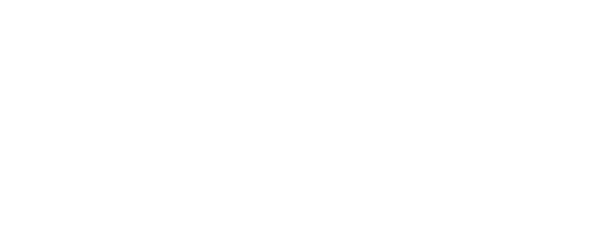

# [[Fundamental Data Structures]] #[[CSI 2110]]
	- ## Arrays
		- An **array** is a sequenced collection of variables all of the same type
		- Each variable or **cell**, in an array has an index, which uniquely refers to the value stored in that cell
			- The cells of a numbered array are 0,1,2, etc.
	- ## Linked Structures
- # [[Analysis of Algorithms]] #[[CSI 2110]]
	- ## Introduction
		- An **algorithm** is a step-by-step procedure for solving a problem in a finite amount of time
		- Analyzing an algorithm means to determine its efficiency
		- ### Running Time
			- The running time of an algorithm typically grows with the input size, but also depends on input data;
				- Different inputs of the same size can have different running times
				- 
			- ^^Average case^^ time is often difficult to determine
			- Normally focus of ^^worst case^^ running time as it is:
				- Easier to analyze
				- Crucial to applications such as games, finance and robotics
			- Example:
			  background-color:: blue
				- 
				- If the input are different integers with the same size (number of bits), the running will be very different depend if the input is odd or even
				- This is because for odd $x$, only a couple operations are executed , while for even $x$, the loop is run $x$ times
		- ### Experimental Studies
			- Write a program implementing the algorithm, and run it with inputs of varying size and composition, plotting the time needed
			- ```javascript
			  long startTime = system.currentTimeMillis(); //record the starting time
			  /*run the algorithm*/
			  long endTime = System.currentTimeMillis()    //record the ending time
			  long elapsed = endTime - startTime;          //compute the elapsed time
			  ```
			- {:height 192, :width 425}
		- ### Limitations of Experiments
			- It is necessary to implement the algorithm, which may be difficult
			- Results may not be indicative of the running time on other inputs not included in the experiment
			- In order to compare two algorithms, the same hardware and software environments must be used
		- ### Theoretical Analysis
			- It is a **general methodology** that:
				- Uses a ^^high-level description^^ of the algorithm ^^(pseudo code)^^ ^^independent^^ of implementation
				- Characterizes running time as a ^^function of the input size^^
				- Takes into account ^^all possible inputs^^
				- ^^Independent of the hardware and software^^ environment
		- ### Pseudocode
			- High-level description of an algorithm
			- More structured than English prose
			- Less detailed than a program
			- Preferred notation for describing algorithms
			- Hides program design issues
		- ### Pseudocode Details
			- #### Control Flow
				- `if... then... [else...]`
				- .`while... do...`
				- `repeat... until...`
				- `for...  do...`
				- Indentation replaces braces
			- #### Method Declaration
				- Algorithm `method(arg, [,arg...])`
					- `Input...`
					- `Output...`
			- #### Method Call
			- *method(arg[, arg...])*
			- #### Return Value
				- return *expression*
			- #### Expressions
				- ($\neg$) Assignment
				- ($=$) Equality testing
				- ($n^2$) Superscripts and other mathematical formatting allowed
			- Example:
			  background-color:: blue
				- ```d
				  /**Returns the max value of a nonempty array of numbers**/
				  public static double arrayMax(double[] data){
				    int n = data.length;
				    double currentMax = data[0];
				    for(int j = 1; j < n; j++){
				      if(data[j] > current max){
				        current max = data[j]
				      }
				    } 
				    return currentMax;
				  }
				  ```
				- ^^**Pseudocode**^^:
					- **Algorithm** arrayMax(*data*, n)
					                          Input: An array *data* storing *n* integers
					                          Output: The maximum element in *A*
					  *currentMax* <- *data*[0]
					  **for** *i* <- 1 to *n-1* **do**
					       **if** *data[i]* > *currentMax* **then**
					                *currentMax* <- *data*[i]
					  **return** *currentMax*
		- ### Random Access Machine (RAM Model)
			- A RAM consists of
				- A **CPU**
				- A potentially unbounded back of **memory** cells, each of which can hold an arbitrary number of character
				- Memory cells re numbered and accessing any cell in memory takes unit time
		- ### Primitive Operations
			- Basic computations performed by an algorithm
			- Identifiable in pseudocode
			- Largely independent from the programming language
			- Assumed to take a constant amount of time in the RAM model
			- Example:
			  background-color:: blue
				- Evaluating an expression
				- Assignment a value to a variable
				- Indexing into an array
				- Calling a method
				- Returning from a method
	- ## Asymptotic Analysis: Growth and Big-O Notation
		- ### Growth Running Time
			- Running time is taken as an average of fastest and slowest primitive operation
			- Why growth rate matters:
				- {:height 385, :width 656}
		- ### Big-O (Upper Bound)
			- Given two functions $f(n)$ and $g(n)$, we say that $f(n)$ is $O(g(n))$
			- If and only if there are positive constants $c$ and $n_0$ such that $f(n) \le c \ g(n)$ for all $n > n_0$
		- Big-O notation gives an upper bound on the growth rate of a function
		- The statement "$f(n)$ is $O(g(n))$ means the growth rate of $f(n)$ is no more than the growth rate of $g(n)$
		- We can use the Big-O notation to rank functions according to their growth rates
		- 
		- Example:
		  background-color:: blue
			- $7n-2$
				- It is $O(n)$, need $c>0$ and $n_0 \ge 1$ such that $7n-2 \le c \ n$ for $n \ge n_0$
					- This is true for $c=7$ and $n_0 = 1$
			- $3n^3 + 20 n^2 +5$
				- It is $O(n^3)$, need $c>0$ and $n_0 \ge 1$ such that $3n^3 + 20n^2 +5 \le c \ n^3$ for $n \ge n_0$
					- This true for $c = 4$ and $n_0 = 21$
			- $3 \log n + 5$
				- It is $O \log n$, need $c > 0$ and $n_0 \ge 1$ such that $3 \log n + 5 \le c \ \log n$ for $n \ge n_0$
					- This is true for $c=8$ and $n_0 = 2$
		- ### Big-O Conventions
			- If $f(n)$ is a polynomial of degree $d$, the $f(n)$ is $O(n^d)$,
				- Drop lower order term
				- Drop constant factors
				- Example:
					- $7n-3 = O(n)$
					- $8n^2 \log n + 5n^2 + n = O(n^2\log n)$
					- $12n^2 + 5000n^2 + 2n^4 = O(n^4)$
			- Use the smallest possible class of functions
			- Use simplest expression of the class
		- ### Asymptotic Algorithm Analysis
			- The asymptotic analysis of an