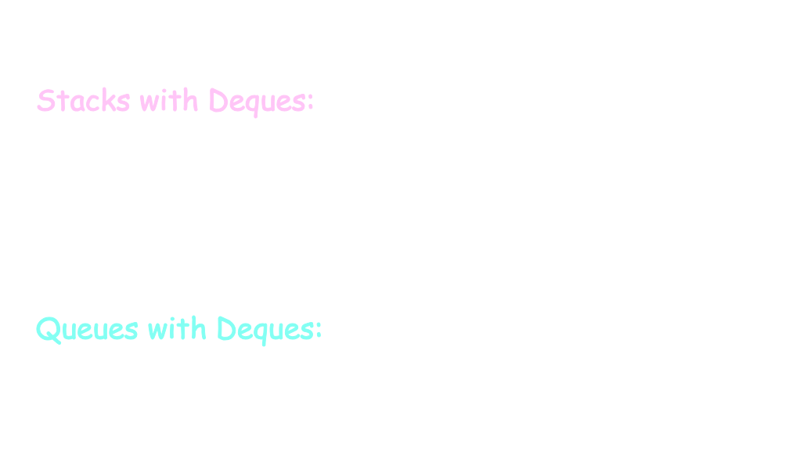

# [[Stacks, Queues, Deques]] #[[CSI 2110]]
id:: 670f47b4-d9f7-4e9a-9d82-14df54ff0be8
	- ## Abstract Data Types (ADT)
	  id:: 670f47b4-c671-438e-93fd-985101af3aa0
		- An **Abstract Data Type** is an ^^abstraction of a data structure^^
		- The **ADT** specifies:
			- *What can be stored* in the ADT
			- *What operations* can be done on/by the ADT
			- It specifies *what* each operation does, *NOT* how it does it
			- In Java an **ADT** can be expressed by an ^^interface^^
		- An **ADT** is realized/implemented by a ^^concrete data structure^^
			- A *concrete data structure implements an ADT* in the same way in Java, *a class implements an interface*
		- Specificy precisely the operations that can be performed
		- The implementation is HIDDEN and can be easily changed
	- ## Stacks
	  id:: 670f47b4-227a-4fb2-8058-211f812eaf5d
		- A **stack** is a collection of objects that are inserted and removed according to the **last in, first out (LIFO)** principle
		- **Main Methods:**
			- `push(e)`: Adds element `e` to the top of the stack
			- `object pop()`: Removes and returns the top element from the stack(or null if the stack is empty)
		- **Support Methods:**
			- `object top()`: Returns the top element of the stack, without removing it (or null if the stack is empty)
			- `int size()`: Returns the number of elements stored in the stack
			- `isEmpty()`: Returns a boolean indicating whether the stack is empty
		- Stack Interface in Java
			- ```d
			  public interface Stack<E>{
			    int size();
			    boolean isEmpty();
			    E top();
			    void push(E element);
			    E pop();
			  }
			  ```
		- ### Array-Based Stack Implementation
			- The elements are stored in an array, with capacity $N$ for some fixed $N$
				- The stack is oriented so that the bottom element is stored at the first position in the array, and each subsequent element is stored at the end of the array at some index $t$
				- {:height 96, :width 656}
			- Array implementation is relatively simple and efficient however it relies on always having a fixed-capacity array, limiting the size of the stack
			- ^^**Note**^^: All the methods run in constant time, at $O(1)$ time
				- The performance of the stack is however dependent on the size of the array, so the space used is $0(N)$
		- ### Singly Linked List-Based Implementation
			- Using a singly-linked list allows for memory usage proportional to the number of elements in the stack, and without a capacity limit
			- The elements can be accessed from the front of the list, making the top of the stack the front of the list, making all methods execute in constant time
		- ### Direct Applications
			- Page-visited history in a web browser
			- Undo sequence in a text editor
			- Chain of method calls in JVM
		- ### Indirect Applications
			- Auxiliary data structure for algorithms
			- Component of other data structures
	- ## Queues
	  id:: 670f47b4-c84d-42a3-9a0e-0bd11b9a4fe6
		- A **queue** is a collection of objects that are inserted and removed according to the **first-in, first out (FIFO)** principle
			- Elements can be inserted at any time, but only the element that has been in the queue for the longest can be next removed
			- Elements are inserted at the **rear**(^^enqueued^^) and removed from the **front**(^^dequeued^^)
		- **Main Methods:**
			- `enqueue(e)`: Adds element `e` to the back of the queue
			- `dequeue()`: Removes and returns the first element from the queue (or null if the queue is empty)
		- **Support Methods:**
			- `first()`: Returns the first element of the queue, without it removing it (or null if the queue is empty)
			- `size()`: Returns the number of elements in the queue
			- `isEmpty()`: Returns a boolean indicating whether the queue is empty
		- Stack interface in Java
			- ```d
			  public interface Queue<E>{
			    int size();
			    boolean isEmpty();
			    E first();
			    void enqueue(E e);
			    E dequeue();
			  }
			  ```
		- ### Direct Applications
			- Waiting lists, bureaucracy
			- Access to shared resources (ex. printer)
			- Multiprogramming
		- ### Indirect Applications
			- Auxiliary data structures for algorithms
			- Component of other data structures
	- ## Deques
	  id:: 670f47b4-4920-43e2-abf1-4d47e3c64cee
		- A **double-ended queue (deque)** is a queue-like data structure that supports insertion and deletion at both the front and back of the queue
		- **Main Methods:**
			- `addFirst(e)`: Insert a new element `e` to the front of the deque
			- `addLast(e)`: Insert a new element `e` at the back of the deque
			- `removeFirst()`: Remove and return the first element of the deque (or null if the deque is empty)
			- `removeLast()`: Remove and return the last element of the deque (or null if the deque is empty)
		- **Support Methods:**
			- `first()`: Returns the first element of the deque, without removing it (or null if the deque is empty)
			- `last()`: Returns the last element of the deque, without removing it (or null if the deque is empty)
			- `size()`: Returns the number of elements in the deque
			- `isEmpty()`: Returns a boolean indicating whether the deque is empty
		- ### Implementing Deques with Doubly Linked Lists
			- Deletions at the tail of singly linked list cannot be done efficiently
			- To implement a deque, use a ^^doubly linked list^^ with special header and trailer nodes
				- The **header** node goes before the first list element
					- It has a valid `next` link but a null `prev` link
				- The **trailer** node goes after the last list element
					- It has a valid `prev` link but null `next`reference
				- 
			- **Insertion:**
				- 
			- **Deletion:**
				- 
		- 
- # [[Lists]] #[[CSI 2110]]
	- **Lists** or **Sequences** are collection of elements in linear order
	- ## Lists ADT
		- In `java.util.List`, the following index-based methods are supported:
			- `size()`: Returns the number of elements in the list
			- `isEmpty()`: Returns a boolean indicating whether the list is empty
			- `get(i)`: Returns the element of the list having index $i$; an error occurs if $i$ is not in range
			- `set(i,e)`: Replaces the element an index $i$ with $e$ and returns the old element that was replaced ; an error condition occurs if $i$ is not in range
			- `add(i,e)`: Inserts a new element $e$ into the list so that it has index $i$, moving all subsequent elements one index later in the list, an error occurs if $i$ is not in range
	- ## Array List ADT
		- Implements the methods of a List ADT
		- Can access any element directly, not just first or last
		- Elements are accessed by **index** (or **rank**), the number of elements which precede it, (if starting from index 0)
		- Typically implemented by an array
		- ### Implementation of Array List with an Array
			- Array $V$ of size $N$
			- A variable $n$ keeps track of the size of the array-list (number of elements stored)
			- Operation $get(i)$ is implemented in $O(1)$ time by returning $V[i]$
		- ### Insertion
			- In operation `add(r,o)`, make room for the new element by shifting forward the $n-r$ elements
			- In the worst case ($r=0$), this takes $O(N)$
			- 
		- ### Deletion
			- In operation `remove(r)`, fill the hole left by removed elements by shifting backward the $n-r-1$ elements
			- In the worst case ($r=0$), this takes $O(N)$ time
			- 
		- ### Java Implementation
		  background-color:: purple
		  collapsed:: true
			- 
			- 
			- 
			- 
		- ^^Note^^: Implementing an Array-List with a **doubly linked list** would be quite inefficient because of the time complexity of accessing elements inside of the array
		- ### Extendable/Dynamic Array-Based Array List
			- Let `push(o)`be the operation that add an element `o` at the end of the list
			- When the array is full, it is replaced with a larger one
				- {:height 262, :width 202}
			- ### Comparison of Strategies
				- To determine the size of the new array, one can either use an **incremental strategy** or **doubling strategy**, but first understand which is more efficient
				- ^^Compare^^ the **incremental strategy** and **doubling strategy** by analyzing the total time $T(n)$ needed to perform a series of $n$ push operations
					- ^^Amortized time^^ of a push operation is the average time taken by a push operation over the series of operations ($T(n)/n$)
				- **Incremental Strategy Analysis:**
					- $n \leftarrow n + c$
					- Over $n$ push operations, one replaces the array $k = n/c$ times, where $c$ is constant
					- The total time $T(n)$ of a series of $n$ push operations is proportional to:
						- $$n + c + 2c + 3c +4c+ ... + kc = \\ n + c(1+2+3+...+k) = \\ n + ck(k+1)/2$$
					- Since $c$ is constant, $T(n) = O(n+k^2$), so $O(n^2)$
					- Therefore the **amortized time** is $O(n)$
				- **Doubling Strategy Analysis**
					- $n \leftarrow 2n$
						- Replace the array $k = \log_2 n$ times
						- The total time $T(n)$ of a series of $n$ push operations is proportional to
						  collapsed:: true
							- $$n+1 +2+4+8+...+2^k = \\ n+2^{k+1}-1 = \\3n -1$$
							- $T(n)$ is $O(n)$
						- Therefore the **amortized time** is $O(1)$
		- ## Positional Lists
			- Container of elements that store each element at a **position** and that keeps these positions arranged in a linear order
			- Cannot access any element directly, can access just first or last
			- Elements are accessed by **position**(place/address/node)
			- Positions are defined relatively to other positions (before/after relation)
			- Element does not know its rank, just element before & after
			- ### Positional List ADT
				- **Generic Methods**
					- `size()`,`isEmpty()`
				- **Accessor Methods**
					- `first()`,`last()`
					- `before(p)`,`after(p)`
				- **Update Methods**
					- `addFirst(e)`, `addLast(e)`
					- `addBefore(p,e)`, addAfter(p,e)`
					- `set(p,e)`, `remove(p)`
			- ### Implementation with Linked List
				- A doubly linked list provides a natural implementation of the positional list ADT
				- {:height 161, :width 248}
				- Nodes implement Position and store:
					- Element
					- Link to previous node
					- Link to the next node
					- Special trailer and header nodes
					- 
			- ### Insertion
				- Visualize operation `addAfter(p,X)`, which returns position `q`
				- {:height 279, :width 476}
				- ```d
				  addAfter(p,e)
				    	Create a new node v
				    	v.setElement(e)
				    	v.setPrev(p)
				    	v.setNext(p.getNext())
				    	(p.getNext()).setPrev(v)
				    	p.setNext(V)
				  ```
			- ### Deletion
				- Visualize `remove(p)`, where `p = last()`
				- {:height 279, :width 476}
				- ```d
				  remove(p)
				  	t <- p.element
				  	(p.getPrev()).setNext(p.getNext())
				      (p.getNext()).setNext(p.getPrev())
				    	p.setPrev(null)
				    	p.setNext(null)
				    	return t
				  ```
			- ### Performance
				- In the implementation of **Positional-List ADT** by means of a **doubly-linked list**
					- The space used by a list with $n$ elements is $O(n)$
				- All operations in the Positional-List ADT run in $O(n)$
	- ## Sequence ADT
		- Combines the Array-List and Positional-List ADT providing all of its operations plus **bridge methods**
		- Adds methods that ^^bridge between index and positions^^:
			- `atIndex(i)`: Returns a position
			- `indexOf(p)`: Returns an integer index
		- ### Array-Based Implementation
			- Circular array storing positions
			- A position object stores:
				- Element
				- Index
			- $f$ and $i$ keep track of first and last positions
			- ^^**Visualization**^^
				-  {:height 367, :width 687} 
				-
		- ### Sequence: Array-Based Implemenation
			- $O(n)$: `addFirst()`,`addBefore()`,`addAfter()`,`remove()`, `add()`, removing based on the index
			- Other methods can be $O(1)$
	- ## Iterators
		- An **iterator** is a software design pattern that abstracts the process of scanning through a sequence of elements, one element at a time
			- The underlying elements might be stored in a container class, streaming through a network, or generated by a series of computations
		- Defined by the following two methods:
			- `hasNext()`: Returns `true` if there is at least one additional element in the sequence, and `false` otherwise
			- `next()`: Returns the next element in the sequence
		- Optionally can be implemented
			- `remove()`: REmoves from the collection the element returned by the most recent call to `next()`
				- Throws a `IllegalStateException`if next has not yet been called, or if remove was already called since the most recent call to next
		- ### The Iterable Interface
			- Java defines a parameterized interface, named `Iterable` that includes the following single method:
				- `iterator()`L Returns an iterator of the elements in the collection
			- An instance of a typical collection class in Java, such as an ArrayList, is iterable (but not itself an iterator); it produces an iterator for its collection as the return value of the `iterator()` method
			- Each call to `iterator()`returns a new iterator instance, thereby allowing multiple (even simultaneous) traversals of collections
		- ### The For-Each Loop
			- Java's Iterable class also plays a fundamental role in the support of the "for-each" loop syntax
			- ```d
			  for (ElementType variable: collection){
			    	loopBody //may refer to variable
			  }
			  //IS EQUIVALENT TO
			  
			  Iterator<ElementType> iter = collection.iterator();
			  while(iter.hasNext()){
			    	ElementType variable = iter.next();
			    	loopBody //may refer to variable
			  }
			  ```