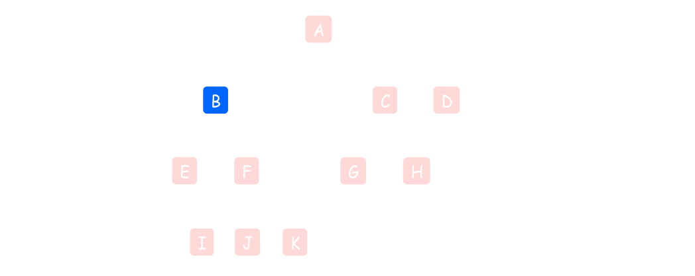
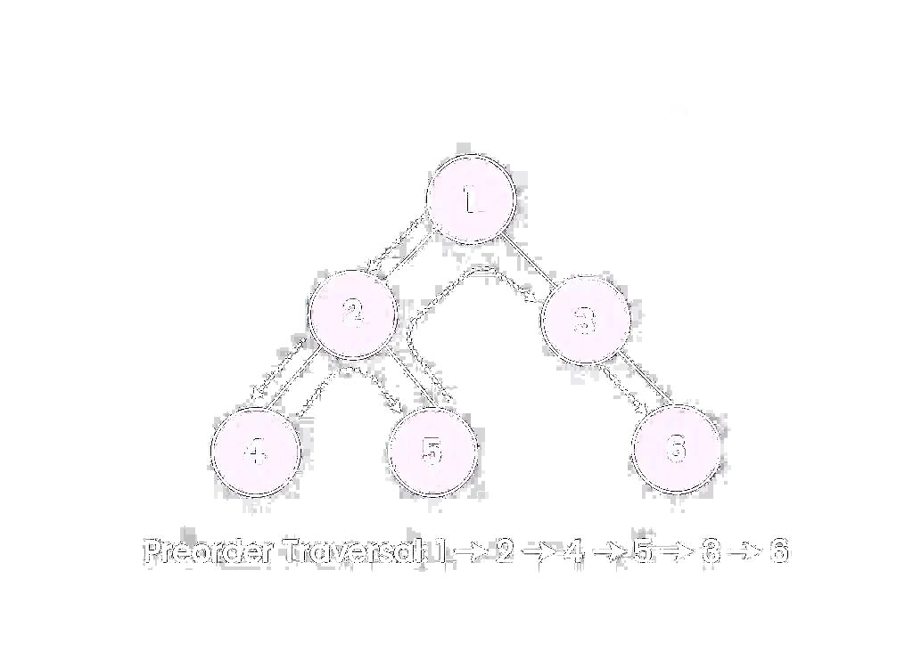
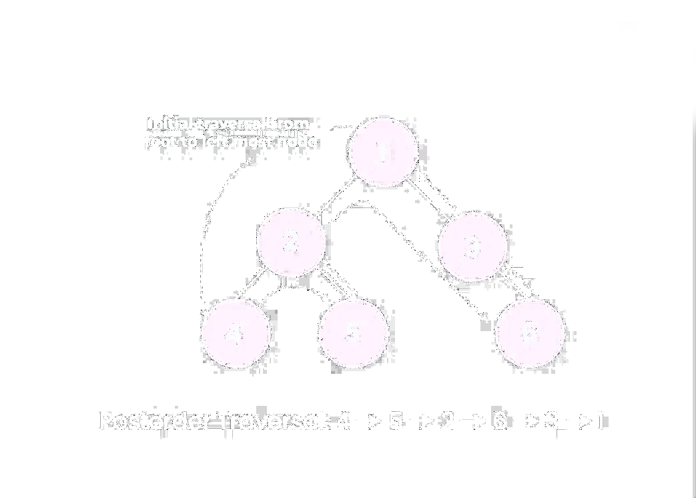
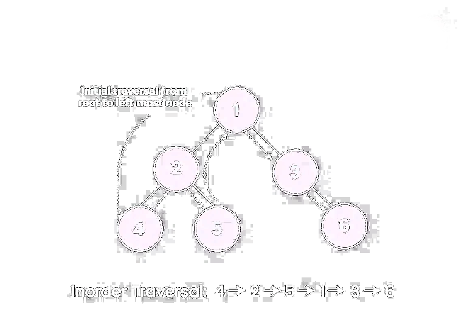

# [[Trees I]] #[[CSI 2110]]
	- ## Trees
	  id:: 6715a89c-1200-4ea0-a715-89dbf34e812f
		- A **graph** $G= (V,E)$ consists of a set $V$ of vertices and a set $E$ of edges with $E = \{\{u,v\}, u ,v \in V, u \ne v\}$
			- 
		- A **tree** is a connected graph with no cycles $\exists$ a path between each pair of vertices
		  id:: 67102927-fc0c-415e-af97-3b4be9bf650c
		- **Rooted Trees**
			- 
		- ### Tree Terminology
			- **Root**: Node without parent
			- **Subtree rooted at a node**: Tree consists of a node and its descendents
			- **Internal Node**: Node with at least one child
			- **External Node (leaf)**: Node without children
			- **Ancestors** (of a node): Parent, grandparent, etc.
			- **Descendent** (of a node): Child, grandchild, etc.
			- **Distance** between two nodes: Number of "edges" between them
				- **Depth** of a node: Number of ancestors (or distance from the root)
				- **Height** of a tree: Maximum depth of any node
	- ## ADTs For Trees
	  id:: 6715a89c-94a5-44b2-a137-498f64b83127
		- **Generic Container Methods**
			- `getElement()`: Returns the element stored at this position
			- `size()`: Returns the numbers of positions (and hence elements) that are contained in the tree
			- `isEmpty()`: Returns true if the tree does not contain any positions (and thus no elements)
			- `elements()`
		- **Positional Container Methods**
			- `positions()`: Returns an iterable collection of all positions of the tree
			- `swapElements(p,q)`
			- `replaceElement(p,e)`
		- **Query Methods**
			- `isInternal(p)`: Returns `true` if position `p` has atleast one child
			- `isExternal(p)`: Returns `true` if position `p` does not have any child
			- `isRoot(p)`: Returns `true` if position `p` is the root of the tree
		- **Accessor Methods**
			- `root()`: Returns the position of the root oft he tree (or null if empty)
			- `parent(p)`: Returns the position of the parent of position `p` (or null if `p` is the root)
			- `children(p)`: Returns an iterable collection the children of position `p` (if any)
			- `numChildren(p)`: Returns the number of children of position `p`
	- ## Traversing Trees
	  id:: 6715a89c-b979-4cd6-b907-7bc0193cfa79
		- A traversal visits the nodes of a tree in a systematic order
		- ### Preorder Traversal
			- **Root** $\rightarrow$ **Left** $\rightarrow$ **Right**
			- In a preorder traversal, a **node is visited before its descendents**
				- ```d
				  Algorithm preOrder(v):
				  	visit(V)
				  	for each child w of v
				        	preOrder(w)
				  	
				  ```
			- 
		- ### Postorder Traversal
			- **Left** $\rightarrow$ **Right** $\rightarrow$ **Root**
			- In a postorder traversal, a **node is visited after its descendents**
				- ```d
				  Algorithm postOrder(v):
				  	for each child w of v
				        	preOrder(w)
				       visit(V)
				  
				  ```
			- 
		- ### **Inorder Traversal**
			- **Left** $\rightarrow$ **Root** $\rightarrow$ **Right**
			- 
	- ## Binary Trees
	  id:: 6715a89c-3a8d-458b-9ec8-f7add32acfca
		- In binary trees, children are ordered
		- Each node has at most two children
		- A **full binary tree** has every node be a leaf, or have two children
		- A **perfect binary tree** is a full binary tree with all leaves at some level
		- ### Properties of Binary Trees
			- $n$ is the # of nodes
			- $e$ is the number of leaves
			- $i$ is the number of internal nodes
			- $h$ is the height of the tree
			- **Properties of Full Binary Trees:**
				- $e = i+1$
				- $n = 2e-1$
				- $h \le i$
				- $h \le (n-1)/2$
				- $e \le 2^h$
				- $h \ge \log_2 e$
				- $h \ge \log_2(n+1) -1$
		- In perfect binary trees, there are $n = 2^{h+1}-1$ nodes