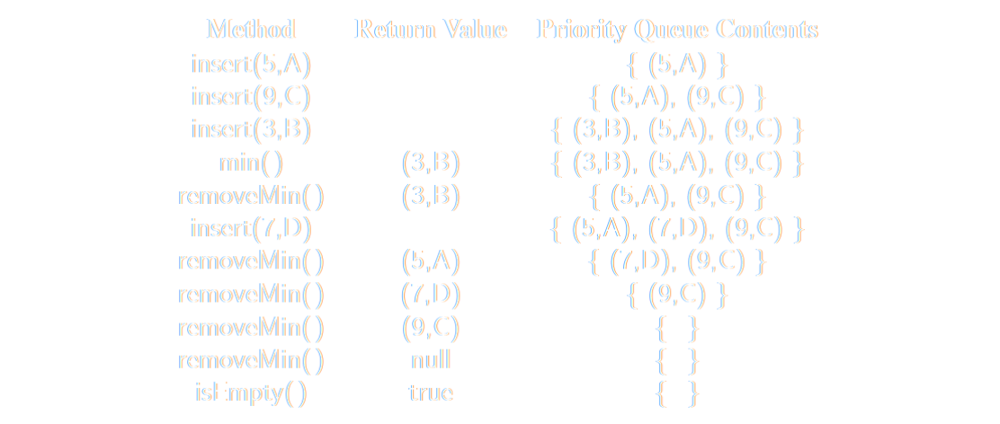

# [[Priority Queues]] #[[CSI 2110]]
	- A set of elements with a given **priority**
	- One can insert in any order
	- Removal is performed following **the priority order**
		- The element with highest priority is removed first
	- The elements are stored according to their priorities, and not their position
	- ## The Priority Queue ADT
		- A priority queue stores a collection of entries
			- Each **entry** is a pair of (key, value) OR (key, element)
		- **Keys** in a priority queue can be arbitrary objects on which a total order is defined
		- Two distinct entries in a priority queue can have the same key
		- **Main Methods**:
			- `insert(k,v)`: Creates an entry with key `k` and value `v` in the priority queue
			- `removeMin()`: Removes and returns an entry `(k,v)` having minimal key: returns null if the priority queue is empty
		- **Additional Methods**:
			- `min()`: Returns (but does not remove) a priority queue entry `(k,v)` having minimal key: returns null if the priority queue is empty
			- `size()`: Returns the number of entries in the priority queue
			- `isEmpty()`: Returns a boolean indicating whether the priority queue is empty
		- A sequence of priority queue methods:
			- 
			-