# [[Analysis of Resistive Circuits]] #[[ELG 2138]]
	- ## Classification of Circuit Elements
	  id:: 66df64ca-e4d8-43df-af9a-e6eabf9e909f
	  collapsed:: true
		- A circuit, when existing withing a circuit, will have current $i$ flowing between its two terminals and a voltage difference $v$ associated with it
		- 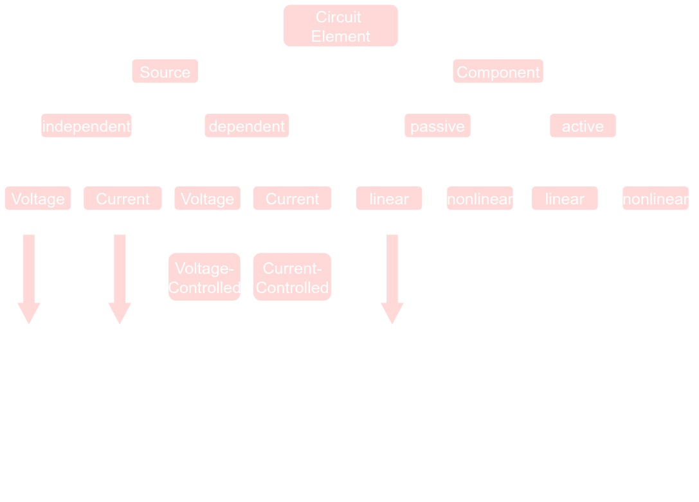
		- ### How to connect two circuits elements?
		  collapsed:: true
			- Two circuit elements are said to be *directly connected* when they share the same terminal
			- The common terminal is referred to as a ^^circuit node^^
			  collapsed:: true
				- 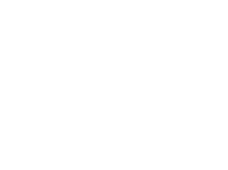
			- When a wire is used to connect two terminals together, the connecting wire is considered part of the node
	- ## Types of Connections
	  id:: 66df64ca-0c3a-410c-b2dc-afeb26d77150
	  collapsed:: true
		- ### Series Connections
		  collapsed:: true
			- Two circuit elements are connected in series such that they share at least a single node, ^^such that the currents that flow in both elements are the same^^
			  collapsed:: true
				- 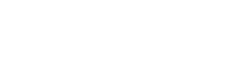{:height 87, :width 311}
		- ### Parallel Connections
		  collapsed:: true
			- Two circuit elements are said to connected in parallel when their two terminals are connected such that their voltages are the same
			  collapsed:: true
				- 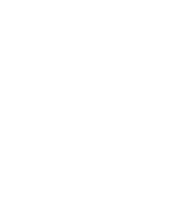
		- It is possible to have **more than two** elements in parallel or series
		- **Example:**
		  background-color:: blue
		  collapsed:: true
			- 
	- ## Resistive Circuit Element Characteristics
	  id:: 66df6591-aeed-4f9a-a30c-e9b6650bde01
	  collapsed:: true
		- ### Resistor
		  collapsed:: true
			- A resistor has a resistance value of $R$ measured in $\Omega$
			  collapsed:: true
				- 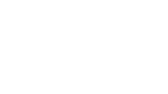{:height 145, :width 207}
			- By Ohm's Law we have
			  collapsed:: true
				- $$i = \frac{v}{R} \quad \text{ OR } \quad  v = iR$$
				-
		- ### Voltage Source
		  collapsed:: true
			- A voltage source has a predefined value of voltage $E$, measured in volts $V$
			  collapsed:: true
				- 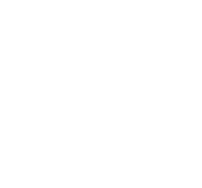
			- A voltage source is circuit element that has a constant voltage(E) e.g, $10V$ across its terminals
			- 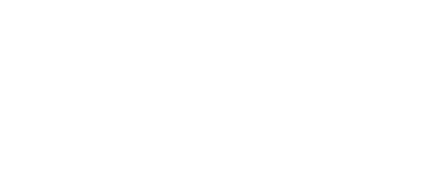{:height 152, :width 346}
		- ### Current Source
		  collapsed:: true
			- A current source has a predefined value of current $J$, measured in amperes ($A$)
			- A current source is a circuit element that has a constant value of current flowing between its terminals
	- ## Kirchoff Current Law (KCL)
	  id:: 66df6cca-df6a-4dcf-9764-d8c9d8d01e19
	  collapsed:: true
		- The algebraic sum of currents at any node is always = 0
		  collapsed:: true
			- 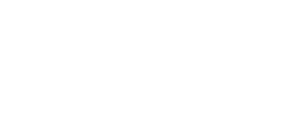
		- By convention currents **EXITING**, the node are assigned **PLUS** sign, while currents **ENTERING** the node are assigned **NEGATIVE** sign so,
		  collapsed:: true
			- $$i_3 + i_4 - i_1 -i_2 =0$$
	- ## Kirchoff Voltage Law (KVL)
	  id:: 66df6dca-705e-4df3-a79f-69c9f25ba369
	  collapsed:: true
		- The concept of **LOOP**
		  collapsed:: true
			- A closed path through a circuit that does not encounter any intermediate loop more than once
		- The algebraic sum of voltages in a loop is always = 0
		  collapsed:: true
			- Move in a loop counterclockwise
			  logseq.order-list-type:: number
			- If you encounter "$+$" sign of the voltage polarity, include it with a positive sign
			  logseq.order-list-type:: number
			- If you encounter "$-$" sign of the voltage polarity, include it with a negative sign
			  logseq.order-list-type:: number
	- ## Resistors
	  id:: 66e054c5-4582-4f50-938a-a88a01c8dd95
	  collapsed:: true
		- ### Resistors in Series:
		  collapsed:: true
			- For resistors connected in series, one can replace them with a single resistor whose value is equal to the summation
			  collapsed:: true
				- $$R_{eq} = \sum R_n$$
		- ### Resistors in Parallel
		  collapsed:: true
			- For resistors connected in parallel, one can replace them with a single resistor whose value is equal to the reciprocal of summation of their reciprocals
			  collapsed:: true
				- $$R_{eq} = \frac{1}{\sum_{i=1}^n \frac{1}{R_i}}$$
				- 
		- A **conductance** is the reciprocal of resistance, the conductance of a resistor $R1$  is $\frac{1}{R1}$
		  collapsed:: true
			- Representing resistors of previous circuits by their conductance gives the circuit:
			  collapsed:: true
				- $$G_{eq} = \sum_{i=1}^N G_i$$
				- 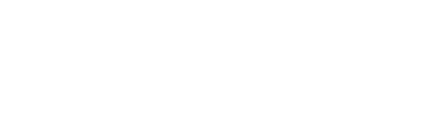
	- ## Special Cases of Resistors
	  id:: 66dfc4b2-eebb-4837-bf04-85e5c245237d
	  collapsed:: true
		- ### Short Circuit (Zero resistance)
		  collapsed:: true
			- A short circuit will always have **zero voltage** difference across its terminals
			- However, the current in a short circuit ^^may not be zero^^, and actually determined by the circuit in which the short circuit is connected
			- 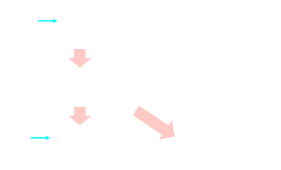
		- ### Open Circuit (Infinite resistance)
		  collapsed:: true
			- An open circuit will have **zero current** through its terminals
			- However, voltage in an open circuit ^^may not be zero^^, and its actual value can be determined from the circuit in which the open circuit is connected
			- 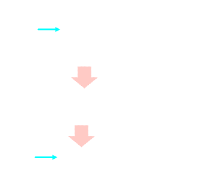
		- ### Combining resistances with a short circuit in parallel
		  collapsed:: true
			- 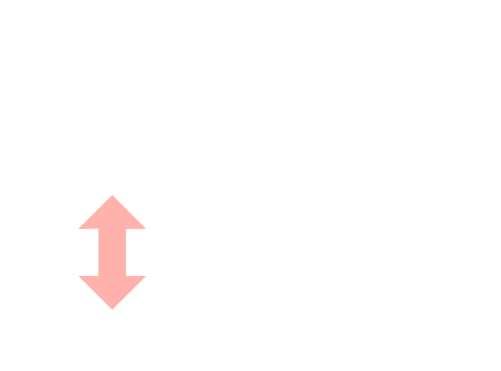
			- Any short circuit in parallel with any resistance is a short circuit
		- ###  Combining resistances with an open circuit in parallel
		  collapsed:: true
			- 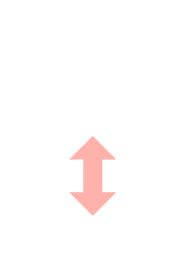
			- Any open circuit in parallel with any resistance is the same resistance
		- ### Combining resistances with a short circuit in series
		  collapsed:: true
			- 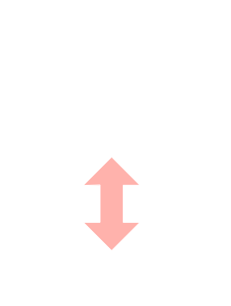{:height 302, :width 250}
			  id:: 66e051f6-ce4c-4597-a13e-e48922318bfb
			- A short circuit in series with any resistance is the same resistance
		- ### Combining resistances with a open circuit in series
		  collapsed:: true
			- 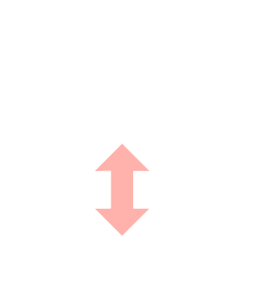
			- Any open circuit in a series with any resistance is an open circuit
	- ## Voltage Divider
	- ## Current Divider
	- ## Independent Voltage Sources in Series
	  collapsed:: true
		- The rule is to replace every two or more independent voltage sources in series by a single independent voltage source whose value is the algebraic sum of the voltages
		- 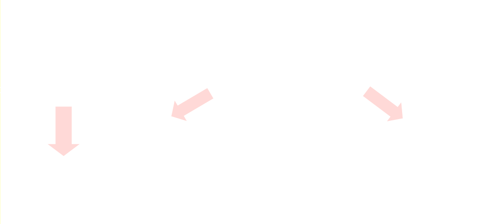
		- Example:
		  background-color:: blue
		  collapsed:: true
			- ![Screenshot from 2024-09-12 21-46-57.png](../assets/Screenshot_from_2024-09-12_21-46-57_1726192056126_0.png
		- **Independent Voltage Sources in Parallel are ^^NOT ALLOWED^^**
		  collapsed:: true
			- Elements in parallel have the same voltage, and by connecting two independent voltage sources in parallel, they cannot be considered as independent any more because we are forcing one of them to follow the other
	- ## Independent Current Sources in  Parallel
	  collapsed:: true
		- The rule is replace every two or more independent current sources in parallel by a single independent source whose value is the algebraic sum of the current
		- 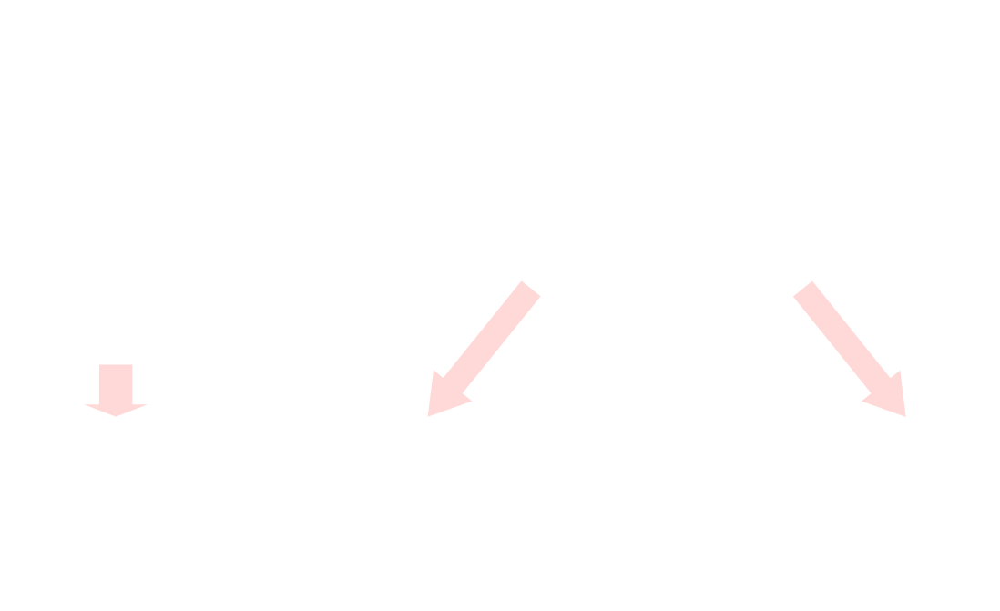
		  id:: 66e399f7-7cdd-454a-a9b7-9b46c8b777c9
		- **Independent Current Sources in Series are ^^NOT ALLOWED^^**
		  collapsed:: true
			- Elements in series have the same current, and by connecting two independent current sources in series, they cannot be considered as independent any more because we are forcing one of them to have the same current as the other