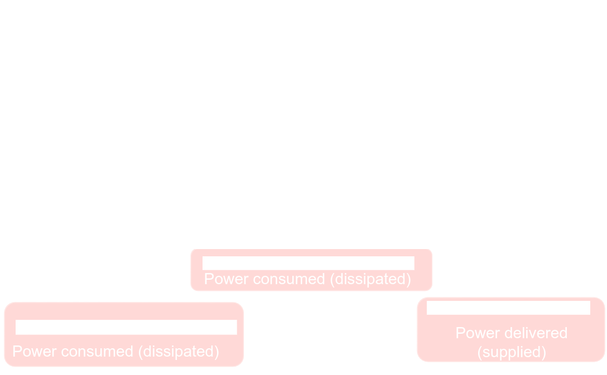

# [[Analysis of Resistive Circuits]] #[[ELG 2138]]
	- ## Convention of Power
	  id:: 66ec7d6f-c244-49ef-81be-65b378bdda05
		- If it is found that the current flows from the terminal with with the high voltage to the lower voltage
			- 
			- Element **consumes** power
				- $$P = + vi$$
				- $$P = + \frac{v^2}{R}$$
				- $$P = + i^2 R$$
		- If it is found that current flows from the terminal with lower voltage to the higher voltage
			- 
			- Element **produces** power
				- $$P = -vi$$
				- This rule **does not** apply with resistors
		- **Example:**
		  background-color:: blue
			- 
		- If it is found that voltage is **higher** at the tail of the current, the current source **consumes** power
		- If the voltage is **lower** at the tail of the current, the current source **produces** power
		- 
		- **Example:**
		  background-color:: blue
			- Compute the power in every element
				- 
				- 
				- 
	- ## Dependent Sources
	  id:: 66f0768d-2a18-4494-ad23-ccfd0becba13
		- ### Dependent Voltage Source
			- The volt value is controlled by some current or some voltage in the circuit, creating:
				- 
				- Current-Controlled Voltage Source **or** Voltage-Controlled Voltage Source
			- The ampere value is controlled by some current or voltage in the circuit, creating:
				- 
				- Current-Controlled Current Source **or** Voltage-Controlled Current Source