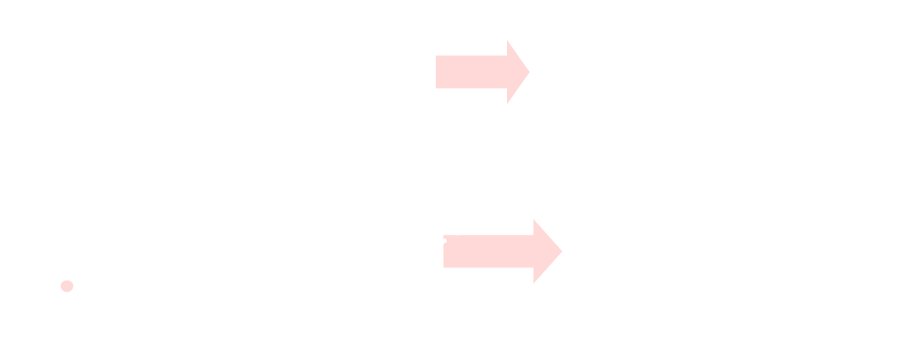

# [[Methods for Analysis of Resistive Circuits]] #[[ELG 2138]]
	- ## Node Voltage Analysis
		- ### Circuits with ^^Independent Current Sources^^
			- Identify the number of nodes in the circuit
			  logseq.order-list-type:: number
			- Designate one node as reference node
			  logseq.order-list-type:: number
				- A **reference node** is a node to which every other node voltage is referred to
				  logseq.order-list-type:: number
					- Take the element below,
					  logseq.order-list-type:: number
						- If point $b$ is chosen a reference node, then one can say that node $a$ has an absolute voltage of 10 volts when **referred to point** $b$
							- 
						- If $a$ is chosen a reference node, then one can say that node $b$ has an absolute voltage of -10 volts when **referred to point** $a$
							- 
				- A good practice is to use the reference node in the negative terminal of the independent voltage source or the ingoing terminal of the independent current source
			- Express current in the circuit elements in terms of node voltages
			  logseq.order-list-type:: number
			- Apply KCL Law at each node except the reference node
			  logseq.order-list-type:: number
				- $\sum$ Currents entering $(a,b,c,d) = \sum$ Currents exiting from $(a,b,c,d)$
			- Solve the equations from KCL to get node voltages using direct substitution or matrix algebra
			  logseq.order-list-type:: number
			- Using the node voltages, find the currents in the elements
			  logseq.order-list-type:: number
			- Example:
			  background-color:: blue
				-
		- ### Circuits with ^^Independent Current/Voltage Sources^^
			- Identify the number of nodes in the circuit
			  logseq.order-list-type:: number
			- Designate one node as reference mode
			  logseq.order-list-type:: number
			- If any ^^independent voltage sources^^ connected between two nodes, none of them being the reference node
			  logseq.order-list-type:: number
				- Use a **supernode** for such sources:
				  logseq.order-list-type:: number
					- Treats two non-reference nodes and a voltage source as a singular node
						- The voltage difference between the two nodes is known and equal to the voltage of the source connecting them
			- Write node voltages for voltage sources with one reference node
			  logseq.order-list-type:: number
			- Apply KCL Law at each node (including supernode) except for reference node and nodes of voltage sources with one reference node
			  logseq.order-list-type:: number
			- Solve the equations from KCL to get node voltages
			  logseq.order-list-type:: number
			  id:: 670d8181-5f24-4252-a99c-71b269e18687
			- Using the node voltages, find the currents in the elements
			  logseq.order-list-type:: number
			- Example:
			  background-color:: blue
		- ### Circuits with ^^Dependent Sources^^
			- If there is a dependent voltage source, treat it as an independent voltage source
				- Substitute for the current and the voltage of the dependent source in terms of node voltages
		- ### The Basic Strategy for Node Voltage Analysis
			- Consider node voltages as unknowns except for the reference node
			- Solve for a number of unknowns using the same number of equations
			- Generate the required equations by applying KCL at each node
			- Solve the resulting equations to obtain the unknown node voltages
			- Using calculated nodes voltages, calculate the currents
	- ## Mesh Current Analysis
		- ### What is a Mesh
			- A **mesh** is a special case of a loop
				- It is a loop that does not contain any other loops within itself
					- {:height 244, :width 625}
		- ### Circuits with ^^Independent Voltage Sources^^
			- Divide the circuit into meshes
			  logseq.order-list-type:: number
				- 
				  logseq.order-list-type:: number
			- Associate each mesh with a mesh current
			  logseq.order-list-type:: number
				- 
				  logseq.order-list-type:: number
				- Each mesh is assigned a given current
				  logseq.order-list-type:: number
				- ^^**Note:**^^ Mesh currents are only introduced as intermediate variables, and may not be actual currents in the circuit elements
				  logseq.order-list-type:: number
			- From the mesh currents find the element currents
			  logseq.order-list-type:: number
				- **Currents** in the **circuit elements** are obtained from mesh currents ^^if an element is^^:
				  logseq.order-list-type:: number
					- **Not common** between two meshes, 
					  logseq.order-list-type:: number
						- Current in the element is equal to the mesh current of the element
						  logseq.order-list-type:: number
					- **Common** between two meshes
					  logseq.order-list-type:: number
						- Current is equal to *difference* between the two mesh currents of the element
						  logseq.order-list-type:: number
				- **Currents** in the **resistors** are obtained from mesh currents if:
				  logseq.order-list-type:: number
					- A current in the resistor is the same as the mesh current if it is not common between two meshes
					  logseq.order-list-type:: number
					- A current in the resistor is the difference between two mesh currents if it is common between two meshes
					  logseq.order-list-type:: number
			- Apply KVL at each mesh
			  logseq.order-list-type:: number
			- Solve the equations from each mesh
			  logseq.order-list-type:: number
			- From the currents obtained, find the voltages
			  logseq.order-list-type:: number
		- ### Circuits with ^^Independent Voltage/Current Sources^^
			- Divide the current into meshes
			  logseq.order-list-type:: number
			- Associate with each mesh a mesh current
			  logseq.order-list-type:: number
			- If the circuit contains an ^^independent current sources^^ common between two meshes
			  logseq.order-list-type:: number
				- Form a **supermesh**:
				  logseq.order-list-type:: number
					- Combining two or more adjacent meshes that share a current source
					  logseq.order-list-type:: number
			- Write the mesh currents for those meshes containing independent current sources that are NOT common
			  logseq.order-list-type:: number
			- Apply KVL at each mesh (including the supermesh) except those meshes with a current source
			  logseq.order-list-type:: number
			- Solve the equations resulting from each esh
			  logseq.order-list-type:: number
			- Using the mesh currents, find the unknown voltages
			  logseq.order-list-type:: number
		- ### Circuits with ^^Dependent Sources^^
			- If there is a dependent current source, treat it as an independent current source
			- Substitute for the current and the voltage of the dependent source in terms of mesh currents
			-