# [[Methods for Analysis of Resistive Circuits]] #[[ELG 2138]]
	- ## Node Voltage Analysis
		- ### Circuits with ^^Independent Current Sources^^
			- 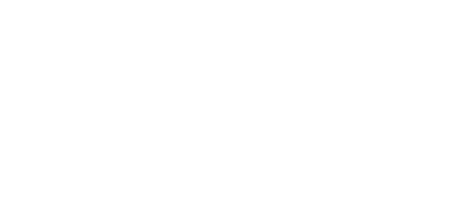
			- Identify the number of nodes in the circuit
			  logseq.order-list-type:: number
				- Assume the number of nodes is $n$
				  logseq.order-list-type:: number
				- In the example circuit there are 3 nodes
				  logseq.order-list-type:: number
					- 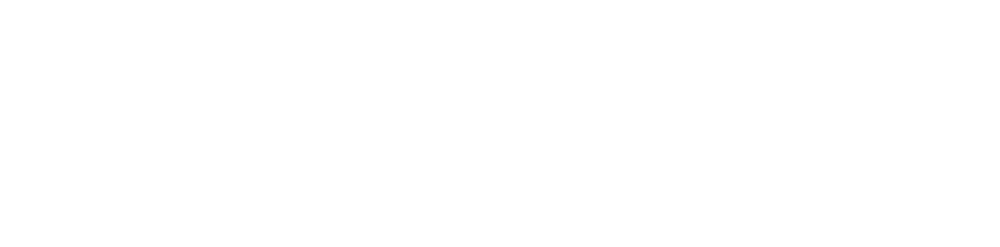
					  logseq.order-list-type:: number
			- Designate one node as reference node
			  logseq.order-list-type:: number
				- A **reference node** is a node to which every other node voltage is referred to
				  logseq.order-list-type:: number
					- Take the element below,
					  logseq.order-list-type:: number
						- If point $b$ is chosen a reference node, then one can say that node $a$ has an absolute voltage of 10 volts when **referred to point** $b$
							- 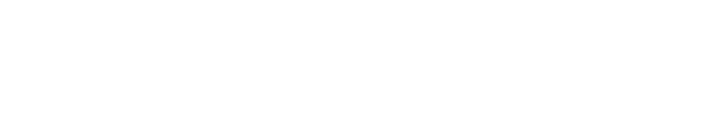
						- If $a$ is chosen a reference node, then one can say that node $b$ has an absolute voltage of -10 volts when **referred to point** $a$
							- 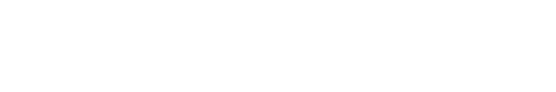
					- Example:
					  background-color:: blue
						- 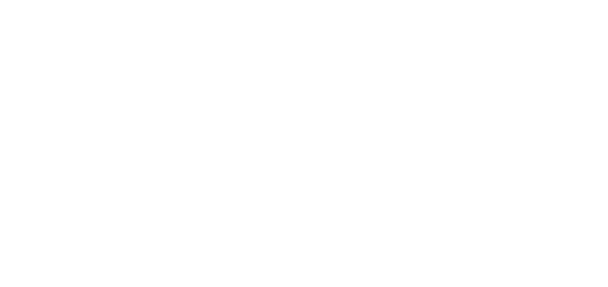
						- Assuming node $d$ is the reference
							- 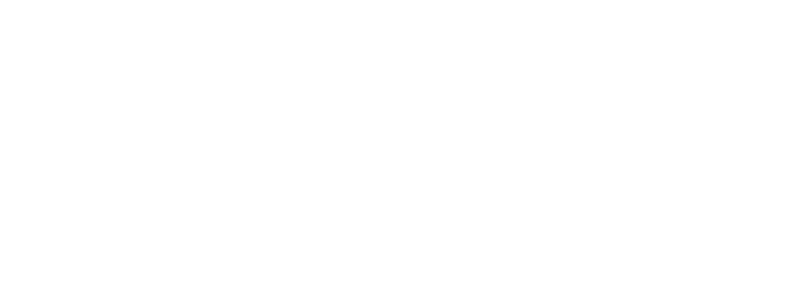
						- Assuming node $c$ is the reference
							- 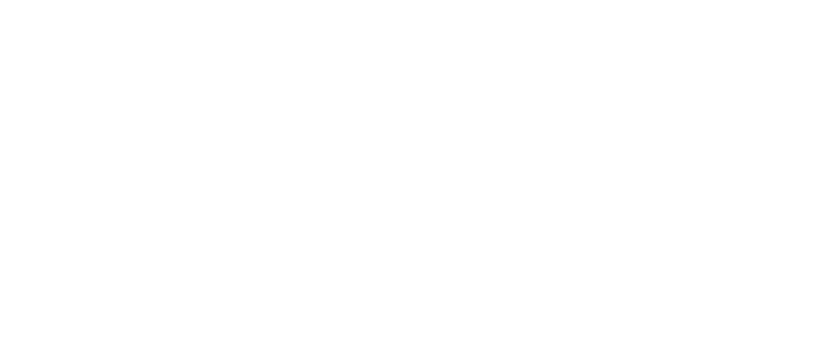
						- Assuming node $b$ is the reference
							- 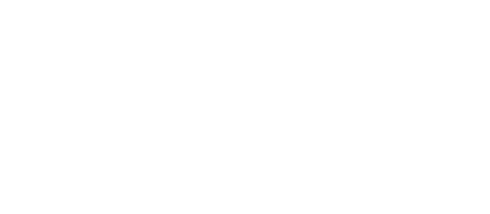
				- A good practice is to use the reference node in the negative terminal of the independent voltage source or the ingoing terminal of the independent current source
			- Express current in the circuit elements in terms of node voltages
			  logseq.order-list-type:: number
				- 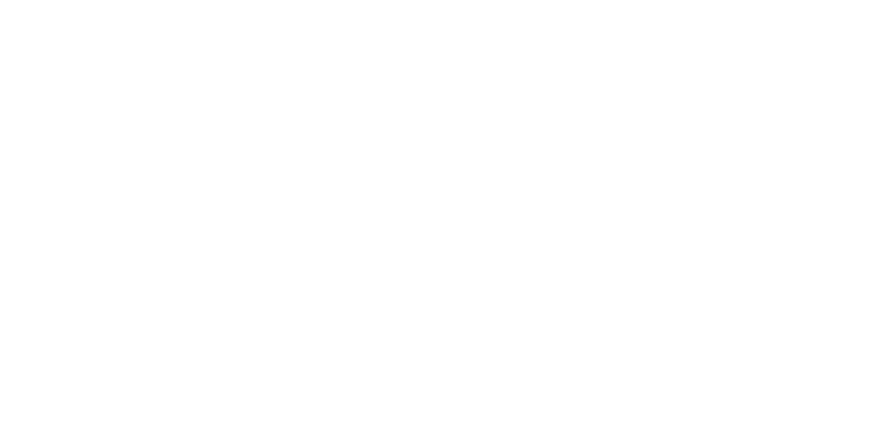
			- Apply KCL Law at each node except the reference node
			  logseq.order-list-type:: number
				- $\sum$ Currents entering $(a,b,c,d) = \sum$ Currents exiting from $(a,b,c,d)$
					- 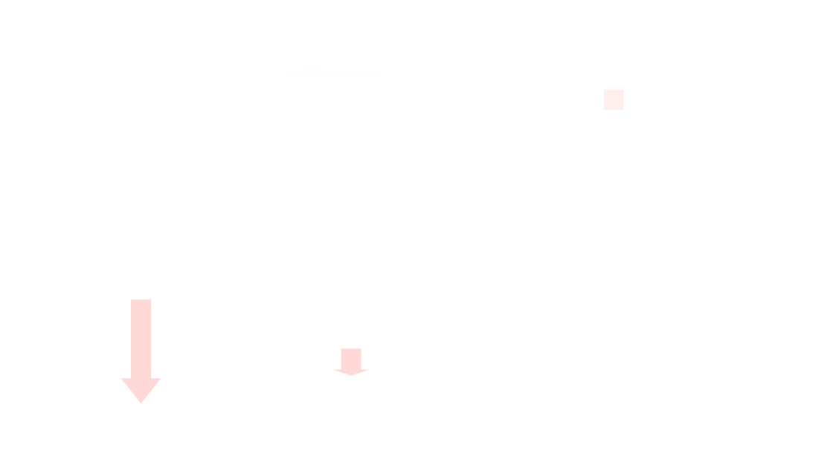
					- 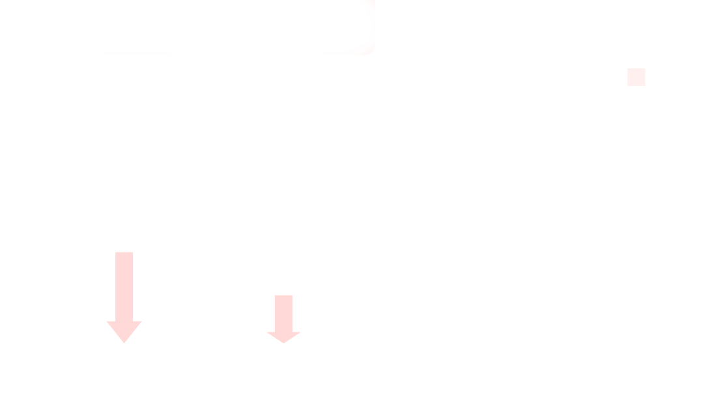
					-
			- Solve the equations from KCL to get node voltages using direct substitution or matrix algebra
			  logseq.order-list-type:: number
				- 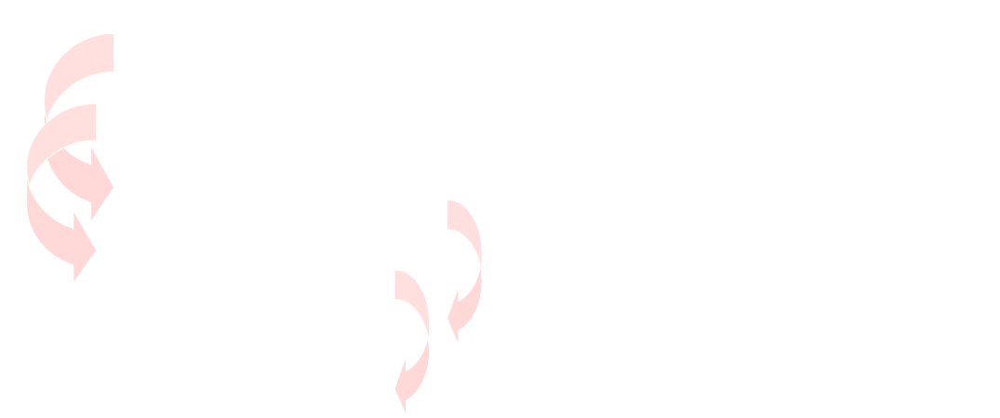
				- 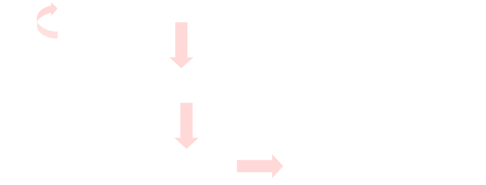
			- Using the node voltages, find the currents in the elements
			  logseq.order-list-type:: number
				- 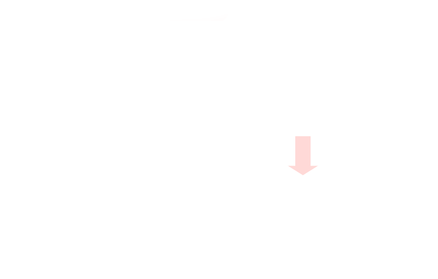
		- ### The Basic Strategy for Node Voltage Analysis
			- Consider node voltages as unknowns except for the reference node
			- Solve for a number of unknowns using the same number of equations
			- Generate the required equations by applying KCL at each node
			- Solve the resulting equations to obtain the unknown node voltages
			- Using calculated nodes voltages, calculate the currents
	- ## Mesh Current Analysis