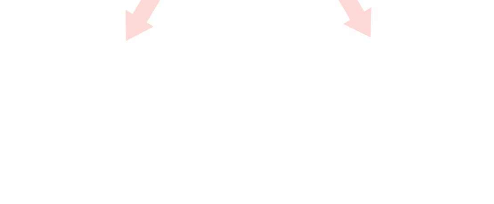
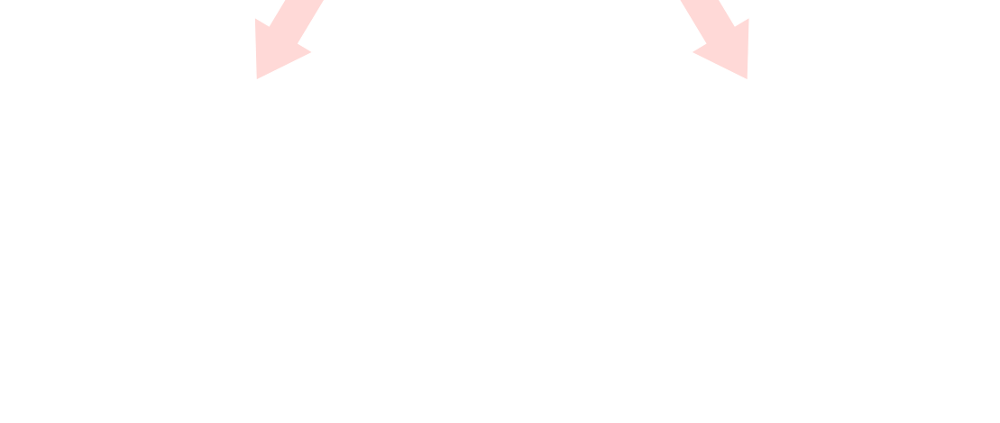

# [[Energy Storage Elements]] #[[ELG 2138]]
	- ## Capacitors
		- Capacitors are constructed from two conducting plates separated by a non-conducting material known as a dielectric
		- Electric charge are stored on the plates if a voltage difference is applied between them
		- To understand how capacitors operate as energy storage elements, imagine that a negative (or positive) charge is placed between the plates
			- The charge, which was initially at rest will start drifting toward the plate with the opposite charge
			- The energy that propelled the charge to move has gained from the energy stored in the electric field
		- ### $i-v$ relation in a Capacitor
			- $$i(t) = C \frac{dv(t)}{dt}$$
		- ### To Calculate the Voltage in a Capacitor
			- $$v(t) = v(t_0) + \frac{1}{C} \int_{t_0}^t \ i (\tau) d\tau$$
			-
		- ### Combining Capacitors in Parallel
			- $$C_{eq} = C_1 + C_2 + C_3 + ... + C_n$$
		- ### Combining Capacitors in Series
			- $$C_{eq} = \frac{1}{ \frac{1}{C_1}+  \frac{1}{C_2} +  \frac{1}{C_3} + ...  \frac{1}{C_n}}$$
			-
	- ## Inductors
		- Inductors are formed by winding a wire around an iron core
		- When a current $i$ passes through the inductor, it generates flux $\phi$
			- The flux intensity in every turn is proportional to the current flowing in the inductor
		- Thus if the inductor has $N$ turns, the total flux is $N \phi$
		- ### $i-v$ relation in a Inductor
			- $$v(t) = L \frac{di(t)}{dt}$$
		- ### To Calculate the Current in an Inductor
			- $$i(t) = i(t_0) + \frac{1}{L} \int_{t_0}^t v(\tau) d\tau$$
		- ### Combining Inductors in Parallel
			- $$L_{eq} = \frac{1}{ \frac{1}{L_1}+  \frac{1}{L_2} +  \frac{1}{L_3} + ...  \frac{1}{L_n}}$$
		- ### Combining Inductors in Series
			- $$L_{eq} = L_1 + L_2 + L_3 + ... + L_n$$
	- **^^Note^^:**
		- **Capacitors** in ^^series^^ are combined like **resistors** in ^^parallel^^, while **capacitors** in ^^parallel^^ are combined like **resistors** in ^^series^^
		- **Inductors** in series are combined like **resistors** in ^^series^^ while **inductors** in ^^parallel^^ are combined like **resistors** in ^^parallel^
	- ## Switching Circuits
		- ### What is a switching circuit?
			- A switching circuits is a circuit that contains some switching elements
		- **How does a switch operate**?
			- A switch usually has a time label attached to it $t = t_0$ and it can either be **closing** or **opening**
		- When performing ^^circuit analysis^^ one is analyzing the conditions of the circuit:\
			- **Just BEFORE** and **right AFTER** the switch is ^^Closed^^ or ^^Opened^^
		- ### Initial Conditions in Switched Circuits
			- ### Operation of an Opening Switch
				- 
			- ### Operation of a Closing Switch
				- 
			- ### Values BEFORE or AFTER it has turned ON/OFF
				- Currents through inductors and voltages across capacitors **can NEVER change instantaneously**
					- $v_C|(t = 0^-) = v_C|(t = 0^+)$
					- $i_L|(t = 0^-) = i_L|(t = 0^+)$
				- ### Things that ^^CAN POSSIBLY^^ upon switching
					- Current of a capacitor can change instantaneously
					- Voltage of a inductor can change instantaneously
					- Voltage and current of a resistor can change instantaneously
				- A capacitor can assumed to be a open circuit
				  id:: 6711fcf9-c025-4394-bd8e-56da084a3365
				- A inductor can be assumed to be short circuit
			- For a capacitor at any $t', v(t'^-) = v(t'^+)$, voltage is always continuous in time
			- For a inductor at any $t', i(t'^-) = i(t'^+)$, current is always continuous in time
	- ## General Strategy for Circuit Analysis
		- Consider the circuit at $t = 0^-$:
			- All capacitors are replaced by open-circuits
			- All inductors are replaced by short-circuits
			- Perform circuit analysis using any of the methods already known
			- Determine all capacitor voltages: $v_C(0^-)$
			- Determine all inductor current: $i_L(0^-)$
		- At $t = 0^+$:
			- For each capacitor:  $v_C(0^+)=v_C(0^-)$
			- For each inductor:  $i_L(0^+)=i_L(0^-)$
			- Optionally:
				- Represent capacitors as voltage sources
				- Represent inductors as current sources
			- Perform circuit analysis using any of the methods already known
		- At $t = \infin$
			- All capacitors are replaced by open-circuits
			- All inductors are replaced by short-circuits