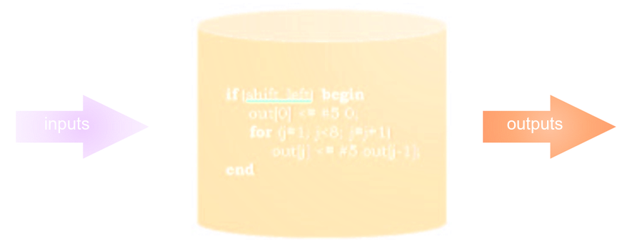
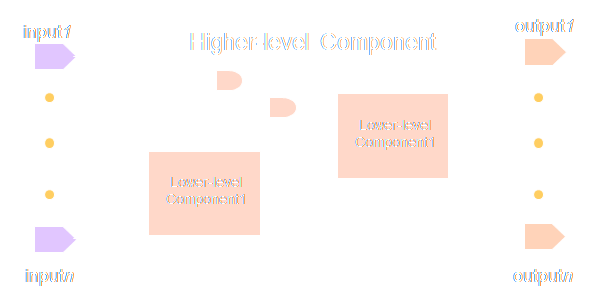
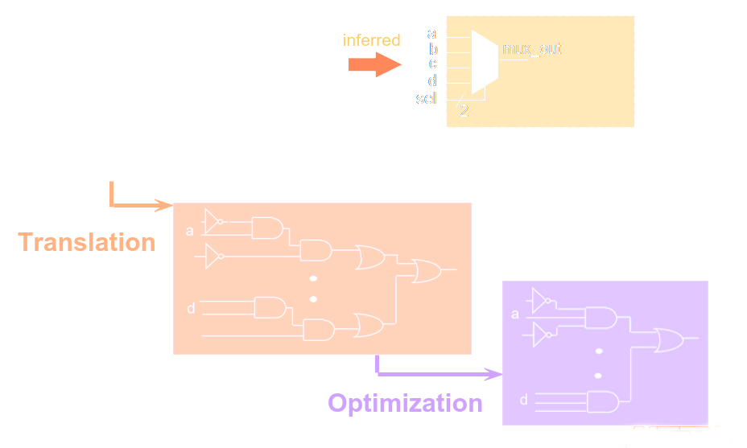
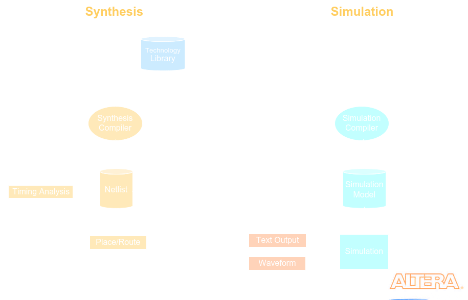
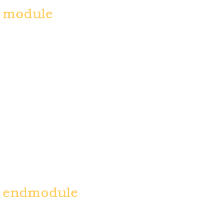

# Verilog HDL Overiew
	- Hardware description language for visualizing digital circuits
	- # Terminology
	  collapsed:: true
		- ## HDL (Hardware Description Language)
			- A text based programming language used to model a piece of hordware
		- ## Behaviour Modelling
			- A component described by its input/output response
			- Only describing the functionality of a circuit, not its structure
			- Synthesis tool creates correct logic
			- Input $\rightarrow$ logic $\rightarrow$ output
			- 
		- ## Structural Modelling
			- A component is described by interconnecting lower-level components/primitives
			- Both the functionality of a circuit and its structure are specified
			- The specific hardware is called out
			- 
		- ## Register Transfer Level (RTL)
			- The style of behavioral modelling that describes input/output relations in terms of data flow operations inside a hardware model
			- RTL constructs are **synthesizable**
		- ## Synthesis
			- The translation and optimization of HDL code into a represented circuit (look up tables/flip flops)
		- ## RTL Synthesis
			- The translation of a RTL model of hardware into an optimized technology specific gate level implementation
			- 
				- The synthesis engine translates code into hardware using architecture of specified hardware
				- Optimizes hardware design
			- 
- # Model Structure
	- ## Basic Modelling Structure
		- Begins with the keyword **module** and ends with an **endmodule**
		- Case sensitive, and all keywords are lower case
		- `;` is the statement terminator
		- `//`:Single Line Comment
		- `/* */`; Multi-line Comment
		- 
		-
- # Module Components
- # Tasks and Functions
-
-