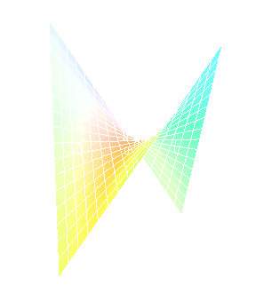

# [[Relative Minimums and Maximums]] #[[MAT 2322]]
	- A function $f(x,y)$ has a **relative minimum** at the point $(a,b)$ if $f(x,y) \ge f(a,b)$ for all points $(x,y)$ in some region around $(a, b)$
	- A function $f(x,y)$ has a **relative maximum** at the point $(a.b)$ if $f(x,y) \le f(a,b)$ for all points $(x,y)$ in some region around $(a,b)$
	- ^^**Note:**^^
		- This definition does not say that a relative minimum is the smallest value that the function will ever take
		- It only says that in some region around the point $(a,b)$ the function will always be larger than $f(a,b)$
			- Outside the region it is completely possible for the function to be smaller
		- A relative maximum only says that around $(a,b)$ the function will always be smaller than $f(a,b)$
			- Outside of the region it possible for the function to be larger
	- The point $(a,b)$ is a **critical point** (or a **stationary point**) of $f(x,y)$ provided one of the following is true
		- $\nabla f(a,b) = \vec{0}$ (equivalent to saying that $f_x (a,b) = 0 and $f_y (a,b)=0$)
		  logseq.order-list-type:: number
		- $f_x(a,b)$ and/or $f_y(a,b)$
		  logseq.order-list-type:: number
		  id:: 66e75b87-bb05-4d1a-b017-037f5d47da9f
	- To see the equivalence in the first part let's start off with $\nabla f = \vec{0}$ and put in the definition of each part
		- $$\nabla  f(a,b) = \vec{0}$$
		- $$\langle f_x (a,b), \rangle f_y(a,b) \rangle = \langle 0, 0 \rangle $$
	- The only way these two vectors can equal be is to have $f_x (a,b) = 0$ and $f_y (a,b) = 0$
	- ^^**Note:**^^
		- BOTH of the first order partial derivatives must be zero at $(a,b)$
		- If only one of the first partial order derivatives are zero at the point then the point will NOT be a critical point
	- ^^**Fact**^^
		- If the point $(a,b)$ is a relative extrema of the function $f(x,y)$ has a relative extrema at $(a,b)$
		- However, this also means that $g(x)$ also has a relative extrema (of the same kind as $f(x,y)$ at $x = a$
		- By Fermat's Theorem it is also know that $g' (a) = 0$
			- It is also known that $g'(a) = f_x (a,b)$ and so we have that $f_x (a,b) = 0$
		- If it defined $h(y) = f(a,y)$ and going through exactly the same process as above we will see that $f_y(a,b) = 0$
		- Therefore $\nabla f(a,b) = \vec{0}$ and so $f(x,y)$ has a critical point at $(a,b)$
	- This does not say that all critical points are relative extrema, only says relative extrema will be critical points of the function
		- Consider the function : $f(x,y) = xy$
			- The first order partial derivatives are $f_x (x,y) = y \qquad f_y(x,y)= x$
			- The only point that will make both of these derivatives zero at the same time is $(0,0)$ and so $(0,0)$ is a critical point for the function
			- Graph of the function:
				- 
	- Note, that the axes are not in the standard orientation here so that it can be seen more clearly what is happening at the origin $(0,0)$
		- If one starts at the origin and moves into either of the quadrants where both $x$ and $y$ have the same sign the function increases
		- However if one starts at the origin and move into either of the quadrants where $x$ and $y$ have the opposite sign then the function decreases
		- No matter the region you take the origin there will be points larger than $f(0,0)=0$ and points smaller than $f(0,0) = 0$
		- Therefore, there is no $(0,0)$ is relative extrema
	- Critical Points that exhibit this behaviour are **saddle points**
	- ^^**Fact**^^
		- Suppose that $(a,b)$ is a critical point of $f(x,y)$ and that the second order partial derivatives are continuous in some regions that contain $(a,b)$, therefore
			- $$D = D(a,b) = f_{xx} (a,b) f_{yy} (a,b) - [f_{xy} (a,b)^2]$$
		- This provides the following classifications of the critical point
			- If $D > 0$ and $f_{xx}(a,b) > 0$ then there is a relative minimum at $(a,b)$
			  logseq.order-list-type:: number
			- If $D > 0$ and $f_{xx} (a,b) < 0$ then there is a relative maximum at $(a,b)$
			  logseq.order-list-type:: number
			- If $D<0$ then the point $(a,b)$ is a saddle point
			  logseq.order-list-type:: number
			- If $D = 0$ then the point $(a,b)$ may be a relative minimum, relative maximum or a saddle point
			  logseq.order-list-type:: number
	- ^^**Note**^^
		- If $D > 0$ then both $f_{xx} (a,b)$ and $f_{yy}(a,b)$ will have the same and so in the first two cases above we could just as easily replace $f_{xx}(a,b)$ with $f_{yy}(a,b)$
	- **Example:**
	  background-color:: blue
- # [[Absolute Extrema]] #[[MAT 2322]]
	- A region in $\mathbb{R}^2$ is called **closed** it it includes its boundary
		- A region is called **open** if it doesn't include any of its boundary points
	- A region in $\mathbb{R}^2$ is called **bounded** if it can be completely contained in a disk
		- In other words, a region will be bounded if it finite
	- **Example**:
	  background-color:: blue
		- Open: $-5 < x < 3$
		- Closed: $1\le y \le 6$
	- ## Extreme Value Theorem
		- If $f(x,y)$ is continuous in some closed, bounded set $D$ in $\mathbb{R}^2$ then there are points in $D, (x_1, y_1)$ and so that $f(x_1, y_1)$ is the absolute maximum and $f(x_2, y_2)$ so that $f(x_1, y_1)$ is the absolute maximum and $f(x_2, y_2)$ is the absolute minimum of the function in $D$
		- ^^**Note:**^^
			- The theorem does NOT tell us where the absolute min or max will occur, it only tells it exists
			- The absolute max and min may occur in the interior of the region or it may occur on the boundary of the region
	- ## Finding Absolute Extrema
		- Find all the critical points of the function that lie in the region $D$ and determine the function value at each of these points
		  logseq.order-list-type:: number
		- Find all extrema of the function of the boundary
		  logseq.order-list-type:: number
		- The largest and smallest values found in the first two steps are absolute minimum and the absolute maximum of the function
		  logseq.order-list-type:: number
		- **Example:**
		  background-color:: blue
			- Find the absolute minimum and absolute maximum of $f(x,y) = x^2 + 4y^2 -2x^2y + 4$ on the rectangle given by $-1 \le x \le 1$ and $-1 \le y \le 1$
			- Find the absolute minimum and absolute maximum of $f(x,y) = 2x^2 - y^2 +6y$ on the disk of radius $4, x^2 + y^2 \le 16$
- # [[Lagrange Multipliers]] #[[MAT 2322]]
	- ## Method of Lagrange Multipliers
		- Solve the following system of equations
		  logseq.order-list-type:: number
			- $$\nabla f(x,y,z) = \lambda \nabla g(x,y,z) \\g(x,y,z) = k$$
		- Plug in all solutions $(x,y,z)$ from the first step into $f(x,y,z)$ and identify the minimum and maximum values, provided they exist and $\nabla g \ne \vec{0}$
		  logseq.order-list-type:: number
		- The constant $\lambda$ is called the **Lagrange Multiplier**
	- **Example:**
	  background-color:: blue
		- Find the dimensions of the box with largest volume if the total surface area is $64 \text{cm}^2$
		- Find the maximum and minimum of $f(x,y) = 5x -3y$ subject to the constraint $x^2+y^2 = 136$
		- Find the maximum and values of $f(x,y,z) = xyz$ subject to the constraint $x+y+z=1$
			- Assume $x,y,z \ge 0$
		- Find the maximum and minimum values of $f(x,y) = 4x^2 + 10y^2$ on the disk $x^2 +y^2 \le 4$
		- Find the maximum and minimum of $f(x,y,z) = 4y - 2z$ subject to the constraints $2x-y-z=2$ and $x^2 + y^2 =1$
		-