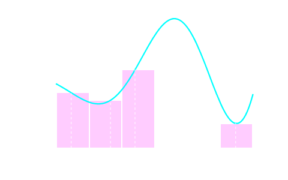
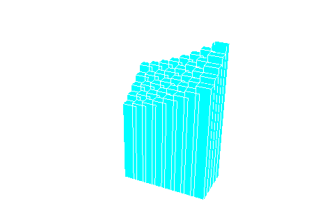
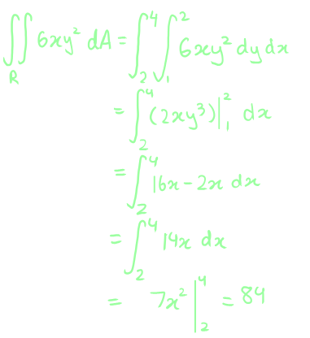
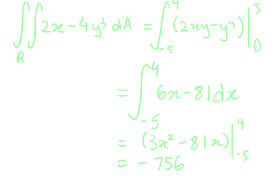
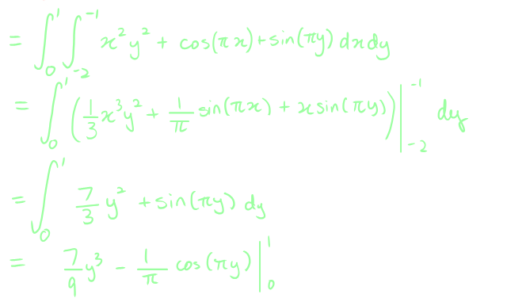
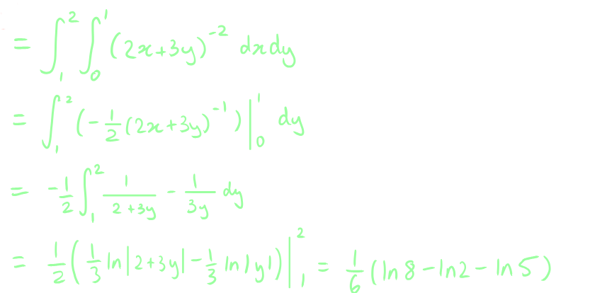
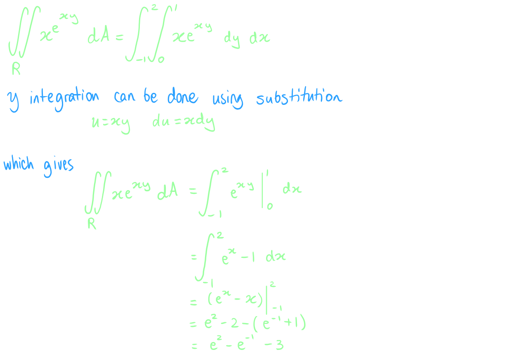
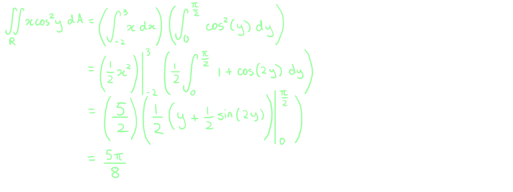

# [[Double Integrals]] #[[MAT 2322]]
	- ## Definite Integrals Review
	  id:: 66ec7d6f-813c-4289-bbbd-0ef80d70f95d
		- An integral,
			- $$\int_a^b f(x) \ dx$$
			- comes from the interval $a \le x \le b$
		- The definition of a definite derivative is determined as an area problem:
			- 
		- Each of the rectangles has height of $f(x_i*) and could be used to area of these rectangles to approximate the area:
			- $$A \approx f(x_i*) \Delta x + f(x_2*) \Delta x + ... + f(x_i*) \Delta x + ... + f(x_n*)\Delta x$$
		- To get the exact area the limit as $n$ goes to infinity, was the definition of a definite integral:
			- $$\int_b^a f(x) dx =\lim_{n \rightarrow \infin} \sum_{i=1}^n f(x_i*) \Delta x$$
	- ## Integration of a Function of Two Variables
	  id:: 66ecdafe-51bf-4dd2-b1ed-7675cad16dd5
		- Functions of one variable are integrated over an interval (one-dimensional space), so when integrating over a region of $\mathbb{R}^2$ (two-dimensional space)
		- Assuming $\mathbb{R^2}$ is a rectangle denoted as: $R = [a,b] \times [c,d]
			- The ranges for $x$ and $y$ are $a\le x \le b$ and $c \le y \le d$
		- Also assume $f(x,y) \ge 0$
		- Similar to a definite integral in 1-D, 2-D ones are made of smaller boxes whose height is given by $f(x_i*, y_i*)$
		- 
		- The volume under the surface $S$ is then approximately:\
			- $$V \approx \sum_{i =1}^n \sum_{j=1}^n f(x_i*, y_j*) \Delta A$$
		- The official definition of a double integration of a function of two variables over a rectangular region $R$:
			- $$\int \int f(x,y) dA = \lim{n, m \rightarrow \infin} \sum_{i =1}^n \sum_{j=1}^m f(x_i*, y_j* \Delta A$$
			- or
				- $$\text{Volume} = \int\int f(x,y) dA$$
		- Use the double sum in the definition to estimate value of a double integral, by using the midpoint of each rectangle, denoting the points as $(\overline{x_i}, \overline{y_j})$
	- ## Fubini's Theorem
	  id:: 66ece890-5315-43c3-942e-f6bfdc197298
		- If $f(x,y)$ is continuous on $R = [a,b] \times [c,d]$ then,
			- $$\int \int f(x,y) dA = \int_a^b \int_c^d f(x,y) dy dx = \int_c^d \int_a^b f(x,y) dx dy$$
			- Called **iterated integrals**
		- There are two ways of computing a double integral over a rectangle and also the inner differentials matches with the limits on the inner integral and like wise for the outer limits
			- If the inner differential is $dy$ then the limits on the inner integral must be $y$ limits,of integration, and if the outer differential is $dy$ then the limits on the outer integral must be $y$ limits of integration
		- Example:
		  background-color:: blue
			- Compute each of the following double integrals over the indicated rectangles
				- $$\int \int 6xy^2\  dA, R = [2,4] \times [1,2]$$
					- 
				- $$\int \int 2x-4y^2 \ dA, R = [-5,4] \times [0,3]$$
					- 
				- $$\int \int x^2y^2 + \cos(\pi x) + \sin(\pi y)\  dA, R = [-2,-1] \times [0,1]$$
					- 
				- $$\iint_R {{\frac{1}{{{{\left( {2x + 3y} \right)}^2}}}\,dA}}, R = [0,1] \times [1,2]$$
					- 
				- $$\iint xe^{xy} dA, R = [-1,2] \times [1,2]$$
					- 
	- ## Iterated Integrals
	  id:: 66ff5b59-acce-41bc-a2c4-165d40f8dfb8
		- ^^**Fact:**^^
			- If $f(x,y) = g(x) h(y)$ and one is integrating over the rectangle $R = [a,b] \times [c,d]$ then,
				- $$\iint_R f(x,y) \ dA = \iint g(x) h(y) \ dA = \Biggl(\int_a^b g(x) \ dx \Biggr) \Biggl(\int_c^d h(y) \ dy \Biggr)$$
			- **Example:**
				- Evaluate $\iint_R x \cos^2(y) \ dA, R = [-2,3] \times [0, \frac{\pi}{2}]$
					- 