# [[Double Integrals over General Regions]] #[[MAT 2322]]
	- Most double integrals follow the form,
		- $$\iint_D f(x,y) \ dA$$
		- where $D$ is any region
	- The two types of regions are:
		- 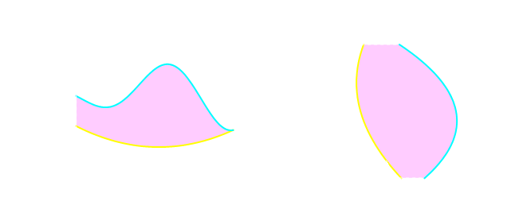
	- **Set builder notation** is normally used to describe these regions:
		- The definition for the region in Case 1
		  collapsed:: true
			- $$D = \{(x,y) | a \le x \le b, g_1 (x) \le y \le g_2(x)\}$$
		- The definition for the region in Case 2
		  collapsed:: true
			- $$D = \{(x,y)| h_1 (y) \le x \le h_2 (y), c\le y \le d\}$$
		- All the points $(x,y)$ in which the coordinates will satisfy the two given inequalities
	- The double integral for both of these cases are defined in terms of iterated integrals as followngs
	  collapsed:: true
		- In Case 1 where $D = \{(x,y)| a \le x \le b , g_1 (x) \le y \le g_2 (x)\}$ the integral is defined to be
		  collapsed:: true
			- $$\iint_D f(x,y) \ dA = \int_a^b \int_{g_1(x)}^{g_2(x)} f(x,y) \ dy dx$$
		- In Case 1 where $D = \{(x,y)| h_1 (x) \le y \le h_2 (x), c\le x \le d\}$ the integral is defined to be
		  collapsed:: true
			- $$\iint_D f(x,y) \ dA =  \int_{h_1(x)}^{h_2(x)}  \int_c^d f(x,y) \ dy dx$$
	- ## Properties of Double Integrals
	  id:: 66ff5b58-1e9a-4305-8790-79818aa123a6
		- logseq.order-list-type:: number
		  $$\iint_D f(x,y) + g(x,y) \ dA = \iint_D f(x,y) \ dA + \iint_D g(x,y) \  dA$$
		- logseq.order-list-type:: number
		  $$\iint_D cf (x,y) \ dA = c \iint_D f(x,y) \ dA$$ where $c$ is constant
		- I the region $D$ can be split into two separate regions $D_1$ and $D_2$ then the integral can be written as
		  logseq.order-list-type:: number
			- $$\iint_D f(x,y) \ dA = \iint_{D_1} f(x,y) \ dA + \iint_{D_2} f(x,y) \ dA$$
	- **Example:**
	  background-color:: blue
		- Evaluate each of the following integrals over general regions $D$
			- $$\iint_D e^{\frac{x}{y}} \ dA, D = \{(x,y) | 1 \le y \le 2, y \le x \le y^3\}$$
				- 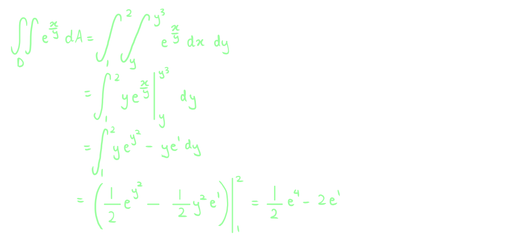
			- $$\iint_D 4xy - y^3 \ dA, D = \{\sqrt{x} \le y \le x^3\}$$
				- 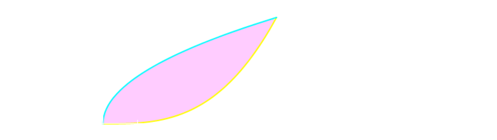
				- 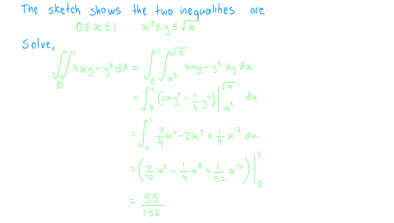
		- $\iint_D 6x^2 - 40y \ dA$ where $D$ is a triangle with vertices $(0,3), (1,1)$ and $(5,3)$
			- 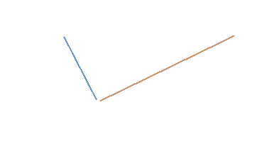
			- 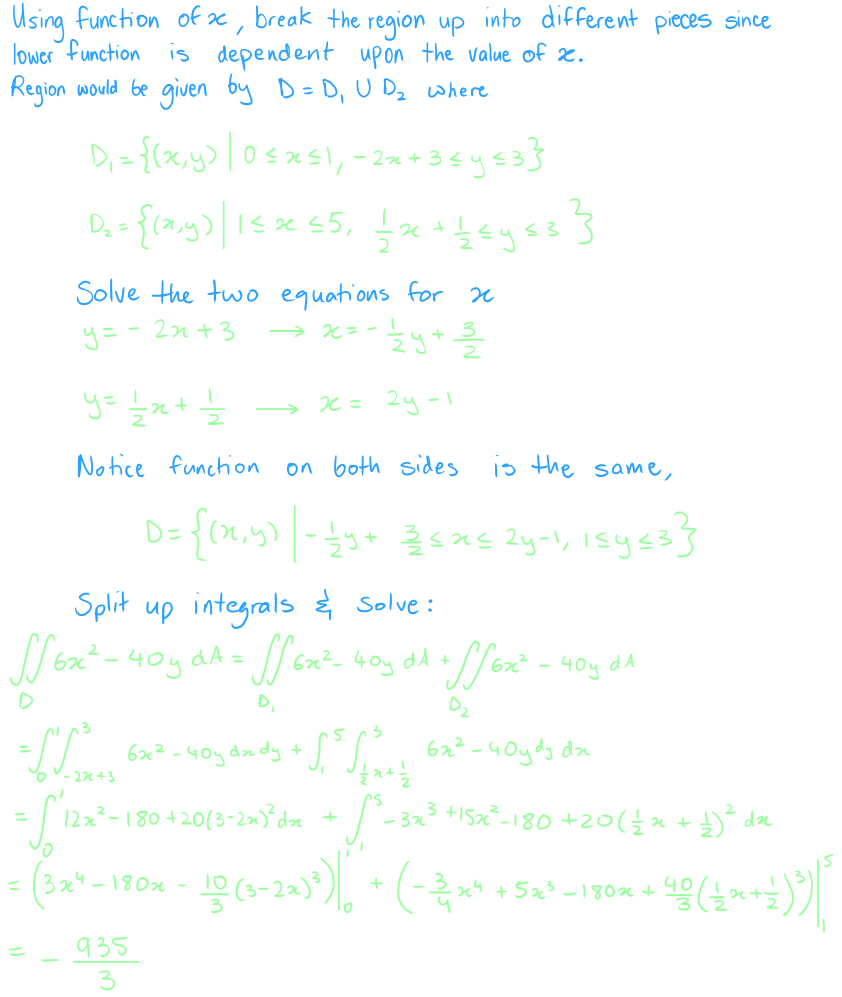
		- Evaluate the following integrals by reversing the order of integration
			- $$\int_0^3 \int_{x^2}^9 x^3 e^{y^3} \ dy dx$$
				- 
				- 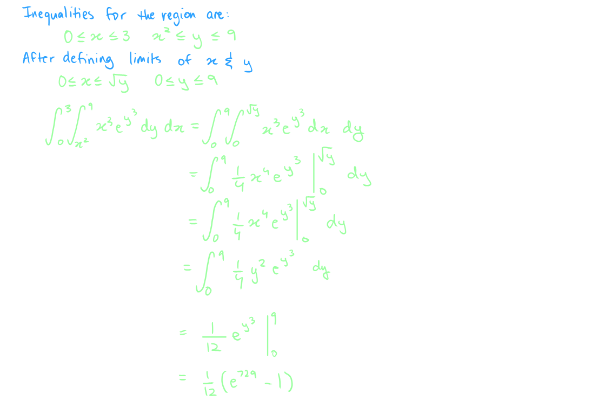
			- $$\int_0^8 \int_{\sqrt[3]{y}}^2 \sqrt{x^4 + 1} \ dx dy$$
				- 
				- 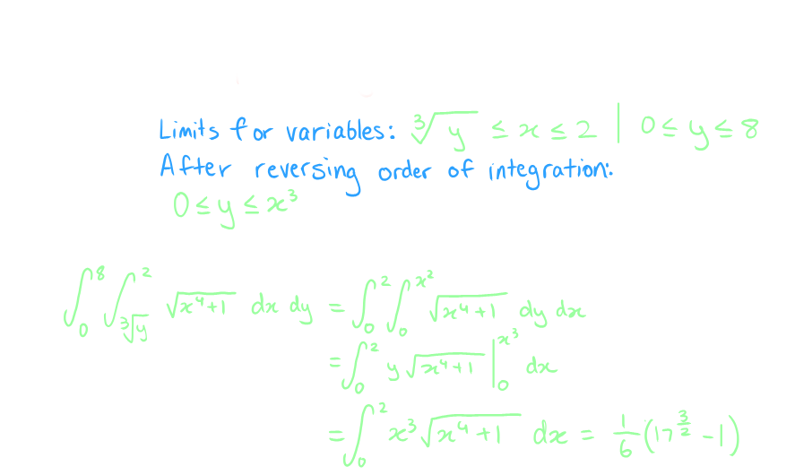
		- Find the volume of a solid that lies below the surface given by $z = 16xy + 200$ and lies above the region in the $xy$-plane bounded by $y = x^2$ and $y = 8-x^2$
			- 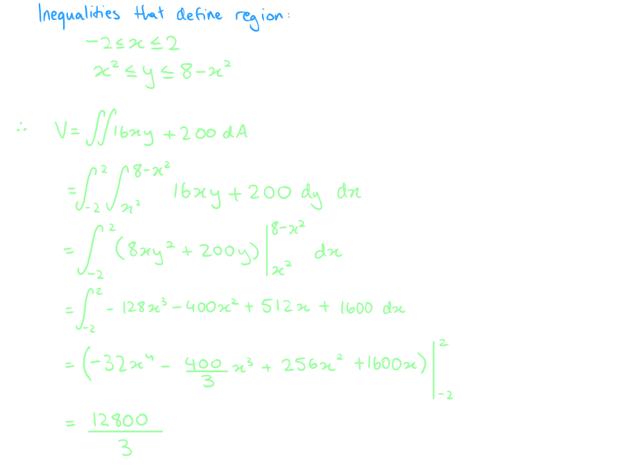
		- Find the volume of the solid enclosed by the planes $4x + 2y + z = 10, y =3x, z=0, x = 0$
			- 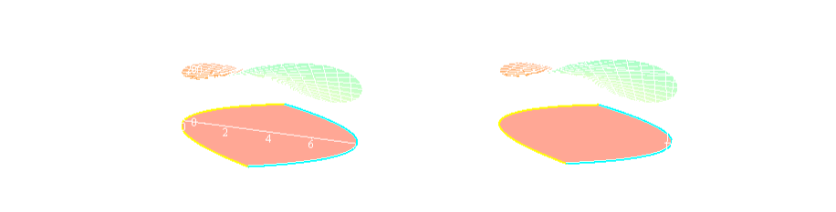
			- 
			- 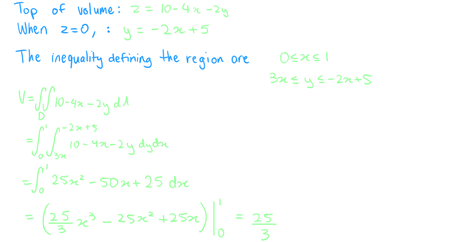
- # [[Double Integrals in Polar Coordinates]] #[[MAT 2322]]
	- ## Polar Coordinates
		- Sketch of some region using polar coordinates
			- 
		- The general region will be defined by inequalities,
			- $$\alpha \le \theta \le  \Beta \\h_1(\theta) \le \le h_2(\theta)$$
		- Break up the region into a mesh of radial lines and arcs
			- 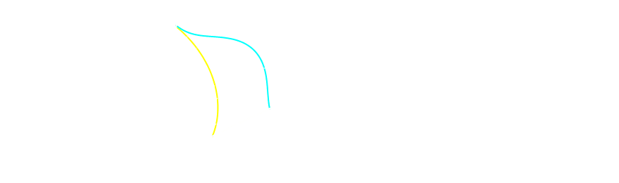
		- The area of this piece is $\Delta A$
			- The sides of this piece both have length $\Delta r = r_o - r_i$ where $r_o$ is the radius of the outer arc and $r_i$ is the radius of the inner arc
				- The length of the inner edge is $r_i \Delta (\theta)$ while the length of the out edge is $r_0\Delta (\theta)$ where $\theta$ is the angle between the two radial lines that form the sides of this piece
			- Assume that a small piece of mesh so small that one can assume  that $r_i \approx r_0= r$
				- One can assume that
					- $$\Delta A \approx r \Delta \theta \Delta r$$
					- Which can form the assumption that if the mesh is small enough
						- $$dA  \approx \Delta A \quad d\theta  \approx \Delta \theta \ dr  \approx \Delta r$$
		- ### Formula for Double Integral in Terms of Polar Coordinates
			- $$\iint_D f(x,y) \ dA = \int_{\alpha}^{\Beta} \int_{h_1 (\theta)}^{h_2(\theta)} f(r \cos \theta, r \sin \theta) r \ dr \ d\theta$$
		- Example:
		  background-color:: blue
			- Evaluate the following integrals by converting them into polar coordinates
				- $$\iint_D 2xy \ dA, D$$ is the portion between the circles of $r_1 = 2$ and $r_2 =5$ centered at the origin that lies in the first quadrant
					- 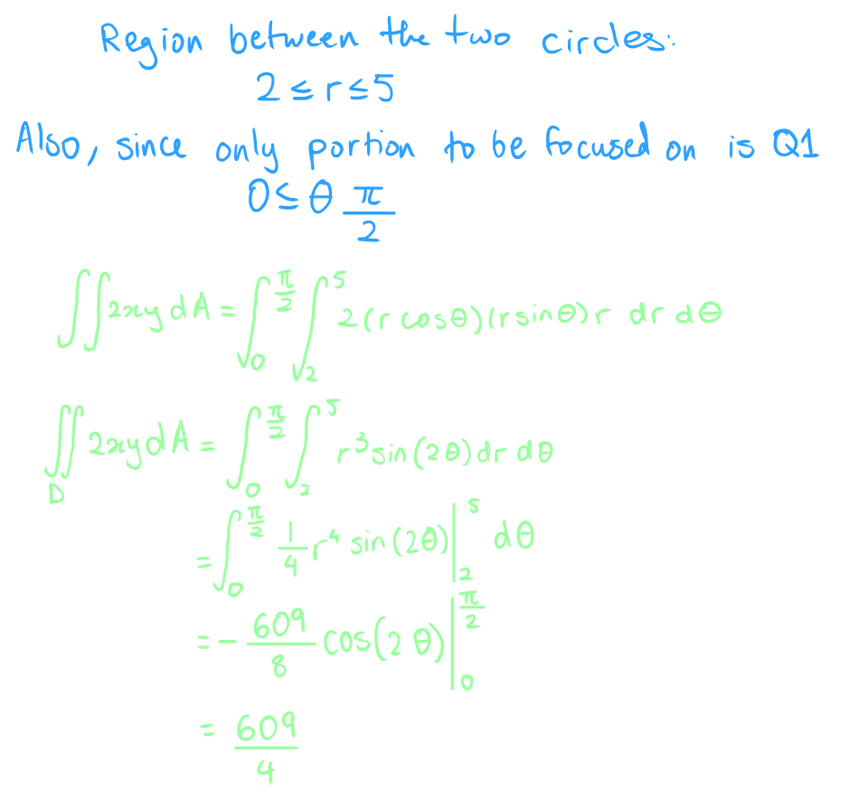
				- $$\iint_D e^{x^2+y^2} \ dA, D$$
				- is the unit desk centered at the origin
					- 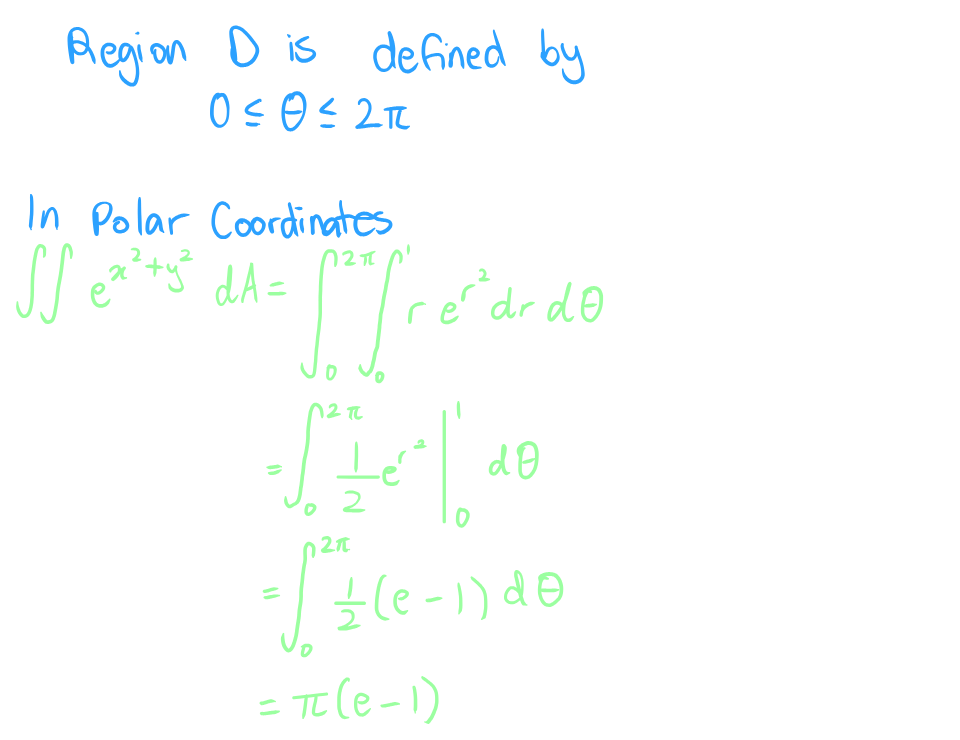
			- Determine the area of the region that lies $r = 3+2 \sin \theta$ and outside $r =2$
				- 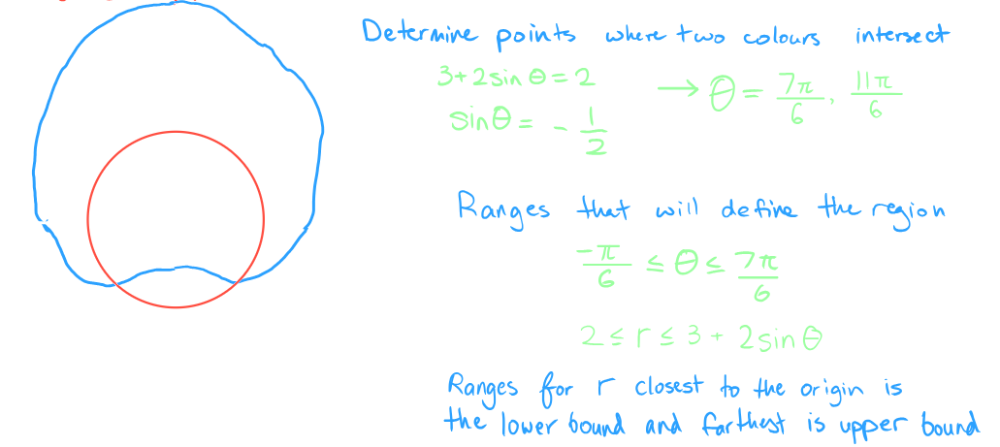
				- 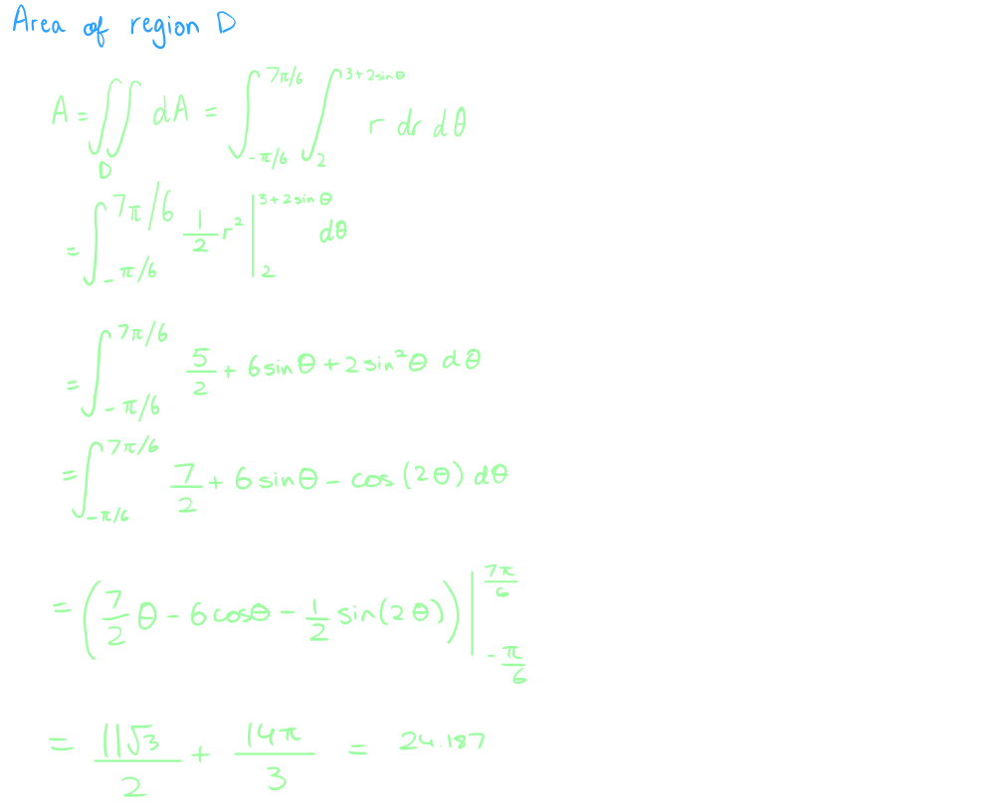
			- Determine the area of the region that lies under the sphere $x^2 +y^2 +z^2 =9$ above the plane $z = 0$ inside the cylinder $x^2 + y^2 =5$
				- 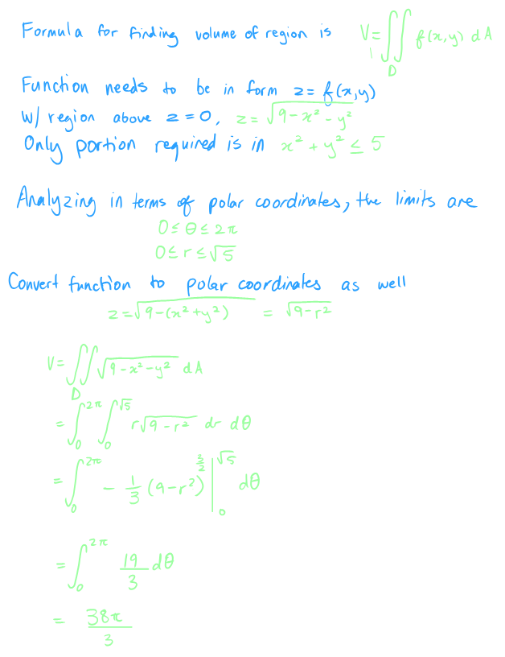
			- Find the volume of region that lies inside $z = x^2 + y^2$ and below the plane $z = 16$
				- 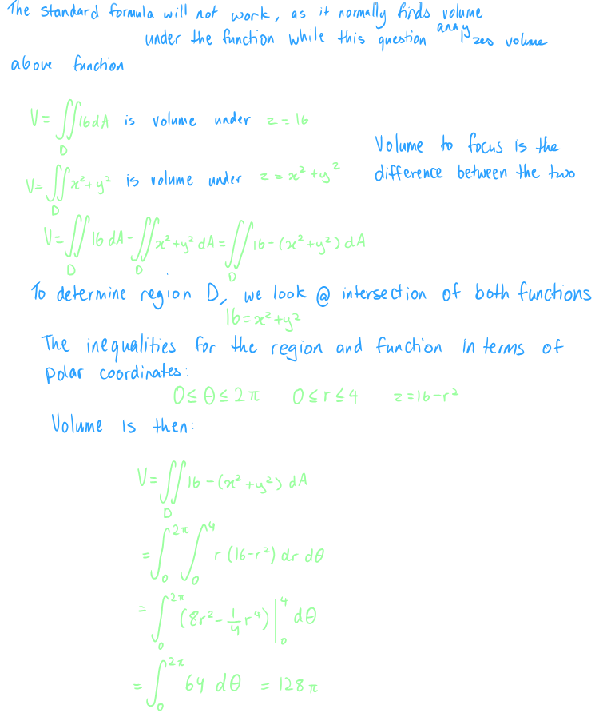
			- Evaluate the following integral by first converting to polar coordinates
				- $$\int_{-1}^1 \int_{-\sqrt{1-x^2}}^0 \cos (x^2 +y^2) \ dy \ dx$$
					- 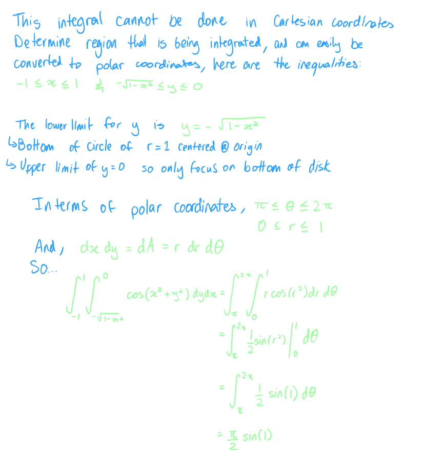