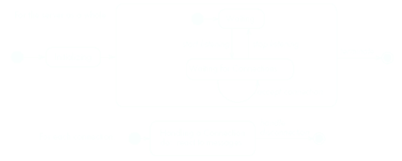
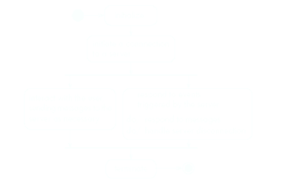
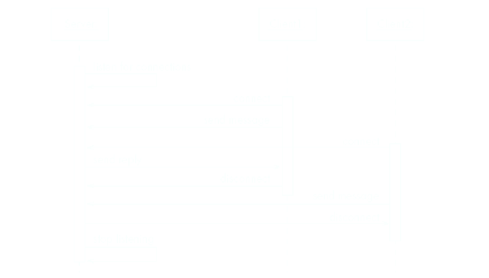
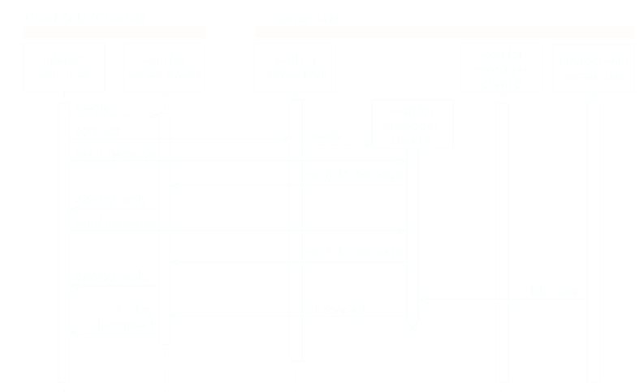
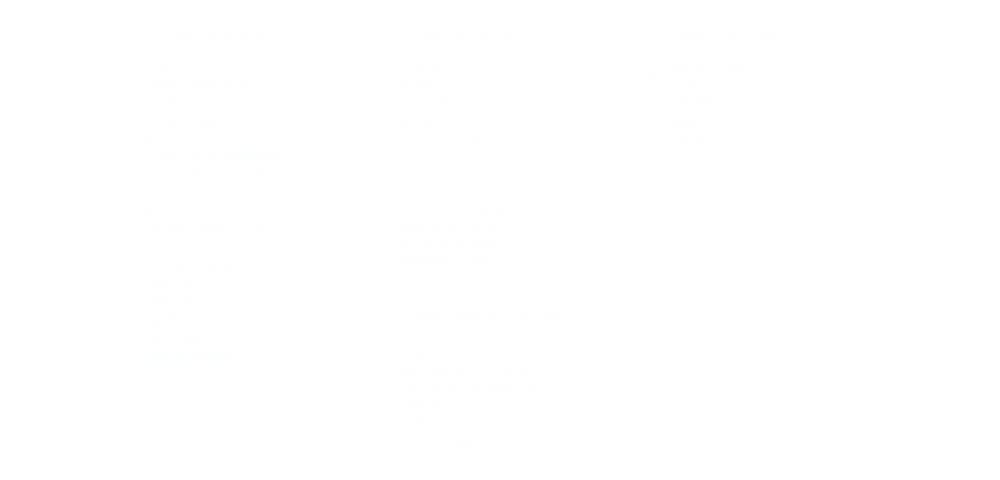

## [[Software and Software Engineering]]
- ## [[Object Orientation and Java]]
- ## [[Basing Software Development on Reusable Technology]]
- ## [[Modelling with Classes]]
- # Chapter 1
	- ­Nature of software systems
		- Software is **hard** to **quantify development**, **easy** to **reproduce** in future
		- Hard to automate, untrained people can still be skilled, software is ^^long lasting^^
		- RTOS, data processing software, video games, mobile & web based software are some examples
	- ­Understanding of the definition of “software engineering”
		- The process of ^^solving customers' problems^^ by the systematic development and evolution of large, high-quality software systems within cost, time and other constraints by:
			- Solving customers problems
			- Systematic development and evolution
			- Large, high quality software systems (coordination and teamwork)
	- ­Stakeholders in software engineering
		- **Users** (use the system)
			- Software must be easy to learn and efficient
		- **Customers** (pay for the system)
			- Cost should be acceptable compared to solved problem
		- **Developers** (develop the system)
			- Should be easy to design, maintain, reuse
		- **Managers**(supervise production)
			- Product should be able to sell
	- ­Different perspectives of software quality (e.g., usability, efficiency, reliability, etc.)
	- ­Types of software engineering projects
		- **^^Corrective^^ projects:** fixing defects
		- **^^Adaptive^^ projects:** changing the system to fit OS, database, rules and regulations
		- **^^Enhancement^^ projects:** adding new features for users
		- **^^Reengineering (Perfective)^^ projects:**make more maintainable system
	- ­Activities common to software projects
		- **Requirements and specifications**
		- **Design**: Implementing technologies (system engineering/software architecture), design of subsystem and UI
		- **Modelling**
		- **Programming & QA**
		- **Deployment**
- # Chapter 2
	- ­Procedural and data abstraction
		- Software is organized around the notion of *procedures*, and it works as long as the data is simple
		- Adding data abstractions group together pieces that describe some entity, helping reduce the system's complexity (such as ^^records^^ and ^^structures^^)
	- ­Basics of the object-oriented paradigm
		- All computations are performed in context of objects (instances of classes, contain procedural code that operate on objects)
	- ­An object is a chunk of structured data, has properties, behaviours
	- ­Naming classes (use capital letters & singular nouns)
	- ­Instance and class variables
		- Refers to an object corresponding to data
		- Class variables are values shared by all instances of a variable
	- ­Methods, operations, and polymorphism (and dynamic binding)
		- **Operation**:
			- A higher-level procedural abstraction that specifies a type of behaviour, independent of the code that implements the behaviour (ex. calculating area)
		- **Methods**
			- A procedural abstraction used to implement the behaviour of the class, the same abstract operation can be implemented differently depending on classes (calculating area of triangle vs circle)
	- ­Inheritance (and the “isa” rule)
	- ­Abstract classes and methods
	- ­Overriding
	- ­How a decision is made about which method to run in an inheritance hierarchy
	- ­Basics of Java (characters and strings, ArrayList and Collection, casting, exceptions, interfaces, and access control)
	- ­Threads and concurrency
- # Chapter 3
	- ­Types of reusability
		- Expertise, standard design & algorithms, libraries of classes or procedures, frameworks, and even complete applications
	- ­Object oriented frameworks (hooks, slots, service methods)
		- **Slots:** Intentionally missing components of software framework designed to be implemented by developers
		- **Hooks**: Allows developers to add optional functionality or modify existing behaviour, aka extension points
	- ­What is an API?
		- A software intermediary that allows two applications to communicate with each other, defined by the set of all ^^public methods^^ of these classes
	- ­Types of frameworks
		- **Horizontal Framework:** provides commonly-used general application facilities
		- **Vertical Framework:** Application framework, needs some slots to be filled in to adapt it for specific application
	- ­Distributed systems
		- A system in which computations are performed by separate programs, running on separate pieces of hardware and cooperate to perform the task of the system
	- ­Client-server architecture
		- **Server:** A program that *provides* a service for other programs that connect to it
			- 
		- **Client:** A program that access server to obtain services
			- 
	- ­Client-server sequence diagrams
		- 
	- ­Client-server threads
		- 
	- ­Types of clients in client-server systems
		- **Thin client systems** have clients as small as possible (most of the work is done on the server), easy to download over network
		- **Fat client systems** have as much work as possible delegated to clients, allowing server to handle more clients
	- ­Communication protocols
		- The messages the client sends to the server from a *language* & server is programmed to understand *language*
		- The same principle applies to clients
	- ­TCP and IP protocols
		- Internet Protocols
			- Route messages from one computer to another, long messages are split up into small pieces
		- Transmission Control Protocol
			- Handles *connections* between two computers, can exchange many IP messages over a connection
		- A host has an IP address and a host name
			- Several several servers can be run on the same host, each server is identified by a port number
			- To initiate communication with a server, a client must know both the host name and the port number
	- ­Sockets and input and output streams
	- OCSF (creating a client, creating a server, and callbacks and service methods)
		- 
- # Chapter 5
	- Essentials of UML Diagram
		- Classes represent the types of data themselves
		- Association represent linkages between of classes
		- Attributes are simple data found in classes and their instances
		- Operations represent the functions performed by the classes
		- Generalizations group classes into inheritance hierarchies
	- ­Classes, associations, and multiplicity
		- A class is represented by a box with name, showing attributes and operations
		- An *association* is used to show how two classes are related to each other
		- *Multiplicity* indicates the numerical constraints on relationships
		- *Aggregation* is a relationship where a class that can exist independently of the whole
		- *Composition* is relationship where an object cannot exist without its parent object
	- ­Association classes
		- Sometimes an attribute that concerns two associated classes cannot be placed in either of the classes
	- ­Reflexive associations
		- 
	- ­Generalization
		- A *generalization* set is a labelled group of generalization with common super class
			- They describe relationships between *classes in class diagrams*
	- ­Object diagrams
		- An object diagram is a snapshot of instances of classes(objects) in a system at a specific point in time, showing relationships and links in between objects
		- A *link* is an instance of an association
	- ­Types of UML class diagrams: exploratory domain model, system domain model, and system model