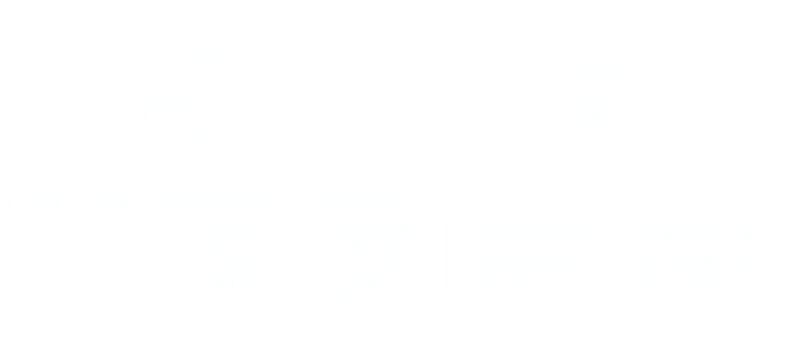
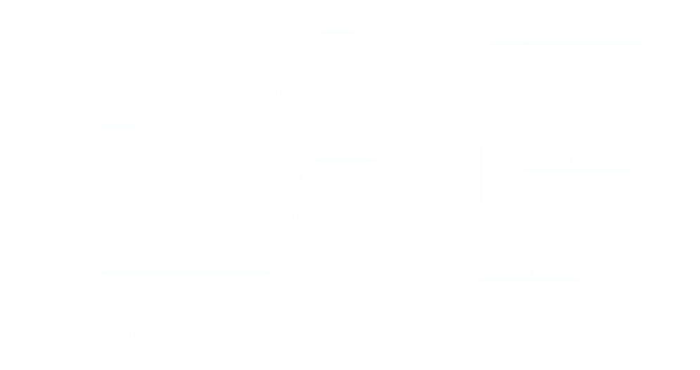
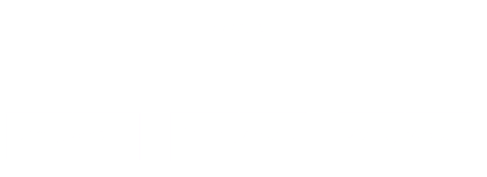
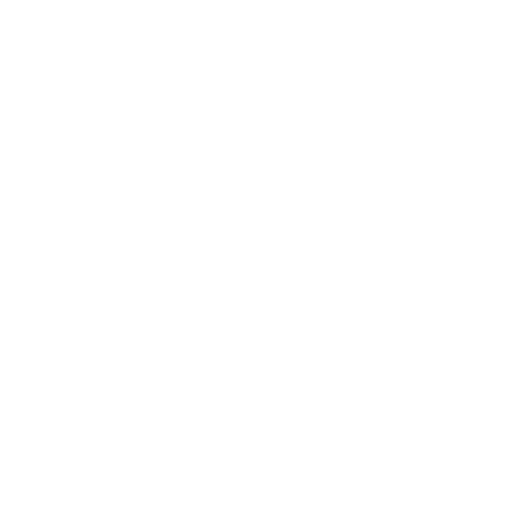
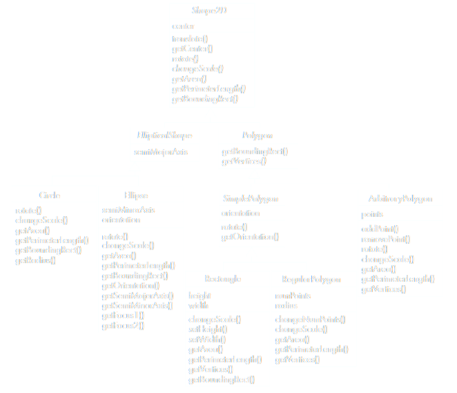

# [[Software and Software Engineering]] #[[SEG 2105]]
	- ## The Nature of Software
	  id:: 66daf451-11fd-45ae-bd81-adfd462c27f0
		- ### Software is intangible
			- Hard to quantify development efforts
		- ### Software is easy to reproduce
			- Main cost is **development**, whereas in other engineering disciplines, manufacturing is the costly component of production
		- ### The industry is labour intensive
			- Hard to automate
		- ### Untrained people can still put something together
			- Quality problems are hard to notice
		- ### Software is easy to modfiy
			- People make changes without fully understanding it
		- ### Software is long lasting, and does not "wear out"
			- It "deteriorates" by having its design changed erroneously or in unanticipated ways, increasing complexity
	- ## Some Times of Software
	  id:: 66daf451-44d7-418f-bd23-cae72c27f52a
		- ### Real time embedded software
			- Control systems and monitoring systems
			- Must react immediately
			- Safety is often a concern
		- ### Data Processing Software
			- Used to run businesses
			- Accuracy and security of data are key
		- ### Game Software
		- ### Mobile Device Software
		- ### Web-Based Software
	- ## What is Software Engineering?
	  id:: 66daf451-6c2c-44ed-ba97-d3561bfc9b9d
		- The process of ^^solving customers' problems^^ by the systematic development and evolution of large, high-quality software systems within cost, time and other constraints
		- ### Solving customers' problems
			- The goal
			- Sometimes the solution is to **buy**, not ^^build^^
			- Adding unnecessary features often makes software worse
			- Software engineers must *communicate effectively* to identify and understand the problem
		- ### ^^Systematic development^^ and evolution
			- An engineering process involves applying *well understood techniques* in an organized and disciplined way
			- Many well-accepted practices have been formally standardized by the IEEE or ISO
			- Most development work is **evolution**
		- ### Large, high quality software systems
			- Software engineering techniques are needed because large systems cannot be completely understood by one person
			- Teamwork and coordination are required
			- Dividing up the work and ensuring that parts of the system work properly together is a key challenge
			- The end product must be of sufficient quality
		- ### Cost, time and other resources
			- Finite resources
			- Benefit must outweigh the cost
			- Others are competing to the do the job cheaper and faster
			- Inaccurate estimates of cost and time have historically caused many project failures
	- ## The Software Engineering Profession
	  id:: 66daf451-77f3-4afd-9026-f1cbbe704ba5
		- The term "Software Engineering" was coined in 1968, as people began to realize the principles of engineering can apply to software development
		- #### Engineering is a licensed profession
			- In order to protect the public
			- Ethical practice is also a key tenet of the profession
	- ## Software Engineering Code of Ethics
	  id:: 66daf640-5bf0-4c07-9314-df4f0445f305
		- Act consistently in **public interest**
		- Act in the **best interest of their clients**
		- Develop and maintain with the **highest standards** possible
		- Maintain **integrity and independence**
		- Promote an **ethical** approach in **management**
		- Advance the integrity and **reputation of the profession**
		- Be fair and **supportive to colleagues**
		- Participate in **lifelong learning**
	- ## Software Quality
	  id:: 66db1d71-e478-47ce-968a-4359b9241686
		- ### Usability
			- Users can learn it fast and get their job done
			- UI is a pivotal component in streamlining usability
		- ### Efficiency
			- Doesn't  waste system resources such as CPU or memory
		- ### Reliability
			- Does what is required without failing
		- ### Maintainability
			- Can be easily changed
		- ### Reusability
			- Parts of the code can be reused in other  projects, so reprogramming is not needed
	- ## Stakeholders in Software Engineering
	  id:: 66db1ce4-963e-4f5b-b941-d92fe1c871a1
		- ### Users
			- Those who use the system
			- Always need an advocate for users on the software team
			- Software should be easy to learn, efficient to use and helps get the work done
		- ### Customers
			- Those that pay for the system
			- Software should solve their problems at an acceptable cost in terms of the money spent & resources used
		- ### Developers
			- Those that develop the system
			- Software should be easy to design, maintain, and reuse
		- ### Managers
			- Those that supervise the production of the system
			- Software should be able to sell, pleasing customers while costing less to develop and maintain
		- ^^All of these roles can be played by the same person^^
	- ## Software Quality Conflicts and Objectives
	  id:: 66db1e91-0be5-403b-a05e-2e84dcc357aa
		- ### The different qualities can conflict
			- Increasing efficiency can reduce maintainability or reusability
			- Increasing usability can reduce efficiency
		- ### Setting objectives for quality is a key engineering activity
			- Design to meet objectives, which avoids "over-engineering" which wastes money
	- ## Software Engineering Projects
	  id:: 66db1fc4-9185-4b4a-b281-3c26f8f5d33f
		- Most projects are **evolutionary** or **maintenance** projects, involving work on ^^legacy systems^^:
			- **^^Corrective^^ projects:** fixing defects
			- **^^Adaptive^^ projects:** changing the system to fit OS, database, rules and regulations
			- **^^Enhancement^^ projects:** adding new features for users
			- **^^Reengineering (Perfective)^^ projects:** changing the system internally so it is more maintainable
		- **^^"Green Field"^^ projects**
			- New development, and very rare projects
	- ## Activities Common to Software Projects
	  id:: 66db20f9-ef94-4f10-bdc7-f544bebd9c36
		- ### Requirements and specification
			- Domain analysis
			- Defining the problem
			- Requirements gathering
				- Obtaining input from as many sources as possible
			- Requirements analysis
				- Organizing the information
			- Requirements specification
				- Writing detailed instructions about how the software should behave
		- ### Design
			- Deciding how the requirements should be implemented, using the available technology, which includes:
				- System engineering
					- Deciding what should be in hardware and what in software
				- Software architecture
					- Dividing the system into subsystems and deciding how the subsystems will interact
			- Detailed design of the internals of a subsystem
			- User interface design
			- Design of databases
		- ### Modelling
			- Creating representations of the domain or the software
				- Use case modelling
				- Structural modelling
				- Dynamic and behavioural modeling
		- ### Programming
		- ### Quality Assurance
			- Reviews and inspections
			- Testing
		- ### Deployment
		- ### Managing the Process
- # [[Object Orientation and Java]] #[[SEG 2105]]
	- ## What is Object Orientation
	  id:: 66e18944-998b-4443-bccd-5afb778815a9
		- ### Procedural paradigm
			- Software is organized around the notion of *procedures*
			- **Procedural abstraction**
				- Works as long as the data is simple
		- **Adding *data abstractions* group together pieces of data that describe some entity**
			- Helps reduce the system's complexity
				- Such as *records* and *structures*
		- ### Object oriented paradigm
			- Organizing procedural abstractions in the context of data abstractions
	- ## Object Oriented Paradigm
	  id:: 66e18944-09de-44f8-9b95-5c013d0f747d
		- All computations are performed in the context of objects
			- The objects are instances of classes which:
				- Are data abstractions
				- Contain procedural abstractions that operate on the objects
			- A running program can be seen as a collection of objects collaborating to perform a given task
		-  A view of the two paradigms
	- ## Classes and Objects
	  id:: 66e18944-4107-4ad6-bba6-c0176409cc52
		- ### Object
			- A chunk of structured data in a running software system
			- Has *properties*, represents its state
			- Has *behaviour*, how is acts and reacts
				- May simulate the behaviour of an object in the real world
			- **Objects as a UML Instance Diagram**
				- 
		- ### Class
			- A unit of abstraction in an object oriented (OO) program
			- Represents similar objects
				- Its **instances**
			- A kind of software module
				- Describes it instances' structure (properties)
				- Contains *methods* to implement their behaviour
		- ### Classes vs. Instances
			- Something should be a *class* if it could have instances
			- Something should be an *instance* if it is clearly a ^^single member^^ of the set defined by a class
			- Example:
			  background-color:: blue
				- Film; class, instances are individual films
				- Reel of film; class; instances are physical reels
				- Film reel with serial number SW19876; instance of reel
				- Science fiction; instance of class genre
				- Science fiction film; class; instance includes '*Star Wars*'
				- Showing '*Star Wars*' in the '*Phoenix Cinema*' at '*7pm*'; instances of film showing
		- ### Naming Classes
			- Use *capital letters*(ex. `BankAccount` not `bankAccount`)
			- Use *singular nouns*
			- Use the right level of generality
			- Make sure the name has only one meaning
	- ## Variables and Objects
	  id:: 66e44785-221f-41c3-8d18-12d1e079baf7
		- A variable, refers to an object
			- May refer to different objects at different points in time
			- Type of a variable can determine what classes of objects it may contain
		- An object can be referred to by several different variables at the same time
		- Variables defined inside a class corresponding to data present in each instance
			- Also called *fields* or *member variables*
			- **Attributes**
				- Simple data
				- Ex. `name`, `dataOfBirth`
			- **Associations**
				- Relationships to other important classes
				- Ex. `supervisor`, `coursesTaken`
		- ### Class Variables
			- A class variable's value is *shared* by all instances of a class
				- Also called a *static* variable
			- If one instance sets the value of a class variable, then all the other instances see the same changed value
			- Class variables are useful for default or 'constant' values, or lookup tables and similar structures
	- ## Methods, Operators and Polymorphism
	  id:: 66e44914-a87d-466e-9de0-7747b84e6c37
		- ### Operation
			- A higher-level procedural abstraction that specifies a type of behaviour
			- Independent of any code which implements that behaviour
				- Ex. calculating area
		- ### Methods
			- A procedural abstraction used to implement the behaviour of a class
			- Several different classes can have methods with the same name
				- They implement the same abstract operation is ways suitable to each class
				- Ex. calculating area in a rectangle is done differently from in a circle
		- ### Polymorphism
			- A property of object oriented software by which an *abstract operation may be performed in different ways* in different classes
				- Requires that there be *multiple methods of the same name*
				- The choice of which one to execute depends on the object that is in a variable
				- Reduces the need for programmers to code many `if-else` or `switch` statements
	- ## Organizing Classes into Inheritance Hierarchies
	  id:: 66e44abc-282b-4e38-afa7-b8699ac325e6
		- **Superclasses**
			- Contain features common to a set of subclasses
		- **Inheritance hierarchies**
			- Show the relationships among superclasses and subclasses
			- A triangle shows a generals a generalization $\Delta$
		- **Inheritance**
			- The *implicit* possession by all subclasses of features defined in its superclasses
				- 
		- ^^**ISA Rule**^^
			- Always check generalizations to ensure they obey the ISA rule
				- "A checking account ***is an*** account"
				- "A village ***is a*** municipality
		- Possible Inheritance Hierarchy of Mathematical Objects
			- 
		- 
	- ## Abstract Classes And Methods
	  id:: 66e44dd7-cfd2-42ea-a0f6-0c7961629256
		- An operation should be declared to exist at the highest class in the hierarchy where it makes sense
			- The *operation* may be *abstract* (lacking implementation) at that level
			- If so, the *class* also **must** be abstract
				- No instance classes can be created
				- The opposite of an abstract class is a **concrete** class
			- If a superclass has an abstract operation then its subclasses at some level must have a concrete method for the operation
				- Leaf classes must have or inherit concrete methods for all operations
				- Leaf classes must be concrete
	- ## Overriding
	  id:: 66e44e6c-4021-446d-bce6-3546f9e69bc5
		- A method would be inherited, but a subclass contains a new version instead
			- For extension: Ex. `SavingsAccount` might charge an extra fee following every debit
			- For optimization: Ex. The `getPerimeterLength`method in `Circle`is much simpler than in `Ellipse`
			- For restriction (best to avoid): Ex. `scale(x,y)` would not work in `Circle`
	- ## Deciding which Method to Run
	  id:: 66e44ef1-afaa-46fd-9a94-a0e4af10fb43
		- If there is a concrete method for the operation in the current class, run that method
		  logseq.order-list-type:: number
		- Otherwise, check in the immediate superclass to see if there is a method there; if so, run it
		  logseq.order-list-type:: number
		- Repeat step 2, looking in successively higher superclasses until a concrete method is found and run
		  logseq.order-list-type:: number
		- If no method is found, then there is an error
		  logseq.order-list-type:: number
			- In Java and C++ the program would not have compiled
			  logseq.order-list-type:: number
	- ## Dynamic Binding
	  id:: 66e44f06-6f71-4b04-95ee-8c12a08f6c08
		- Occurs when a decision about which method to run can only be made at *run time*
			- Needed when:
				- A variable is declared to have a superclass as its type, and
				- There is more than one possible polymorphic method that could be run among the type of the variable and its subclasses