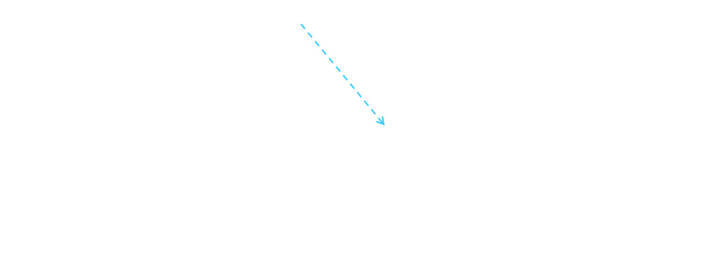
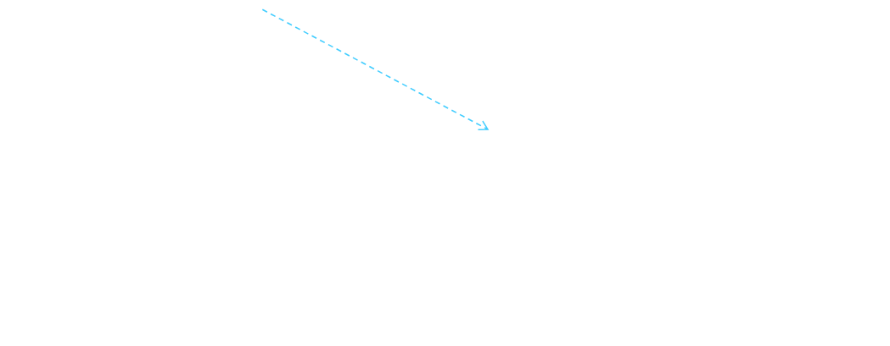

# [[Object Orientation and Java]] #[[SEG 2105]]
	- ## Basics of Java
		- ### History
			- The first object oriented programming language was Simula-67
				- Designed to allow programmers to write simulation programs
			- In the early 1980's, Smalltalk was developed at Xerox PARC
				- New syntax, large open-source library of reusable code, bytecode, platform independence, garbage collection
			- In the late 1980's C++ was developed by B. Stroustrup,
			  id:: 66f41e7e-6711-4ddd-b4ba-d8620a0e2c6c
				- Recognized the advantages of OO but also recognized that there were tremendous number of C programmers
			- In 1991, engineers at Sun Microsystems started a project to design a language that could be used in consumer "smart devices"
				- When the internet gained popularity, Sun saw an opportunity to  exploit the new technology
				- The new language, renamed Java, was formally presented in 1995 at the SunWorld ’95 conference
	- ## Java Documentation
		- Looking up classes and methods is an essential skill
			- Looking up unknown classes and methods will get you a long way towards understanding code
		- Java documentation can be automatically generated by a program called Javadoc
			- Documentation is generated from the code and its comments
			- Format your comments as shown in some book examples
	- ## Character and Strings
		- `Character`is a class representing Unicode characters
			- Represents any world language
		- `char` is a primitive data type containing a Unicode character
		- `String`is a class containing collections of characters
			- `+` is the operator used to concatenate strings
	- ## Arrays and Collections
		- Arrays are of fixed size and lack methods to manipulate them
		- `ArrayList`is the most widely used  class to hold a *collection* of other objects
			- More powerful than arrays but less efficient
		- `Iterators`are used to access members of `Lists`
	- ## Casting
		- Java is very strict about ypes
			- Widening Casting (automatically)
				- Converting a smaller type to a larger type size (byte $\rightarrow$ short)
			- Narrowing casting (manually)
				- Converting a larger type to a smaller size type (long $\rightarrow$ int)
	- ## Exceptions
		- Anything that can go wrong should result in raising of an **Exception**
			- `Exception` is a class with many subclasses for specific things that can go wrong
	- ## Interfaces
		- Like abstract classes, but cannot have executable statements
			- Define a set of operations that make sense in several classes
		- A class can implement any number of interfaces
			- Must have concrete methods for the operations
		- Declare the type of variable to be an interface
			- Like declaring the type of an abstract class
		- Important interfaces in Java include:
			- `Runnable`, `Collection`, `Iterator`, `Comparable`, `Cloneable`
	- ## Packages and Importing
		- A package combines related classes into subsystems
			- All the classes in a particular directory
		- Classes in different packages can have the same name (although not recommended)
	- ## Access Control
		- Applies to methods and variables
			- `public`: Any class can access
			- `protected`: Only code in the package, or subclasses can access
			- (blank): Only code in the package can access
			- `private`: Only code written in the class can access
	- ## Threads and Concurrency
		- Thread:
			- Sequence of executing statements that can be running concurrently with other threads
		- To create a thread in Java:
			- Create a class implementing `Runnable` or extending `Thread`
			  logseq.order-list-type:: number
			- Implement the `run` method that does something for a period of time
			  logseq.order-list-type:: number
			- Create an instance of this class
			  logseq.order-list-type:: number
			- Invoke the `start` operation, which calls `run`
			  logseq.order-list-type:: number
			- 
			- 
	- ## Programming Style
		- Remember that programs are for people to read
			- Always choose that simpler alternative
			- Reject clever code that is hard to understand
			- Shorter code is not necessarily better
		- Choose good names
			- Make them highly descriptive
			- Do not worry about using long names
		- Comment extensively
			- Comment whatever is non-obvious
			- Do not comment the obvious
			- Comments should be 25-50% of the code
		- Organize class elements consistently
			- Variables, constructors, public methods then private methods
		- Be consistent regarding layout of code
		- Avoid duplication of code
			- Do not 'clone' if possible
				- Create a new method and call it
				- Cloning results in two copies that may both have bugs
					- When one copy of the bug is fixed, the other may be forgotten
		- Adhere to good object-oriented principles
		- Prefer `private`as opposed to `public`
		- Do not mix user interface code with non-user interface code
			- Interact with the user in separate classes
				- This makes non-UI classes more reusable