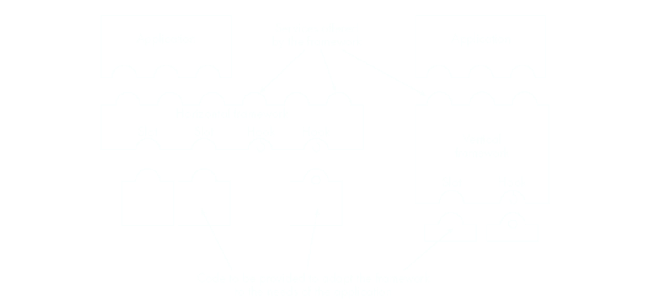
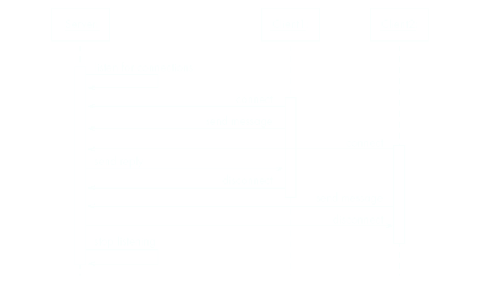
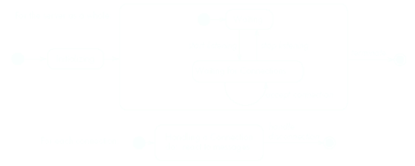
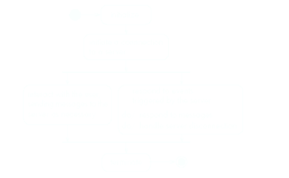
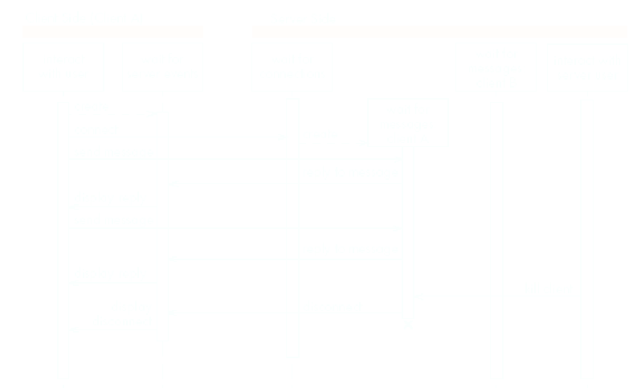
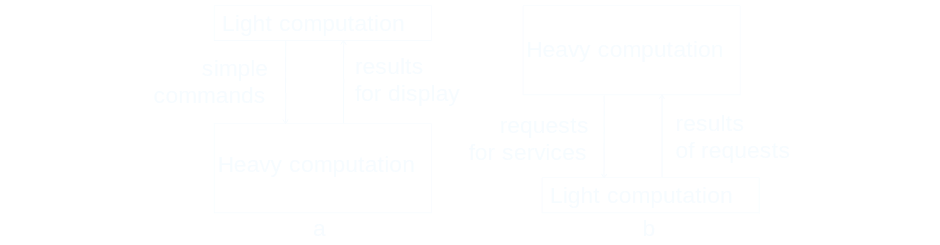

# [[Basing Software Development on Reusable Technology]] #[[SEG 2105]]
	- ## Building On the Experience of Others
		- Software engineers should avoid re-developing software already develop
		- Types of reuse:
			- Reuse of ^^expertise^^
			- Reuse of ^^standard designs^^ and algorithms
			- Reuse of ^^libraries^^ of classes or procedures
			- Reuse of powerful ^^commands^^ built into languages and operating systems
			- Reuse of ^^frameworks^^
			- Reuse of complete ^^applications^^
	- ## Frameworks: Reusable Subsystems
		- A *framework* is a reusable software that implements a generic solution to generalized problem
			- It provides common facilities applicable to different application programs
		- *Principle:*
			- Applications that do different, but related, things tend to have similar designs
		- A framework is intrinsically *incomplete*
			- Certain classes or methods are used by the framework but are missing (^^slots^^)
		- Some functionality is optional
			- Allowance is made for developer to provide it (^^hooks^^ or ^^extension points^^)
		- Developers use the *services* that the framework provides
			- Taken together the services are called the Application Program Interface (^^API^^)
		- ### Object-Oriented Frameworks
			- In the **object oriented** paradigm, a framework is composed of a library of classes
				- The API is defined by the set of all ^^public methods^^ of these classes
				- Some of the classes will normally be abstract and there are often many interfaces
			- Example:
				- A framework for payroll management
				- A framework for frequent buyer clubs
				- A framework for university registration
				- A framework for e-commerce web sites
		- ### Types of Frameworks
			- A ^^**horizontal** framework^^ provides general application facilities that a large number of applications can use
			- A ^^**vertical** framework^^ (*application framework*) is more "complete" but still needs some slots to be filled to adapt it to specific application needs
			- 
	- ## Client-Server Architecture
		- A *distributed system* is a system in which
			- Computations are performed by *seperate programs*
			- Normally running on separate pieces of hardware
			- That *co-operate* to perform the task of the system
		- ^^Server^^:
			- A program that *provides a service* for other programs that connect to it using a communication channel
		- ^^Client^^:
			- A program that accesses a server (or several servers) to *obtain services*
			- A server may be accessed by many clients simultaneously
		- Examples of Client-Server Systems
			- The WWW
			- Email
			- Network File System
			- Transaction Processing Systems
			- Remote Display System
			- Communication System
			- Database System
		- ### Sequence of Activities in a Client-Server System
			- The server begins its execution
			  logseq.order-list-type:: number
			- The server waits for connections
			  logseq.order-list-type:: number
			- A client begins its execution and performs a series of operations
			  logseq.order-list-type:: number
				- Some of these operations involve access to some of the services offered by the server
			- The client then tries to connect to the server, which accepts or refuses the connection
			  logseq.order-list-type:: number
			- The server waits to receive messages from connected clients
			  logseq.order-list-type:: number
			- When a message is received, the server performs certain operations and then goes back to standby
			  logseq.order-list-type:: number
			- Clients and server repeat this process until of them disconnects or is stopped
			  logseq.order-list-type:: number
			- A server program communicating with two client programs
				- 
		- ### Activities of a Server
			- Initializes itself
			  logseq.order-list-type:: number
			- Starts listening for clients
			  logseq.order-list-type:: number
			- Handles the following types of events originating from clients
			  logseq.order-list-type:: number
				- Accepts connections
				  logseq.order-list-type:: number
				- Responds to messages
				  logseq.order-list-type:: number
				- Handles client disconnection
				  logseq.order-list-type:: number
			- May stop listening
			  logseq.order-list-type:: number
			- Must cleanly terminate
			  logseq.order-list-type:: number
			- 
		- ### Activities of a Client
			- Initializes itself
			  logseq.order-list-type:: number
			- Initiates a connection
			  logseq.order-list-type:: number
			- Sends messages
			  logseq.order-list-type:: number
			- Handles the following types of events originating from the server
			  logseq.order-list-type:: number
				- Responds to messages
				  logseq.order-list-type:: number
				- Handles server disconnection
				  logseq.order-list-type:: number
			- Must cleanly terminate
			  logseq.order-list-type:: number
			- 
		- ### Threads in a Client-Server System
			- 
		- ### Thin & Fat Client Systems
			- **^^Thin-client^^ System**
				- Client is made as small as possible
				- Most of the work is done in the server
				- Client easy to download over the netowrk
			- **^^Fat-client^^ System**
				- As much work as possible is delegated to the clients
				- Server can handle more clients
					- 
		- ### Communication Protocols
			- The messages the client sends to the server form a *language*
				- The server has to be programmed to understand that language
			- The messages the server sends to the client also form a language
				- The client has to be programmed to understand the language
			- When a client and server are communicating, they are in effect having a conversation using these two languages
			- The two languages and rules of the conversation, taken together are called the *protocol*
		- ### Tasks to Perform to Develop Client-Server Applications
			- Design the ^^primary work to be performed^^ by both client and server
			  logseq.order-list-type:: number
			- Design ^^how the work will be distributed^^
			  logseq.order-list-type:: number
			- Design the ^^details of the set of messages^^ that will be sent
			  logseq.order-list-type:: number
			- Design the mechanism for 
			  logseq.order-list-type:: number
				- Initializing
				  logseq.order-list-type:: number
				- Handling connections
				  logseq.order-list-type:: number
				- Sending and receiving messages
				  logseq.order-list-type:: number
				- Terminating
				  logseq.order-list-type:: number
		- ### Advantages of Client-Server Systems
			- The work can be distributed among different machines
			- The clients can access the server's functionality from a distance
			- The client and server can be designed separately
			- They can both be simpler
			- There is a choice about where to keep data
				- All the *data can be kept* at the server
				- *Data can be distributed* among many different clients or servers
			- The server can be accessed *simultaneously* by many clients
		- ### Technology Needed to Build Client-Server Systems
			- Internet Protocol (IP)
				- Route messages from one computer to another
				- Long messages are normally split up into small pieces
			- Transmission Control Protocol (TCP)
				- Handles *connections* between two computers
				- Computers can then exchange many IP messages over a connection
				- Assures that the messages have been satisfactorily received
			- A host has an *IP address* and a *host name*
				- Several servers can run on the same host
				- Each server is identified by a port number (0 to 65535)
				- To initiate communication with a server, a client must know both the host name and the port number
	- ## Establishing a Connection In Java
		- The `java.net`package
			- Permits the creation of a TCP/IP connection between two applications
		- Before a connection can be established the server must start *listening* to one of the ports
			- ```d
			  ServerSocket serverSocket = new
			  	ServerSocket(port);
			  Socket clientSocket = serverSocket.accept();
			  ```
		- For a client to connect to a server
			- ```d
			  Socket clientSocket = new Socket(host,port);
			  ```
	- ## Exchanging Information in Java
		- Each program uses an instance of
			- `InputStream` to receive messages from the other program
			- `OutputStream` to send messages to the other program
			- These are found in the package `java.io`
		- `output = clientSocket.getOutputSteam();`
		- `input = clientSocket.getInputStream();`
	- ## Sending and Receiving Messages
		- Without any filters
			- ```d
			  output.write(msg);
			  msg = input.read();
			  ```
		- Or using `DataInputStream`/`DataOutputStream`filters
			- ```d
			  output.writeDouble(msg);
			  msg = input.readDouble();
			  ```
		- Or using `ObjectInputStream`/`ObjectOutputStream`filters
			- ```d
			  ObjectOutputStream output =
			  	new ObjectOutputStream(socket.getOutputStream())) {
			  output.writeObject(msg);
			  ObjectInputStream input =
			  	new ObjectInputStream(socket.getInputStream()))
			  msg = input.readObject()
			  ```
		- Only serializable objects can be sent and received over a netowrk
		- Ensuring that objects instantiated from a class are serializable:
			- The class must implement the Serializable interface
				- This interface is a marker that indicates to the JVM that objects from this class can be serialized
			- **Optional**: Declare a static and final variable of type long in the serializable class called serialVersionUID and give it a default value
				- This is used for versioning where for each version of the class, this variable is given a different value
			- If your class contains non-primitive fields (i.e. references to other objects), those objects/classes should also implement Serializable
		- If a superclass has already implemented Serializable, subclasses are automatically serializable