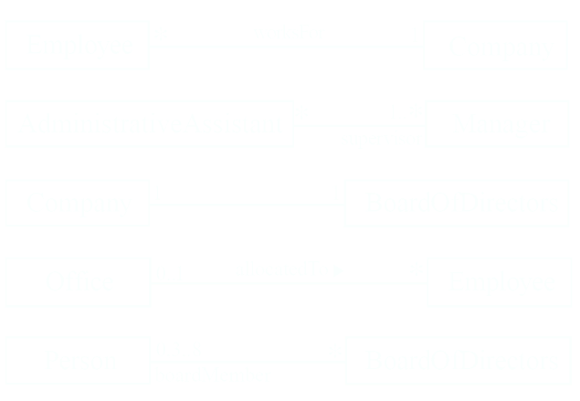

# [[Modelling with Classes]] #[[SEG 2105]]
	- ## UML Diagrams
		- ### Class Diagrams
			- Describes ^^classes^^ and their ^^relationships^^
		- ### Interaction Diagrams
			- Sequence and communication systems
			- Show the ^^behaviour^^ of systems in terms of how objects ^^interact^^ with each other
		- ### State Diagrams and Activity Diagrams
			- Show how systems or classes ^^behave internally^^
		- ### Component and Deployment Diagrams
			- Show how the various components of systems are ^^arranged logically and physically^^
	- ## Essentials of UML Class Diagrams
		- The main symbols shown on class diagrams are
			- **Classes**
				- Represent the types of data themselves
			- **Associations**
				- Represent linkages between instances of classes
			- **Attributes**
				- Are simple data found in classes and their instances
			- **Operations**
				- Represent the functions performed by the classes
			- **Generalizations**
				- Group classes into inheritance hierarchies
	- ## Classes
		- A class is simply represented as a box with the name of ht eclass minside
			- The diagram may also show the attributes and operations
			- The complete signature of an operation is:
				- `operationName(parameterName:parameterType...):returnType`
				- 
	- ## Associations and Multiplicity
		- An *association* is used to show how two classes are related to each other
			- Symbols indicating *multiplicity* are shown at each end of the association
			- {:height 304, :width 486}
		- ### Labelling Associations
			- Each association can be labelled, to make explicit the nature of the association
			- 
		- ### Analyzing and Validating Associations
			- **Many-to-one**
				- A company has many employees,
					- An employee can only work for one company
						- This company will not store data about the moon lighting activities of employees!
				- A company can have zero employees
					- Ex. a "shell" company
				- It is not possible to be an employee unless you work for a company
				- 
			- **Many-to-Many**
				- An assistant can work for many managers
				- A manager can have many assistants
				- Managers can have a group of assistants
				- Some managers might have zero assistants
				- 
			- **One-to-one**
				- For each company, there is exactly one board of directors
				- A board is the board of only one company
				- A company must always have a board
				- A board must always be of some company
				- 
				- Avoid unnecessary one-to-one associations
		- ### Association Classes
			- Sometimes an attribute that concerns two associated classes cannot be placed in either of the classes
			- The following are equivalent:
				- 
			- Associations by default are ^^bi-directional^^
			- It is possible to limit the direction of an association by adding an arrow at one end
			- 
		- ### Reflexive Association
			- It is possible for an association to connect a class to itself
				- {:height 111, :width 560}
	- ## Generalization
		- Specializing a superclass into two or more subclasses
			- A *generalization* set is a labelled group of generalization with common superclass
			- The label (sometimes called the *discriminator*) describes the criteria used in specialization
			- 
		- ### Avoiding Unnecessary Generalizations
			- 
				- Inappropriate hierarchy of classes, which should be instances
			- 
				- Improved class diagram, with its corresponding instance diagram
		- ### Handling Multiple Discriminators
			- Creating higher-level generalizations
				- 
			- Using multiple inheritance
				- 
		- ### Avoid Having Instances Change Class
			- An instance should never need to change class
				- 
	- ## Object Diagrams
		- A *link* is an instance of an association
			- In the same way that we say an object is an instance of a class
				- 
		- ## Associations versus Generalizations in object diagrams
			- Associations describe the relationships that will exist between *instances* at run time
				- When you show an instance diagram generated from a class diagram, there will be an instance of *both* classes joined by an association
			- Generalizations describe relationships between *classes in class diagrams*
				- They do not appear in instance diagrams at all
				- An instance of any class should be considered to be an instance of each of the class' superclass